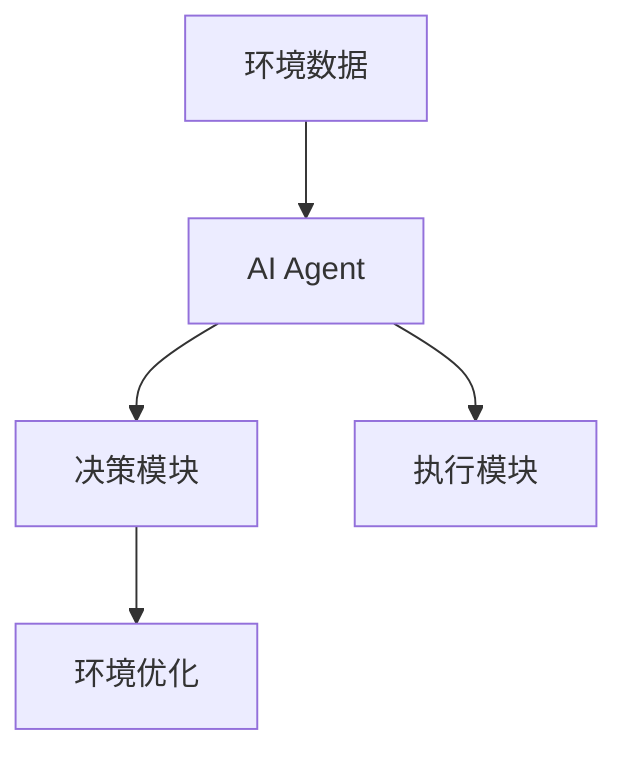
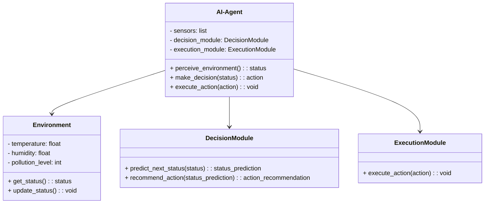
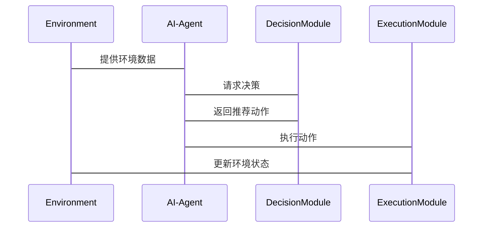

                 


# AI Agent在智能环境保护中的实践

## 关键词：AI Agent，环境保护，智能监测，资源优化，数据驱动，算法模型，可持续发展

## 摘要：  
本文探讨了AI Agent在智能环境保护中的实践应用，通过详细分析AI Agent的核心概念、算法原理、系统设计和实际案例，展示了AI Agent在环境监测、资源优化和生态保护中的巨大潜力。文章从理论到实践，结合技术细节和项目案例，为读者提供了全面的技术解读和实践指导。

---

# 第1章: AI Agent与智能环境保护的引言

## 1.1 AI Agent的基本概念
### 1.1.1 什么是AI Agent
AI Agent（人工智能代理）是一种能够感知环境、自主决策并执行任务的智能实体。它可以是一个软件程序、机器人或任何具备人工智能能力的系统。

### 1.1.2 AI Agent的核心特征
- **自主性**：能够在没有外部干预的情况下独立运行。
- **反应性**：能够实时感知环境变化并做出响应。
- **目标导向**：具备明确的目标，能够优化决策以实现目标。
- **学习能力**：通过数据和经验不断优化自身性能。

### 1.1.3 AI Agent在环境保护中的潜力
AI Agent可以通过实时监测环境数据、优化资源配置和预测环境变化，帮助人类更高效地解决环境问题。

---

## 1.2 智能环境保护的背景与挑战
### 1.2.1 环境保护的现状与问题
- 环境污染（空气、水、土壤污染）日益严重。
- 资源浪费（能源、水资源、土地资源）问题突出。
- 生态系统失衡，生物多样性减少。

### 1.2.2 智能化环保的必要性
- 提高环境监测效率。
- 优化资源利用。
- 实现环境问题的智能化预警和解决方案。

### 1.2.3 AI Agent在环保中的应用场景
- **环境监测**：实时监测空气质量、水质等环境指标。
- **资源优化**：优化能源、水资源的分配和利用。
- **生态保护**：保护濒危物种、监测生态变化。

---

## 1.3 本章小结
本章介绍了AI Agent的基本概念和核心特征，分析了智能环境保护的背景与挑战，并展望了AI Agent在环境保护中的潜力和应用场景。

---

# 第2章: AI Agent的核心概念与联系

## 2.1 AI Agent的核心原理
### 2.1.1 问题背景与解决思路
AI Agent通过感知环境、分析数据、制定决策并执行任务，实现对环境的智能化管理。

### 2.1.2 核心概念的结构与要素
AI Agent的核心结构包括：
- **感知模块**：采集环境数据。
- **决策模块**：分析数据并制定决策。
- **执行模块**：根据决策执行任务。
- **学习模块**：通过经验优化性能。

### 2.1.3 AI Agent的属性特征对比（表格形式）

| 属性       | 传统自动化系统 | AI Agent       |
|------------|----------------|----------------|
| 自主性     | 低             | 高             |
| 反应性     | 低             | 高             |
| 目标导向   | 无             | 有             |
| 学习能力   | 无             | 有             |

---

## 2.2 AI Agent的实体关系与架构
### 2.2.1 ER实体关系图（使用 Mermaid）


---

## 2.3 本章小结
本章详细讲解了AI Agent的核心原理和架构，分析了其与传统自动化系统的区别，并通过实体关系图展示了AI Agent在环境保护中的整体架构。

---

# 第3章: AI Agent的算法原理

## 3.1 常见AI Agent算法概述
### 3.1.1 强化学习（Reinforcement Learning）
强化学习是一种通过与环境交互来学习最优策略的算法。AI Agent通过试错学习，不断优化决策以最大化奖励。

### 3.1.2 监督学习（Supervised Learning）
监督学习通过大量标注数据训练AI Agent，使其能够预测环境状态。

### 3.1.3 混合型AI Agent算法
结合强化学习和监督学习的优点，适用于复杂环境下的任务。

---

## 3.2 强化学习算法的数学模型
### 3.2.1 Q-learning算法
Q-learning是一种经典的强化学习算法，适用于离散状态和动作空间。

### 3.2.2 数学公式
$$ Q(s, a) = r + \gamma \max Q(s', a') $$
其中：
- $Q(s, a)$：状态$s$下动作$a$的期望回报。
- $r$：当前动作带来的回报。
- $\gamma$：折扣因子，用于权衡当前回报和未来回报的重要性。
- $s'$：执行动作$a$后的新状态。

---

## 3.3 算法实现的代码示例
```python
import numpy as np
from collections import defaultdict

def q_learning(env):
    Q = defaultdict(lambda: np.zeros(env.n_actions))
    rewards = []
    for episode in range(n_episodes):
        state = env.reset()
        episode_reward = 0
        while True:
            action = np.argmax(Q[state])
            next_state, reward, done = env.step(action)
            Q[state][action] += reward + gamma * np.max(Q[next_state])
            episode_reward += reward
            state = next_state
            if done:
                break
        rewards.append(episode_reward)
    return Q, rewards
```

---

## 3.4 本章小结
本章详细讲解了AI Agent的常见算法，重点分析了Q-learning算法的数学模型和实现代码，展示了强化学习在环境保护中的应用潜力。

---

# 第4章: AI Agent的系统分析与架构设计

## 4.1 问题场景介绍
以空气质量监测为例，设计一个基于AI Agent的智能监测系统。

## 4.2 系统功能设计
### 4.2.1 领域模型（使用 Mermaid 类图）


---

## 4.3 系统架构设计
### 4.3.1 系统架构图（使用 Mermaid）


---

## 4.4 系统接口设计
- **输入接口**：环境数据采集模块。
- **输出接口**：执行模块，用于控制环境设备。

---

## 4.5 系统交互设计
### 4.5.1 交互流程（使用 Mermaid 序列图）


---

## 4.6 本章小结
本章从系统设计的角度，详细分析了AI Agent的架构、功能模块和交互流程，展示了如何将AI Agent应用于智能环境保护系统中。

---

# 第5章: AI Agent在环境保护中的项目实战

## 5.1 项目背景
以城市垃圾分类为例，设计一个基于AI Agent的智能垃圾分类系统。

## 5.2 项目环境与工具
- **环境**：Python 3.8+
- **工具库**：TensorFlow、Keras、OpenCV、NumPy

---

## 5.3 核心代码实现
### 5.3.1 数据预处理
```python
import numpy as np
import cv2

def preprocess_image(image_path):
    image = cv2.imread(image_path)
    resized_image = cv2.resize(image, (100, 100))
    normalized_image = resized_image / 255.0
    return normalized_image
```

### 5.3.2 模型训练
```python
from tensorflow.keras.models import Sequential
from tensorflow.keras.layers import Dense, Conv2D, MaxPooling2D, Flatten

model = Sequential([
    Conv2D(32, (3,3), activation='relu', input_shape=(100, 100, 3)),
    MaxPooling2D((2,2)),
    Conv2D(64, (3,3), activation='relu'),
    MaxPooling2D((2,2)),
    Flatten(),
    Dense(128, activation='relu'),
    Dense(10, activation='softmax')
])
model.compile(optimizer='adam', loss='sparse_categorical_crossentropy', metrics=['accuracy'])
model.fit(X_train, y_train, epochs=10, batch_size=32)
```

### 5.3.3 系统实现
```python
class AI-Agent:
    def __init__(self):
        self.sensors = []
        self.decision_module = DecisionModule()
        self.execution_module = ExecutionModule()

    def perceive_environment(self):
        # 获取环境数据
        pass

    def make_decision(self, status):
        # 调用决策模块进行决策
        return self.decision_module.recommend_action(status)

    def execute_action(self, action):
        # 调用执行模块执行动作
        self.execution_module.execute_action(action)
```

---

## 5.4 项目案例分析
以空气质量监测为例，分析AI Agent如何通过实时监测和优化决策，降低空气污染指数。

---

## 5.5 本章小结
本章通过实际案例，详细讲解了AI Agent在环境保护中的项目实战，展示了从环境数据采集到模型训练再到系统实现的完整流程。

---

# 第6章: AI Agent在环境保护中的最佳实践

## 6.1 实践总结
- **数据质量**：高质量的数据是AI Agent性能的基础。
- **模型优化**：选择合适的算法和优化策略，提升模型性能。
- **系统稳定性**：确保系统在复杂环境下的稳定运行。

---

## 6.2 注意事项
- **数据隐私**：确保环境数据的隐私和安全。
- **系统兼容性**：确保AI Agent与现有环境系统的兼容性。
- **可解释性**：提高AI Agent决策的可解释性，便于问题排查。

---

## 6.3 未来展望
随着AI技术的不断进步，AI Agent在环境保护中的应用将更加广泛和深入。未来的研究方向包括：
- 更高效的AI算法。
- 更智能的决策系统。
- 更广泛的应用场景。

---

## 6.4 本章小结
本章总结了AI Agent在环境保护中的最佳实践，提出了注意事项和未来展望，为读者提供了宝贵的实践经验和未来研究方向。

---

# 附录
## 附录A: 数据集与工具库
- **数据集**：空气质量数据集、水质数据集。
- **工具库**：TensorFlow、Keras、OpenCV、NumPy。

## 附录B: 参考文献
- [1] Sutton, R. S., & Barto, A. G. (2018). Reinforcement Learning: An Introduction.
- [2] Goodfellow, I., Bengio, Y., & Courville, A. (2016). Deep Learning.

---

## 作者：AI天才研究院/AI Genius Institute & 禅与计算机程序设计艺术 /Zen And The Art of Computer Programming

