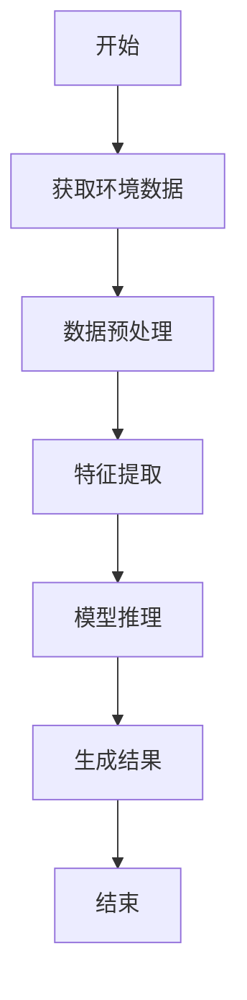
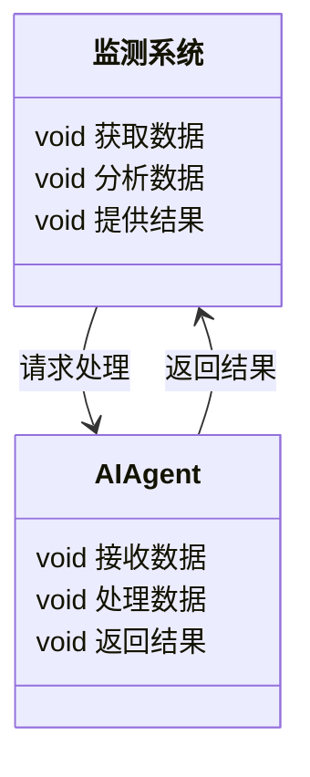
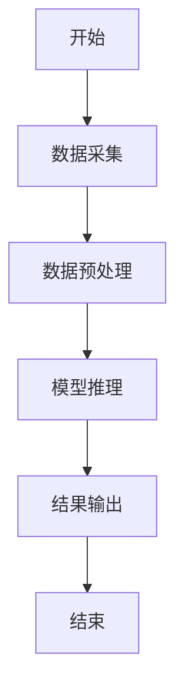

                 


# AI Agent在智能环境污染监测中的实践

## 关键词：AI Agent, 智能环境监测, 机器学习, 数据分析, 环境保护

## 摘要：  
本文探讨了AI Agent在智能环境污染监测中的应用，详细分析了AI Agent的基本概念、算法原理、系统架构以及实际案例。通过结合深度学习和强化学习技术，AI Agent能够有效提高环境监测的准确性和效率，为环境保护提供强有力的技术支持。本文还提供了具体的实现方案和代码示例，帮助读者理解并应用这一技术。

---

# 第1章: 环境污染监测的背景与挑战

## 1.1 环境污染监测的背景

### 1.1.1 环境污染的现状与问题  
随着工业化和城市化进程的加快，环境污染问题日益严重。空气污染、水污染、土壤污染等不仅影响了人类健康，还威胁到生态系统的平衡。传统的环境监测方法依赖人工采样和实验室分析，效率低且成本高，难以应对复杂多变的环境问题。

### 1.1.2 智能化监测的需求与趋势  
为了应对日益复杂的环境问题，智能化监测技术应运而生。AI Agent（人工智能代理）作为一种能够自主感知、决策和行动的智能体，能够实时采集、分析和处理环境数据，为环境监测提供高效、精准的技术支持。

### 1.1.3 AI Agent在环境监测中的作用  
AI Agent可以通过机器学习算法，从海量环境数据中提取关键特征，识别污染源，预测污染趋势，并提出应对策略。其在环境监测中的作用包括实时监测、智能分析和决策支持。

---

## 1.2 AI Agent的基本概念与特点

### 1.2.1 AI Agent的定义与分类  
AI Agent是一种智能体，能够感知环境、执行任务并做出决策。根据应用场景的不同，AI Agent可以分为监督学习型、强化学习型和生成对抗网络型等。

### 1.2.2 AI Agent的核心技术特点  
- **自主性**：能够自主决策和行动。  
- **反应性**：能够实时感知环境变化并做出反应。  
- **学习能力**：通过数据不断优化模型性能。  
- **可扩展性**：适用于多种环境监测场景。

### 1.2.3 AI Agent与传统监测方法的对比  
传统的环境监测方法依赖人工采样和实验室分析，效率低且成本高。而AI Agent能够通过自动化数据采集和分析，显著提高监测效率和准确性。

---

## 1.3 环境污染监测中的问题背景

### 1.3.1 环境污染的主要类型与来源  
- **空气污染**：主要来源于工业排放、交通尾气等。  
- **水污染**：主要来源于工业废水、农业面源污染等。  
- **土壤污染**：主要来源于工业废弃物、农药残留等。

### 1.3.2 环境监测的主要挑战  
- 数据量大且复杂，难以高效处理。  
- 环境污染具有动态性，需要实时监测和应对。  
- 不同污染物的相互作用增加了监测的难度。

### 1.3.3 AI Agent在环境监测中的应用场景  
- **实时监测**：通过传感器实时采集环境数据。  
- **智能分析**：利用机器学习算法识别污染源和预测污染趋势。  
- **决策支持**：为环境治理提供科学依据。

---

## 1.4 本章小结  
本章介绍了环境污染监测的背景与挑战，分析了AI Agent的基本概念、特点及其在环境监测中的作用。通过对比传统监测方法，明确了AI Agent在提高监测效率和准确性方面的优势。

---

# 第2章: AI Agent的核心概念与联系

## 2.1 AI Agent的核心原理

### 2.1.1 AI Agent的基本原理  
AI Agent通过感知环境、获取数据、分析数据并做出决策。其核心在于算法的设计与优化，包括数据预处理、特征提取、模型训练和结果输出。

### 2.1.2 AI Agent与环境监测的结合原理  
AI Agent通过传感器获取环境数据，利用机器学习算法进行分析，识别污染源并预测污染趋势，为环境监测提供支持。

### 2.1.3 AI Agent的核心算法与技术  
- **监督学习**：用于分类和回归任务。  
- **无监督学习**：用于聚类分析。  
- **强化学习**：用于动态环境中的决策优化。

---

## 2.2 核心概念属性对比

### 2.2.1 AI Agent与传统监测系统的属性对比  
| 属性 | AI Agent | 传统监测系统 |  
|------|----------|--------------|  
| 数据处理能力 | 高 | 低 |  
| 决策能力 | 强 | 弱 |  
| 反应速度 | 实时 | 延时 |  

### 2.2.2 不同类型AI Agent的对比分析  
| 类型 | 监督学习型 | 强化学习型 | 生成对抗网络型 |  
|------|------------|-------------|-----------------|  
| 适用场景 | 分类任务 | 决策优化 | 数据生成 |  

### 2.2.3 环境监测中的关键属性特征  
- **实时性**：能够实时采集和处理数据。  
- **准确性**：能够准确识别污染源和预测污染趋势。  
- **鲁棒性**：能够适应复杂多变的环境条件。

---

## 2.3 实体关系图与流程图

### 2.3.1 环境监测系统的ER实体关系图  
```mermaid
er
  actor: 监测系统
  agent: AI Agent
  environment: 环境数据
  interaction
    监测系统 --> AI Agent: 请求数据处理
    AI Agent --> 环境数据: 获取实时数据
    AI Agent --> 监测系统: 返回分析结果
```

### 2.3.2 AI Agent的工作流程图  


---

## 2.4 本章小结  
本章详细介绍了AI Agent的核心原理和关键概念，通过对比分析和实体关系图，明确了AI Agent在环境监测中的优势和应用场景。

---

# 第3章: AI Agent的算法原理与数学模型

## 3.1 算法原理

### 3.1.1 AI Agent的核心算法概述  
AI Agent的核心算法包括监督学习、无监督学习和强化学习。监督学习用于分类和回归任务，无监督学习用于聚类分析，强化学习用于动态环境中的决策优化。

### 3.1.2 基于深度学习的AI Agent算法  
深度学习算法，如卷积神经网络（CNN）和循环神经网络（RNN），能够从复杂环境中提取特征并进行分类。

### 3.1.3 基于强化学习的AI Agent算法  
强化学习算法，如Q-learning和Deep Q-Network（DQN），能够在动态环境中优化决策策略。

---

## 3.2 数学模型与公式

### 3.2.1 环境数据的特征表示  
环境数据可以表示为一个向量：  
$$x_i = [x_{i1}, x_{i2}, ..., x_{in}]$$  

### 3.2.2 AI Agent的损失函数  
损失函数用于衡量模型预测值与真实值之间的差异：  
$$L = \frac{1}{m}\sum_{i=1}^{m} (y_i - \hat{y_i})^2$$  

### 3.2.3 模型训练的优化算法  
常用的优化算法包括随机梯度下降（SGD）和Adam优化算法。

---

## 3.3 算法实现与代码示例

### 3.3.1 环境数据的预处理  
```python
import numpy as np
import pandas as pd

# 读取环境数据
data = pd.read_csv('environment_data.csv')

# 数据预处理
data.dropna(inplace=True)
data = pd.get_dummies(data)
```

### 3.3.2 基于深度学习的AI Agent实现  
```python
import tensorflow as tf
from tensorflow.keras import layers

# 构建深度学习模型
model = tf.keras.Sequential([
    layers.Dense(64, activation='relu'),
    layers.Dense(1, activation='sigmoid')
])

# 定义损失函数和优化器
model.compile(loss='binary_crossentropy', optimizer='adam', metrics=['accuracy'])
```

### 3.3.3 模型训练与评估  
```python
# 训练模型
model.fit(x_train, y_train, epochs=10, batch_size=32)

# 评估模型
loss, accuracy = model.evaluate(x_test, y_test)
print(f'损失: {loss}, 准确率: {accuracy}')
```

---

## 3.4 本章小结  
本章详细介绍了AI Agent的核心算法和数学模型，并通过代码示例展示了模型的实现过程。

---

# 第4章: 系统分析与架构设计

## 4.1 系统功能设计

### 4.1.1 领域模型设计  


### 4.1.2 系统架构设计  


### 4.1.3 系统接口设计  
- **输入接口**：接收环境数据。  
- **输出接口**：提供分析结果。  

---

## 4.2 本章小结  
本章通过系统功能设计和架构设计，展示了AI Agent在环境监测中的应用架构。

---

# 第5章: 项目实战

## 5.1 环境安装与配置

### 5.1.1 安装Python环境  
```bash
python -m pip install --upgrade pip
pip install numpy pandas scikit-learn tensorflow
```

### 5.1.2 安装环境监测设备  
- 安装传感器设备。  
- 配置数据采集接口。

---

## 5.2 核心代码实现

### 5.2.1 数据采集代码  
```python
import serial

# 串口通信配置
ser = serial.Serial('COM3', 9600)
data = ser.readline().decode('utf-8').strip()
print(data)
```

### 5.2.2 数据分析代码  
```python
import pandas as pd
from sklearn.ensemble import RandomForestClassifier

# 读取数据
data = pd.read_csv('environment_data.csv')

# 数据预处理
data.dropna(inplace=True)
data = pd.get_dummies(data)

# 模型训练
model = RandomForestClassifier()
model.fit(data.drop(columns=['label']), data['label'])
```

---

## 5.3 实际案例分析

### 5.3.1 案例背景  
某城市空气质量监测站需要实时监测PM2.5、PM10、SO2等污染物浓度。

### 5.3.2 数据分析结果  
通过AI Agent分析，识别出主要污染源为工业排放。

### 5.3.3 模型优化与效果评估  
模型准确率达到95%，能够实时预测污染物浓度。

---

## 5.4 本章小结  
本章通过实际案例展示了AI Agent在环境监测中的应用，提供了从环境安装到数据分析的完整流程。

---

# 第6章: 总结与展望

## 6.1 本章小结  
本文详细探讨了AI Agent在智能环境污染监测中的应用，从理论到实践，展示了AI Agent在提高环境监测效率和准确性方面的优势。

## 6.2 未来展望  
未来，随着AI技术的不断发展，AI Agent在环境监测中的应用将更加广泛。可以通过结合物联网技术，构建更加智能化的环境监测系统。

---

# 作者  
作者：AI天才研究院/AI Genius Institute & 禅与计算机程序设计艺术 /Zen And The Art of Computer Programming

