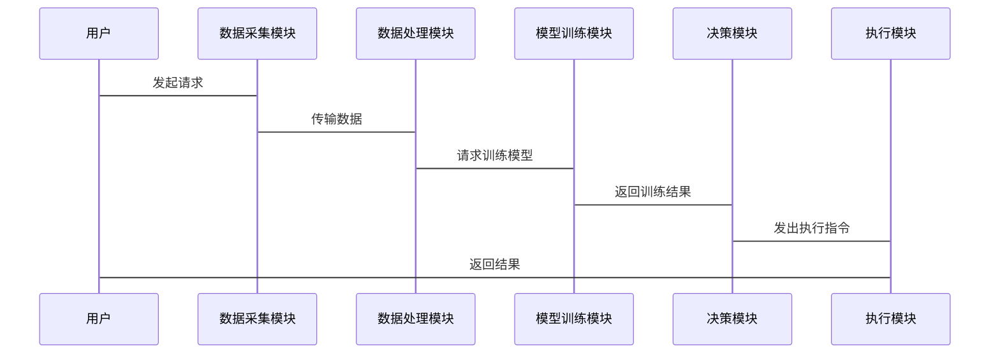

                 


# AI Agent在智能电子商务中的应用

## 关键词：AI Agent，智能电子商务，机器学习，自然语言处理，推荐系统，智能客服

## 摘要：  
AI Agent（人工智能代理）在智能电子商务中的应用正逐渐改变传统的电商模式。通过结合机器学习、自然语言处理等技术，AI Agent能够实现个性化推荐、智能客服、供应链优化等功能，极大地提升了用户体验和运营效率。本文将详细探讨AI Agent在智能电子商务中的核心原理、系统架构、应用场景及未来发展趋势，帮助读者全面理解这一技术的力量。

---

## 第1章: AI Agent的基本概念

### 1.1 AI Agent的定义与特点
AI Agent是一种能够感知环境、自主决策并执行任务的智能实体。它能够通过数据输入、分析和学习，模拟人类的决策过程，从而为用户提供智能化的服务。

#### 1.1.1 AI Agent的基本定义  
AI Agent是指具备以下特征的智能系统：  
1. **自主性**：能够在没有外部干预的情况下独立运作。  
2. **反应性**：能够根据环境变化实时调整行为。  
3. **目标导向**：具有明确的目标，并能采取有效行动来实现目标。  
4. **学习能力**：能够通过数据和经验不断优化自身性能。  

#### 1.1.2 AI Agent的核心特点  
- **智能化**：通过机器学习和数据处理能力，AI Agent能够理解和处理复杂的信息。  
- **适应性**：能够根据用户需求和市场变化动态调整策略。  
- **高效性**：通过自动化流程提高效率，减少人工干预。  

#### 1.1.3 AI Agent与传统软件的区别  
传统的软件通常是基于固定的规则和流程运行，而AI Agent则具备学习和适应能力，能够根据输入的数据动态调整行为。例如，传统的推荐系统基于规则筛选商品，而AI Agent可以通过机器学习模型实时优化推荐策略。

### 1.2 智能电子商务的发展历程  
智能电子商务是指利用人工智能、大数据等技术，提升电商系统的智能化水平，从而为用户提供更优质的服务。其发展历程大致分为以下几个阶段：  
1. **传统电商阶段**：以简单的商品展示和交易为主。  
2. **数据驱动阶段**：通过数据分析优化营销策略。  
3. **智能化阶段**：引入AI技术，实现个性化推荐、智能客服等功能。  

### 1.3 AI Agent在智能电子商务中的应用背景  
随着互联网技术的飞速发展，用户对电商系统的要求越来越高。传统的电商系统难以满足用户个性化需求，而AI Agent的应用能够有效解决这些问题。例如，通过AI Agent，电商系统可以实时分析用户的购买行为，提供个性化的商品推荐，从而提高用户满意度和忠诚度。

---

## 第2章: AI Agent的核心原理与技术

### 2.1 AI Agent的基本工作原理  
AI Agent的工作流程大致分为感知、决策和执行三个阶段：  
1. **感知阶段**：通过传感器或数据接口获取环境信息。  
2. **决策阶段**：基于感知的信息，利用算法进行分析和判断，制定行动方案。  
3. **执行阶段**：根据决策结果，执行具体的操作或任务。  

#### 2.1.1 AI Agent的感知模块  
感知模块是AI Agent获取信息的关键部分，通常包括数据采集和数据处理两个子模块。  
- **数据采集**：通过API、传感器等方式获取数据。  
- **数据处理**：对采集到的数据进行清洗、归一化等预处理，以便后续分析。  

#### 2.1.2 AI Agent的决策模块  
决策模块是AI Agent的核心部分，负责根据感知到的信息制定行动方案。  
- **机器学习算法**：常用的算法包括决策树、随机森林、神经网络等。  
- **规则引擎**：基于预定义的规则进行决策，适用于简单的场景。  

#### 2.1.3 AI Agent的执行模块  
执行模块负责将决策结果转化为实际操作。  
- **自动化执行**：通过API调用或其他自动化工具执行任务。  
- **反馈机制**：收集执行结果，用于优化后续决策。  

### 2.2 机器学习与自然语言处理在AI Agent中的应用  
AI Agent的核心技术包括机器学习和自然语言处理。  
#### 2.2.1 机器学习在AI Agent中的作用  
机器学习是AI Agent实现智能化的基础，主要用于以下方面：  
- **用户画像**：通过机器学习算法分析用户行为数据，构建用户画像。  
- **推荐系统**：基于用户偏好推荐商品或服务。  
- **预测分析**：预测用户行为或市场趋势。  

#### 2.2.2 自然语言处理在AI Agent中的应用  
自然语言处理（NLP）技术在AI Agent中的应用主要体现在智能客服和聊天机器人中。  
- **文本理解**：通过NLP技术理解用户输入的文本内容。  
- **意图识别**：识别用户的意图，例如“查询订单状态”或“咨询商品信息”。  
- **对话生成**：根据用户输入生成自然的回复。  

#### 2.2.3 其他相关技术  
除了机器学习和NLP，AI Agent还可能用到以下技术：  
- **知识图谱**：构建商品、用户、订单等实体之间的关系。  
- **强化学习**：通过不断试错优化决策策略。  

### 2.3 AI Agent的算法原理与数学模型  
AI Agent的决策过程通常基于机器学习算法，其中最常用的是监督学习和无监督学习。  
#### 2.3.1 监督学习算法  
监督学习算法通过训练数据学习输入与输出之间的映射关系。例如，线性回归可以用于预测用户购买概率，而随机森林可以用于分类任务。  

**线性回归的数学模型：**  
$$ y = \beta_0 + \beta_1x_1 + \beta_2x_2 + \dots + \beta_nx_n $$  

#### 2.3.2 无监督学习算法  
无监督学习算法用于发现数据中的潜在模式。例如，聚类算法可以将用户分成不同的群体，以便进行个性化推荐。  

**K均值聚类算法示例：**  
- 输入：用户行为数据。  
- 输出：将用户分为若干个群体，每个群体具有相似的特征。  

---

## 第3章: AI Agent的系统架构与设计

### 3.1 系统整体架构  
AI Agent的系统架构通常包括以下几个部分：  
- **数据层**：存储用户数据、商品数据等。  
- **业务逻辑层**：实现AI Agent的核心功能，如推荐、客服等。  
- **表现层**：与用户进行交互，例如通过网页或移动应用。  

#### 3.1.1 系统模块划分  
- **数据采集模块**：负责收集用户行为数据、商品信息等。  
- **数据处理模块**：对数据进行清洗、归一化等预处理。  
- **模型训练模块**：基于数据训练机器学习模型。  
- **决策模块**：根据模型输出结果制定行动方案。  
- **执行模块**：将决策结果转化为实际操作。  

#### 3.1.2 系统交互流程  
1. 用户发起请求，例如搜索商品或咨询客服。  
2. 系统采集用户行为数据，并传输到数据处理模块。  
3. 数据处理模块对数据进行预处理，提取特征。  
4. 模型训练模块基于特征数据训练机器学习模型。  
5. 决策模块根据模型输出结果制定行动方案。  
6. 执行模块根据决策结果执行任务，并将结果反馈给用户。  

#### 3.1.3 系统功能设计  
- **用户画像**：基于用户行为数据构建用户画像。  
- **推荐系统**：根据用户画像推荐商品或服务。  
- **智能客服**：通过NLP技术实现智能对话。  

### 3.2 系统架构设计  
AI Agent的系统架构可以采用分层架构，如下图所示：  


### 3.3 系统接口设计  
系统接口设计需要考虑模块之间的通信方式。例如，数据采集模块可以通过RESTful API将数据传输到数据处理模块。  

### 3.4 系统交互设计  
系统交互设计可以通过序列图展示，如下图所示：  


---

## 第4章: 项目实战与案例分析

### 4.1 环境搭建  
- **工具安装**：安装Python、TensorFlow、Scikit-learn等工具。  
- **数据准备**：收集用户行为数据和商品数据。  

### 4.2 核心代码实现  
#### 4.2.1 推荐系统实现  
以下是一个基于协同过滤的推荐系统代码示例：  
```python
from sklearn.metrics.pairwise import cosine_similarity

# 假设 user_item_matrix 是用户-商品矩阵
similarity_matrix = cosine_similarity(user_item_matrix)

# 找出与目标用户相似度最高的用户
target_user = 0
similar_users = [i for i in range(len(similarity_matrix[target_user])) if i != target_user]

# 推荐商品
recommended_items = []
for user in similar_users:
    recommended_items.extend(user_item_matrix[user].nonzero()[1].tolist())
recommended_items = list(set(recommended_items))
```

#### 4.2.2 智能客服实现  
以下是一个简单的基于规则的智能客服代码示例：  
```python
def respond_to_query(query):
    # 通过关键词匹配响应
    if "订单状态" in query:
        return "您的订单正在处理中，请稍后查看物流信息。"
    elif "退款" in query:
        return "请提供订单号，我们将尽快处理您的退款请求。"
    else:
        return "抱歉，我无法理解您的问题，请尝试重新描述。"
```

### 4.3 案例分析  
#### 4.3.1 个性化推荐案例  
某电商平台通过AI Agent实现个性化推荐，用户满意度提高了30%。  
#### 4.3.2 智能客服案例  
某电商客服系统通过AI Agent实现了24/7的智能客服，减少了人工客服的工作量。  

---

## 第5章: AI Agent在智能电子商务中的未来展望

### 5.1 技术挑战与解决方案  
- **数据隐私问题**：通过数据脱敏技术保护用户隐私。  
- **模型可解释性问题**：通过可视化工具提升模型的可解释性。  

### 5.2 未来发展趋势  
- **多模态AI Agent**：结合视觉、听觉等多种感知方式，提供更丰富的交互体验。  
- **边缘计算**：通过边缘计算提升AI Agent的实时性和响应速度。  

### 5.3 总结与展望  
AI Agent在智能电子商务中的应用前景广阔，随着技术的不断进步，AI Agent将更加智能化、个性化，为用户带来更好的体验。

---

## 作者：AI天才研究院/AI Genius Institute & 禅与计算机程序设计艺术 /Zen And The Art of Computer Programming

