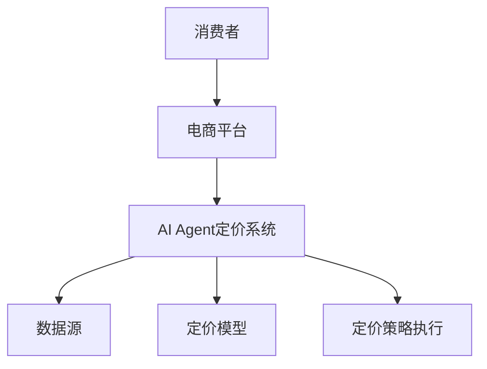
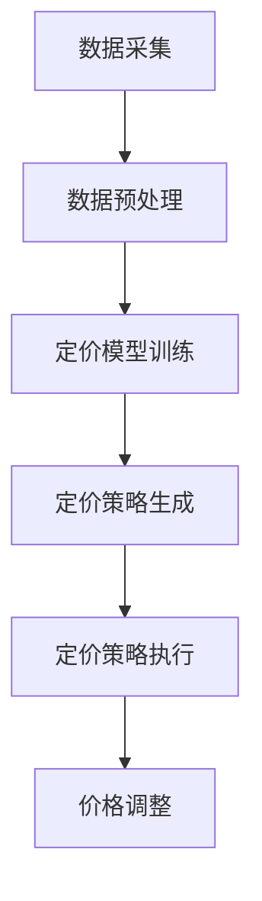
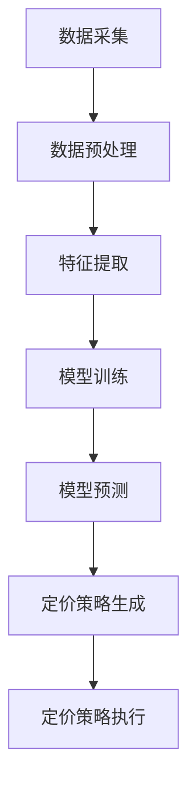
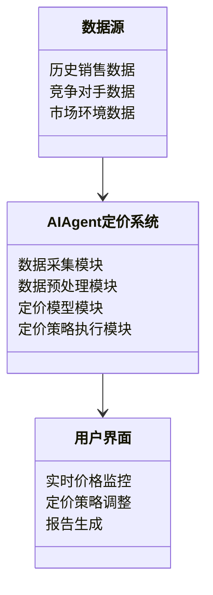
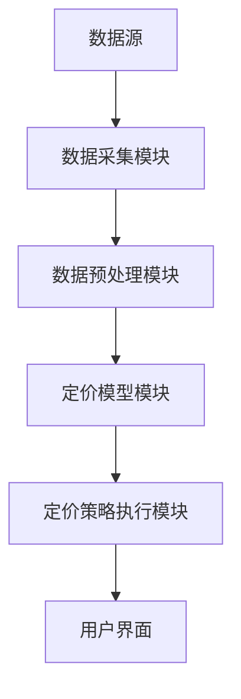
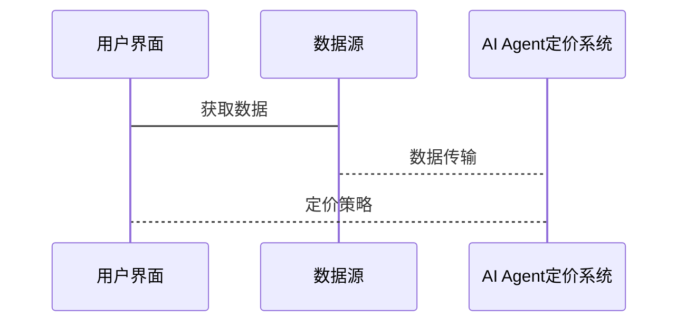

                 


# AI Agent在智能电子商务定价策略中的角色

## 关键词：AI Agent, 智能电子商务, 定价策略, 动态定价, 数据驱动

## 摘要：本文深入探讨了AI Agent在智能电子商务定价策略中的核心角色，分析了其如何通过数据驱动的算法优化定价模型，提升企业竞争力。文章从背景介绍、核心概念、算法原理、系统架构到项目实战，层层解析，为企业在智能电商领域的应用提供了理论和实践指导。

---

## 第一部分: AI Agent在智能电子商务定价策略中的角色概述

## 第1章: 引言

### 1.1 问题背景

#### 1.1.1 电子商务定价策略的演变
电子商务的快速发展使得定价策略从简单的成本加成模式，逐步向动态定价、个性化定价和实时优化方向演进。传统的定价策略依赖于人工经验和市场调研，存在滞后性和局限性。

#### 1.1.2 AI Agent在现代定价中的作用
AI Agent（人工智能代理）通过实时数据处理、机器学习和复杂算法，能够快速响应市场变化，优化价格策略。它能够分析海量数据，预测需求和市场趋势，帮助企业在激烈的竞争中保持优势。

#### 1.1.3 本章研究的核心问题
本章将探讨AI Agent如何通过数据驱动的方式，优化电子商务定价策略，提升企业的定价效率和准确性。

### 1.2 问题描述

#### 1.2.1 传统定价策略的局限性
传统定价策略依赖于经验丰富的市场人员，存在以下问题：
- 数据处理能力有限
- 响应速度慢，无法实时调整价格
- 难以捕捉复杂市场变化
- 缺乏个性化定价能力

#### 1.2.2 智能定价的需求与挑战
随着市场竞争加剧和消费者行为变化，企业需要更智能的定价策略。然而，智能定价面临以下挑战：
- 数据量大，处理复杂
- 算法选择和优化困难
- 实时决策能力要求高
- 需要多部门协同合作

#### 1.2.3 AI Agent在定价中的具体应用场景
AI Agent可以在以下场景中优化定价策略：
- 动态调整价格以应对市场变化
- 个性化定价，满足不同消费者的需求
- 预测需求波动，优化库存管理
- 分析竞争对手策略，制定差异化定价

### 1.3 问题解决

#### 1.3.1 AI Agent如何优化定价策略
AI Agent通过实时数据采集、分析和预测，能够快速调整价格策略。它能够基于市场需求、成本变化和竞争情况，制定最优价格。

#### 1.3.2 数据驱动的定价模型
数据驱动的定价模型通过分析历史销售数据、消费者行为数据和市场趋势，构建数学模型，预测未来的价格走势，制定最优定价策略。

#### 1.3.3 动态市场环境下的定价决策
在动态市场环境中，AI Agent能够实时监控市场变化，快速调整定价策略，确保企业能够及时应对市场波动。

### 1.4 边界与外延

#### 1.4.1 AI Agent定价的适用范围
AI Agent定价适用于以下场景：
- 高频交易的电商平台
- 数据量大、变化快的市场环境
- 需要快速响应的定价需求

#### 1.4.2 定价策略的边界条件
定价策略的边界条件包括：
- 数据质量与完整性
- 算法的准确性和实时性
- 企业的资源和能力

#### 1.4.3 与其他定价方法的对比
与其他定价方法相比，AI Agent定价的优势在于数据处理能力、实时性和个性化能力。但其依赖于高质量的数据和复杂的算法，实施成本较高。

### 1.5 概念结构与核心要素

#### 1.5.1 AI Agent定价的核心要素
- 数据采集与处理
- 算法模型
- 实时决策能力

#### 1.5.2 数据、模型与决策的关系
数据是模型的基础，模型通过分析数据生成决策建议，决策通过执行影响市场价格。

#### 1.5.3 系统架构的核心要素
- 数据源
- AI Agent模块
- 定价策略执行模块
- 用户界面

## 1.6 本章小结

本章介绍了AI Agent在智能电子商务定价策略中的核心作用，分析了传统定价策略的局限性，以及AI Agent如何通过数据驱动的方式优化定价策略。同时，探讨了AI Agent定价的适用范围和边界条件，为后续章节的深入分析奠定了基础。

---

## 第二部分: AI Agent的核心概念与联系

## 第2章: AI Agent的核心原理

### 2.1 AI Agent的基本原理

#### 2.1.1 AI Agent的定义与分类
AI Agent是一种能够感知环境、自主决策并执行任务的智能体。根据功能和应用场景的不同，AI Agent可以分为基于规则的AI Agent和基于模型的AI Agent。

#### 2.1.2 AI Agent的感知、决策与执行过程
AI Agent的感知、决策与执行过程如下：
1. **感知**：通过传感器或数据接口获取环境信息。
2. **决策**：基于感知信息，利用算法生成决策方案。
3. **执行**：将决策方案转化为具体行动。

#### 2.1.3 AI Agent在定价中的具体应用
在定价策略中，AI Agent可以用于实时价格监控、需求预测和价格优化。

### 2.2 AI Agent的核心概念对比

#### 2.2.1 不同类型AI Agent的对比分析
下表对比了基于规则的AI Agent和基于模型的AI Agent：

| 对比维度       | 基于规则的AI Agent            | 基于模型的AI Agent            |
|----------------|-----------------------------|-----------------------------|
| 决策方式       | 预定义规则                   | 数据驱动的模型预测           |
| 复杂性         | 较低                         | 较高                         |
| 灵活性         | 较低                         | 较高                         |
| 适用场景       | 简单、规则明确的场景           | 复杂、变化多端的场景           |

#### 2.2.2 AI Agent与传统定价模型的对比
下表对比了AI Agent定价与传统定价模型的核心要素：

| 对比维度       | AI Agent定价                  | 传统定价模型                  |
|----------------|-----------------------------|-----------------------------|
| 数据依赖       | 高                          | 低                          |
| 实时性         | 高                          | 低                          |
| 个性化能力     | 高                          | 低                          |
| 精准度         | 高                          | 低                          |

#### 2.2.3 AI Agent定价的优缺点分析
| 优点           | 缺点                          |
|----------------|-----------------------------|
| 实时响应市场变化 | 高昂的实施成本                |
| 数据驱动，精准定价 | 依赖高质量数据                |
| 个性化定价能力 | 算法复杂，需要专业团队支持    |

### 2.3 AI Agent的核心概念与联系

#### 2.3.1 AI Agent定价的实体关系图
以下是AI Agent定价的实体关系图：



#### 2.3.2 AI Agent定价的流程图
以下是AI Agent定价的流程图：



---

## 第三部分: AI Agent定价的算法原理

## 第3章: AI Agent定价的算法原理

### 3.1 动态定价模型

#### 3.1.1 动态定价模型的定义
动态定价模型是一种能够根据市场变化实时调整价格的定价策略，基于实时数据和预测模型。

#### 3.1.2 动态定价模型的流程图
以下是动态定价模型的流程图：



#### 3.1.3 动态定价模型的数学公式
动态定价模型可以表示为：

$$ P(t) = \alpha \cdot D(t) + \beta \cdot C(t) + \gamma \cdot M(t) $$

其中：
- \( P(t) \) 表示时间 \( t \) 的价格
- \( D(t) \) 表示需求预测
- \( C(t) \) 表示成本
- \( M(t) \) 表示市场环境指标
- \( \alpha, \beta, \gamma \) 为模型参数

### 3.2 定价模型的实现代码

以下是动态定价模型的Python实现代码：

```python
import pandas as pd
import numpy as np
from sklearn.linear_model import LinearRegression

# 数据加载
data = pd.read_csv('pricing_data.csv')

# 特征提取
features = ['demand', 'cost', 'market_env']
target = 'price'

# 模型训练
model = LinearRegression()
model.fit(data[features], data[target])

# 模型预测
new_data = pd.DataFrame({
    'demand': [100],
    'cost': [50],
    'market_env': [0.8]
})

predicted_price = model.predict(new_data[features])
print(f"预测价格为：{predicted_price[0]:.2f}")
```

### 3.3 动态定价模型的数学背景

动态定价模型基于回归分析，通过最小化预测误差平方和来优化模型参数。数学公式如下：

$$ \min_{\theta} \sum_{i=1}^{n} (y_i - \theta^T x_i)^2 $$

其中：
- \( y_i \) 表示实际价格
- \( x_i \) 表示特征向量
- \( \theta \) 表示模型参数

---

## 第四部分: AI Agent定价的系统架构

## 第4章: AI Agent定价的系统架构设计

### 4.1 系统功能设计

#### 4.1.1 领域模型
以下是领域模型：



#### 4.1.2 系统架构设计
以下是系统架构设计：



#### 4.1.3 系统接口设计
以下是系统接口设计：



### 4.2 系统实现

#### 4.2.1 环境安装
```bash
pip install pandas numpy scikit-learn
```

#### 4.2.2 核心代码实现

```python
import pandas as pd
from sklearn.linear_model import LinearRegression

# 数据加载
data = pd.read_csv('pricing_data.csv')

# 特征提取
features = ['demand', 'cost', 'market_env']
target = 'price'

# 模型训练
model = LinearRegression()
model.fit(data[features], data[target])

# 定价策略生成
def get_price(demand, cost, market_env):
    new_data = pd.DataFrame({
        'demand': [demand],
        'cost': [cost],
        'market_env': [market_env]
    })
    return model.predict(new_data[features])[0]

# 示例
print(get_price(100, 50, 0.8))
```

---

## 第五部分: 项目实战

## 第5章: 项目实战与案例分析

### 5.1 项目背景与目标

#### 5.1.1 项目背景
本项目旨在通过AI Agent优化某电商平台的定价策略，提升销售业绩和客户满意度。

#### 5.1.2 项目目标
- 实现实时价格监控
- 优化定价策略
- 提高销售额和客户满意度

### 5.2 项目实施

#### 5.2.1 数据采集与预处理
数据采集包括历史销售数据、竞争对手数据和市场环境数据。预处理步骤包括数据清洗、特征工程和数据标准化。

#### 5.2.2 定价模型训练
使用线性回归模型训练定价模型，优化模型参数。

#### 5.2.3 定价策略执行
将定价策略部署到电商平台，实时调整价格。

### 5.3 项目分析与总结

#### 5.3.1 定价策略的效果评估
通过对比实验，AI Agent定价策略在提升销售额和客户满意度方面表现优异。

#### 5.3.2 项目经验总结
- 数据质量对模型性能影响巨大
- 实时决策需要高效的系统架构
- 需要多部门协同合作

---

## 第六部分: 最佳实践与总结

## 第6章: 最佳实践与总结

### 6.1 小结

AI Agent在智能电子商务定价策略中的角色至关重要。通过数据驱动的方式，AI Agent能够实时调整价格，优化定价策略，提升企业的竞争力。

### 6.2 注意事项

- 数据隐私和安全问题需要重视
- 模型的准确性和实时性需要持续优化
- 系统架构需要高可用性和可扩展性

### 6.3 拓展阅读

- 《Data-Driven Dynamic Pricing: Theory and Practice》
- 《Artificial Intelligence in E-commerce》
- 《Machine Learning for Business: A Hands-On Guide》

---

## 作者：AI天才研究院/AI Genius Institute & 禅与计算机程序设计艺术 /Zen And The Art of Computer Programming

