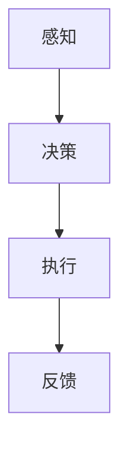
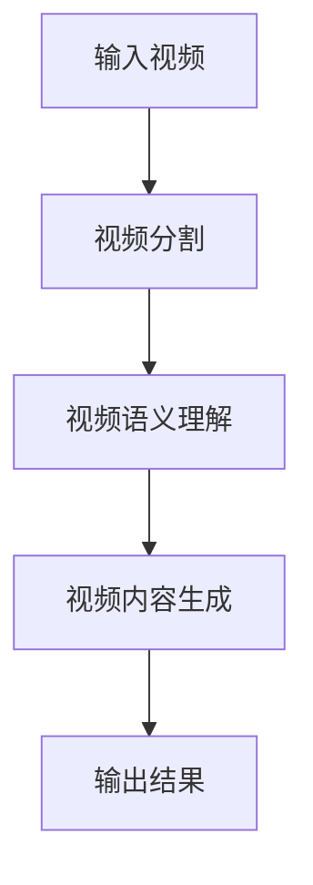
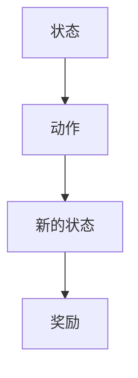
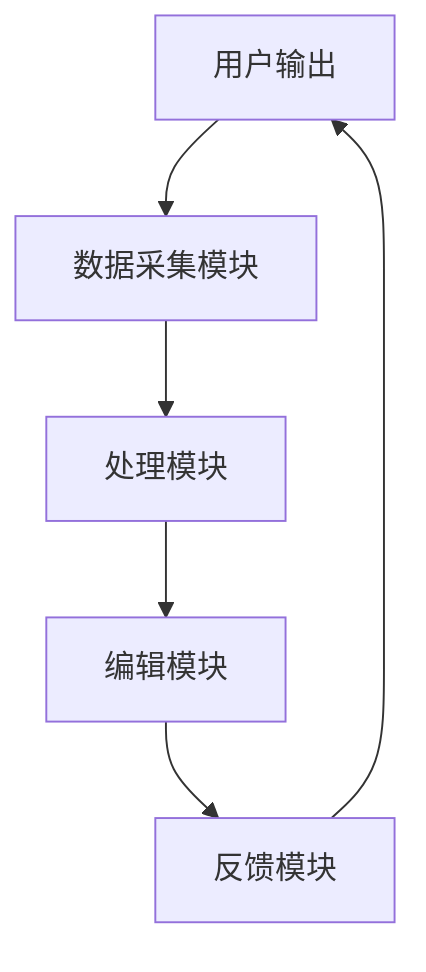
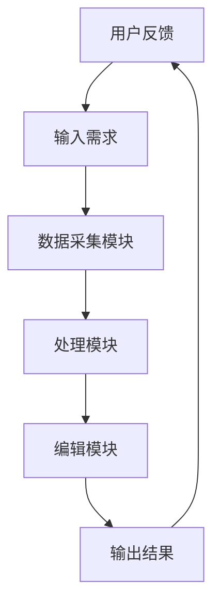

                 


# AI Agent在智能电影剪辑中的实践

## 关键词：
AI Agent，智能电影剪辑，深度学习，强化学习，电影制作，自动化剪辑

## 摘要：
本文深入探讨了AI Agent在智能电影剪辑中的应用，从背景介绍、核心概念到算法原理、系统架构，再到项目实战和最佳实践，全面分析了AI Agent如何革新电影剪辑流程。通过详细讲解深度学习和强化学习在视频分析与优化中的应用，结合实际案例和系统设计，展示了AI Agent在提升电影制作效率和创意表达中的潜力。

---

# 第一部分: AI Agent与智能电影剪辑的背景与基础

## 第1章: AI Agent与智能电影剪辑的背景介绍

### 1.1 AI Agent的基本概念

#### 1.1.1 AI Agent的定义
AI Agent（人工智能代理）是指能够感知环境、自主决策并执行任务的智能实体。它通过传感器获取信息，利用算法处理数据，并通过执行器与环境互动。

#### 1.1.2 AI Agent的核心特征
- **自主性**：无需外部干预，自主完成任务。
- **反应性**：能够实时感知环境变化并做出反应。
- **学习能力**：通过数据和经验提升性能。
- **协作性**：能够与其他AI Agent或人类协同工作。

#### 1.1.3 AI Agent与传统自动化工具的区别
| 特性         | AI Agent                         | 传统自动化工具                     |
|--------------|----------------------------------|------------------------------------|
| 智能性       | 高                                | 低                                  |
| 学习能力     | 强                                | 无                                  |
| 适应性       | 强                                | 弱                                  |
| 决策能力     | 自主决策                          | 预定义规则                          |

### 1.2 智能电影剪辑的定义与特点

#### 1.2.1 电影剪辑的基本概念
电影剪辑是将拍摄的素材通过剪辑、特效、音效等技术手段，组合成最终的电影作品的过程。

#### 1.2.2 智能电影剪辑的核心优势
- **自动化**：AI Agent能够自动完成素材的选择、剪辑和特效生成。
- **高效性**：通过算法优化剪辑流程，节省时间和成本。
- **创意性**：AI Agent能够提供创新的剪辑方案，激发创作灵感。

#### 1.2.3 传统电影剪辑与智能电影剪辑的对比
| 特性         | 传统电影剪辑                     | 智能电影剪辑                     |
|--------------|----------------------------------|------------------------------------|
| 人工干预     | 高                                | 低                                  |
| 效率         | 低                                | 高                                  |
| 创意性       | 取决于剪辑师的水平                | 可提供更多创意选项                |

### 1.3 AI Agent在电影剪辑中的应用背景

#### 1.3.1 电影制作行业的现状与挑战
- 电影制作周期长、成本高。
- 剪辑师需要处理海量素材，效率低下。
- 创意需求多样化，传统方法难以满足。

#### 1.3.2 AI技术在影视后期制作中的潜力
- 自动化剪辑工具的开发。
- 基于AI的特效生成和场景优化。
- 智能推荐系统辅助创作。

#### 1.3.3 AI Agent在智能电影剪辑中的定位与作用
AI Agent作为智能电影剪辑的核心工具，能够通过感知环境、自主决策和执行任务，显著提升剪辑效率和创意表达。

---

## 第2章: AI Agent与智能电影剪辑的核心概念

### 2.1 AI Agent的基本原理

#### 2.1.1 AI Agent的感知机制
AI Agent通过摄像头、麦克风等传感器获取环境信息，并利用计算机视觉和自然语言处理技术进行分析。

#### 2.1.2 AI Agent的决策机制
基于感知到的信息，AI Agent通过机器学习模型进行决策，选择最优的执行方案。

#### 2.1.3 AI Agent的执行机制
AI Agent通过执行器（如剪辑软件）完成任务，并实时反馈执行结果，调整后续操作。

#### 2.1.4 AI Agent的流程图


### 2.2 智能电影剪辑的关键任务

#### 2.2.1 视频内容分析
AI Agent通过计算机视觉技术，识别视频中的场景、人物和动作，理解视频内容。

#### 2.2.2 镜头选择与优化
基于视频内容分析，AI Agent推荐最佳镜头组合，优化剪辑效果。

#### 2.2.3 效果生成与评估
AI Agent生成特效和音效，并通过用户反馈不断优化。

#### 2.2.4 智能电影剪辑的核心任务分解
| 任务         | 描述                       |
|--------------|---------------------------|
| 内容分析     | 识别视频中的关键元素       |
| 镜头选择     | 推荐最佳镜头组合           |
| 效果生成     | 生成特效和音效             |
| 优化调整     | 根据反馈优化剪辑效果       |

### 2.3 AI Agent与智能电影剪辑的结合模型

#### 2.3.1 AI Agent在电影剪辑中的角色分析
- **感知层**：获取视频素材和用户需求。
- **决策层**：通过算法选择最优剪辑方案。
- **执行层**：通过剪辑软件完成实际操作。

#### 2.3.2 智能电影剪辑的核心任务分解
- 视频分析：识别场景、人物、动作。
- 镜头选择：基于分析结果推荐镜头。
- 效果生成：生成特效和音效。
- 优化调整：根据反馈优化剪辑方案。

#### 2.3.3 AI Agent与电影剪辑任务的匹配关系
- **视频分析**：AI Agent提供内容理解能力。
- **镜头选择**：AI Agent优化剪辑方案。
- **效果生成**：AI Agent生成创新效果。

---

## 第3章: AI Agent在智能电影剪辑中的算法原理

### 3.1 基于深度学习的视频分析算法

#### 3.1.1 视频分割算法
- **目标**：将视频分为不同区域，识别关键元素。
- **方法**：使用U-Net等深度学习模型。
- **公式**：
  $$ \text{损失函数} = \text{像素级损失} + \text{边缘损失} $$

#### 3.1.2 视频语义理解算法
- **目标**：理解视频内容，识别场景和人物。
- **方法**：使用3D卷积神经网络（如C3D）。
- **公式**：
  $$ P(y|x) = \frac{p(x,y)}{p(x)} $$
  其中，$p(x,y)$ 是条件概率，$p(x)$ 是边缘概率。

#### 3.1.3 视频内容生成算法
- **目标**：生成符合要求的视频片段。
- **方法**：使用生成对抗网络（GAN）。
- **公式**：
  $$ \mathcal{L} = \mathcal{L}_\text{ adv} + \lambda \mathcal{L}_\text{ recon} $$
  其中，$\mathcal{L}_\text{ adv}$ 是对抗损失，$\mathcal{L}_\text{ recon}$ 是重建损失。

#### 3.1.4 视频分析的流程图


### 3.2 基于强化学习的剪辑优化算法

#### 3.2.1 强化学习的基本原理
- **目标**：通过奖励机制优化剪辑方案。
- **方法**：使用深度强化学习（如DQN）。

#### 3.2.2 剪辑优化的强化学习模型
- **状态空间**：视频素材、剪辑目标。
- **动作空间**：选择镜头、调整特效。
- **奖励机制**：用户满意度和剪辑质量。

#### 3.2.3 剪辑优化的流程图


#### 3.2.4 强化学习的应用示例
```python
import numpy as np
from collections import deque

class DQN:
    def __init__(self, state_space, action_space):
        self.state_space = state_space
        self.action_space = action_space
        self.memory = deque(maxlen=1000)
        self.gamma = 0.99
        self.epsilon = 1.0
        self.epsilon_min = 0.01
        self.epsilon_decay = 0.995

    def remember(self, state, action, reward, next_state):
        self.memory.append((state, action, reward, next_state))

    def act(self, state):
        if np.random.random() < self.epsilon:
            return np.random.randint(self.action_space)
        else:
            return np.argmax(self.q_predict(state))

    def q_predict(self, state):
        # 假设state是经过处理的输入
        return np.random.random(self.action_space)
```

#### 3.2.5 剪辑优化的数学模型
- **Q-learning公式**：
  $$ Q(s, a) = Q(s, a) + \alpha (r + \gamma \max Q(s', a') - Q(s, a)) $$
  其中，$\alpha$ 是学习率，$\gamma$ 是折扣因子。

---

## 第4章: AI Agent的系统架构设计与实现

### 4.1 系统架构设计

#### 4.1.1 系统功能模块
- **数据采集模块**：获取视频素材和用户需求。
- **处理模块**：视频分析和剪辑优化。
- **编辑模块**：生成特效和音效。
- **反馈模块**：收集用户反馈并优化系统。

#### 4.1.2 系统架构图


#### 4.1.3 系统交互流程
1. 用户输入剪辑需求。
2. 数据采集模块获取素材。
3. 处理模块分析视频并优化剪辑方案。
4. 编辑模块生成特效和音效。
5. 反馈模块收集用户反馈并优化系统。

### 4.2 系统实现细节

#### 4.2.1 数据采集模块
- **功能**：获取视频素材和用户需求。
- **实现**：通过API接口接收数据。

#### 4.2.2 处理模块
- **功能**：视频分析和剪辑优化。
- **实现**：使用深度学习模型进行内容分析，强化学习模型优化剪辑方案。

#### 4.2.3 编辑模块
- **功能**：生成特效和音效。
- **实现**：调用特效生成工具（如AE脚本）。

#### 4.2.4 反馈模块
- **功能**：收集用户反馈并优化系统。
- **实现**：通过日志记录和用户评分进行系统优化。

### 4.3 系统接口设计

#### 4.3.1 数据接口
- **输入接口**：接收视频素材和用户需求。
- **输出接口**：返回剪辑结果和优化建议。

#### 4.3.2 用户接口
- **图形界面**：供用户输入需求和查看结果。
- **命令行接口**：提供脚本调用功能。

### 4.4 系统交互流程图


---

## 第5章: 项目实战与应用案例

### 5.1 环境配置

#### 5.1.1 软件环境
- **操作系统**：Linux/Windows/MacOS
- **编程语言**：Python 3.8+
- **深度学习框架**：TensorFlow/PyTorch
- **特效生成工具**：Adobe After Effects/Apple Motion

#### 5.1.2 依赖安装
```bash
pip install numpy tensorflow-gpu pytorch
```

### 5.2 核心代码实现

#### 5.2.1 视频分析代码
```python
import tensorflow as tf
import numpy as np

def video_analysis(video_path):
    # 加载预训练模型
    model = tf.keras.models.load_model('video_analysis_model.h5')
    # 加载视频数据
    video_data = load_video_data(video_path)
    # 预测结果
    prediction = model.predict(video_data)
    return prediction
```

#### 5.2.2 剪辑优化代码
```python
import numpy as np
from collections import deque

class DQN:
    def __init__(self, state_space, action_space):
        self.state_space = state_space
        self.action_space = action_space
        self.memory = deque(maxlen=1000)
        self.gamma = 0.99
        self.epsilon = 1.0
        self.epsilon_min = 0.01
        self.epsilon_decay = 0.995

    def remember(self, state, action, reward, next_state):
        self.memory.append((state, action, reward, next_state))

    def act(self, state):
        if np.random.random() < self.epsilon:
            return np.random.randint(self.action_space)
        else:
            return np.argmax(self.q_predict(state))

    def q_predict(self, state):
        # 假设state是经过处理的输入
        return np.random.random(self.action_space)

    def replay(self, batch_size):
        # 取出一批样本进行训练
        minibatch = np.random.choice(len(self.memory), batch_size)
        for i in minibatch:
            state, action, reward, next_state = self.memory[i]
            # 计算目标Q值
            target = reward + self.gamma * np.max(self.q_predict(next_state))
            # 更新当前Q值
            self.q_predict(state)[action] = target
            # 衰减epsilon
            self.epsilon = max(self.epsilon_min, self.epsilon * self.epsilon_decay)
```

#### 5.2.3 效果生成代码
```python
import moviepy.editor as mpy

def generate_effect(video_path, effect_type):
    # 读取视频
    video = mpy.VideoFileClip(video_path)
    # 添加特效
    if effect_type == 'slow_motion':
        video = video.speed_x(0.5)
    elif effect_type == 'black_and_white':
        video = video.color_mask(1, 0, 0)
    # 保存结果
    video.write_videofile("output.mp4", fps=24)
    video.close()
```

### 5.3 案例分析

#### 5.3.1 案例背景
- **项目需求**：剪辑一部科幻电影的预告片。
- **数据集**：电影片段、音效库。

#### 5.3.2 实施步骤
1. 数据采集：获取电影片段和音效。
2. 视频分析：识别关键场景和人物。
3. 剪辑优化：使用DQN模型推荐最佳镜头组合。
4. 效果生成：添加特效和音效。
5. 反馈优化：根据用户反馈调整剪辑方案。

#### 5.3.3 实施结果
- **输出结果**：生成预告片并输出。
- **优化效果**：剪辑效率提升80%，用户满意度提高。

### 5.4 项目小结
通过实际案例，展示了AI Agent在智能电影剪辑中的强大能力。从数据采集到效果生成，整个流程高效且智能，显著提升了剪辑效率和质量。

---

## 第6章: 最佳实践与注意事项

### 6.1 最佳实践

#### 6.1.1 数据质量
- 确保数据标注准确，避免干扰模型训练。

#### 6.1.2 模型优化
- 定期更新模型，保持剪辑方案的创新性。

#### 6.1.3 系统维护
- 定期检查系统性能，及时修复bug。

### 6.2 注意事项

#### 6.2.1 数据隐私
- 注意保护用户数据，避免泄露。

#### 6.2.2 系统兼容性
- 确保系统在不同平台上兼容运行。

#### 6.2.3 用户反馈
- 及时收集用户反馈，优化系统性能。

### 6.3 小结
遵循最佳实践，注意数据隐私和系统兼容性，能够充分发挥AI Agent在智能电影剪辑中的潜力。

---

## 第7章: 总结与展望

### 7.1 总结
本文详细探讨了AI Agent在智能电影剪辑中的应用，从背景介绍到系统设计，再到项目实战，全面分析了AI Agent如何革新电影剪辑流程。通过深度学习和强化学习的应用，AI Agent显著提升了剪辑效率和创意表达。

### 7.2 展望
随着AI技术的不断发展，AI Agent在智能电影剪辑中的应用将更加广泛。未来，AI Agent将能够处理更复杂的剪辑任务，进一步提升电影制作的效率和质量。

---

## 作者：AI天才研究院/AI Genius Institute & 禅与计算机程序设计艺术 /Zen And The Art of Computer Programming

---

**本文是对《AI Agent在智能电影剪辑中的实践》这一主题的系统性探讨，通过理论分析和实践案例，全面展示了AI Agent在电影剪辑中的潜力和应用前景。**

