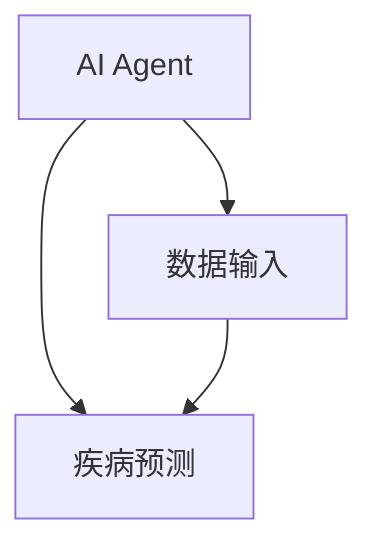

                 


# AI Agent在智能疾病预测中的角色

> 关键词：AI Agent，智能疾病预测，机器学习，医疗健康，人工智能

> 摘要：本文探讨了AI Agent在智能疾病预测中的角色，从核心概念、算法原理到系统架构，再到项目实战和最佳实践，详细分析了AI Agent如何通过感知、决策和学习能力，推动疾病预测的智能化和精准化。

---

# 引言

智能疾病预测是医疗健康领域的重要研究方向，旨在通过数据分析和模型构建，提前识别潜在疾病风险。AI Agent（人工智能代理）作为一种具备自主决策和学习能力的智能体，正在成为疾病预测中的关键角色。本文将系统分析AI Agent在疾病预测中的应用，探讨其技术原理和实际价值。

---

# 第一部分: AI Agent与智能疾病预测的背景介绍

## 第1章: AI Agent的基本概念与作用

### 1.1 AI Agent的定义与核心特征

AI Agent（人工智能代理）是一种能够感知环境、自主决策并执行任务的智能系统。其核心特征包括：

- **自主性**：无需外部干预，自主完成任务。
- **反应性**：能够实时感知环境变化并做出响应。
- **学习能力**：通过数据和反馈不断优化自身的决策能力。
- **社交能力**：能够与其他系统或人类进行交互和协作。

### 1.2 智能疾病预测的背景与意义

疾病预测是医疗健康领域的核心问题之一，传统的疾病预测方法依赖于统计分析和专家经验，存在效率低、精度不足等问题。随着AI技术的发展，智能疾病预测逐渐成为医疗领域的重要研究方向。

### 1.3 AI Agent在疾病预测中的角色

AI Agent在疾病预测中扮演着多重角色，既是数据处理的核心工具，也是模型优化的推动者。通过AI Agent的感知和决策能力，可以实现更精准的疾病预测和个性化医疗。

---

## 第2章: 疾病预测的核心问题与解决方案

### 2.1 疾病预测的核心问题

疾病预测的核心问题包括：

- **数据特征提取**：从海量医疗数据中提取有效的特征，用于模型训练。
- **模型选择与优化**：选择合适的算法并优化模型性能。
- **预测结果的可解释性**：确保预测结果具有可解释性，便于医生理解和应用。

### 2.2 AI Agent在疾病预测中的解决方案

AI Agent通过以下方式解决疾病预测的核心问题：

- **数据处理与特征工程**：AI Agent能够自动提取数据中的特征，并进行数据清洗和预处理。
- **模型构建与训练**：AI Agent可以选择合适的算法，并通过不断迭代优化模型性能。
- **结果分析与优化**：AI Agent可以对预测结果进行分析，并根据反馈进一步优化模型。

### 2.3 AI Agent在疾病预测中的边界与外延

AI Agent在疾病预测中的应用具有明确的边界和外延：

- **适用场景**：AI Agent适用于数据量大、特征复杂、需要实时反馈的疾病预测场景。
- **局限性**：AI Agent的预测结果依赖于数据质量和模型训练，可能存在过拟合或欠拟合的问题。
- **与其他技术的结合**：AI Agent可以与自然语言处理、图像识别等技术结合，拓展其在疾病预测中的应用范围。

---

# 第二部分: AI Agent的核心概念与联系

## 第3章: AI Agent的核心原理与模型构建

### 3.1 AI Agent的核心原理

AI Agent的核心原理包括：

- **感知与决策机制**：AI Agent通过感知环境信息，结合内部知识库，生成决策。
- **状态空间与动作空间**：AI Agent通过状态空间表示问题，通过动作空间执行决策。
- **奖励函数与策略优化**：AI Agent通过奖励函数优化策略，实现目标的最优化。

### 3.2 疾病预测中的AI Agent模型构建

疾病预测中的AI Agent模型构建需要考虑以下几个方面：

- **数据预处理与特征提取**：通过数据清洗、特征选择等步骤，提取有效的特征。
- **模型选择与训练**：选择合适的算法（如LSTM、随机森林等），并进行模型训练。
- **模型评估与优化**：通过交叉验证、网格搜索等方法，优化模型性能。

### 3.3 AI Agent与疾病预测的实体关系分析

以下是AI Agent与疾病预测的实体关系图（Mermaid图）：



---

## 第4章: 算法原理与数学模型

### 4.1 算法原理

AI Agent在疾病预测中的算法原理可以通过以下步骤进行：

1. **数据预处理**：清洗数据，处理缺失值，标准化数据。
2. **特征提取**：提取关键特征，如年龄、性别、病史等。
3. **模型训练**：选择合适的算法（如LSTM）进行模型训练。
4. **模型评估**：通过准确率、召回率等指标评估模型性能。
5. **模型优化**：调整超参数，优化模型性能。

### 4.2 数学模型与公式

以下是疾病预测中常用的LSTM模型的数学公式：

$$
\text{LSTM}(x_t) = \text{cell}(\text{遗忘门}(f_t) + \text{输入门}(i_t) + \text{输出门}(o_t))
$$

其中，$f_t$、$i_t$、$o_t$分别是遗忘门、输入门和输出门的输出结果。

---

## 第5章: 系统架构与设计

### 5.1 问题场景介绍

疾病预测系统需要处理大量的医疗数据，包括患者的病史、生活习惯、基因信息等。

### 5.2 系统功能设计

系统功能设计包括：

- **数据输入与处理**：患者信息输入、数据清洗、特征提取。
- **模型构建与训练**：选择算法、训练模型、优化参数。
- **预测与结果展示**：生成预测结果、可视化展示。

### 5.3 系统架构设计

以下是系统架构设计的Mermaid图：


---

## 第6章: 项目实战与代码实现

### 6.1 环境安装

需要安装的环境包括Python、TensorFlow、Keras等。

### 6.2 核心代码实现

以下是LSTM模型的代码实现：

```python
import tensorflow as tf
from tensorflow.keras.layers import LSTM, Dense, Dropout
from tensorflow.keras.models import Sequential

model = Sequential()
model.add(LSTM(64, input_shape=(timesteps, features)))
model.add(Dropout(0.5))
model.add(Dense(1, activation='sigmoid'))
model.compile(loss='binary_crossentropy', optimizer='adam', metrics=['accuracy'])
model.fit(X_train, y_train, epochs=10, batch_size=32)
```

### 6.3 案例分析与结果解读

通过实际案例分析，验证模型的预测效果和准确性。

---

## 第7章: 最佳实践与总结

### 7.1 总结与回顾

总结AI Agent在疾病预测中的应用价值和实际效果。

### 7.2 实践建议

提出实际应用中的注意事项和优化建议。

### 7.3 注意事项

提醒读者在使用AI Agent进行疾病预测时，需要注意数据隐私和模型的可解释性问题。

### 7.4 拓展阅读

推荐相关领域的书籍和论文，供读者进一步学习。

---

# 结语

AI Agent在智能疾病预测中的应用前景广阔，通过不断的技术创新和实践积累，AI Agent将为医疗健康领域带来更多的变革和进步。

---

# 作者

作者：AI天才研究院/AI Genius Institute & 禅与计算机程序设计艺术/Zen And The Art of Computer Programming

联系邮箱：[email protected]

