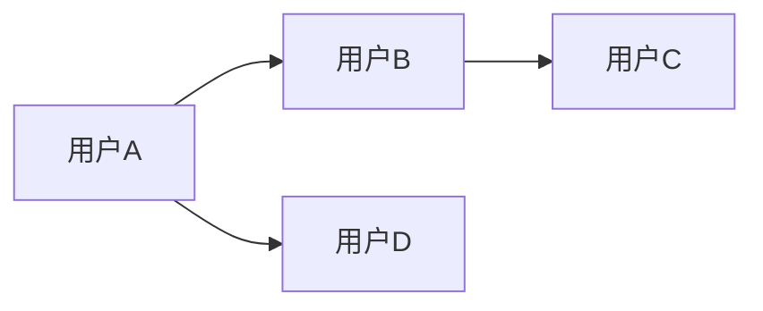
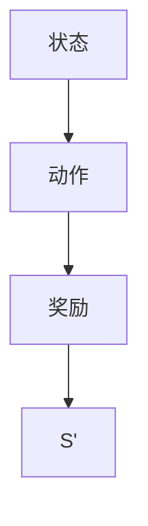
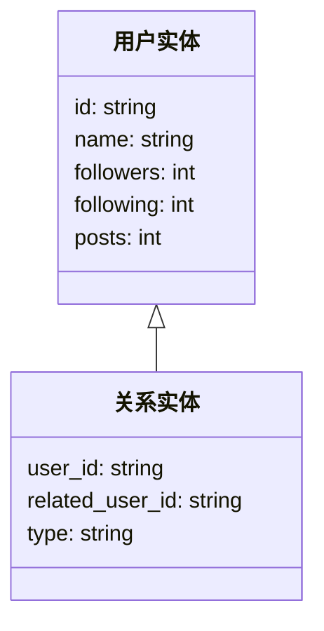
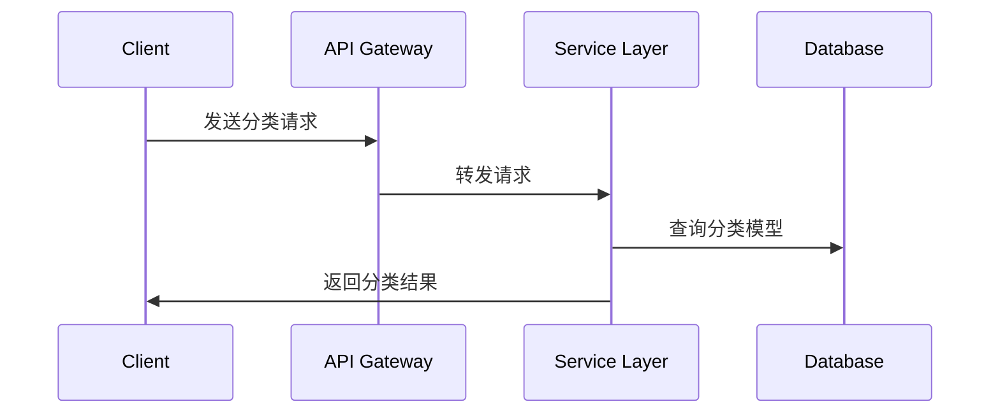

                 


# AI Agent在智能社交网络分析中的应用

---

## 关键词：AI Agent、社交网络分析、数据挖掘、自然语言处理、机器学习、图论、系统架构

---

## 摘要：  
本文详细探讨了AI Agent在智能社交网络分析中的应用，从核心概念、算法原理到系统架构设计，再到项目实战，全面剖析了AI Agent如何助力社交网络的智能化分析。文章通过具体案例和代码实现，展示了AI Agent在社交网络中的实际应用场景，并总结了相关技术的未来发展方向。

---

# 第一部分: AI Agent与智能社交网络分析的背景与基础

# 第1章: AI Agent与智能社交网络分析概述

## 1.1 AI Agent的基本概念与特点
### 1.1.1 AI Agent的定义与核心特征
AI Agent（人工智能代理）是指能够感知环境、自主决策并执行任务的智能实体。其核心特征包括：
- **自主性**：能够在无外部干预的情况下自主运行。
- **反应性**：能够实时感知环境并做出反应。
- **目标导向性**：基于目标驱动行为。
- **学习能力**：通过数据和经验不断优化性能。

### 1.1.2 AI Agent与传统算法的区别
| 特性          | 传统算法                 | AI Agent                 |
|---------------|--------------------------|--------------------------|
| 决策机制      | 基于预定义规则           | 基于目标驱动与自适应学习 |
| 数据依赖性    | 弱依赖                    | 强依赖                    |
| 任务处理方式  | 单任务处理               | 多任务与复杂任务处理     |

### 1.1.3 AI Agent在社交网络中的应用潜力
AI Agent在社交网络中的潜力主要体现在以下几个方面：
1. **用户行为预测**：通过分析用户的社交数据，预测用户的兴趣和行为。
2. **信息过滤与推荐**：基于用户偏好，实时推荐相关内容。
3. **情感分析与舆情监控**：识别用户情感倾向，监控网络舆论。

## 1.2 社交网络分析的基本概念
### 1.2.1 社交网络的定义与结构
社交网络是由用户（节点）及其之间的关系（边）构成的图结构。节点代表用户，边代表用户之间的关系（如关注、点赞等）。

### 1.2.2 社交网络分析的主要方法
1. **基于图论的方法**：分析节点之间的关系和社区结构。
2. **基于机器学习的方法**：通过特征提取和模型训练进行分类和预测。
3. **基于自然语言处理的方法**：分析文本内容，提取情感和主题信息。

### 1.2.3 智能社交网络分析的核心目标
智能社交网络分析的目标是通过AI技术，实现对社交网络数据的深度理解和智能化应用，包括：
- **用户画像构建**：基于社交数据，生成用户画像。
- **内容生成与推荐**：根据用户行为生成个性化内容。
- **异常行为检测**：识别虚假信息和网络攻击。

## 1.3 问题背景与挑战
### 1.3.1 社交网络中的信息过载问题
用户每天面对海量信息，如何快速筛选出有价值的内容是社交网络分析的核心挑战。

### 1.3.2 用户行为预测的难点
用户行为受到多种因素影响，包括情绪、环境和社会关系等，难以用简单的模型捕捉。

### 1.3.3 智能社交网络分析的边界与外延
智能社交网络分析的边界在于如何平衡隐私保护与数据利用，外延则涉及与其他领域的交叉融合，如电子商务和医疗健康。

---

# 第二部分: AI Agent的核心概念与原理

# 第2章: AI Agent的核心原理与算法

## 2.1 AI Agent的任务规划与知识表示
### 2.1.1 任务规划的基本原理
任务规划是AI Agent根据目标生成行动计划的过程。常用算法包括**宽度优先搜索（BFS）**和**A*算法**。

#### 使用BFS算法规划任务
```python
from collections import deque

def bfs(graph, start, goal):
    visited = set()
    queue = deque([(start, [start])])
    while queue:
        current, path = queue.popleft()
        if current == goal:
            return path
        for neighbor in graph[current]:
            if neighbor not in visited:
                visited.add(neighbor)
                queue.append((neighbor, path + [neighbor]))
    return None
```

### 2.1.2 知识表示的常用方法
知识表示是AI Agent理解和存储知识的方式。常用方法包括：
- **语义网络**：通过节点和边表示知识。
- **逻辑推理**：通过逻辑规则进行推理。
- **知识图谱**：构建结构化的知识库。

### 2.1.3 基于图的推理机制
基于图的推理机制通过图结构分析关系，例如：



## 2.2 AI Agent的学习与自适应机制
### 2.2.1 监督学习与无监督学习的对比
| 方法         | 数据类型       | 描述                           |
|--------------|----------------|--------------------------------|
| 监督学习       | 标签数据       | 需要标注数据进行训练           |
| 无监督学习     | 无标签数据     | 通过数据本身发现隐含结构       |

### 2.2.2 强化学习在AI Agent中的应用
强化学习通过奖惩机制训练AI Agent，例如：



### 2.2.3 知识蒸馏与模型压缩技术
知识蒸馏通过将大型模型的知识迁移到小型模型，实现轻量化部署。

## 2.3 AI Agent的决策与执行过程
### 2.3.1 决策树与随机森林的对比
决策树适合简单问题，随机森林适合复杂问题。

| 方法         | 优点                     | 缺点                     |
|--------------|--------------------------|--------------------------|
| 决策树         | 易解释                   | 易过拟合                 |
| 随机森林       | 高准确性                 | 计算复杂                 |

### 2.3.2 基于规则的分类与机器学习分类的对比
基于规则的分类通过预定义规则分类，机器学习分类通过数据训练分类器。

---

# 第三部分: AI Agent在社交网络分析中的算法实现

# 第3章: 基于AI Agent的社交网络分析算法

## 3.1 基于规则的分类算法
### 3.1.1 基于规则的分类原理
基于规则的分类通过预定义规则进行分类，例如：

```python
def classify(text):
    if 'positive' in text:
        return 'positive'
    elif 'negative' in text:
        return 'negative'
    else:
        return 'neutral'
```

### 3.1.2 优缺点分析
- **优点**：规则明确，易于解释。
- **缺点**：难以处理复杂场景。

## 3.2 基于机器学习的情感分析算法
### 3.2.1 基于朴素贝叶斯的分类
朴素贝叶斯是一种常用的文本分类算法，公式如下：

$$ P(y|x) = \frac{P(x|y)P(y)}{P(x)} $$

### 3.2.2 优缺点分析
- **优点**：计算简单，适合高维数据。
- **缺点**：假设特征独立，实际场景中可能不成立。

## 3.3 基于深度学习的社交网络分析
### 3.3.1 基于BERT的情感分析
BERT是一种基于Transformer的预训练模型，适用于复杂文本分析。

### 3.3.2 图神经网络在社交网络分析中的应用
图神经网络通过处理图结构数据，分析社交网络关系。

---

# 第四部分: AI Agent在社交网络分析中的系统架构设计

# 第4章: 系统分析与架构设计方案

## 4.1 问题场景介绍
### 4.1.1 舆情监控系统
实时监控社交网络中的舆论动态。

### 4.1.2 社交推荐系统
基于用户行为推荐相关内容。

## 4.2 系统功能设计
### 4.2.1 领域模型设计


### 4.2.2 系统架构设计


## 4.3 系统接口设计
### 4.3.1 接口定义
- **GET /api/users**: 获取用户信息
- **POST /api/classify**: 文本分类请求

### 4.3.2 交互流程


---

# 第五部分: AI Agent在社交网络分析中的项目实战

# 第5章: 项目实战与代码实现

## 5.1 环境安装
### 5.1.1 安装Python与相关库
```bash
pip install python
pip install numpy
pip install scikit-learn
pip install transformers
```

## 5.2 系统核心实现
### 5.2.1 数据预处理
```python
import pandas as pd

def preprocess_data(df):
    df['text'] = df['text'].apply(lambda x: x.lower())
    return df
```

### 5.2.2 特征提取
```python
from sklearn.feature_extraction.text import TfidfVectorizer

vectorizer = TfidfVectorizer()
X = vectorizer.fit_transform(df['text'])
```

### 5.2.3 模型训练
```python
from sklearn.naive_bayes import MultinomialNB

model = MultinomialNB()
model.fit(X, df['label'])
```

## 5.3 代码应用解读与分析
### 5.3.1 代码实现的关键点
- 数据预处理：将文本转为小写，去除停用词。
- 特征提取：使用TF-IDF提取文本特征。
- 模型训练：使用Naive Bayes算法训练分类模型。

### 5.3.2 实际案例分析
通过实际案例分析模型的性能，并优化模型参数。

## 5.4 项目小结
总结项目实现的关键步骤和经验教训，强调代码实现中的注意事项。

---

# 第六部分: 总结与展望

# 第6章: 总结与最佳实践

## 6.1 总结
### 6.1.1 关键点回顾
- AI Agent的核心原理与算法
- 社交网络分析的系统架构设计
- 项目实战与代码实现

### 6.1.2 最佳实践 tips
- 数据预处理是关键，特征提取要准确。
- 模型选择要根据实际场景。
- 系统设计要注重扩展性与可维护性。

## 6.2 未来展望
AI Agent在社交网络分析中的应用前景广阔，未来可以探索以下方向：
- 更加智能化的用户行为预测。
- 多模态数据的融合分析。
- 更加高效的模型压缩与推理技术。

---

## 作者：AI天才研究院/AI Genius Institute & 禅与计算机程序设计艺术 /Zen And The Art of Computer Programming

