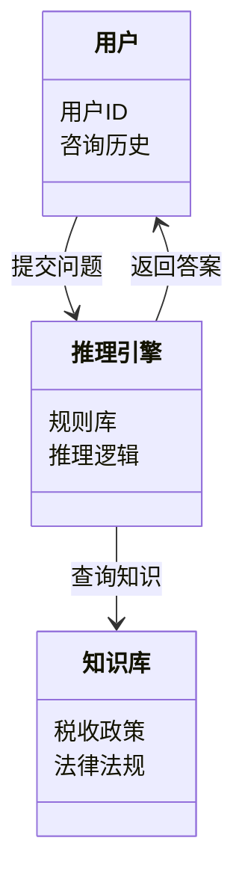
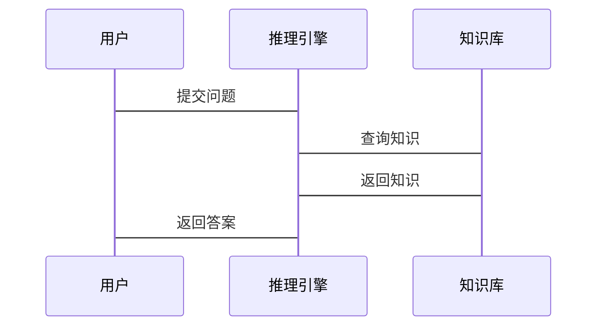

                 


# AI Agent在智能税务咨询中的角色

> 关键词：AI Agent，智能税务咨询，知识库构建，自然语言处理，专家系统

> 摘要：本文探讨了AI Agent在智能税务咨询中的角色与应用，分析了其核心概念、算法原理、系统架构以及实际项目中的应用。通过详细的技术分析和案例研究，展示了AI Agent如何提升税务咨询的效率与准确性。

---

# 第一部分: AI Agent在智能税务咨询中的背景与概念

## 第1章: AI Agent的基本概念与背景

### 1.1 AI Agent的定义与特点

#### 1.1.1 AI Agent的定义

AI Agent（人工智能代理）是指能够感知环境并采取行动以实现目标的智能系统。在税务咨询领域，AI Agent通过处理用户输入的税务问题，利用知识库和推理引擎提供准确的解答和建议。

$$\text{AI Agent} = \text{知识库} + \text{自然语言处理} + \text{推理引擎}$$

#### 1.1.2 AI Agent的核心特点

| 特性 | 描述 |
|------|------|
| 智能性 | 能够理解和推理复杂的税务问题 |
| 实时性 | 提供即时响应和解决方案 |
| 个性化 | 根据用户需求定制建议 |
| 自适应性 | 能够学习和优化自身的响应策略 |

#### 1.1.3 AI Agent与传统税务咨询的区别

- **效率**：AI Agent能够快速处理大量数据，显著提高咨询效率。
- **准确性**：通过规则和模型确保答案的准确性。
- **成本**：AI Agent可以降低人力成本，同时提供24/7的咨询服务。

### 1.2 智能税务咨询的现状与挑战

#### 1.2.1 税务咨询的传统模式

传统税务咨询依赖于人工服务，咨询师通过经验判断和查阅资料为用户提供解答。这种方式效率较低，且受咨询师知识和时间的限制。

#### 1.2.2 当前税务咨询的主要问题

- **效率低**：人工咨询耗时较长，无法满足大量用户的需求。
- **一致性差**：不同咨询师可能给出不同的答案。
- **知识更新慢**：税收政策不断变化，知识库更新不及时。

#### 1.2.3 AI技术在税务咨询中的应用背景

随着AI技术的快速发展，AI Agent能够快速响应用户需求，提供一致性和准确性的税务咨询服务，成为传统模式的有力补充。

---

## 第2章: AI Agent在税务咨询中的角色与作用

### 2.1 AI Agent在税务咨询中的角色定位

#### 2.1.1 AI Agent作为辅助工具的角色

AI Agent可以作为税务咨询师的辅助工具，帮助他们快速查找信息和制定建议。

#### 2.1.2 AI Agent作为决策支持的角色

通过分析大量数据和案例，AI Agent可以为税务决策提供支持，优化税务规划。

#### 2.1.3 AI Agent作为客户交互界面的角色

用户可以直接与AI Agent交互，获取实时的税务解答和建议，无需通过人工咨询。

### 2.2 AI Agent在税务咨询中的核心作用

#### 2.2.1 提高咨询效率

AI Agent能够快速处理用户的问题，减少等待时间，提高整体效率。

#### 2.2.2 优化税务规划

通过分析用户的财务数据和税收政策，AI Agent可以提供个性化的税务规划建议。

#### 2.2.3 提供实时信息支持

AI Agent能够实时更新税收政策和法规变化，确保用户获取最新的信息。

---

# 第二部分: AI Agent的核心概念与原理

## 第3章: AI Agent的核心概念与原理

### 3.1 AI Agent的核心概念

#### 3.1.1 知识库构建

知识库是AI Agent的核心，包含税务相关的法律法规、政策解读和常见问题解答。知识库的构建需要涵盖以下内容：

- 税收政策
- 法律法规
- 常见问题
- 历史案例

#### 3.1.2 自然语言处理技术

自然语言处理（NLP）技术用于理解和生成自然语言文本。在税务咨询中，NLP技术用于：

- 用户意图识别
- 问题分类
- 自动回答生成

#### 3.1.3 专家系统与推理引擎

专家系统通过知识库和推理规则，模拟专家的思维过程，提供解决方案。推理引擎负责根据输入的问题，匹配最相关的知识并生成回答。

### 3.2 AI Agent的工作原理

#### 3.2.1 信息输入与解析

用户通过文本或语音形式输入问题，AI Agent将其解析为结构化数据。

#### 3.2.2 知识检索与推理

AI Agent从知识库中检索相关信息，并通过推理引擎进行逻辑推理，生成答案。

#### 3.2.3 结果输出与反馈

AI Agent将答案以自然语言形式返回给用户，并根据反馈优化自身的响应策略。

---

## 第4章: AI Agent的核心技术与实现

### 4.1 知识库构建与管理

#### 4.1.1 税务知识库的构建

知识库的构建需要结合领域专家和数据工程师的努力，确保知识的准确性和全面性。

#### 4.1.2 知识库的组织与管理

知识库通常采用层次化组织，便于快速检索和更新。

#### 4.1.3 知识库的更新与维护

知识库需要定期更新，以适应税收政策的变化。

### 4.2 自然语言处理技术的应用

#### 4.2.1 语义理解与意图识别

通过NLP技术，AI Agent能够理解用户的真实意图，例如识别用户的问题是关于个人所得税还是企业所得税。

#### 4.2.2 问答系统与对话生成

AI Agent能够通过对话生成技术，与用户进行自然的交流，提供个性化的答案。

#### 4.2.3 基于上下文的理解

AI Agent能够根据上下文理解用户的问题，提供连贯的回答。

---

## 第5章: AI Agent的算法原理与实现

### 5.1 基于规则

#### 5.1.1 基于规则的知识匹配

基于规则的算法通过预定义的规则和条件，匹配用户的问题到最相关的知识条目。

#### 5.1.2 基于规则的推理过程

推理引擎根据匹配的知识条目，生成回答。

#### 5.1.3 基于规则的优缺点

优点：简单易懂，规则明确；缺点：难以应对复杂和模糊的问题。

---

### 5.2 基于机器学习的算法

#### 5.2.1 机器学习模型的训练

通过大量税务相关数据的训练，机器学习模型能够识别模式和规律。

#### 5.2.2 模型的输入与输出

模型输入是用户的问题，输出是分类标签或生成的答案。

#### 5.2.3 基于机器学习的优缺点

优点：能够处理复杂和模糊的问题；缺点：需要大量的数据和计算资源。

---

## 第6章: 系统分析与架构设计

### 6.1 问题场景介绍

税务咨询系统需要处理多种类型的问题，包括个人所得税、企业所得税、增值税等。

### 6.2 系统功能设计

#### 6.2.1 领域模型设计



#### 6.2.2 系统架构设计


#### 6.2.3 系统接口设计

系统接口设计包括：

- 用户接口：用于提交问题和接收答案。
- 知识库接口：用于查询和更新知识库。
- 推理引擎接口：用于处理问题和生成答案。

#### 6.2.4 系统交互设计



---

## 第7章: 项目实战

### 7.1 环境安装

需要安装以下工具和库：

- Python 3.x
- NLP库（如spaCy、NLTK）
- 机器学习库（如scikit-learn）
- Mermaid图表生成工具

### 7.2 核心代码实现

#### 7.2.1 知识库构建代码

```python
class TaxKnowledgeBase:
    def __init__(self):
        self.policies = {}
        self.laws = {}
    
    def add_policy(self, policy_name, policy_content):
        self.policies[policy_name] = policy_content
    
    def add_law(self, law_name, law_content):
        self.laws[law_name] = law_content
    
    def get_policy(self, policy_name):
        return self.policies.get(policy_name, "")
```

#### 7.2.2 推理引擎代码

```python
class TaxInferenceEngine:
    def __init__(self, knowledge_base):
        self.knowledge_base = knowledge_base
    
    def infer(self, question):
        # 简单的关键词匹配
        keywords = self.extract_keywords(question)
        for keyword in keywords:
            answer = self.knowledge_base.get_policy(keyword)
            if answer:
                return answer
        return "抱歉，无法回答您的问题。"
    
    def extract_keywords(self, question):
        # 简单的关键词提取
        return [word for word in question.split() if word.isalpha()]
```

#### 7.2.3 自然语言处理代码

```python
import spacy

nlp = spacy.load("en_core_web_sm")

def analyze_question(question):
    doc = nlp(question)
    # 提取实体
    entities = [ent.text for ent in doc.ents]
    return entities
```

### 7.3 实际案例分析

以个人所得税为例，用户询问：“如果我每月工资超过1万元，如何缴纳个人所得税？”

AI Agent会通过NLP技术提取关键词“个人所得税”和“工资”，然后从知识库中检索相关知识，生成回答。

### 7.4 项目小结

通过实际项目，我们可以看到AI Agent在税务咨询中的潜力和优势。然而，系统的准确性和响应速度还需要进一步优化。

---

## 第8章: 最佳实践与小结

### 8.1 最佳实践

- **数据质量**：确保知识库的数据准确无误。
- **模型优化**：定期更新和优化机器学习模型。
- **用户体验**：提供友好的用户界面和交互体验。

### 8.2 小结

AI Agent在智能税务咨询中的应用前景广阔，能够显著提升咨询效率和准确性。然而，系统的完善和优化还需要持续的努力。

### 8.3 注意事项

- AI Agent不能完全替代人类咨询师，特别是在复杂和模糊的问题上。
- 需要遵守数据隐私和安全的相关法规。

### 8.4 拓展阅读

- 推荐阅读《人工智能：一种现代的方法》
- 参考税务咨询相关的技术文档和最佳实践。

---

作者：AI天才研究院 & 禅与计算机程序设计艺术

