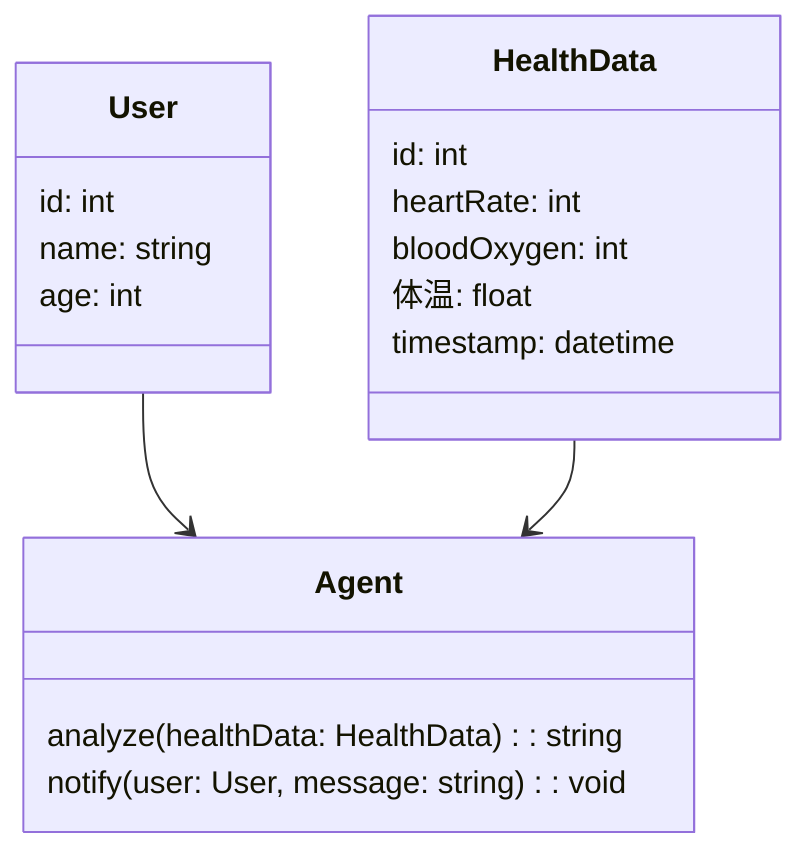
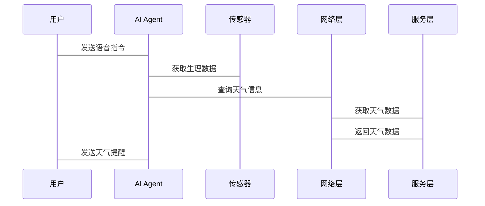

                 


# AI Agent在智能穿戴设备中的应用：健康监测与生活助手

## 关键词：AI Agent, 智能穿戴设备, 健康监测, 生活助手, 人工智能, 物联网

## 摘要：  
随着人工智能技术的飞速发展，AI Agent（人工智能代理）在智能穿戴设备中的应用日益广泛。本文从AI Agent的基本概念出发，详细探讨其在智能穿戴设备中的健康监测与生活助手功能。通过分析AI Agent的核心原理、算法实现以及系统架构，本文展示了AI Agent在智能穿戴设备中的巨大潜力和实际应用价值。

---

## 第1章: AI Agent与智能穿戴设备的背景介绍

### 1.1 AI Agent的基本概念

#### 1.1.1 什么是AI Agent
AI Agent（人工智能代理）是指能够感知环境、自主决策并执行任务的智能实体。它通过传感器获取信息，利用算法进行分析，并通过执行器完成目标。AI Agent的核心在于其智能性和自主性。

#### 1.1.2 AI Agent的核心特点
- **自主性**：能够自主决策，无需人工干预。
- **反应性**：能够实时感知环境并做出反应。
- **学习能力**：通过数据和经验不断优化自身性能。
- **可扩展性**：能够适应不同的应用场景和复杂度。

#### 1.1.3 AI Agent的分类与应用场景
AI Agent可以分为基于规则的Agent和基于机器学习的Agent。基于规则的Agent通过预定义的规则进行决策，适用于简单场景；基于机器学习的Agent能够通过数据训练，适用于复杂场景。

---

### 1.2 智能穿戴设备的定义与发展

#### 1.2.1 智能穿戴设备的定义
智能穿戴设备是指能够 worn on the body 并通过传感器和计算技术提供智能化服务的设备，包括智能手表、智能手环、智能眼镜等。

#### 1.2.2 智能穿戴设备的发展历程
智能穿戴设备经历了从简单计步器到多功能健康监测设备的演变，近年来随着AI技术的发展，其功能更加智能化。

#### 1.2.3 智能穿戴设备的市场现状
当前，智能穿戴设备市场增长迅速，应用场景涵盖健康监测、运动追踪、生活助手等多个领域。

---

### 1.3 AI Agent在智能穿戴设备中的应用前景

#### 1.3.1 健康监测的潜力
AI Agent可以通过分析心率、血压等数据，实时监测用户的健康状况，并在异常情况下发出预警。

#### 1.3.2 生活助手的创新应用
AI Agent可以作为用户的私人助手，帮助管理日程、提醒事项、提供天气信息等。

#### 1.3.3 未来发展趋势
随着AI技术的进步，智能穿戴设备将更加智能化，AI Agent的功能也将更加多样化和个性化。

---

## 第2章: AI Agent与智能穿戴设备的核心概念

### 2.1 AI Agent的核心原理

#### 2.1.1 感知层
AI Agent通过传感器获取环境数据，例如心率、体温等。

#### 2.1.2 决策层
AI Agent通过算法对感知数据进行分析，做出决策。

#### 2.1.3 执行层
AI Agent通过执行器（如震动提醒、屏幕显示）完成决策结果的输出。

### 2.2 智能穿戴设备的系统架构

#### 2.2.1 数据采集层
负责采集用户的生理数据和环境数据。

#### 2.2.2 数据处理层
对采集的数据进行分析和处理，生成有意义的信息。

#### 2.2.3 应用层
提供用户界面和功能，实现AI Agent与用户的交互。

### 2.3 AI Agent与智能穿戴设备的结合

#### 2.3.1 数据流的交互
AI Agent与智能穿戴设备之间通过数据流进行实时交互，确保信息的及时性和准确性。

#### 2.3.2 功能模块的协同
AI Agent协同智能穿戴设备的各个功能模块，实现健康监测和生活助手的双重功能。

#### 2.3.3 系统的整体架构
AI Agent作为系统的核心，协调智能穿戴设备的各个部分，实现智能化服务。

---

## 第3章: AI Agent在健康监测中的应用

### 3.1 健康监测的核心功能

#### 3.1.1 心率监测
AI Agent通过传感器采集心率数据，分析心率变化，识别潜在健康问题。

#### 3.1.2 血氧监测
AI Agent可以实时监测血氧饱和度，帮助用户了解健康状况。

#### 3.1.3 体温监测
AI Agent通过体温传感器，实时监测体温，识别发热等异常情况。

### 3.2 AI Agent在健康数据处理中的作用

#### 3.2.1 数据的实时采集与分析
AI Agent通过传感器实时采集生理数据，并利用算法进行分析，生成健康报告。

#### 3.2.2 异常数据的识别与预警
AI Agent能够识别异常数据，及时发出预警，帮助用户采取措施。

#### 3.2.3 健康报告的生成与推送
AI Agent可以根据分析结果，生成健康报告，并通过智能穿戴设备推送至用户。

### 3.3 健康监测的算法原理

#### 3.3.1 基于AI的健康数据分析
AI Agent利用机器学习算法，对健康数据进行分类和预测，例如心率异常检测。

#### 3.3.2 健康预测模型的构建
通过训练数据，AI Agent可以构建健康预测模型，预测用户的健康状况。

#### 3.3.3 算法的优化与改进
通过不断优化算法，AI Agent可以提高健康监测的准确性和效率。

---

## 第4章: AI Agent作为生活助手的功能实现

### 4.1 生活助手的核心功能

#### 4.1.1 日程管理
AI Agent可以帮助用户管理日程安排，提醒重要事件。

#### 4.1.2 信息提醒
AI Agent可以实时推送天气、新闻等信息，帮助用户获取最新动态。

#### 4.1.3 语音交互
AI Agent支持语音交互，用户可以通过语音指令完成操作。

### 4.2 AI Agent的生活助手算法

#### 4.2.1 自然语言处理技术
AI Agent利用自然语言处理技术，实现语音交互和信息理解。

#### 4.2.2 个性化推荐算法
AI Agent通过分析用户行为，推荐个性化的内容和服务。

#### 4.2.3 任务调度算法
AI Agent可以根据任务优先级，合理调度资源，优化任务执行效率。

### 4.3 生活助手的用户体验优化

#### 4.3.1 交互设计
通过优化用户界面和交互流程，提升用户体验。

#### 4.3.2 功能的智能化提升
AI Agent通过学习用户行为，提供更加智能化的服务。

#### 4.3.3 用户反馈的处理
AI Agent可以根据用户反馈，不断优化自身功能和服务。

---

## 第5章: 系统架构

### 5.1 问题场景介绍
智能穿戴设备需要同时实现健康监测和生活助手功能，对系统的架构和算法提出了更高的要求。

### 5.2 项目介绍
本项目旨在通过AI Agent实现智能穿戴设备的健康监测和生活助手功能，提升用户体验。

### 5.3 系统功能设计

#### 5.3.1 领域模型


#### 5.3.2 系统架构设计


#### 5.3.3 接口设计
- **传感器接口**：用于采集生理数据。
- **网络接口**：用于与云端服务通信。
- **用户接口**：用于与用户交互。

#### 5.3.4 交互序列图


---

## 第6章: 项目实战

### 6.1 环境安装
需要安装Python、TensorFlow、Keras等工具。

### 6.2 核心代码实现
```python
import numpy as np
from tensorflow import keras

# 加载预训练模型
model = keras.models.load_model('health_predictor.h5')

# 数据预处理
data = np.array([[75, 98, 36.5]])

# 预测结果
prediction = model.predict(data)
print(prediction)
```

### 6.3 代码解读与分析
上述代码展示了如何使用预训练模型进行健康数据的预测。模型通过输入心率、血氧和体温数据，输出健康状态的预测结果。

### 6.4 案例分析与详细讲解
通过实际案例分析，展示AI Agent在智能穿戴设备中的应用效果和优化方向。

### 6.5 项目小结
总结项目实现的关键点和经验教训，为后续开发提供参考。

---

## 第7章: 最佳实践

### 7.1 小结
AI Agent在智能穿戴设备中的应用前景广阔，健康监测和生活助手功能的结合将为用户带来更智能化的服务。

### 7.2 注意事项
- 数据隐私保护
- 系统稳定性
- 用户体验优化

### 7.3 拓展阅读
推荐相关领域的书籍和论文，帮助读者进一步深入学习。

---

## 作者：AI天才研究院 & 禅与计算机程序设计艺术

---

以上是《AI Agent在智能穿戴设备中的应用：健康监测与生活助手》的技术博客文章的完整目录大纲和内容概述。通过系统化的分析和详细的技术讲解，本文为读者全面展现了AI Agent在智能穿戴设备中的应用潜力和实际价值。

