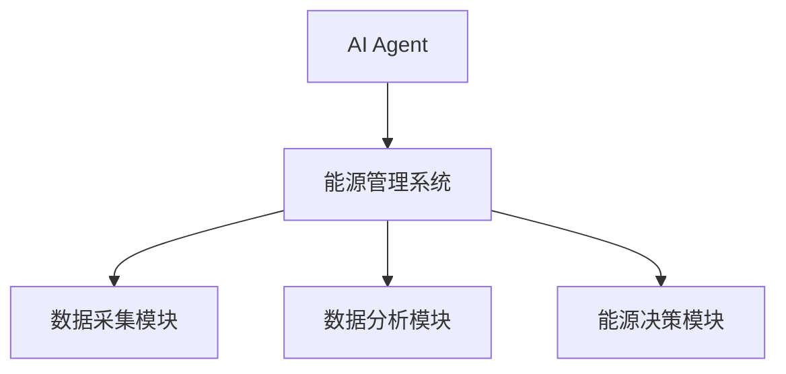

                 


# AI Agent在智能能源管理中的应用

## 关键词：AI Agent, 智能能源管理, 算法原理, 系统架构, 项目实战

## 摘要：  
AI Agent作为一种智能化的决策和执行代理，正在被广泛应用于能源管理领域。本文将深入探讨AI Agent的核心概念、算法原理、系统架构以及在智能能源管理中的实际应用。通过案例分析和项目实战，结合理论与实践，全面解析AI Agent在能源管理中的优势与挑战，为读者提供一个系统性的视角。

---

## 第1章: AI Agent的基本概念与背景

### 1.1 AI Agent的定义与核心原理

#### 1.1.1 AI Agent的定义  
AI Agent（人工智能代理）是指一种能够感知环境、自主决策并执行任务的智能实体。它能够通过传感器获取信息，利用算法进行分析，并通过执行器完成目标。AI Agent的核心在于其自主性、反应性和社会性。

#### 1.1.2 AI Agent的核心原理  
AI Agent的工作原理可以分为以下几个步骤：  
1. **感知环境**：通过传感器或数据接口获取外部信息。  
2. **信息处理**：利用算法对信息进行分析和处理。  
3. **决策制定**：基于处理后的信息，选择最优行动方案。  
4. **执行行动**：通过执行器将决策转化为具体行动。  

#### 1.1.3 AI Agent与传统AI的区别  
AI Agent与传统AI的区别主要体现在以下几个方面：  
- **自主性**：AI Agent能够自主决策，而传统AI通常依赖于外部指令。  
- **实时性**：AI Agent能够实时响应环境变化，而传统AI更多是离线处理。  
- **目标导向**：AI Agent的目标明确，而传统AI更多是任务导向。  

### 1.2 智能能源管理的背景与挑战

#### 1.2.1 能源管理的基本概念  
能源管理是指通过对能源的生产、传输、分配和使用进行规划、监控和优化，以实现能源高效利用和可持续发展的过程。  

#### 1.2.2 当前能源管理的主要挑战  
1. **能源浪费**：传统能源管理方式效率低下，导致能源浪费。  
2. **资源分配不均**：能源资源在不同区域和时间的分配不均，影响整体效率。  
3. **环境问题**：能源的过度使用和不合理利用导致环境污染和气候变化。  

#### 1.2.3 智能能源管理的必要性  
智能能源管理通过引入人工智能、大数据和物联网等技术，实现能源的智能化调度和优化管理，从而提高能源利用效率，减少浪费和环境污染。

### 1.3 AI Agent在能源管理中的应用背景

#### 1.3.1 能源管理的智能化需求  
随着能源需求的增长和环境问题的加剧，智能化能源管理已成为必然趋势。AI Agent能够通过实时数据分析和决策，优化能源的生产和使用。  

#### 1.3.2 AI Agent在能源管理中的优势  
1. **高效性**：AI Agent能够快速响应环境变化，提高能源管理效率。  
2. **准确性**：通过算法优化，AI Agent能够做出更准确的决策。  
3. **灵活性**：AI Agent能够适应不同的能源管理场景。  

---

## 第2章: AI Agent在能源管理中的核心概念

### 2.1 AI Agent的核心概念与属性特征对比

#### 2.1.1 AI Agent的核心概念  
AI Agent在能源管理中的核心概念包括：  
- **自主性**：能够在没有外部干预的情况下自主运行。  
- **反应性**：能够实时感知环境变化并做出反应。  
- **目标导向**：以优化能源管理为目标，做出最优决策。  

#### 2.1.2 AI Agent与传统代理的对比  
| 特性 | AI Agent | 传统代理 |
|------|-----------|-----------|
| 自主性 | 高         | 低         |
| 反应性 | 高         | 低         |
| 学习能力 | 高         | 低         |
| 决策能力 | 高         | 低         |

#### 2.1.3 AI Agent的ER实体关系图  
```mermaid
er
actor: AI Agent
actornote: 能够感知环境、决策和执行
```

### 2.2 能源管理的核心概念与体系

#### 2.2.1 能源管理的基本体系  
能源管理的基本体系包括：  
1. **数据采集**：通过传感器采集能源数据。  
2. **数据分析**：对数据进行处理和分析。  
3. **决策制定**：基于分析结果制定优化策略。  
4. **执行控制**：根据决策结果进行执行和控制。  

#### 2.2.2 AI Agent与能源管理的协同机制  
AI Agent通过与能源管理系统的协同，实现能源的智能化管理。具体机制包括：  
1. **数据共享**：AI Agent与能源管理系统共享数据。  
2. **任务分配**：AI Agent根据系统需求分配任务。  
3. **反馈优化**：AI Agent根据执行结果优化决策策略。  

---

## 第3章: AI Agent的算法原理与能源管理应用

### 3.1 AI Agent的算法原理

#### 3.1.1 决策树算法  
决策树是一种常用的AI Agent决策算法，其核心思想是通过构建树状结构，逐步划分问题空间，最终找到最优决策路径。  

#### 3.1.2 马尔可夫决策过程  
马尔可夫决策过程（MDP）是一种基于状态转移的概率模型，适用于动态环境下的决策问题。  

#### 3.1.3 强化学习算法  
强化学习是一种通过试错机制优化决策策略的方法，适用于复杂环境下的能源管理问题。  

### 3.2 能源管理中的AI Agent算法实现

#### 3.2.1 数据采集与处理  
能源数据采集模块通过传感器获取实时数据，经过预处理后输入到AI Agent进行分析。  

#### 3.2.2 模型训练与优化  
基于历史数据，AI Agent通过训练模型优化决策策略，确保在实际应用中能够做出最优决策。  

#### 3.2.3 模型部署与应用  
训练好的AI Agent模型被部署到能源管理系统中，实时监控和优化能源使用。  

---

## 第4章: 智能能源管理系统的架构设计

### 4.1 系统功能设计

#### 4.1.1 能源数据采集模块  
通过传感器采集能源消耗数据，并传输到中央控制系统。  

#### 4.1.2 能源数据分析模块  
对采集到的数据进行分析，识别异常情况并生成优化建议。  

#### 4.1.3 能源决策模块  
基于分析结果，AI Agent制定优化决策并执行。  

### 4.2 系统架构设计

#### 4.2.1 系统架构图  


#### 4.2.2 系统接口设计  
系统接口包括：  
1. 数据采集接口：用于与传感器通信。  
2. 数据分析接口：用于与数据处理模块交互。  
3. 决策执行接口：用于与执行器通信。  

### 4.3 项目实战

#### 4.3.1 环境安装  
安装所需的开发环境和依赖库，例如Python、TensorFlow等。  

#### 4.3.2 系统核心实现  
实现AI Agent的核心算法，例如决策树算法和强化学习算法。  

#### 4.3.3 实际案例分析  
通过实际案例分析AI Agent在能源管理中的应用效果，总结经验和优化点。  

---

## 第5章: 最佳实践与未来展望

### 5.1 最佳实践

#### 5.1.1 系统设计建议  
在设计AI Agent系统时，应注重模块化设计和可扩展性。  

#### 5.1.2 算法优化建议  
根据具体场景选择合适的算法，并不断优化模型性能。  

#### 5.1.3 安全性考虑  
确保系统数据安全和算法安全，防止恶意攻击。  

### 5.2 小结与展望

#### 5.2.1 小结  
本文详细介绍了AI Agent在智能能源管理中的应用，从理论到实践，全面解析了其核心概念、算法原理和系统架构。  

#### 5.2.2 未来展望  
随着AI技术的不断发展，AI Agent在能源管理中的应用将更加广泛和深入，未来可能会出现更加智能化和个性化的能源管理方案。  

---

## 作者：AI天才研究院/AI Genius Institute & 禅与计算机程序设计艺术 /Zen And The Art of Computer Programming  

---

**总结**：通过本文的详细讲解，读者可以全面了解AI Agent在智能能源管理中的应用，从理论到实践，掌握其核心概念和算法原理，为未来的能源管理优化提供参考和指导。

