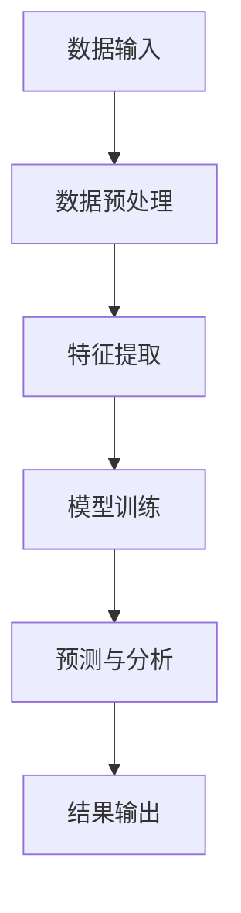
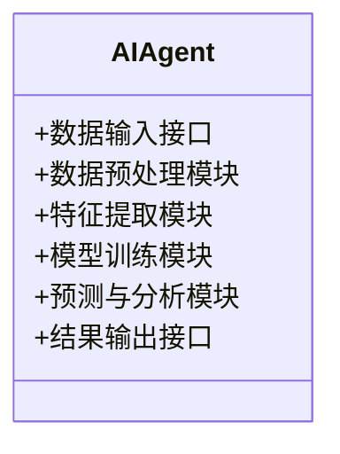

                 


# AI Agent在智能财务分析中的应用

## 关键词：AI Agent，智能财务分析，机器学习，深度学习，自然语言处理，财务决策，数据挖掘

## 摘要：  
随着人工智能技术的迅速发展，AI Agent（人工智能代理）在智能财务分析中的应用越来越广泛。本文从AI Agent的基本概念出发，深入探讨其在财务数据处理、分析与决策中的核心作用，结合具体算法原理和系统架构设计，展示其在智能财务分析中的实际应用价值。文章通过详细的技术分析和案例研究，揭示AI Agent如何提升财务分析的效率和准确性，为财务管理和决策提供强有力的技术支持。

---

## 第1章 AI Agent与智能财务分析的背景与概念

### 1.1 AI Agent的基本概念与定义

AI Agent（人工智能代理）是一种能够感知环境、执行任务并做出决策的智能实体。它通过与数据源、用户或其他系统的交互，实现特定目标。AI Agent的核心特征包括：

- **自主性**：能够在没有人工干预的情况下运行。
- **反应性**：能够实时感知环境并做出反应。
- **目标导向性**：以完成特定任务为目标。
- **学习能力**：通过数据和经验不断优化自身的性能。

AI Agent与传统财务分析工具的主要区别在于，它不仅能够处理数据，还能通过学习和推理提供智能化的分析结果和决策建议。

### 1.2 智能财务分析的背景与现状

财务分析是企业管理和决策的重要环节，传统的财务分析依赖人工处理，效率低且容易出错。随着AI技术的发展，智能财务分析逐渐成为主流。目前，AI Agent在财务分析中的应用主要集中在以下方面：

- **财务数据自动化处理**：通过AI Agent快速处理大量财务数据。
- **智能预测与决策支持**：利用机器学习模型进行财务预测和决策支持。
- **非结构化数据分析**：通过自然语言处理技术分析财务报告和文档。

### 1.3 AI Agent在财务分析中的作用

AI Agent在财务分析中的作用主要体现在以下几个方面：

- **提升效率**：通过自动化处理财务数据，显著提高分析效率。
- **增强准确性**：利用机器学习算法减少人为错误，提高分析结果的准确性。
- **提供决策支持**：通过智能化分析为企业提供数据支持，帮助做出更科学的财务决策。

---

## 第2章 AI Agent的核心概念与工作原理

### 2.1 AI Agent的核心概念

AI Agent在财务分析中的核心概念包括：

- **数据处理**：AI Agent能够处理结构化和非结构化的财务数据。
- **模型构建**：通过机器学习算法构建预测模型。
- **决策支持**：基于模型结果提供财务决策建议。

### 2.2 AI Agent与财务数据的关系

AI Agent与财务数据的关系可以通过以下步骤理解：

1. **数据预处理**：清洗和整理数据，确保数据质量。
2. **特征提取**：从数据中提取有用的特征，用于模型训练。
3. **模型训练**：利用训练数据训练机器学习模型。
4. **预测与分析**：基于模型进行预测和分析，生成财务报告。

### 2.3 AI Agent的核心算法与模型

AI Agent的核心算法包括监督学习、无监督学习和强化学习。以下是几种常见算法的简单介绍：

- **线性回归**：用于预测连续型变量，如股票价格。
- **决策树**：用于分类和回归问题，如客户信用评分。
- **随机森林**：通过集成学习提高模型的准确性和稳定性。

---

## 第3章 AI Agent的算法原理与数学模型

### 3.1 AI Agent的算法原理

AI Agent的算法原理可以通过以下流程图表示：



### 3.2 数学模型与公式

线性回归的数学模型可以表示为：

$$ y = \beta_0 + \beta_1 x + \epsilon $$

其中，$y$ 是目标变量，$x$ 是自变量，$\beta_0$ 和 $\beta_1$ 是回归系数，$\epsilon$ 是误差项。

---

## 第4章 系统分析与架构设计

### 4.1 应用场景

AI Agent在财务分析中的应用场景包括：

- **财务报表分析**：通过AI Agent自动分析财务报表，生成财务分析报告。
- **风险评估**：利用AI Agent进行信用风险评估和市场风险分析。
- **预测分析**：通过时间序列分析预测未来的财务状况。

### 4.2 系统功能设计

以下是系统功能设计的类图：



### 4.3 系统架构设计

以下是系统架构设计的架构图：

```mermaid
rectangle 数据源 {
    数据库
    文本文件
}
rectangle 数据处理模块 {
    数据清洗
    特征提取
}
rectangle 模型训练模块 {
    线性回归
    决策树
}
rectangle 预测与分析模块 {
    预测结果
    可视化报告
}
数据源 --> 数据处理模块
数据处理模块 --> 模型训练模块
模型训练模块 --> 预测与分析模块
```

---

## 第5章 项目实战

### 5.1 环境安装

以下是环境安装的代码示例：

```bash
# 安装Python
sudo apt-get install python3 python3-pip

# 安装机器学习库
pip install numpy scikit-learn
```

### 5.2 核心代码实现

以下是核心代码实现的示例：

```python
import numpy as np
from sklearn.linear_model import LinearRegression

# 示例数据
X = np.array([[1], [2], [3], [4]])
y = np.array([2, 4, 6, 8])

# 创建模型
model = LinearRegression()
model.fit(X, y)

# 预测
print(model.predict([[5]]))  # 输出: [[10]]
```

### 5.3 案例分析

以财务报表分析为例，通过AI Agent分析公司的财务状况，生成财务分析报告。

---

## 第6章 总结与展望

### 6.1 总结

AI Agent在智能财务分析中的应用显著提升了财务分析的效率和准确性。通过机器学习算法和自然语言处理技术，AI Agent能够处理复杂的财务数据，为企业提供科学的决策支持。

### 6.2 展望

未来，随着AI技术的不断发展，AI Agent在财务分析中的应用将更加广泛。可能的发展方向包括：

- **多模态数据处理**：结合文本、图像等多种数据源进行分析。
- **边缘计算**：在边缘设备上部署AI Agent，实现实时分析。

---

## 作者：AI天才研究院/AI Genius Institute & 禅与计算机程序设计艺术/Zen And The Art of Computer Programming

---

本文通过详细的技术分析和案例研究，展示了AI Agent在智能财务分析中的巨大潜力和实际应用价值。希望本文能为读者提供有益的参考和启发，进一步推动AI技术在财务领域的应用和发展。

