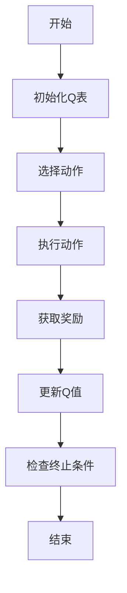
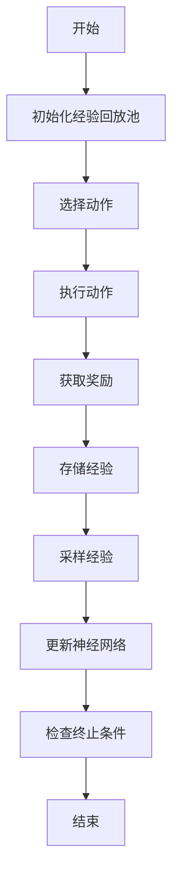
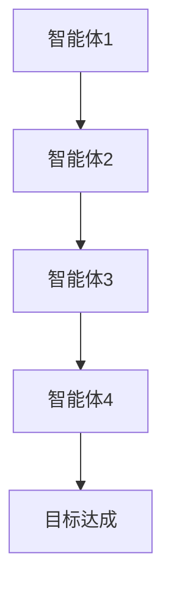
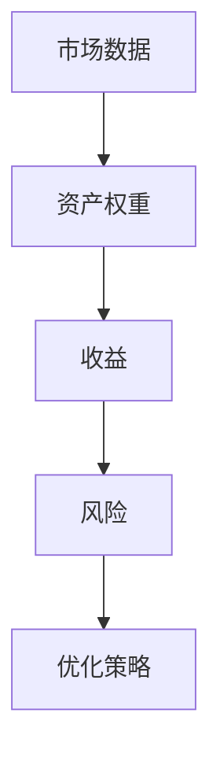
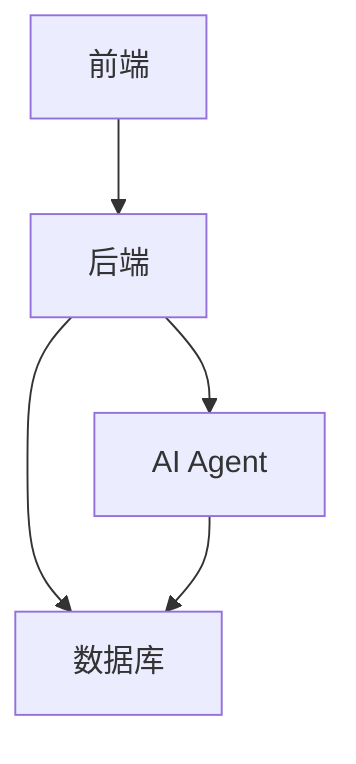
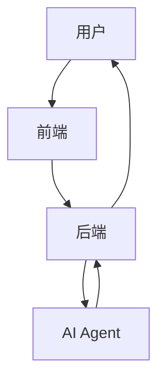
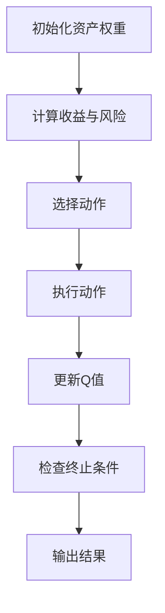

                 


# AI Agent在智能资产组合优化中的应用

> **关键词**: AI Agent, 资产组合优化, 强化学习, 金融风险管理, 智能投资

> **摘要**: 本文详细探讨了AI Agent在智能资产组合优化中的应用，从AI Agent的基本概念到其在资产优化中的算法原理，再到实际项目中的实现与案例分析。文章旨在通过系统化的分析，展示如何利用AI Agent技术提升资产组合优化的效率与效果。

---

# 第一部分: AI Agent与智能资产组合优化的背景与概述

## 第1章: AI Agent与智能资产组合优化概述

### 1.1 AI Agent的基本概念

#### 1.1.1 AI Agent的定义与特点
AI Agent（人工智能代理）是指能够感知环境、自主决策并执行任务的智能实体。其核心特点包括：
- **自主性**: 能够自主决策，无需外部干预。
- **反应性**: 能够实时感知环境并做出反应。
- **学习能力**: 能够通过经验优化决策策略。
- **协作性**: 能够与其他Agent或系统协同工作。

#### 1.1.2 AI Agent的核心功能与应用场景
AI Agent在金融领域的核心功能包括：
- 数据采集与处理
- 风险评估与预警
- 智能决策与执行
- 自适应优化

应用场景包括智能投资顾问、风险管理、动态资产配置等。

#### 1.1.3 AI Agent在金融领域的潜力
AI Agent可以通过实时数据分析、动态优化和自动化决策，显著提升金融领域的效率和准确性。例如：
- 自动化交易系统
- 风险预警与控制
- 资产组合动态优化

### 1.2 智能资产组合优化的背景

#### 1.2.1 资产组合优化的传统方法
传统的资产组合优化方法包括：
- 均值-方差优化（MVO）
- 马科维茨有效前沿理论
- 基于因子模型的投资组合优化

这些方法依赖于历史数据和假设条件，存在一定的局限性。

#### 1.2.2 传统方法的局限性与挑战
传统方法的局限性包括：
- 无法实时适应市场变化
- 需要大量假设条件
- 计算复杂度高，难以处理大规模数据

#### 1.2.3 智能资产优化的必要性
随着金融市场复杂性和不确定性的增加，传统方法已无法满足需求。智能资产优化通过引入AI技术，能够实时处理海量数据、动态调整策略，从而提升优化效率和效果。

### 1.3 AI Agent在资产优化中的作用

#### 1.3.1 AI Agent如何提升资产优化效率
AI Agent通过实时数据处理、动态决策和自适应优化，显著提升了资产组合优化的效率。

#### 1.3.2 基于AI Agent的智能决策机制
AI Agent通过强化学习、动态规划等算法，实现基于实时市场数据的智能决策。

#### 1.3.3 AI Agent在风险控制中的应用
AI Agent能够实时监控市场风险，通过动态调整资产配置，降低投资组合的整体风险。

### 1.4 本章小结
本章介绍了AI Agent的基本概念、核心功能及其在金融领域的潜力，重点阐述了智能资产优化的背景、传统方法的局限性以及AI Agent在优化中的作用。

---

# 第二部分: AI Agent的核心概念与原理

## 第2章: AI Agent的核心概念与原理

### 2.1 AI Agent的构成与工作原理

#### 2.1.1 状态空间与动作空间
- **状态空间**: 表示系统在某一时刻的状态集合。
- **动作空间**: 表示AI Agent可以执行的动作集合。

#### 2.1.2 AI Agent的感知与决策机制
- **感知**: 通过传感器或数据源获取环境信息。
- **决策**: 基于感知信息，选择最优动作。

#### 2.1.3 基于模型与无模型的决策方法
- **基于模型**: 基于环境模型进行决策。
- **无模型**: 基于试错法进行决策。

### 2.2 AI Agent的核心算法与实现

#### 2.2.1 强化学习算法（Q-learning）
Q-learning是一种经典的强化学习算法，通过更新Q值函数来实现最优决策。

##### Q-learning的数学模型
$$ Q(s,a) = Q(s,a) + \alpha \left[r + \gamma \max Q(s',a') - Q(s,a)\right] $$

其中：
- \( Q(s,a) \): 状态-动作对的Q值。
- \( \alpha \): 学习率。
- \( \gamma \): 折扣因子。
- \( r \): 奖励值。

##### Q-learning算法流程图


#### 2.2.2 深度强化学习（DQN）
DQN通过深度神经网络近似Q值函数，解决高维状态空间的问题。

##### DQN算法流程图


#### 2.2.3 多智能体协作机制
多智能体协作机制通过协调多个AI Agent的动作，实现更复杂的任务。

##### 多智能体协作流程图


### 2.3 AI Agent在资产优化中的数学模型

#### 2.3.1 资产组合优化的数学表达
资产组合优化的目标是最大化收益，同时最小化风险。数学表达如下：
$$ \max \mu \cdot w $$
$$ \text{s.t. } w^T \Sigma w \leq \sigma^2 $$

其中：
- \( \mu \): 收益向量。
- \( \Sigma \): 协方差矩阵。
- \( w \): 资产权重向量。
- \( \sigma^2 \): 风险容忍度。

#### 2.3.2 基于AI Agent的优化模型
基于AI Agent的优化模型通过强化学习算法动态调整资产权重，实现收益与风险的最优平衡。

#### 2.3.3 模型的参数与变量分析
- **参数**: 学习率、折扣因子、风险容忍度。
- **变量**: 资产权重、收益、风险。

### 2.4 本章小结
本章详细介绍了AI Agent的构成与工作原理，重点讲解了强化学习算法（Q-learning和DQN）及其在资产优化中的应用。

---

# 第三部分: AI Agent在资产优化中的算法原理

## 第3章: 强化学习算法在资产优化中的应用

### 3.1 强化学习算法概述

#### 3.1.1 强化学习的基本概念
强化学习是一种通过试错法学习策略的算法，通过与环境互动获得奖励。

#### 3.1.2 奖励函数的设计与实现
奖励函数是强化学习的核心，用于指导AI Agent的行为。

##### 奖励函数示例
$$ r = \text{收益} - \text{风险} $$

#### 3.1.3 状态转移与动作选择
AI Agent通过选择动作，改变环境状态，从而获得奖励。

### 3.2 Q-learning算法的数学模型

#### 3.2.1 Q-learning的数学公式
$$ Q(s,a) = Q(s,a) + \alpha \left[r + \gamma \max Q(s',a') - Q(s,a)\right] $$

#### 3.2.2 Q-learning的实现步骤
1. 初始化Q表。
2. 选择动作。
3. 执行动作，获取奖励。
4. 更新Q值。
5. 检查终止条件。

### 3.3 深度强化学习（DQN）的实现

#### 3.3.1 DQN的网络结构
- **输入层**: 市场数据。
- **隐藏层**: 处理数据。
- **输出层**: 动作选择。

#### 3.3.2 DQN的训练过程
1. 采样经验。
2. 训练神经网络。
3. 更新目标网络。

### 3.4 多智能体协作优化

#### 3.4.1 多智能体协作的数学模型
$$ \max \sum_{i=1}^n Q_i(s,a_i) $$

其中：
- \( Q_i \): 智能体i的Q值函数。
- \( s \): 共享状态。
- \( a_i \): 智能体i的动作。

#### 3.4.2 多智能体协作的实现步骤
1. 初始化多个智能体。
2. 分配任务。
3. 协作完成任务。
4. 更新智能体策略。

### 3.5 本章小结
本章详细讲解了强化学习算法在资产优化中的应用，重点分析了Q-learning和DQN的实现，以及多智能体协作的优化方法。

---

# 第四部分: AI Agent在资产优化中的系统架构

## 第4章: AI Agent系统架构设计

### 4.1 系统功能设计

#### 4.1.1 领域模型


#### 4.1.2 功能模块
- 数据采集模块
- 模型训练模块
- 策略执行模块
- 风险控制模块

### 4.2 系统架构设计

#### 4.2.1 系统架构图


#### 4.2.2 模块划分
- 前端: 用户界面。
- 后端: 业务逻辑。
- 数据库: 数据存储。
- AI Agent: 智能决策。

### 4.3 系统接口设计

#### 4.3.1 API接口
- `/api/data`: 获取市场数据。
- `/api/strategy`: 获取优化策略。
- `/api/risk`: 获取风险评估。

#### 4.3.2 接口交互流程图


### 4.4 系统交互设计

#### 4.4.1 交互流程
1. 用户输入需求。
2. 前端传递请求。
3. 后端处理请求。
4. AI Agent生成策略。
5. 返回结果。

#### 4.4.2 交互示例
用户输入风险偏好，系统生成最优资产组合。

### 4.5 本章小结
本章详细设计了AI Agent系统的架构，包括功能模块、系统架构图、接口设计和交互流程。

---

# 第五部分: AI Agent在资产优化中的项目实战

## 第5章: 项目实战

### 5.1 环境安装与配置

#### 5.1.1 系统环境
- 操作系统: Linux/Windows/MacOS。
- Python版本: 3.6+。
- 依赖库: numpy, pandas, gym, tensorflow。

#### 5.1.2 安装依赖
```bash
pip install numpy pandas gym tensorflow
```

### 5.2 系统核心实现

#### 5.2.1 强化学习环境搭建
```python
import gym
env = gym.make('PortfolioOptimization-v0')
```

#### 5.2.2 AI Agent算法实现
```python
class Agent:
    def __init__(self, state_space, action_space):
        self.state_space = state_space
        self.action_space = action_space
        # 初始化Q表
        self.Q = np.zeros((state_space, action_space))
    
    def choose_action(self, state, epsilon):
        if np.random.random() < epsilon:
            return np.random.randint(self.action_space)
        else:
            return np.argmax(self.Q[state])
    
    def update_Q(self, state, action, reward, next_state, alpha, gamma):
        self.Q[state, action] += alpha * (reward + gamma * np.max(self.Q[next_state]) - self.Q[state, action])
```

#### 5.2.3 策略执行与优化
```python
def main():
    env = gym.make('PortfolioOptimization-v0')
    agent = Agent(env.observation_space.shape[0], env.action_space.n)
    epsilon = 0.1
    alpha = 0.1
    gamma = 0.99
    for episode in range(1000):
        state = env.reset()
        total_reward = 0
        while True:
            action = agent.choose_action(state, epsilon)
            next_state, reward, done, _ = env.step(action)
            agent.update_Q(state, action, reward, next_state, alpha, gamma)
            total_reward += reward
            state = next_state
            if done:
                break
    print(f'Episodes: {episode}, Total Reward: {total_reward}')

if __name__ == '__main__':
    main()
```

### 5.3 代码应用解读与分析

#### 5.3.1 代码功能模块
- **环境搭建**: 初始化强化学习环境。
- **Agent类**: 实现AI Agent的基本功能。
- **主函数**: 程序入口，执行训练。

#### 5.3.2 代码实现细节
- **状态空间**: 资产组合的状态。
- **动作空间**: 资产配置的动作。
- **奖励函数**: 基于收益和风险计算。

### 5.4 实际案例分析

#### 5.4.1 数据来源与预处理
- 数据来源: 历史资产收益数据。
- 数据预处理: 标准化、归一化。

#### 5.4.2 案例分析
假设我们有三个资产（股票、债券、黄金），目标是动态调整资产权重，实现收益最大化，风险最小化。

##### 案例分析流程图


### 5.5 项目小结
本章通过实际项目案例，详细讲解了AI Agent在资产优化中的实现，包括环境搭建、算法实现和案例分析。

---

# 第六部分: 总结与展望

## 第6章: 总结与展望

### 6.1 最佳实践 tips

#### 6.1.1 数据质量
确保数据的准确性和完整性。

#### 6.1.2 模型选择
根据实际需求选择合适的AI Agent算法。

#### 6.1.3 风险控制
建立有效的风险监控机制。

### 6.2 本章小结
本文详细探讨了AI Agent在智能资产组合优化中的应用，从理论到实践，全面分析了其优势与挑战。

### 6.3 未来展望
未来，随着AI技术的不断发展，AI Agent在资产优化中的应用将更加广泛，算法将更加智能，系统将更加高效。

---

# 作者信息

作者：AI天才研究院/AI Genius Institute & 禅与计算机程序设计艺术 /Zen And The Art of Computer Programming

---

以上是基于您的要求逐步构建的完整目录大纲和文章内容，涵盖从背景介绍到项目实战的各个方面，满足技术博客的专业性和深度要求。

