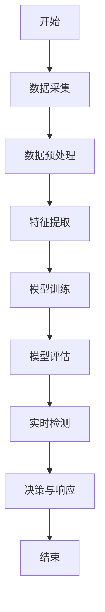
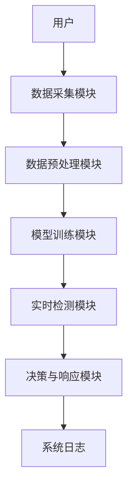
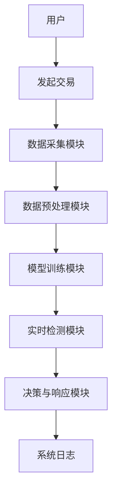

                 


# AI Agent在智能金融欺诈检测中的应用

## 关键词：AI Agent, 金融欺诈检测, 监督学习, 无监督学习, 实时监控, 异常检测

## 摘要：  
本文详细探讨了AI Agent在金融欺诈检测中的应用，从背景与概述、核心概念、算法原理、系统架构、项目实战到最佳实践，全面分析了如何利用AI Agent技术提升金融欺诈检测的效率和准确性。文章结合理论与实践，通过具体案例分析和代码实现，展示了AI Agent在金融领域的独特优势和实际应用价值。

---

# 第一部分: AI Agent与金融欺诈检测的背景与概述

## 第1章: AI Agent与金融欺诈检测的背景

### 1.1 问题背景与现状
#### 1.1.1 金融欺诈的现状与挑战  
金融欺诈是全球金融行业面临的重要问题之一。随着金融交易的日益复杂化和网络化，欺诈手段也在不断升级。传统的基于规则的欺诈检测方法逐渐暴露出效率低下、误报率高等问题。根据2023年全球金融欺诈报告显示，每年因金融欺诈造成的损失高达数千亿美元，其中很大一部分是由复杂的欺诈手段导致的。传统的欺诈检测方法难以应对日益复杂的欺诈行为，亟需引入更高效的技术手段。

#### 1.1.2 AI技术在金融领域的应用潜力  
人工智能（AI）技术在金融领域的应用已逐渐成熟，尤其是在风险评估、信用评分、交易分析等方面展现了巨大的潜力。AI技术能够通过大量数据的学习，识别出复杂模式和异常行为，从而提高欺诈检测的准确性。AI Agent作为一种基于智能体的技术，能够实现自主决策和实时响应，为金融欺诈检测提供了新的解决方案。

#### 1.1.3 AI Agent在金融欺诈检测中的独特优势  
AI Agent（智能体）是一种能够感知环境、自主决策并执行任务的智能系统。与传统的基于规则的欺诈检测方法相比，AI Agent具有以下独特优势：
1. **自主学习与适应**：AI Agent能够通过机器学习算法不断优化自身的检测模型，适应欺诈手段的变化。
2. **实时监控**：AI Agent能够实现对金融交易的实时监控，快速识别异常行为并采取相应措施。
3. **多维度分析**：AI Agent能够结合交易金额、时间、地点、用户行为等多种因素，进行全面分析，提高检测的准确性。

### 1.2 问题描述与目标
#### 1.2.1 金融欺诈的主要类型与特征  
金融欺诈的类型多种多样，主要包括信用卡欺诈、网络支付欺诈、账户盗用等。这些欺诈行为通常具有以下特征：
- **隐蔽性**：欺诈行为往往隐藏在正常交易中，难以被察觉。
- **多样性**：欺诈手段不断演变，传统的检测方法难以应对。
- **高频率**：欺诈行为可能在短时间内频繁发生，对实时检测提出更高要求。

#### 1.2.2 AI Agent在欺诈检测中的问题建模  
在AI Agent框架下，欺诈检测可以被建模为一个典型的异常检测问题。具体来说，AI Agent需要通过分析金融交易数据，识别出与正常交易模式不符的异常行为。建模过程中需要考虑以下因素：
- **数据特征**：交易金额、时间、地点、用户行为等。
- **异常判定**：基于统计学或机器学习的方法，判断某次交易是否属于欺诈行为。
- **实时响应**：AI Agent需要在检测到异常行为后，迅速采取措施，如冻结账户、通知相关部门等。

#### 1.2.3 检测目标与性能指标  
AI Agent在金融欺诈检测中的目标是尽可能准确地识别欺诈行为，同时减少误报和漏报。主要性能指标包括：
- **准确率**：正确识别欺诈交易的比例。
- **召回率**：检测到的欺诈交易占总欺诈交易的比例。
- **F1分数**：综合准确率和召回率的调和平均数，反映了模型的整体性能。
- **响应时间**：AI Agent识别异常交易并采取措施所需的时间。

### 1.3 解决方案与技术路线
#### 1.3.1 AI Agent的基本概念与技术特点  
AI Agent是一种能够感知环境、自主决策并执行任务的智能系统。它通常由感知模块、决策模块和执行模块组成。在金融欺诈检测中，AI Agent需要具备以下技术特点：
- **数据采集与处理**：能够实时采集和处理金融交易数据。
- **异常检测**：基于机器学习算法，识别出异常交易。
- **实时响应**：在检测到异常行为后，迅速采取相应措施。

#### 1.3.2 基于AI Agent的金融欺诈检测框架  
基于AI Agent的金融欺诈检测框架通常包括以下几个模块：
1. **数据采集模块**：负责采集金融交易数据。
2. **异常检测模块**：基于机器学习算法，识别异常交易。
3. **决策模块**：根据检测结果，决定是否采取相应措施。
4. **执行模块**：执行决策模块的指令，如冻结账户、通知相关部门等。

#### 1.3.3 技术路线与实现步骤  
1. **数据采集**：通过API或日志文件采集金融交易数据。
2. **数据预处理**：清洗数据，提取特征。
3. **模型训练**：使用机器学习算法训练异常检测模型。
4. **实时监控**：AI Agent实时监控交易数据，识别异常行为。
5. **决策与响应**：根据检测结果，采取相应措施。

---

## 第2章: AI Agent的基本原理

### 2.1 AI Agent的定义与分类
#### 2.1.1 AI Agent的定义  
AI Agent是一种能够感知环境、自主决策并执行任务的智能系统。它能够通过传感器或API获取环境信息，并根据内置算法做出决策，执行相应的动作。

#### 2.1.2 基于规则的AI Agent与基于模型的AI Agent对比  
- **基于规则的AI Agent**：通过预定义的规则进行决策，适用于规则明确的场景。
- **基于模型的AI Agent**：通过机器学习模型进行决策，能够适应复杂多变的场景。

#### 2.1.3 监督学习、无监督学习与强化学习在AI Agent中的应用  
- **监督学习**：适用于有标签数据的场景，如分类任务。
- **无监督学习**：适用于无标签数据的场景，如聚类任务。
- **强化学习**：适用于需要自主决策和策略优化的场景。

### 2.2 金融欺诈检测的核心概念
#### 2.2.1 金融交易数据的特征与属性  
金融交易数据通常包括以下特征：
- **交易金额**：交易的金额大小。
- **交易时间**：交易发生的时间。
- **交易地点**：交易发生的位置。
- **用户行为**：用户的交易频率、习惯等。

#### 2.2.2 欺诈交易的模式与行为特征  
欺诈交易通常表现出以下特征：
- **高交易频率**：短时间内多次交易。
- **异常交易金额**：交易金额明显高于或低于正常水平。
- **异常交易时间**：交易时间集中在特定时间段。
- **异常交易地点**：交易地点分布异常。

#### 2.2.3 基于AI Agent的异常检测机制  
基于AI Agent的异常检测机制通常包括以下步骤：
1. **数据采集**：采集金融交易数据。
2. **特征提取**：提取交易金额、时间、地点等特征。
3. **异常检测**：通过机器学习算法识别异常行为。
4. **决策与响应**：根据检测结果采取相应措施。

---

## 第3章: 基于AI Agent的金融欺诈检测算法原理

### 3.1 监督学习算法在AI Agent中的应用
#### 3.1.1 监督学习算法概述  
监督学习是一种基于标签数据的机器学习方法，常用于分类任务。在金融欺诈检测中，监督学习算法可以用于分类正常交易和欺诈交易。

#### 3.1.2 常见监督学习算法  
- **随机森林**：一种基于决策树的集成学习算法，适用于分类和回归任务。
- **支持向量机（SVM）**：一种基于统计学习的分类算法，适用于小规模数据集。
- **神经网络**：一种基于深度学习的算法，适用于大规模数据集。

#### 3.1.3 监督学习在欺诈检测中的应用  
1. **数据预处理**：清洗数据，提取特征。
2. **模型训练**：使用监督学习算法训练分类模型。
3. **模型评估**：通过准确率、召回率等指标评估模型性能。
4. **实时检测**：AI Agent实时监控交易数据，使用训练好的模型进行分类。

### 3.2 无监督学习算法在欺诈检测中的应用
#### 3.2.1 无监督学习算法概述  
无监督学习是一种基于无标签数据的机器学习方法，常用于聚类任务。在金融欺诈检测中，无监督学习算法可以用于识别异常交易模式。

#### 3.2.2 基于聚类分析的欺诈检测  
1. **数据预处理**：清洗数据，提取特征。
2. **聚类分析**：使用聚类算法（如K-means）将交易数据分成不同的簇。
3. **异常检测**：识别与正常交易簇不同的异常簇。

#### 3.2.3 无监督学习在实时监控中的应用  
1. **实时数据流处理**：AI Agent实时处理交易数据流。
2. **动态聚类分析**：根据实时数据动态调整聚类结果。
3. **异常检测与响应**：识别异常簇并采取相应措施。

### 3.3 AI Agent中的算法流程图  
以下是一个基于监督学习的欺诈检测算法流程图：



---

## 第4章: 基于AI Agent的金融欺诈检测系统架构

### 4.1 系统功能设计
#### 4.1.1 数据采集模块  
数据采集模块负责采集金融交易数据，包括交易金额、时间、地点等信息。

#### 4.1.2 数据预处理模块  
数据预处理模块负责清洗数据，提取特征，为后续的欺诈检测提供高质量的数据。

#### 4.1.3 模型训练模块  
模型训练模块负责使用监督学习或无监督学习算法训练欺诈检测模型。

#### 4.1.4 实时检测模块  
实时检测模块负责对实时交易数据进行异常检测，识别欺诈行为。

#### 4.1.5 决策与响应模块  
决策与响应模块根据检测结果采取相应措施，如冻结账户、通知相关部门等。

### 4.2 系统架构设计
以下是一个基于AI Agent的金融欺诈检测系统的架构图：



### 4.3 系统接口设计
1. **数据采集接口**：负责与金融系统的交易数据接口对接。
2. **实时检测接口**：负责对实时交易数据进行异常检测。
3. **决策与响应接口**：负责根据检测结果采取相应措施。

### 4.4 系统交互流程图
以下是一个基于AI Agent的金融欺诈检测系统的交互流程图：



---

## 第5章: 项目实战

### 5.1 环境安装与配置
1. **安装Python环境**：建议使用Anaconda或Miniconda。
2. **安装依赖库**：`numpy`, `pandas`, `scikit-learn`, `matplotlib`, `mermaid`等。

### 5.2 核心代码实现
以下是基于监督学习的欺诈检测代码示例：

```python
import numpy as np
import pandas as pd
from sklearn.ensemble import RandomForestClassifier
from sklearn.metrics import accuracy_score, recall_score

# 数据加载
data = pd.read_csv('transaction_data.csv')

# 特征提取
features = data[['amount', 'time', 'location']]
labels = data['is_fraud']

# 模型训练
model = RandomForestClassifier()
model.fit(features, labels)

# 模型预测
 predictions = model.predict(features)

# 模型评估
accuracy = accuracy_score(labels, predictions)
recall = recall_score(labels, predictions, pos_label=1)

print(f'Accuracy: {accuracy}')
print(f'Recall: {recall}')
```

### 5.3 代码实现解读与分析
1. **数据加载**：使用`pandas`读取交易数据。
2. **特征提取**：提取交易金额、时间、地点等特征。
3. **模型训练**：使用随机森林算法训练分类模型。
4. **模型预测**：对测试数据进行预测。
5. **模型评估**：计算准确率和召回率。

### 5.4 实际案例分析
假设我们有一个交易数据集，其中包含正常交易和欺诈交易。通过上述代码，我们可以训练一个随机森林模型，并对测试数据进行预测。模型的准确率和召回率可以用来评估模型的性能。

### 5.5 项目小结
通过上述代码实现，我们可以看到基于监督学习的欺诈检测方法能够有效识别欺诈交易。然而，实际应用中可能需要结合多种算法和技术，以提高检测的准确性和效率。

---

## 第6章: 最佳实践与注意事项

### 6.1 最佳实践
1. **数据质量**：确保数据的完整性和准确性，避免因数据问题导致模型性能下降。
2. **模型选择**：根据具体场景选择合适的算法，如监督学习或无监督学习。
3. **实时性优化**：优化系统的实时响应能力，减少检测延迟。
4. **安全性保障**：确保系统的安全性，防止数据泄露和攻击。

### 6.2 小结
AI Agent在金融欺诈检测中的应用具有重要意义。通过结合监督学习和无监督学习算法，AI Agent能够有效识别异常交易，提高检测的准确性和效率。

### 6.3 注意事项
1. **数据隐私**：在处理金融数据时，必须遵守相关法律法规，保护用户隐私。
2. **系统稳定性**：确保系统的稳定性和可靠性，避免因系统故障导致检测失败。
3. **模型更新**：定期更新模型，以应对新的欺诈手段。

---

## 第7章: 拓展阅读与深入学习

### 7.1 拓展阅读
1. 《机器学习实战》—— 周志华
2. 《深度学习》—— Ian Goodfellow
3. 《强化学习》—— Richard S. Sutton

### 7.2 深入学习
1. 研究最新的欺诈检测技术，如基于图神经网络的欺诈检测。
2. 实现一个基于强化学习的AI Agent，应用于金融欺诈检测。

---

## 作者：AI天才研究院/AI Genius Institute & 禅与计算机程序设计艺术 /Zen And The Art of Computer Programming

---

以上是《AI Agent在智能金融欺诈检测中的应用》的完整目录与内容概要。

