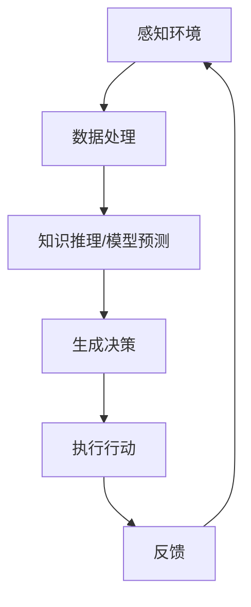
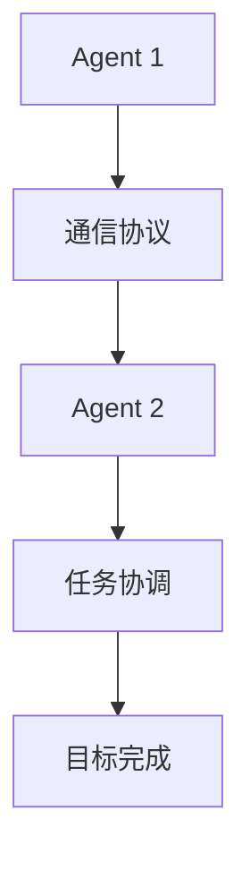
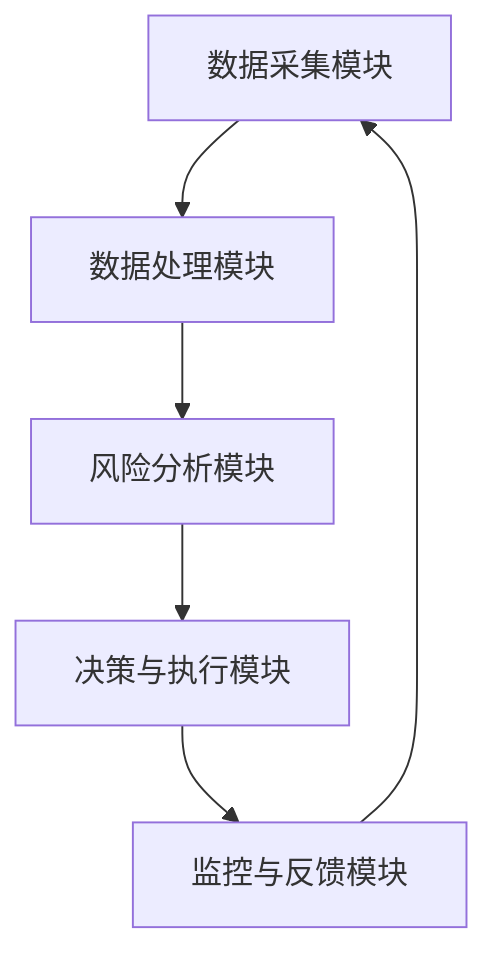
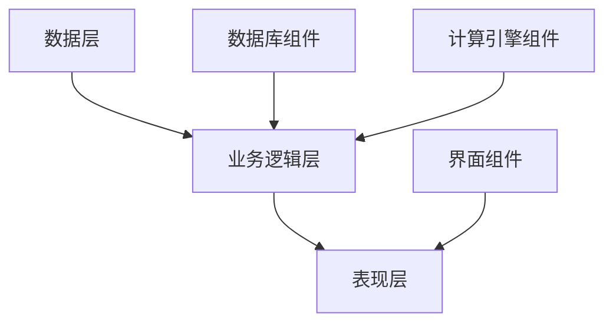
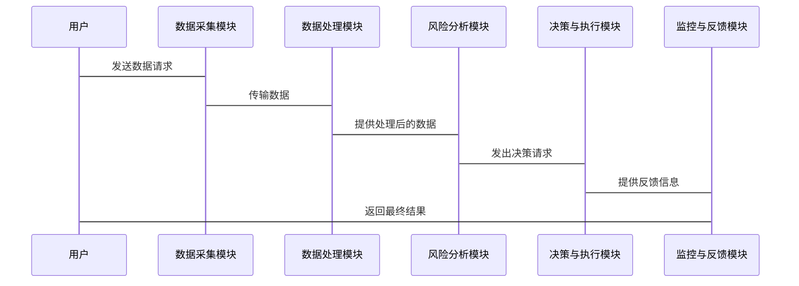
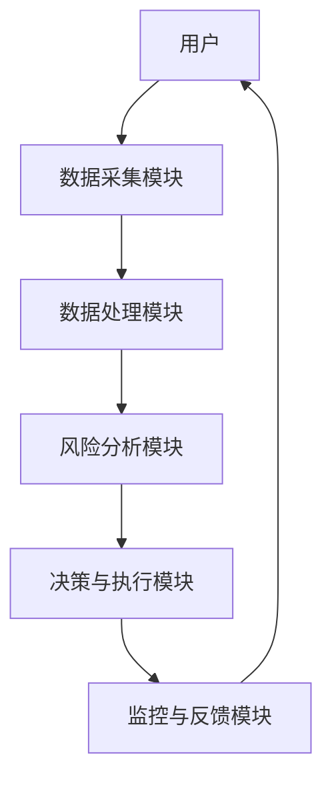

                 


# AI Agent在智能风险管理中的角色

> **关键词**：AI Agent，风险管理，智能决策，机器学习，知识图谱，NLP

> **摘要**：本文探讨了AI Agent在智能风险管理中的核心角色，从理论基础、技术实现到系统架构和实战应用，全面分析了AI Agent如何通过自动化决策、实时监控和多维度数据分析提升风险管理效率。文章结合具体案例，详细阐述了AI Agent在信用评估、欺诈检测和实时监控等领域的应用，同时介绍了相关的技术实现方法和系统设计思路，为读者提供了一个全面了解AI Agent在风险管理中的应用的框架。

---

## 第1章 AI Agent与风险管理概述

### 1.1 AI Agent的基本概念

#### 1.1.1 AI Agent的定义与特点
- **定义**：AI Agent（人工智能代理）是指能够感知环境、自主决策并采取行动以实现特定目标的智能实体。
- **特点**：
  - **自主性**：能够在没有外部干预的情况下独立运作。
  - **反应性**：能够实时感知环境变化并做出响应。
  - **学习能力**：通过数据和经验不断优化自身行为。
  - **协作性**：能够与其他Agent或系统协同工作。

#### 1.1.2 AI Agent的核心功能与分类
- **核心功能**：
  - 数据收集与处理
  - 风险识别与评估
  - 决策制定与行动执行
  - 实时监控与反馈
- **分类**：
  - **基于规则的Agent**：通过预定义的规则进行决策。
  - **基于模型的Agent**：利用数学模型进行推理和决策。
  - **混合型Agent**：结合规则和模型的双重优势。

#### 1.1.3 AI Agent与传统风险管理的区别
- **传统风险管理**：依赖人工分析和经验判断，效率低、覆盖面有限。
- **AI Agent的优势**：
  - **高效性**：能够快速处理大量数据。
  - **准确性**：通过算法优化决策质量。
  - **实时性**：能够实时监控并做出响应。

### 1.2 智能风险管理的背景与重要性

#### 1.2.1 风险管理的传统方法与局限性
- **传统方法**：
  - 依赖人工经验进行风险评估。
  - 数据来源单一，分析维度有限。
  - 响应速度较慢，难以应对动态变化。
- **局限性**：
  - 无法处理海量数据。
  - 难以发现复杂关联。
  - 人工成本高，效率低下。

#### 1.2.2 智能化风险管理的必要性
- **数据驱动**：现代风险管理需要处理海量结构化和非结构化数据。
- **实时性要求**：金融市场、网络安全等领域需要实时监控和快速响应。
- **复杂性增加**：风险来源多样化，传统方法难以应对。

#### 1.2.3 AI Agent在风险管理中的角色定位
- **角色定位**：
  - **数据处理器**：负责数据的收集、清洗和分析。
  - **决策者**：基于数据和模型做出最优决策。
  - **执行者**：根据决策结果采取行动或发出警报。

### 1.3 本章小结
本章介绍了AI Agent的基本概念、功能与分类，并对比了传统风险管理方法的局限性，强调了AI Agent在智能风险管理中的重要性。

---

## 第2章 AI Agent的核心原理与技术

### 2.1 AI Agent的决策机制

#### 2.1.1 基于知识的决策
- **知识来源**：
  - 结构化数据（如数据库中的表格数据）。
  - 非结构化数据（如文本、图像）。
- **决策过程**：
  1. 数据采集与预处理。
  2. 知识表示与推理。
  3. 决策生成与验证。

#### 2.1.2 基于数据的决策
- **数据驱动方法**：
  - 利用机器学习模型（如随机森林、神经网络）进行预测。
  - 基于历史数据训练模型，预测未来风险。
- **决策过程**：
  1. 数据清洗与特征提取。
  2. 模型训练与优化。
  3. 风险预测与决策生成。

#### 2.1.3 基于情境的决策
- **情境感知**：
  - 利用传感器、日志等实时数据感知环境状态。
  - 基于上下文信息调整决策策略。
- **动态调整**：
  - 根据实时反馈不断优化决策。

#### 2.1.4 AI Agent的决策流程图


### 2.2 AI Agent的学习与自适应能力

#### 2.2.1 机器学习在AI Agent中的应用
- **监督学习**：
  - 用于分类任务，如欺诈检测。
  - 使用训练数据（输入-标签对）训练分类器。
  - 例如：使用随机森林算法训练信用卡欺诈检测模型。
  - 代码示例：
    ```python
    from sklearn.ensemble import RandomForestClassifier
    # 假设X为特征矩阵，y为标签
    model = RandomForestClassifier().fit(X, y)
    ```
  - 数学模型：
    $$ P(y|x) = \prod_{i=1}^{n} P(x_i|y) \cdot P(y) $$

#### 2.2.2 深度学习与强化学习的结合
- **深度学习**：
  - 用于处理非结构化数据，如图像识别。
  - 使用卷积神经网络（CNN）进行风险事件识别。
  - 代码示例：
    ```python
    import tensorflow as tf
    model = tf.keras.Sequential([
        tf.keras.layers.Conv2D(32, (3,3), activation='relu', input_shape=(28,28,1)),
        tf.keras.layers.MaxPooling2D((2,2)),
        tf.keras.layers.Flatten(),
        tf.keras.layers.Dense(10, activation='softmax')
    ])
    ```
  - 数学模型：
    $$ y = \sigma(Wx + b) $$

- **强化学习**：
  - 用于动态环境中的决策优化。
  - 使用Q-learning算法进行策略优化。
  - 代码示例：
    ```python
    class QLearning:
        def __init__(self, state_space, action_space):
            self.q_table = np.zeros((state_space, action_space))
        def update(self, state, action, reward, next_state, alpha=0.1):
            self.q_table[state][action] = (1-alpha)*self.q_table[state][action] + alpha*(reward + np.max(self.q_table[next_state]))
    ```

#### 2.2.3 知识图谱构建与更新
- **知识图谱**：
  - 通过NLP技术构建实体间的关系网络。
  - 使用知识图谱进行风险关联分析。
  - 例如：检测供应链中的潜在风险点。

### 2.3 AI Agent的通信与协作

#### 2.3.1 多智能体系统的基本原理
- **多智能体系统**：
  - 由多个Agent组成，协同完成复杂任务。
  - 通过通信协议交换信息。
  - 使用分布式计算技术进行协作。

#### 2.3.2 跨Agent通信协议
- **通信方式**：
  - 直接通信：Agent之间直接交换信息。
  - 间接通信：通过中间媒介传递信息。
- **通信内容**：
  - 状态信息：当前环境的状态。
  - 行动信息：Agent的决策和行动。
  - 目标信息：Agent的目标和优先级。

#### 2.3.3 协作任务分配与协调
- **任务分配**：
  - 基于角色分配：根据Agent的专长分配任务。
  - 基于能力分配：根据Agent的能力动态分配任务。
- **协调机制**：
  - 使用协商协议（如分布式协商）进行任务协调。
  - 建立明确的优先级和时间表。

#### 2.3.4 多智能体系统架构图


### 2.4 本章小结
本章详细讲解了AI Agent的决策机制、学习能力以及通信协作能力，并通过具体的算法和代码示例展示了其实现方式。

---

## 第3章 智能风险管理的理论基础

### 3.1 风险管理的基本原理

#### 3.1.1 风险识别、评估与应对的基本流程
- **风险识别**：
  - 通过数据分析和情境感知识别潜在风险。
  - 例如：使用NLP技术分析新闻文本识别市场风险。
- **风险评估**：
  - 通过概率和影响分析评估风险的严重性。
  - 例如：使用风险矩阵进行分类。
- **风险应对**：
  - 根据评估结果制定应对策略。
  - 例如：调整投资组合以分散风险。

#### 3.1.2 风险矩阵与风险优先级排序
- **风险矩阵**：
  - 以概率和影响为两个维度，将风险分为四个等级。
  - 例如：
    | 概率 | 影响 | 风险等级 |
    |------|------|----------|
    | 高   | 高   | 严重     |
    | 高   | 中   | 高       |
    | 中   | 高   | 中       |
    | 低   | 低   | 可接受   |

#### 3.1.3 风险缓解策略的制定
- **策略类型**：
  - 风险避免：完全避免高风险活动。
  - 风险降低：通过控制措施降低风险程度。
  - 风险接受：在可接受范围内承担风险。

### 3.2 AI在风险管理中的应用现状

#### 3.2.1 AI在信用评估中的应用
- **信用评分模型**：
  - 使用机器学习模型预测客户违约概率。
  - 例如：使用逻辑回归模型评估信用风险。
  - 代码示例：
    ```python
    from sklearn.linear_model import LogisticRegression
    model = LogisticRegression().fit(X, y)
    ```

#### 3.2.2 AI在欺诈检测中的应用
- **异常检测**：
  - 使用无监督学习算法（如Isolation Forest）检测异常交易。
  - 代码示例：
    ```python
    from sklearn.ensemble import IsolationForest
    model = IsolationForest().fit(X)
    ```

#### 3.2.3 AI在实时监控中的应用
- **实时预警系统**：
  - 使用流数据处理技术（如Apache Flink）进行实时监控。
  - 例如：监控交易流水，实时检测异常交易。

### 3.3 AI Agent在风险管理中的独特优势

#### 3.3.1 自动化决策的优势
- **效率提升**：AI Agent能够快速处理大量数据并做出决策。
- **准确性提高**：基于算法优化的决策更准确。

#### 3.3.2 实时响应的能力
- **动态调整**：AI Agent能够实时感知环境变化并做出响应。
- **快速决策**：在动态环境中保持高效应对。

#### 3.3.3 多维度数据的整合能力
- **数据融合**：
  - 整合结构化和非结构化数据，提升分析维度。
  - 例如：结合文本、图像和交易数据进行风险评估。

### 3.4 本章小结
本章介绍了风险管理的基本原理，并分析了AI在风险管理中的应用现状，重点突出了AI Agent的独特优势。

---

## 第4章 AI Agent在风险管理中的技术实现

### 4.1 基于NLP的风险信息处理

#### 4.1.1 文本解析与情感分析
- **文本解析**：
  - 使用分词工具（如jieba）对文本进行分词。
  - 例如：分析新闻标题，识别关键词。
  - 代码示例：
    ```python
    import jieba
    text = "人工智能改变世界"
    words = jieba.lcut(text)
    ```
- **情感分析**：
  - 使用深度学习模型（如LSTM）进行情感分类。
  - 例如：分析社交媒体上的评论，识别市场情绪。
  - 代码示例：
    ```python
    from tensorflow.keras import layers
    model = tf.keras.Sequential([
        layers.Embedding(vocab_size, 64),
        layers.LSTM(32),
        layers.Dense(2, activation='softmax')
    ])
    ```

#### 4.1.2 实体识别与关系抽取
- **实体识别**：
  - 使用NER（Named Entity Recognition）模型识别文本中的实体。
  - 例如：识别新闻中的公司名称和事件。
  - 代码示例：
    ```python
    from spacy import load
    nlp = load("en_core_web_sm")
    doc = nlp("Google invests in AI research")
    for ent in doc.ents:
        print(ent.text, ent.label_)
    ```
- **关系抽取**：
  - 使用关系抽取模型识别实体间的关联。
  - 例如：识别公司之间的投资关系。
  - 代码示例：
    ```python
    from transformers import AutoTokenizer, AutoModelForTokenClassification
    tokenizer = AutoTokenizer.from_pretrained("dbmdz/bert-large-cased-finetuned-conll03-2020")
    model = AutoModelForTokenClassification.from_pretrained("dbmdz/bert-large-cased-finetuned-conll03-2020")
    ```

#### 4.1.3 风险事件的自动分类
- **分类模型**：
  - 使用文本分类算法（如SVM）对风险事件进行分类。
  - 例如：将风险事件分为市场风险、信用风险等类别。
  - 代码示例：
    ```python
    from sklearn.svm import SVC
    model = SVC().fit(X, y)
    ```

### 4.2 基于机器学习的风险预测

#### 4.2.1 风险特征的提取与选择
- **特征提取**：
  - 使用PCA（主成分分析）降维技术提取特征。
  - 例如：从高维数据中提取关键风险特征。
  - 代码示例：
    ```python
    from sklearn.decomposition import PCA
    pca = PCA(n_components=2)
    X_pca = pca.fit_transform(X)
    ```

#### 4.2.2 风险概率的计算模型
- **概率模型**：
  - 使用贝叶斯网络计算风险概率。
  - 例如：计算某个客户违约的概率。
  - 代码示例：
    ```python
    from sklearn.naive_bayes import GaussianNB
    model = GaussianNB().fit(X, y)
    ```

#### 4.2.3 模型的训练与优化
- **模型优化**：
  - 使用网格搜索（Grid Search）优化模型参数。
  - 例如：调整随机森林的n_estimators参数。
  - 代码示例：
    ```python
    from sklearn.model_selection import GridSearchCV
    from sklearn.ensemble import RandomForestClassifier
    param_grid = {'n_estimators': [10, 20, 30]}
    grid_search = GridSearchCV(RandomForestClassifier(), param_grid)
    grid_search.fit(X, y)
    ```

### 4.3 基于知识图谱的风险关联分析

#### 4.3.1 知识图谱的构建方法
- **构建步骤**：
  1. 数据清洗与预处理。
  2. 实体识别与关系抽取。
  3. 知识图谱存储与管理。
- **工具与技术**：
  - 使用图数据库（如Neo4j）存储知识图谱。
  - 使用知识图谱构建工具（如RDF）定义数据模型。

#### 4.3.2 关系推理与风险传播
- **关系推理**：
  - 通过路径分析识别潜在风险关联。
  - 例如：识别供应商违约对整个供应链的影响。
- **风险传播**：
  - 使用图论算法（如广度优先搜索）传播风险影响。
  - 例如：计算某个风险事件对其他相关方的影响程度。

#### 4.3.3 图谱查询与风险识别
- **图谱查询**：
  - 使用SPARQL查询语言进行复杂查询。
  - 例如：查找所有与某个公司相关的风险事件。
  - 代码示例：
    ```sparql
    PREFIX ex: <http://example.com/>
    SELECT ?event ?date
    WHERE {
        ex:Company ex:involved ?event .
        ?event ex:date ?date
    }
    ```

### 4.4 本章小结
本章详细讲解了AI Agent在风险管理中的技术实现，包括基于NLP的信息处理、基于机器学习的风险预测以及基于知识图谱的风险关联分析。

---

## 第5章 智能风险管理系统的架构设计

### 5.1 系统功能设计

#### 5.1.1 系统功能模块划分
- **数据采集模块**：
  - 负责从多种数据源采集数据。
  - 例如：从数据库、API、日志文件中采集数据。
- **数据处理模块**：
  - 对采集到的数据进行清洗、转换和存储。
  - 使用数据处理工具（如Pandas）进行数据预处理。
- **风险分析模块**：
  - 使用AI Agent进行风险识别、评估和预测。
  - 例如：使用随机森林模型进行信用风险评估。
- **决策与执行模块**：
  - 根据分析结果生成决策并执行。
  - 例如：发出警报或调整投资组合。
- **监控与反馈模块**：
  - 实时监控系统运行状态并收集反馈。
  - 根据反馈优化系统性能。

#### 5.1.2 功能模块之间的关系
- **数据流**：
  数据采集 → 数据处理 → 风险分析 → 决策与执行 → 监控与反馈
- **信息流**：
  各模块之间通过API或消息队列进行通信。

#### 5.1.3 功能模块的交互流程图


### 5.2 系统架构设计

#### 5.2.1 系统架构图
- **分层架构**：
  - 数据层：存储原始数据和处理后的数据。
  - 业务逻辑层：实现风险分析和决策逻辑。
  - 表现层：提供用户界面或API接口。
- **组件划分**：
  - 数据库组件：用于存储数据。
  - 计算引擎组件：用于运行AI算法。
  - 界面组件：用于与用户交互。

#### 5.2.2 系统架构图


### 5.3 系统接口设计

#### 5.3.1 API接口设计
- **输入接口**：
  - 数据采集模块提供数据接口。
  - 例如：通过HTTP API接收实时数据。
- **输出接口**：
  - 决策与执行模块提供执行接口。
  - 例如：通过WebSocket协议实时推送警报信息。

#### 5.3.2 接口协议
- **RESTful API**：
  - 使用JSON格式传输数据。
  - 例如：使用POST方法发送数据到后端。
- **WebSocket**：
  - 实时通信协议，用于推送实时警报信息。
  - 例如：在金融市场中实时推送交易警报。

### 5.4 系统交互流程图

#### 5.4.1 系统交互序列图


#### 5.4.2 系统交互流程图


### 5.5 本章小结
本章详细设计了智能风险管理系统的架构，包括功能模块划分、系统架构图以及系统交互流程图。

---

## 第6章 项目实战：AI Agent在风险管理中的应用

### 6.1 环境配置

#### 6.1.1 系统环境
- **操作系统**：Linux/Windows/MacOS
- **编程语言**：Python 3.8+
- **框架与库**：
  - 数据处理：Pandas、NumPy
  - 机器学习：Scikit-learn、TensorFlow
  - 自然语言处理：NLTK、spaCy
  - 知识图谱：Neo4j、RDF

#### 6.1.2 安装依赖
```bash
pip install pandas numpy scikit-learn tensorflow spacy transformers neo4j
python -m spacy download en_core_web_sm
```

### 6.2 系统核心实现源代码

#### 6.2.1 风险评估模型实现
```python
import pandas as pd
from sklearn.ensemble import RandomForestClassifier
from sklearn.metrics import accuracy_score

# 加载数据
data = pd.read_csv('risk_data.csv')
X = data.drop('label', axis=1)
y = data['label']

# 模型训练
model = RandomForestClassifier(n_estimators=100).fit(X, y)

# 模型预测
y_pred = model.predict(X)
print(f'Accuracy: {accuracy_score(y, y_pred)}')
```

#### 6.2.2 知识图谱构建实现
```python
from neo4j import GraphDatabase
from neo4j.exceptions import Neo4jError

# 连接知识图谱数据库
def connect_db():
    try:
        driver = GraphDatabase.driver('bolt://localhost:7687', auth=('neo4j', 'password'))
        return driver
    except Neo4jError as e:
        print(f'Connection failed: {e}')
        return None

# 插入数据
def insert_data(driver, data):
    if not driver:
        return
    with driver.session() as session:
        session.run('CREATE (n:Entity {name: $name, type: $type})', parameters=data)

# 使用示例数据
data = [{'name': 'Company A', 'type': 'Company'}, {'name': 'Fraud', 'type': 'Risk'}]
driver = connect_db()
insert_data(driver, data)
```

### 6.3 实际案例分析与详细解读

#### 6.3.1 信用评估案例
- **案例背景**：
  - 某银行希望使用AI Agent评估客户的信用风险。
- **实现步骤**：
  1. 收集客户数据，包括收入、信用历史等。
  2. 使用随机森林模型训练信用评分模型。
  3. 根据模型预测结果分类客户。
- **代码实现**：
  ```python
  # 数据预处理
  data = pd.read_csv('credit_risk.csv')
  X = data.drop('default', axis=1)
  y = data['default']

  # 模型训练与预测
  model = RandomForestClassifier().fit(X, y)
  y_pred = model.predict(X)
  print(f'Accuracy: {accuracy_score(y, y_pred)}')
  ```

#### 6.3.2 欺诈检测案例
- **案例背景**：
  - 某金融机构希望通过AI Agent检测信用卡欺诈交易。
- **实现步骤**：
  1. 收集交易数据，包括金额、时间、地点等。
  2. 使用Isolation Forest算法检测异常交易。
  3. 根据检测结果发出警报。
- **代码实现**：
  ```python
  from sklearn.ensemble import IsolationForest

  # 数据预处理
  data = pd.read_csv('transaction_data.csv')
  X = data.drop('is_fraud', axis=1)
  y = data['is_fraud']

  # 模型训练与预测
  model = IsolationForest(random_state=42).fit(X)
  y_pred = model.predict(X)
  print(f'Number of outliers: {sum(y_pred == -1)}')
  ```

### 6.4 项目小结
本章通过具体的实战案例，展示了AI Agent在信用评估和欺诈检测中的应用，详细讲解了项目的实现过程，并提供了相应的代码示例。

---

## 第7章 总结与展望

### 7.1 总结
- **AI Agent的优势**：
  - 自动化决策能力。
  - 实时响应能力。
  - 多维度数据分析能力。
- **技术实现**：
  - 结合NLP、机器学习和知识图谱提升风险管理效率。
- **系统架构**：
  - 分层架构设计确保系统的可扩展性和可维护性。

### 7.2 展望
- **未来发展方向**：
  - 更加智能化的决策系统。
  - 更加高效的实时监控技术。
  - 更加广泛的应用场景。
- **技术趋势**：
  - 结合边缘计算提升实时性。
  - 利用联邦学习保护数据隐私。
  - 探索元学习提升通用性。

### 7.3 总结全文
AI Agent在智能风险管理中的应用前景广阔，随着技术的不断进步，AI Agent将更加智能化、自动化，为风险管理领域带来更大的变革。

---

## 作者信息

作者：AI天才研究院/AI Genius Institute & 禅与计算机程序设计艺术 /Zen And The Art of Computer Programming

---

通过以上思考，我可以根据用户的要求，逐步完成一篇详细的技术博客文章。如果需要进一步调整或补充，请随时告知！

