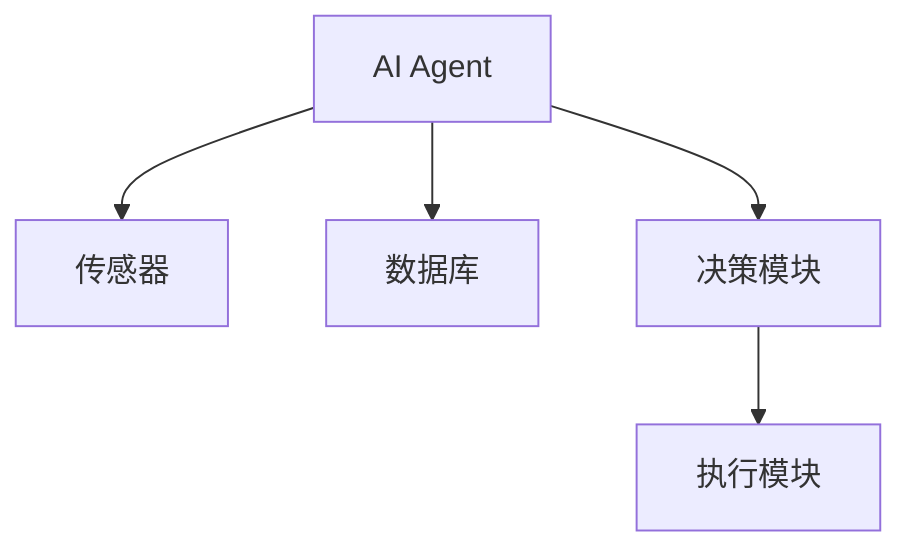

                 


# AI Agent在智能食品安全监控中的角色

> 关键词：AI Agent, 智能食品安全监控, 机器学习, 实时数据分析, 系统架构设计, 数学模型

> 摘要：本文探讨了AI Agent在智能食品安全监控中的角色，详细分析了其核心概念、算法原理、系统架构及实际应用。通过背景介绍、核心概念与联系、算法原理讲解、系统分析与架构设计、项目实战等部分，全面展示了AI Agent在食品安全监控中的重要性及其实际应用价值。

---

## 第一部分：背景介绍

### 第1章：AI Agent与食品安全监控的背景

#### 1.1 问题背景与重要性

食品是人类生存的基本需求，食品安全直接关系到人们的生活质量和健康。然而，随着工业化进程的加快，食品安全问题日益复杂，包括农药残留、重金属污染、添加剂滥用、食品欺诈等问题。传统的食品安全监控方法依赖于人工检查和实验室检测，存在效率低、覆盖面窄、响应慢等问题。在大数据和人工智能技术快速发展的背景下，如何利用AI技术提升食品安全监控的效率和准确性成为一个重要课题。

AI Agent（人工智能代理）作为一种能够感知环境、自主决策并执行任务的智能体，具备实时监控、数据处理和智能决策的能力，为食品安全监控提供了新的解决方案。

---

#### 1.2 AI Agent的基本概念

**AI Agent**是指能够感知环境、自主决策并执行任务的智能实体。AI Agent的核心特征包括：

1. **自主性**：能够在没有外部干预的情况下自主运行。
2. **反应性**：能够实时感知环境变化并做出反应。
3. **学习能力**：能够通过数据和经验不断优化自身的决策能力。
4. **协作性**：能够与其他系统或AI Agent协同工作，完成复杂的任务。

---

#### 1.3 AI Agent在食品安全监控中的角色

AI Agent在食品安全监控中扮演着多重角色，主要包括：

1. **实时监控与数据采集**：通过传感器、摄像头等设备实时采集食品生产和流通过程中的数据。
2. **智能分析与决策支持**：利用机器学习和数据分析技术，识别潜在的食品安全风险。
3. **自动化响应与反馈**：在发现异常情况时，AI Agent能够快速触发报警机制，并启动相应的应对措施。

---

## 第二部分：核心概念与联系

### 第2章：AI Agent的核心原理

#### 2.1 AI Agent的感知模块

感知模块是AI Agent获取环境信息的关键部分，主要包括数据采集和数据处理两个步骤。

1. **数据采集**：通过传感器、摄像头等设备实时采集食品生产和流通过程中的数据，例如温度、湿度、图像等。
2. **数据处理**：对采集到的数据进行清洗、归一化处理，并将其转化为可供分析的格式。

**示例：** 在食品加工车间，AI Agent可以通过传感器实时监测温度和湿度，并将数据传输到分析模块。

---

#### 2.2 AI Agent的决策模块

决策模块是AI Agent的核心部分，负责根据感知到的信息做出决策。常见的决策方法包括规则引擎和机器学习模型。

1. **规则引擎**：基于预定义的规则进行决策，适用于简单的场景。
2. **机器学习模型**：通过训练模型识别复杂模式，适用于复杂的场景。

---

#### 2.3 AI Agent的执行模块

执行模块负责将决策结果转化为实际操作，例如触发报警、调整设备参数等。

**示例：** 如果AI Agent检测到食品中的细菌超标，它会立即触发报警，并通知相关部门进行处理。

---

## 第三部分：算法原理讲解

### 第3章：AI Agent的核心算法

#### 3.1 强化学习算法

强化学习是一种通过试错方式优化决策策略的方法。AI Agent通过与环境的交互，不断优化自身的决策策略。

**数学模型：**

$$ Q(s, a) = r + \gamma \max_{a'} Q(s', a') $$

其中：
- \( Q(s, a) \) 表示在状态 \( s \) 下采取动作 \( a \) 的价值。
- \( r \) 表示奖励。
- \( \gamma \) 表示折扣因子。

---

#### 3.2 监督学习算法

监督学习是一种基于标注数据进行模型训练的方法。AI Agent通过监督学习算法识别食品中的异常情况。

**数学模型：**

$$ y = f(x) $$

其中：
- \( x \) 表示输入数据。
- \( y \) 表示输出标签。

---

## 第四部分：系统分析与架构设计

### 第4章：系统分析与架构设计

#### 4.1 问题场景介绍

在食品生产和流通过程中，存在多种潜在的安全隐患，例如温度异常、图像异常等。AI Agent需要实时监控这些数据，并在发现异常时及时采取措施。

---

#### 4.2 系统功能设计

系统功能设计包括以下模块：

1. **数据采集模块**：负责采集食品生产和流通过程中的数据。
2. **数据分析模块**：对采集到的数据进行分析，识别潜在的安全隐患。
3. **决策模块**：根据分析结果做出决策。
4. **执行模块**：将决策结果转化为实际操作。

---

#### 4.3 系统架构设计

系统架构设计如下：



---

## 第五部分：项目实战

### 第5章：项目实战

#### 5.1 环境安装与配置

需要安装以下工具和库：

- Python
- NumPy
- TensorFlow
- OpenCV

---

#### 5.2 核心代码实现

以下是AI Agent的核心代码示例：

```python
import numpy as np
import cv2

class AIAgent:
    def __init__(self):
        self.model = self.build_model()

    def build_model(self):
        # 构建机器学习模型
        pass

    def perceive(self, data):
        # 处理感知数据
        return processed_data

    def decide(self, state):
        # 基于状态做出决策
        return action

    def execute(self, action):
        # 执行决策
        pass
```

---

## 第六部分：总结与展望

### 第6章：总结与展望

#### 6.1 全文总结

AI Agent在智能食品安全监控中扮演着重要角色，能够显著提升食品安全监控的效率和准确性。

---

#### 6.2 未来展望

随着AI技术的不断发展，AI Agent在食品安全监控中的应用前景广阔，例如更智能的决策算法、更高效的系统架构等。

---

### 最佳实践 Tips

1. 在实际应用中，建议结合具体场景选择合适的AI算法。
2. 系统设计时，需注重模块的可扩展性和可维护性。
3. 数据安全是AI Agent应用中的重要考虑因素。

---

作者：AI天才研究院/AI Genius Institute & 禅与计算机程序设计艺术 /Zen And The Art of Computer Programming

