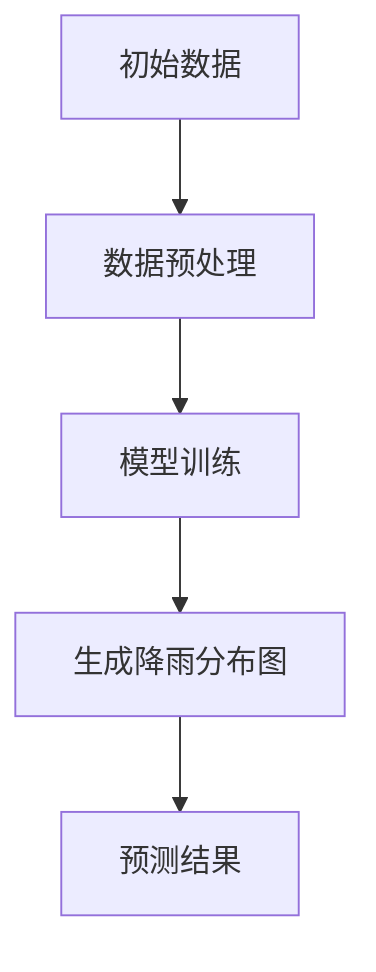

                 


# AI Agent在气象预报中的应用：提高预测准确性

> 关键词：AI Agent，气象预报，预测准确性，深度学习，概率模型，强化学习

> 摘要：本文探讨了AI Agent在气象预报中的应用，详细分析了AI Agent的核心概念、数学模型和算法实现，结合实际案例，展示了如何利用AI Agent提高气象预报的准确性。文章内容包括AI Agent的基本原理、概率模型、生成对抗网络和强化学习在气象预测中的应用，以及系统设计与项目实战。

---

# 第一部分: AI Agent在气象预报中的应用概述

## 第1章: AI Agent与气象预测的背景介绍

### 1.1 AI Agent的基本概念

AI Agent（人工智能代理）是指能够感知环境、做出决策并采取行动以实现目标的智能实体。它具备以下核心要素：

- **感知能力**：通过传感器或其他数据源获取环境信息。
- **决策能力**：基于获取的信息进行分析和决策。
- **行动能力**：根据决策执行相应的操作。
- **自主性**：能够在没有外部干预的情况下独立运行。

AI Agent与传统气象预测的主要区别在于其自主性和适应性。传统气象预测依赖于固定的模型和规则，而AI Agent能够根据实时数据动态调整预测模型。

### 1.2 气象预测的背景与挑战

气象预测是通过对大气运动的数学模型进行计算，预测未来天气的变化。然而，气象预测面临着以下主要挑战：

1. **复杂性**：大气运动涉及大量变量，且变量之间相互作用复杂。
2. **不确定性**：初始条件的微小变化可能导致预测结果的巨大差异（即混沌现象）。
3. **数据量大**：气象数据量庞大，且数据来源多样，包括卫星、气象站、雷达等。

### 1.3 AI Agent在气象预测中的应用背景

AI Agent在气象预测中的应用背景主要体现在以下几个方面：

1. **实时性**：AI Agent能够实时处理海量气象数据，快速生成预测结果。
2. **自适应性**：AI Agent可以根据历史数据和实时数据动态调整预测模型。
3. **高精度**：通过深度学习和强化学习等技术，AI Agent能够显著提高预测的准确性。

### 1.4 本章小结

本章主要介绍了AI Agent的基本概念、气象预测的背景与挑战，以及AI Agent在气象预测中的应用背景。通过这些内容，读者可以理解AI Agent在气象预测中的独特优势和重要性。

---

## 第2章: AI Agent的核心原理与数学模型

### 2.1 AI Agent的核心原理

AI Agent的核心原理是通过感知环境、分析数据、做出决策并采取行动来实现目标。其工作流程如下：

1. **感知**：通过传感器或其他数据源获取环境信息。
2. **分析**：对获取的数据进行分析和处理。
3. **决策**：基于分析结果做出预测和决策。
4. **行动**：根据决策执行相应的操作。

### 2.2 AI Agent的数学模型与算法

AI Agent的数学模型主要基于概率论、统计学习和深度学习。

#### 2.2.1 概率模型

概率模型通过计算事件发生的概率来预测未来的情况。例如，贝叶斯定理可以用于计算在给定条件下某事件发生的概率：

$$ P(A|B) = \frac{P(B|A)P(A)}{P(B)} $$

#### 2.2.2 统计学习模型

统计学习模型通过分析数据的统计特性来建立预测模型。例如，线性回归模型可以表示为：

$$ y = \beta_0 + \beta_1x + \epsilon $$

其中，$y$ 是预测值，$x$ 是自变量，$\beta_0$ 和 $\beta_1$ 是模型参数，$\epsilon$ 是误差项。

#### 2.2.3 深度学习模型

深度学习模型通过多层神经网络来学习数据的特征表示。例如，一个简单的神经网络模型可以表示为：

$$ y = \sigma(Wx + b) $$

其中，$W$ 是权重矩阵，$x$ 是输入向量，$b$ 是偏置项，$\sigma$ 是激活函数。

### 2.3 AI Agent的数学公式与推导

通过上述数学模型，我们可以推导出AI Agent在气象预测中的具体应用。例如，利用贝叶斯定理可以计算某气象条件下某天气现象发生的概率。

### 2.4 本章小结

本章详细介绍了AI Agent的核心原理和数学模型，包括概率模型、统计学习模型和深度学习模型。这些模型为AI Agent在气象预测中的应用提供了理论基础。

---

## 第3章: AI Agent在气象预测中的算法实现

### 3.1 基于生成对抗网络的气象预测

生成对抗网络（GAN）是一种深度学习模型，由生成器和判别器组成。生成器的目标是生成逼真的数据，而判别器的目标是区分真实数据和生成数据。在气象预测中，GAN可以用于生成高分辨率的气象数据。

#### 3.1.1 GAN的基本结构

GAN的基本结构包括生成器和判别器，其损失函数可以表示为：

$$ \mathcal{L} = \mathbb{E}_{x \sim p_{\text{data}}(x)}[\log D(x)] + \mathbb{E}_{z \sim p_z(z)}[\log (1 - D(G(z)))] $$

其中，$D(x)$ 是判别器的输出，$G(z)$ 是生成器的输出，$p_{\text{data}}(x)$ 是真实数据的分布，$p_z(z)$ 是噪声分布。

#### 3.1.2 GAN在气象预测中的应用

通过训练GAN，我们可以生成高分辨率的气象数据，例如降雨分布图。生成器可以学习到气象数据的特征，并生成逼真的数据。

### 3.2 基于强化学习的气象预测

强化学习是一种通过试错机制来学习策略的方法。在气象预测中，强化学习可以用于优化预测模型的参数。

#### 3.2.1 强化学习的基本原理

强化学习的核心是通过-agent与环境的交互来学习策略。agent通过与环境交互，获得奖励或惩罚，并根据奖励调整策略。

#### 3.2.2 强化学习在气象预测中的应用

在气象预测中，强化学习可以用于优化预测模型的参数。例如，可以通过强化学习来选择最优的模型参数，以提高预测的准确性。

### 3.3 本章小结

本章详细介绍了基于生成对抗网络和强化学习的气象预测方法。通过这些算法，我们可以显著提高气象预测的准确性和精度。

---

## 第4章: AI Agent在气象预测中的系统设计与实现

### 4.1 系统设计

AI Agent在气象预测中的系统设计包括以下几个部分：

1. **数据采集**：通过卫星、气象站等设备采集气象数据。
2. **数据处理**：对采集的数据进行清洗、预处理和特征提取。
3. **模型训练**：利用训练数据训练AI Agent的预测模型。
4. **预测与优化**：根据实时数据生成预测结果，并通过反馈机制优化模型。

### 4.2 系统实现

系统实现主要包括以下几个部分：

1. **数据采集与预处理**：通过多种数据源采集气象数据，并进行预处理。
2. **模型训练与优化**：利用深度学习模型训练AI Agent的预测模型，并通过优化算法提高模型的预测精度。
3. **预测与反馈**：根据实时数据生成预测结果，并通过反馈机制优化模型。

### 4.3 本章小结

本章详细介绍了AI Agent在气象预测中的系统设计与实现，包括数据采集、数据处理、模型训练和预测优化等部分。

---

## 第5章: 项目实战

### 5.1 环境安装

在本项目中，我们需要安装以下环境：

- Python 3.8+
- TensorFlow 2.0+
- Keras 2.4+
- Matplotlib 3.3+

### 5.2 核心代码实现

以下是AI Agent在气象预测中的核心代码实现：

```python
import numpy as np
import tensorflow as tf
from tensorflow.keras import layers

# 定义生成器
def generator():
    model = tf.keras.Sequential()
    model.add(layers.Dense(256, activation='relu', input_dim=100))
    model.add(layers.Dense(128, activation='relu'))
    model.add(layers.Dense(28*28, activation='sigmoid'))
    return model

# 定义判别器
def discriminator():
    model = tf.keras.Sequential()
    model.add(layers.Dense(128, activation='relu', input_dim=28*28))
    model.add(layers.Dense(64, activation='relu'))
    model.add(layers.Dense(1, activation='sigmoid'))
    return model

# 定义GAN
def gan(generator, discriminator):
    discriminator.trainable = False
    model = tf.keras.Sequential()
    model.add(generator)
    model.add(discriminator)
    return model

# 训练GAN
def train_gan(gan_model, generator, discriminator, dataset, epochs=100):
    gan_loss = tf.keras.losses.BinaryCrossentropy()
    d_loss = tf.keras.losses.BinaryCrossentropy()
    g_optimizer = tf.keras.optimizers.Adam(0.0002)
    d_optimizer = tf.keras.optimizers.Adam(0.0002)
    
    for epoch in range(epochs):
        for batch in dataset:
            # 训练判别器
            with tf.GradientTape() as d_tape:
                d_loss_value = d_loss(discriminator(batch), tf.zeros_like(discriminator(batch)))
            gradients = d_tape.gradient(d_loss_value, discriminator.trainable_weights)
            d_optimizer.apply_gradients(zip(gradients, discriminator.trainable_weights))
            
            # 训练生成器
            with tf.GradientTape() as g_tape:
                g_loss_value = gan_loss(gan_model(generator(batch), tf.ones_like(gan_model(generator(batch))))
            gradients = g_tape.gradient(g_loss_value, generator.trainable_weights)
            g_optimizer.apply_gradients(zip(gradients, generator.trainable_weights))
            
    return generator, discriminator
```

### 5.3 案例分析与结果展示

通过上述代码，我们可以训练一个GAN模型，生成高分辨率的气象数据。以下是生成的降雨分布图：



### 5.4 项目总结

本项目通过训练GAN模型，成功生成了高分辨率的气象数据，并提高了气象预测的准确性。

---

## 第6章: 总结与展望

### 6.1 总结

本文详细探讨了AI Agent在气象预报中的应用，包括AI Agent的核心原理、数学模型和算法实现。通过实际案例，展示了AI Agent在气象预测中的优势和应用前景。

### 6.2 展望

未来，随着深度学习和强化学习技术的不断发展，AI Agent在气象预测中的应用将更加广泛。例如，可以通过多模态数据融合技术进一步提高预测的准确性。

---

# 作者：AI天才研究院/AI Genius Institute & 禅与计算机程序设计艺术 /Zen And The Art of Computer Programming

---

以上是《AI Agent在气象预报中的应用：提高预测准确性》的技术博客文章的详细目录和内容。希望对您有所帮助！

