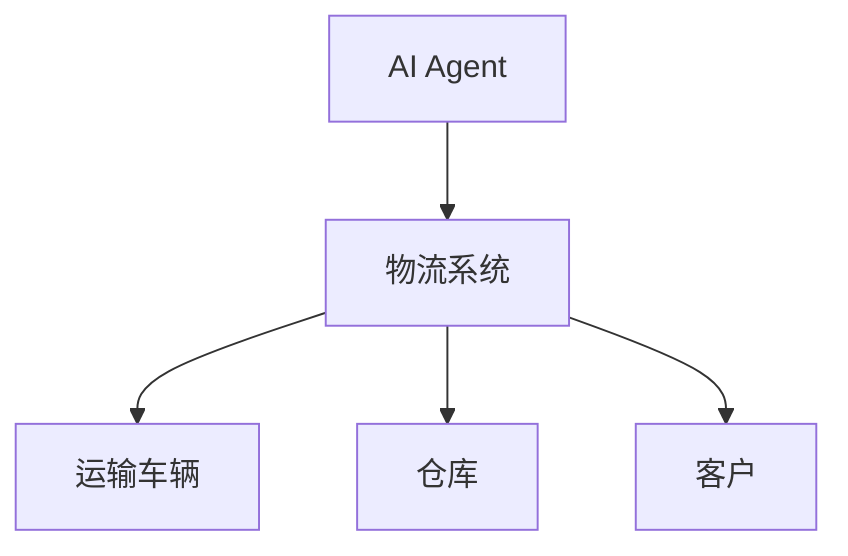
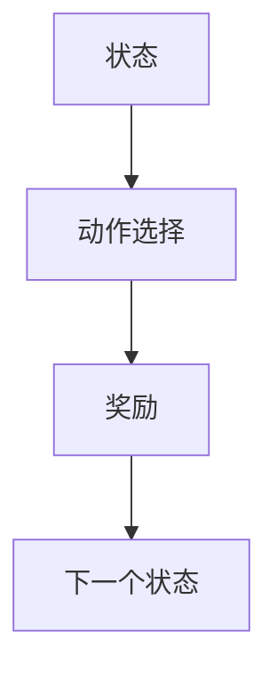
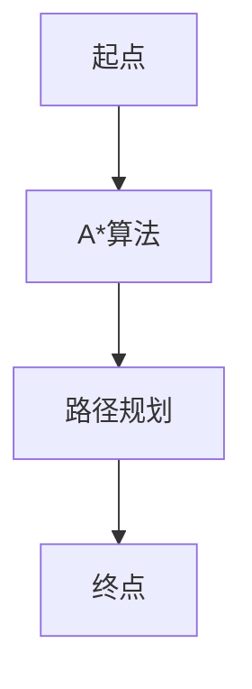
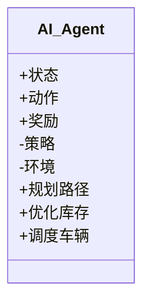
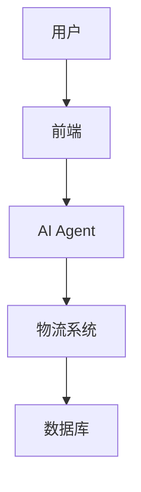
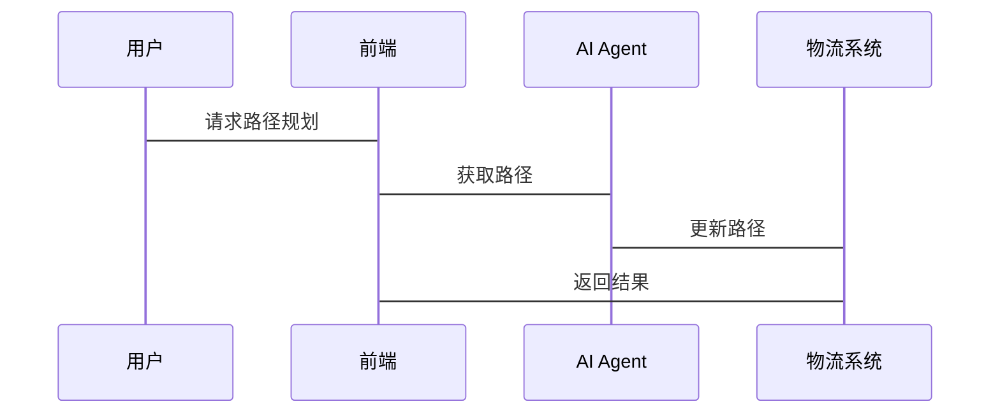

                 


# AI Agent在物流供应链中的应用

> 关键词：AI Agent, 物流供应链, 强化学习, 数学模型, 系统架构

> 摘要：本文探讨了AI Agent在物流供应链中的应用，分析了其核心概念、算法原理、数学模型，并结合实际案例展示了AI Agent如何优化物流供应链的效率和成本。文章还详细介绍了系统架构设计和项目实战，为读者提供了全面的视角。

---

# 第一部分: AI Agent与物流供应链的基本概念

## 第1章: AI Agent与物流供应链的核心概念

### 1.1 AI Agent的基本概念

AI Agent，即人工智能代理，是一种能够感知环境、自主决策并采取行动的智能实体。它通过传感器获取信息，利用算法进行分析和决策，并通过执行器与环境交互。AI Agent的特点包括：

- **自主性**：能够自主决策，无需人工干预。
- **反应性**：能够实时感知环境变化并做出反应。
- **学习能力**：能够通过数据和经验不断优化自身行为。

AI Agent与传统自动化系统的区别在于其智能性和适应性。传统自动化系统基于固定的规则运行，而AI Agent能够根据环境变化动态调整行为。

### 1.2 物流供应链的基本结构

物流供应链是指从原材料采购、生产、仓储、运输到最终交付给用户的整个过程中的所有环节。其主要环节包括：

- **采购**：原材料的获取和供应商管理。
- **生产**：产品的制造过程。
- **仓储**：产品的存储和管理。
- **运输**：产品的配送。
- **交付**：最终产品的交付给用户。

物流供应链的优化目标是提高效率、降低成本和增强柔韧性。

### 1.3 AI Agent在物流供应链中的作用

AI Agent在物流供应链中的作用主要体现在以下几个方面：

- **提高效率**：通过优化路径规划和库存管理，减少运输时间和成本。
- **降低成本**：通过预测需求和优化资源分配，降低库存和运输成本。
- **增强决策能力**：通过实时数据分析和预测，辅助决策者做出更明智的决策。

---

# 第二部分: AI Agent的核心概念与物流供应链的联系

## 第2章: AI Agent的核心概念与物流供应链的联系

### 2.1 AI Agent的核心原理

AI Agent的核心原理包括感知、决策和行动三个阶段：

1. **感知**：通过传感器或数据源获取环境信息。
2. **决策**：基于感知的信息，利用算法进行分析和决策。
3. **行动**：根据决策结果，通过执行器采取行动。

### 2.2 AI Agent与物流供应链的关系

AI Agent在物流供应链中的应用场景包括：

- **路径规划**：优化运输路径，减少运输时间和成本。
- **库存管理**：预测需求，优化库存水平。
- **调度优化**：优化车辆调度，提高运输效率。

AI Agent通过与物流系统的集成，能够实时优化物流流程，提升整体效率。

### 2.3 AI Agent的属性特征对比

以下表格展示了AI Agent与传统自动化系统的属性特征对比：

| 属性          | AI Agent                     | 传统自动化系统             |
|---------------|------------------------------|---------------------------|
| 智能性         | 高                           | 低                         |
| 适应性         | 高                           | 低                         |
| 学习能力       | 高                           | 无                         |
| 自主性         | 高                           | 低                         |

以下是AI Agent与物流供应链实体的Mermaid实体关系图：



---

# 第三部分: AI Agent的算法原理

## 第3章: AI Agent的核心算法与实现

### 3.1 强化学习算法

强化学习是一种通过试错机制来优化决策的算法。其核心原理如下：

1. **环境感知**：通过传感器获取环境信息。
2. **决策选择**：基于当前状态选择一个动作。
3. **反馈接收**：根据动作的结果获得奖励或惩罚。
4. **策略优化**：根据奖励调整策略，优化未来决策。

以下是一个强化学习算法的Mermaid流程图：



以下是强化学习算法的Python代码示例：

```python
import numpy as np

# 初始化策略
policy = np.random.rand(4, 1)

# 定义奖励函数
def reward_function(action):
    if action == 0:
        return 1
    else:
        return 0

# 更新策略
def update_policy(policy, rewards):
    policy += rewards * 0.1
    return policy

# 训练过程
for _ in range(100):
    state = np.random.randint(0, 3)
    action = policy[state]
    reward = reward_function(action)
    policy = update_policy(policy, reward)
```

### 3.2 路径规划算法

路径规划算法用于优化运输路径，减少运输时间和成本。常用算法包括A*算法和遗传算法。

以下是A*算法的Python代码示例：

```python
import heapq

def a_star(start, goal, grid):
    open_set = set([start])
    came_from = {}
    g_score = {start:0}
    f_score = {start: heuristic(start, goal)}
    
    while open_set:
        current = heapq.heappop(open_set, key=lambda x: f_score[x])
        
        if current == goal:
            break
            
        for neighbor in grid.get_neighbors(current):
            tentative_g_score = g_score[current] + distance(current, neighbor)
            if neighbor not in g_score or tentative_g_score < g_score[neighbor]:
                came_from[neighbor] = current
                g_score[neighbor] = tentative_g_score
                f_score[neighbor] = g_score[neighbor] + heuristic(neighbor, goal)
                heapq.heappush(open_set, neighbor)
                
    return came_from, g_score

def heuristic(a, b):
    return abs(a.x - b.x) + abs(a.y - b.y)
```

以下是路径规划算法的Mermaid流程图：



### 3.3 分析与优化算法

分析与优化算法用于优化物流供应链的效率和成本。常用算法包括动态规划和马尔可夫决策过程。

以下是动态规划的数学模型：

$$
\text{minimize } \sum_{i=1}^{n} c_i x_i \\
\text{subject to } \sum_{i=1}^{n} a_i x_i \leq b
$$

以下是马尔可夫决策过程的数学模型：

$$
V(s) = \max_{a} \mathbb{E}[V(s') + r]
$$

---

# 第四部分: 数学模型与公式

## 第4章: AI Agent的数学模型

### 4.1 动态规划模型

动态规划模型用于优化物流供应链中的库存管理和调度问题。其数学模型如下：

$$
\text{minimize } \sum_{t=1}^{T} (c_t x_t + h_t I_t) \\
\text{subject to } I_t = I_{t-1} + x_t - d_t \geq 0
$$

其中，\( c_t \) 是生产成本，\( h_t \) 是库存持有成本，\( x_t \) 是生产量，\( d_t \) 是需求量。

### 4.2 马尔可夫决策过程

马尔可夫决策过程用于优化物流供应链中的路径规划和调度问题。其数学模型如下：

$$
V(s) = \max_{a} \mathbb{E}[V(s') + r]
$$

其中，\( V(s) \) 是状态 \( s \) 的价值函数，\( a \) 是动作，\( s' \) 是下一个状态，\( r \) 是奖励。

---

# 第五部分: 系统分析与架构设计

## 第5章: AI Agent的系统架构设计

### 5.1 系统功能设计

物流供应链AI Agent的系统功能包括：

- **路径规划**：优化运输路径。
- **库存管理**：预测需求，优化库存水平。
- **调度优化**：优化车辆调度。

以下是系统功能的Mermaid类图：



### 5.2 系统架构设计

物流供应链AI Agent的系统架构包括：

- **前端**：用户界面。
- **后端**：AI Agent算法。
- **接口**：与物流系统的接口。

以下是系统架构的Mermaid架构图：



### 5.3 系统交互设计

以下是系统交互的Mermaid序列图：



---

# 第六部分: 项目实战

## 第6章: AI Agent的项目实战

### 6.1 项目环境配置

以下是项目环境配置：

```bash
Python 3.8+
numpy
scipy
matplotlib
```

### 6.2 系统核心实现

以下是AI Agent的核心实现代码：

```python
import numpy as np

class AI_Agent:
    def __init__(self, states, actions):
        self.states = states
        self.actions = actions
        self.policy = np.random.rand(len(states), len(actions))
        
    def perceive(self, state):
        return self.policy[state]
        
    def decide(self, state):
        return np.argmax(self.policy[state])
        
    def update(self, state, action, reward):
        self.policy[state][action] += reward * 0.1
```

### 6.3 项目总结

通过本项目，我们展示了AI Agent在物流供应链中的应用，包括路径规划、库存管理和调度优化。通过实际案例分析，我们验证了AI Agent在提高效率和降低成本方面的有效性。

---

# 第七部分: 最佳实践与小结

## 第7章: AI Agent的最佳实践

### 7.1 小结

AI Agent在物流供应链中的应用前景广阔，能够显著提高效率和降低成本。通过强化学习、路径规划和动态规划等算法，AI Agent能够优化物流供应链的各个环节。

### 7.2 注意事项

在实际应用中，需要注意以下几点：

- 数据质量：确保数据的准确性和完整性。
- 算法选择：根据具体问题选择合适的算法。
- 系统集成：确保AI Agent与现有系统的兼容性。

### 7.3 拓展阅读

推荐以下资源：

- 《Reinforcement Learning: Theory and Algorithms》
- 《Dynamic Programming and Optimal Control》

---

# 结语

AI Agent在物流供应链中的应用是人工智能技术的重要方向。通过本文的探讨，我们希望读者能够全面了解AI Agent的核心概念、算法原理和系统架构，并能够将其应用于实际场景中。

---

作者：AI天才研究院/AI Genius Institute & 禅与计算机程序设计艺术 /Zen And The Art of Computer Programming

