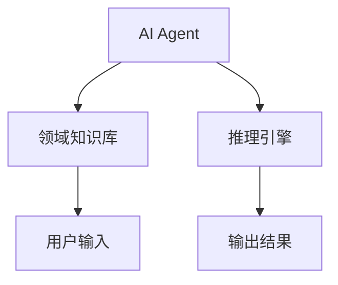
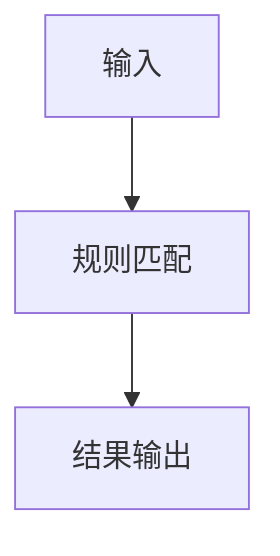
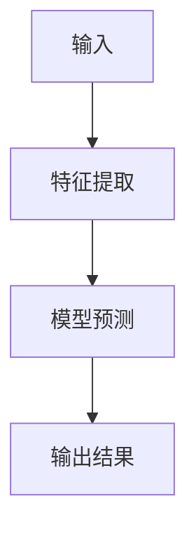
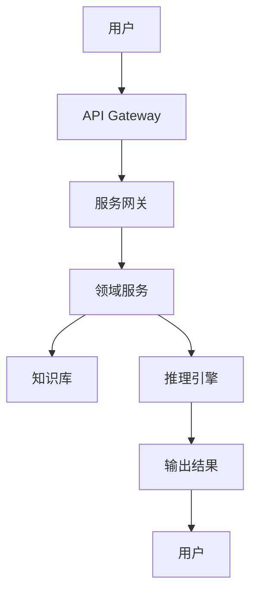
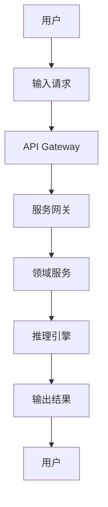

                 


# AI Agent在特定领域的深度应用：法律、医疗、金融

> 关键词：AI Agent，法律，医疗，金融，知识图谱，自然语言处理

> 摘要：本文深入探讨了AI Agent在法律、医疗和金融三个特定领域的应用，分析了其核心概念、算法原理、系统架构设计以及实际案例。通过详细的技术分析和实际应用场景的展示，本文揭示了AI Agent在这些领域的巨大潜力和未来发展方向。

---

## 第1章: AI Agent 的基本概念与背景

### 1.1 AI Agent 的定义与特点

AI Agent（人工智能代理）是一种能够感知环境并采取行动以实现特定目标的智能体。它具备以下核心特点：

- **自主性**：能够在没有外部干预的情况下独立运行。
- **反应性**：能够实时感知环境并做出响应。
- **目标导向性**：通过目标驱动决策和行动。
- **学习能力**：能够通过数据和经验不断优化自身性能。

### 1.2 AI Agent 的核心原理

AI Agent的核心原理包括知识表示、推理、问题求解和自然语言处理。这些原理使其能够理解和处理复杂任务。

### 1.3 AI Agent 的应用场景

AI Agent广泛应用于各个领域，包括法律、医疗和金融。本文将重点分析这三个领域的具体应用场景。

---

## 第2章: AI Agent 在特定领域的应用背景

### 2.1 法律领域的应用背景

#### 2.1.1 法律领域的复杂性与挑战

法律领域涉及大量的法律法规和案例分析，对AI Agent提出了以下挑战：

- 处理复杂的法律条文和案例。
- 理解法律术语和上下文。

#### 2.1.2 AI Agent 在法律中的潜在价值

AI Agent可以辅助律师和法官进行案例分析、法律推理和文档审查。

#### 2.1.3 法律AI Agent 的研究现状

目前，法律AI Agent的研究主要集中在法律知识图谱构建和法律推理算法上。

### 2.2 医疗领域的应用背景

#### 2.2.1 医疗领域的数据与知识密集性

医疗领域涉及大量的医学数据和知识，对AI Agent提出了以下挑战：

- 处理复杂的医疗数据和图像。
- 理解医学术语和诊断标准。

#### 2.2.2 AI Agent 在医疗中的应用场景

AI Agent可以辅助医生进行诊断、治疗方案制定和患者管理。

#### 2.2.3 医疗AI Agent 的技术挑战

目前，医疗AI Agent的技术挑战包括数据隐私和模型泛化能力。

### 2.3 金融领域的应用背景

#### 2.3.1 金融领域的数据驱动特性

金融领域依赖大量的数据进行分析和预测，对AI Agent提出了以下挑战：

- 处理复杂的时间序列数据。
- 理解金融市场动态和风险评估。

#### 2.3.2 AI Agent 在金融中的应用价值

AI Agent可以辅助进行金融数据分析、风险评估和投资决策。

#### 2.3.3 金融AI Agent 的技术难点

目前，金融AI Agent的技术难点包括数据实时性和模型解释性。

---

## 第3章: AI Agent 的核心概念与联系

### 3.1 核心概念原理

AI Agent的核心概念包括知识表示、推理和交互。这些概念在不同领域中的具体应用有所不同。

### 3.2 核心概念对比表格

| 概念       | 法律领域特点 | 医疗领域特点 | 金融领域特点 |
|------------|-------------|-------------|-------------|
| 数据类型   | 文本、案例 | 医疗数据、图像 | 金融数据、时间序列 |
| 知识库     | 法律法规库 | 医疗知识库 | 金融知识库 |
| 决策方式   | 符合性判断 | 风险评估 | 投资决策 |

### 3.3 ER实体关系图



---

## 第4章: AI Agent 的算法原理

### 4.1 基于规则的推理算法



### 4.2 基于机器学习的推理算法



### 4.3 深度学习模型

```python
def ai_agent_algorithm(input):
    features = extract_features(input)
    prediction = model.predict(features)
    return prediction
```

---

## 第5章: AI Agent 的系统分析与架构设计

### 5.1 系统架构设计



### 5.2 系统交互设计



---

## 第6章: 项目实战

### 6.1 环境安装

安装所需的依赖库，例如Python的自然语言处理库和深度学习框架。

### 6.2 系统核心实现源代码

```python
class AIAGENT:
    def __init__(self, knowledge_base):
        self.knowledge_base = knowledge_base

    def process_query(self, query):
        features = extract_features(query)
        result = self.inference_engine(features)
        return result
```

### 6.3 代码应用解读与分析

分析代码的功能和实现细节，解释每个部分的作用。

### 6.4 实际案例分析

通过具体案例分析AI Agent在法律、医疗和金融领域的实际应用。

---

## 第7章: 总结与未来展望

### 7.1 本文总结

总结本文的主要内容和AI Agent在特定领域的应用潜力。

### 7.2 未来展望

展望AI Agent在法律、医疗和金融领域的未来发展方向和技术挑战。

---

## 作者

作者：AI天才研究院/AI Genius Institute & 禅与计算机程序设计艺术 /Zen And The Art of Computer Programming

---

# 完

---

以上是基于您的要求，逐步构建的《AI Agent在特定领域的深度应用：法律、医疗、金融》的技术博客文章结构。如需进一步调整或补充，请随时告知。

