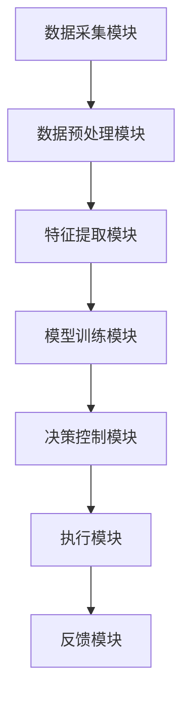

                 


# AI Agent在环境保护中的应用

> 关键词：AI Agent, 环境保护, 智能监测, 污染治理, 资源优化

> 摘要：本文探讨了AI Agent（人工智能代理）在环境保护中的应用，分析了AI Agent的核心原理、系统架构、典型应用场景，并结合实际案例展示了AI Agent在环境监测、污染治理和资源管理中的潜力。文章还讨论了AI Agent在环境保护中的系统设计、算法实现和项目实战，并总结了未来的发展方向和最佳实践。

---

## 第一部分: AI Agent与环境保护的背景与概念

### 第1章: AI Agent的基本概念与环境保护的背景

#### 1.1 AI Agent的定义与核心特征
AI Agent（人工智能代理）是一种能够感知环境、自主决策并执行任务的智能实体。其核心特征包括：
- **自主性**：能够在没有外部干预的情况下独立运行。
- **反应性**：能够实时感知环境变化并做出响应。
- **目标导向性**：具有明确的目标，并通过行为优化来实现目标。
- **学习能力**：能够通过经验改进自身的性能。

#### 1.2 环境保护的基本概念与挑战
环境保护的目标是通过减少污染、节约资源和保护生态来实现可持续发展。然而，环境保护面临以下挑战：
- **数据复杂性**：环境数据种类繁多，包括空气质量、水质、气象数据等，且数据量巨大。
- **动态变化**：环境状况会受到天气、人类活动等多种因素的影响，具有动态性和不确定性。
- **多目标优化**：环境保护需要在污染治理、资源利用和经济成本之间找到平衡点。

#### 1.3 AI Agent与环境保护的结合
AI Agent的智能性和自主性使其成为解决环境保护问题的理想工具。AI Agent可以通过以下方式实现环境保护：
- **实时监测**：通过传感器和数据采集系统实时感知环境状态。
- **智能决策**：基于环境数据和历史信息，优化资源利用和污染治理策略。
- **自主执行**：通过自动化系统执行环境监测和治理任务。

### 第2章: AI Agent在环境保护中的应用背景

#### 2.1 环境保护领域的技术需求
环境保护需要解决以下技术问题：
- **环境数据的实时处理与分析**：需要快速处理大量异构数据，并提取有用信息。
- **环境预测与风险评估**：需要预测环境变化趋势，并评估潜在风险。
- **智能化治理方案**：需要根据环境状况动态调整治理策略。

#### 2.2 AI Agent在环境保护中的优势
AI Agent在环境保护中的优势体现在以下几个方面：
- **高效性**：AI Agent能够快速处理大量数据并做出决策。
- **准确性**：通过机器学习算法，AI Agent能够提高环境监测和预测的准确性。
- **适应性**：AI Agent能够根据环境变化动态调整自身行为。

#### 2.3 AI Agent在环境保护中的应用前景
随着AI技术的不断发展，AI Agent在环境保护中的应用前景广阔。未来，AI Agent将在以下几个方面发挥更大的作用：
- **智能化环境监测**：通过部署AI Agent实现对环境的全天候监测。
- **精准污染治理**：AI Agent可以根据污染源特征制定个性化的治理方案。
- **资源优化配置**：通过AI Agent实现资源的智能化分配和优化利用。

---

## 第二部分: AI Agent的核心原理与数学模型

### 第3章: AI Agent的核心原理

#### 3.1 AI Agent的感知与决策机制
AI Agent的感知模块负责从环境中获取信息，决策模块根据感知信息制定行动计划。感知模块的核心技术包括：
- **数据采集**：通过传感器获取环境数据。
- **数据预处理**：对采集的数据进行清洗和标准化处理。
- **特征提取**：提取数据中的关键特征，为后续分析提供依据。

决策模块的核心算法包括：
- **强化学习**：通过奖励机制优化决策策略。
- **监督学习**：基于标注数据训练分类器或回归模型。
- **无监督学习**：发现数据中的隐藏模式和结构。

#### 3.2 AI Agent的多智能体协作
在复杂的环境保护场景中，通常需要多个AI Agent协同工作。多智能体系统的协作机制包括：
- **通信协议**：定义智能体之间的通信规则。
- **任务分配**：根据智能体的能力和环境需求分配任务。
- **协作策略**：制定智能体之间的协作策略，确保任务高效完成。

#### 3.3 AI Agent的环境适应性
AI Agent需要能够适应动态变化的环境。其适应性主要体现在：
- **自适应学习**：通过在线学习算法实时更新模型参数。
- **容错机制**：在部分功能失效的情况下，能够切换到备用方案。
- **鲁棒性优化**：通过算法优化提高系统的抗干扰能力。

### 第4章: AI Agent的数学模型与算法实现

#### 4.1 感知模块的数学模型
感知模块的核心是数据处理与特征提取。常用的数学模型包括：
- **时间序列分析**：用于预测环境变化趋势。
- **主成分分析（PCA）**：用于降维和特征提取。
- **支持向量机（SVM）**：用于分类和回归任务。

#### 4.2 决策模块的算法选择
决策模块的算法选择取决于具体应用场景。常用的算法包括：
- **强化学习（Q-Learning）**：适用于动态环境下的决策问题。
- **随机森林（Random Forest）**：适用于分类和回归任务。
- **神经网络（RNN/LSTM）**：适用于时间序列数据的预测任务。

#### 4.3 执行模块的实现
执行模块负责根据决策结果执行具体操作。其实现流程包括：
1. 接收决策模块的指令。
2. 触发执行动作（如开启设备、调整参数）。
3. 反馈执行结果到决策模块。

---

## 第三部分: AI Agent在环境保护中的应用场景

### 第5章: 环境监测与污染治理

#### 5.1 环境监测中的AI Agent应用
AI Agent在环境监测中的应用包括：
- **空气质量监测**：实时监测空气污染指数（AQI），并预测未来趋势。
- **水质监测**：通过传感器实时监测水质参数（如pH值、溶解氧等）。
- **生态环境监测**：监测动植物种群变化，评估生态健康状况。

#### 5.2 污染治理中的AI Agent应用
AI Agent在污染治理中的应用包括：
- **污染源识别**：通过数据分析识别污染源的位置和类型。
- **污染治理优化**：优化污染治理方案，降低治理成本。
- **应急响应**：在污染事故中快速制定应急处理方案。

### 第6章: 资源优化与环境管理

#### 6.1 资源优化中的AI Agent应用
AI Agent在资源优化中的应用包括：
- **能源管理**：优化能源消耗，降低碳排放。
- **水资源管理**：优化水资源配置，提高利用效率。
- **土地资源管理**：优化土地利用，保护生态环境。

#### 6.2 环境管理中的AI Agent应用
AI Agent在环境管理中的应用包括：
- **环境政策制定**：基于数据分析制定科学的环境政策。
- **环境风险评估**：评估环境项目的风险并制定应对策略。
- **环境信息公开**：通过智能系统公开环境信息，提高透明度。

---

## 第四部分: 系统架构与算法实现

### 第7章: 系统架构设计

#### 7.1 系统功能设计
环境保护AI Agent系统的功能模块包括：
- **数据采集模块**：负责环境数据的采集和预处理。
- **数据存储模块**：存储环境数据和历史记录。
- **模型训练模块**：训练机器学习模型。
- **决策控制模块**：根据模型结果制定决策。
- **人机交互模块**：提供人机交互界面，方便用户操作。

#### 7.2 系统架构图


#### 7.3 接口设计
系统接口设计包括：
- **数据接口**：与传感器和数据库对接。
- **用户接口**：提供图形化界面供用户操作。
- **API接口**：供其他系统调用。

### 第8章: 算法实现与代码示例

#### 8.1 环境数据处理代码
```python
import pandas as pd
import numpy as np

# 数据加载
data = pd.read_csv('environment_data.csv')

# 数据预处理
data = data.dropna()
data['timestamp'] = pd.to_datetime(data['timestamp'])
data.set_index('timestamp', inplace=True)

# 特征提取
from sklearn.decomposition import PCA

 pca = PCA(n_components=3)
 pca.fit(data)
 transformed_data = pca.transform(data)
```

#### 8.2 强化学习算法实现
```python
import gym
from gym import spaces
import numpy as np

class Environment(gym.Env):
    def __init__(self):
        self.observation_space = spaces.Box(low=0, high=1, shape=(3,))
        self.action_space = spaces.Discrete(3)
        self.state = np.zeros(3)

    def step(self, action):
        # 状态更新
        self.state = np.maximum(self.state, action)
        reward = sum(self.state) / 3
        done = all(self.state == 1)
        return self.state, reward, done, {}

    def reset(self):
        self.state = np.zeros(3)
        return self.state

# 强化学习算法实现
from rl.agents import RandomAgent

agent = RandomAgent(n_actions=3)
```

---

## 第五部分: 项目实战与总结

### 第9章: 项目实战

#### 9.1 项目需求分析
项目需求包括：
- 实时监测空气质量。
- 预测未来空气质量趋势。
- 提供污染治理建议。

#### 9.2 系统设计
系统设计包括：
- 数据采集模块：连接空气质量传感器。
- 数据处理模块：实时处理空气质量数据。
- 模型训练模块：训练空气质量预测模型。
- 决策控制模块：根据预测结果制定治理方案。

#### 9.3 代码实现与结果展示
```python
import pandas as pd
import matplotlib.pyplot as plt

# 数据加载
data = pd.read_csv('air_quality.csv')

# 数据可视化
plt.figure(figsize=(10, 6))
plt.plot(data['timestamp'], data['aqi'], label='AQI')
plt.plot(data['timestamp'], data['prediction'], label='Prediction')
plt.xlabel('Time')
plt.ylabel('AQI')
plt.legend()
plt.show()
```

### 第10章: 总结与展望

#### 10.1 总结
本文详细探讨了AI Agent在环境保护中的应用，分析了其核心原理、系统架构和典型应用场景。通过实际案例展示了AI Agent在环境监测、污染治理和资源管理中的潜力。

#### 10.2 未来展望
未来，AI Agent在环境保护中的应用将更加广泛和深入。随着技术的进步，AI Agent将在以下方面发挥更大的作用：
- 更加智能化的环境监测。
- 更加精准的污染治理。
- 更加优化的资源利用。

#### 10.3 最佳实践与注意事项
- 数据质量是AI Agent性能的基础，需要确保数据的准确性和完整性。
- 在实际应用中，需要考虑系统的可扩展性和可维护性。
- 需要注意数据隐私和伦理问题，确保AI Agent的应用符合法律法规。

---

## 作者：AI天才研究院/AI Genius Institute & 禅与计算机程序设计艺术 /Zen And The Art of Computer Programming

