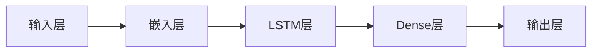
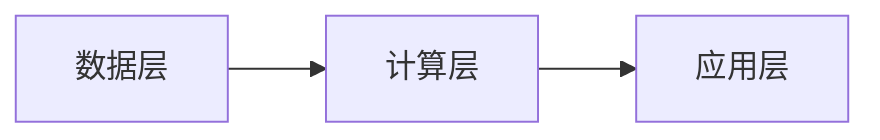
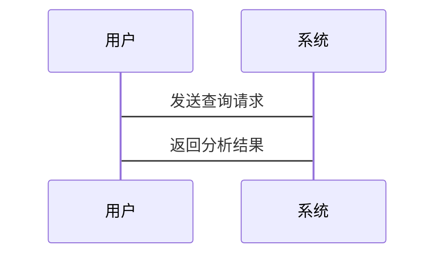

                 


# AI Agent在社交媒体分析中的应用

## 关键词：AI Agent, 社交媒体分析, 自然语言处理, 情感分析, 主题建模, 系统架构

## 摘要

本文系统地探讨了AI Agent在社交媒体分析中的应用，从基本概念到实际案例，详细阐述了如何利用AI Agent提升社交媒体分析的效率与准确性。文章涵盖情感分析、主题建模等关键技术，并通过具体案例展示AI Agent的实际应用效果。

---

## 第1章：社交媒体分析的背景与挑战

### 1.1 社交媒体分析的重要性

社交媒体作为信息传播的主要平台，每天产生海量数据。分析这些数据有助于企业洞察市场趋势、了解用户需求，甚至预测社会情绪。AI Agent的引入显著提升了分析效率和准确性，帮助用户快速获取有价值的信息。

### 1.2 AI Agent的基本概念

AI Agent是一种智能代理，能够自主执行任务，通常由感知、决策和执行模块组成。与传统自动化工具相比，AI Agent具备更强的适应性和学习能力，能够处理复杂任务。

### 1.3 社交媒体分析中的挑战

社交媒体分析面临数据量大、隐私保护、算法解释性等挑战。AI Agent通过智能化处理，有效应对这些挑战，提升分析质量。

---

## 第2章：AI Agent在社交媒体分析中的核心概念

### 2.1 AI Agent的结构与功能

AI Agent由感知模块、推理模块和执行模块组成。感知模块负责数据采集，推理模块进行分析，执行模块输出结果。各模块协同工作，确保高效分析。

### 2.2 社交媒体分析的关键技术

#### 2.2.1 自然语言处理（NLP）

NLP技术用于文本理解，包括分词、句法分析和语义理解。例如，情感分析通过识别文本中的情感倾向，帮助企业了解用户满意度。

#### 2.2.2 情感分析

情感分析是判断文本的情感倾向，常用方法包括基于规则的分类和深度学习模型如LSTM。

#### 2.2.3 主题建模

主题建模（如LDA）用于识别文本主题，帮助发现隐藏的主题结构，便于数据分类和管理。

### 2.3 AI Agent与社交媒体分析的结合

AI Agent通过自动化处理和智能分析，显著提升社交媒体监控和实时响应能力。例如，在危机公关中，AI Agent能快速识别负面评论，及时采取措施。

---

## 第3章：社交媒体分析中的算法原理

### 3.1 情感分析算法

#### 3.1.1 基于机器学习的情感分类

使用逻辑回归模型进行情感分类，公式如下：

$$ P(y=1|x) = \frac{1}{1 + e^{-\beta x}} $$

#### 3.1.2 基于深度学习的模型

LSTM模型结构如图所示：



### 3.2 主题建模算法

#### 3.2.1 LDA主题模型

LDA模型的公式为：

$$ P(\theta|\alpha) = \text{Dirichlet}(\alpha) $$

#### 3.2.2 NMF主题建模

NMF的优化目标是：

$$ \arg \min_{W,H} ||X - WH||_F^2 $$

### 3.3 实体识别与链接算法

#### 3.3.1 基于规则的实体识别

通过预设规则识别特定实体，例如使用正则表达式检测日期。

#### 3.3.2 基于深度学习的实体识别

使用预训练模型（如BERT）进行实体识别，准确率高，适应性强。

---

## 第4章：数学模型与公式

### 4.1 情感分析的分类模型

情感分析中常用的逻辑回归模型：

$$ P(y=1|x) = \frac{1}{1 + e^{-\beta x}} $$

### 4.2 主题建模的数学公式

LDA模型的公式为：

$$ P(\theta|\alpha) = \text{Dirichlet}(\alpha) $$

NMF的优化目标为：

$$ \arg \min_{W,H} ||X - WH||_F^2 $$

---

## 第5章：系统分析与架构设计

### 5.1 系统功能设计

#### 5.1.1 数据采集模块

负责从社交媒体平台获取数据，支持多种API接口。

#### 5.1.2 数据预处理模块

清洗数据，去除噪声，提升分析准确性。

#### 5.1.3 分析模块

包括情感分析和主题建模，输出分析结果。

#### 5.1.4 可视化模块

将分析结果以图表形式展示，便于用户理解。

### 5.2 系统架构设计

采用分层架构：



### 5.3 接口设计与交互

#### 5.3.1 API接口设计

提供RESTful API，方便其他系统调用。

#### 5.3.2 系统交互序列图



---

## 第6章：项目实战

### 6.1 环境安装与配置

安装Python和相关库：

```bash
pip install numpy pandas nltk tensorflow
```

获取社交媒体API密钥，配置环境变量。

### 6.2 核心代码实现

#### 6.2.1 情感分析代码

```python
from tensorflow.keras.models import Sequential
from tensorflow.keras.layers import LSTM, Dense

model = Sequential()
model.add(LSTM(64, input_shape=(max_len, embedding_dim)))
model.add(Dense(1, activation='sigmoid'))
model.compile(loss='binary_crossentropy', optimizer='adam')
model.fit(X_train, y_train, epochs=10)
```

#### 6.2.2 主题建模代码

```python
from sklearn.decomposition import NMF

nmf = NMF(n_components=5, random_state=42)
nmf.fit(X)
```

### 6.3 案例分析与解读

以Twitter数据为例，分析用户情感倾向和主要话题，帮助企业在营销策略中做出数据驱动的决策。

---

## 作者：AI天才研究院 & 禅与计算机程序设计艺术

---

通过以上内容，本文全面介绍了AI Agent在社交媒体分析中的应用，从理论到实践，为读者提供了深入的指导和实用的代码示例。

