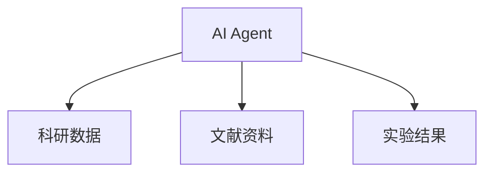
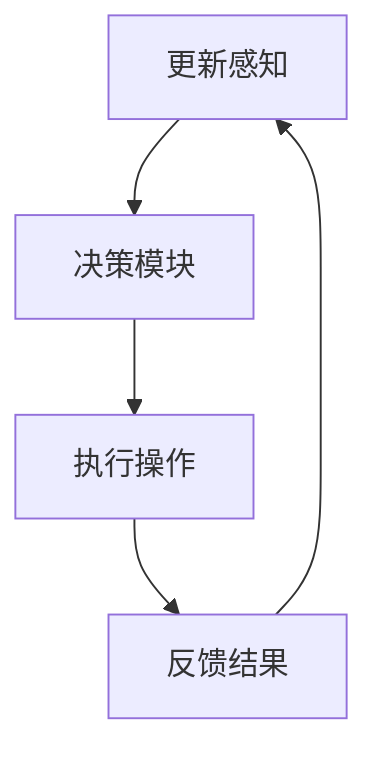
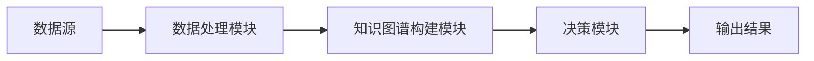

                 


# AI Agent在科研领域的应用：加速科学发现

> 关键词：AI Agent，科研应用，科学发现，人工智能，机器学习，数据处理

> 摘要：本文探讨了AI Agent在科研领域的应用，分析其如何通过自动化和智能化手段加速科学发现。从核心概念、算法原理到系统架构，再到项目实战，全面解析AI Agent在科研中的潜力和实际应用。

---

# 第一部分: AI Agent 在科研领域的背景与概念

## 第1章: AI Agent 的基本概念与背景

### 1.1 AI Agent 的定义与特点
- **1.1.1 什么是AI Agent**
  AI Agent（人工智能代理）是一种能够感知环境、自主决策并执行任务的智能系统，旨在通过自动化手段解决复杂问题。
- **1.1.2 AI Agent 的核心特点**
  - **智能性**：具备理解和处理复杂信息的能力。
  - **自主性**：能够在没有人工干预的情况下独立运行。
  - **反应性**：能够根据环境变化实时调整行为。
  - **学习性**：能够通过数据和经验不断优化性能。
- **1.1.3 AI Agent 与传统工具的区别**
  AI Agent不仅能够执行任务，还能通过学习和适应提高效率，而传统工具缺乏自主性和学习能力。

### 1.2 AI Agent 在科研中的重要性
- **1.2.1 科研中的数据处理挑战**
  科研过程中产生的数据量巨大且复杂，传统方法难以高效处理。
- **1.2.2 AI Agent 在科学发现中的作用**
  AI Agent能够自动化数据处理、文献分析和实验设计，显著提高科研效率。
- **1.2.3 AI Agent 的优势与局限性**
  - **优势**：高效、准确、可扩展。
  - **局限性**：依赖数据质量，可能面临伦理和隐私问题。

### 1.3 科研领域的AI Agent 应用场景
- **1.3.1 数据分析与处理**
  AI Agent可以自动整理和分析大量数据，帮助科学家快速找到有用信息。
- **1.3.2 知识图谱构建**
  通过AI Agent构建的知识图谱能够揭示数据之间的关联，支持更深入的分析。
- **1.3.3 自动化实验设计**
  AI Agent可以根据已有数据和文献，推荐最优的实验方案，加速研究进程。

## 1.4 本章小结
本章介绍了AI Agent的基本概念、特点及其在科研中的重要性，重点分析了其在数据处理、知识图谱构建和实验设计中的应用。

---

# 第二部分: AI Agent 的核心概念与原理

## 第2章: AI Agent 的核心概念与联系

### 2.1 AI Agent 的核心概念
- **2.1.1 感知模块**
  AI Agent通过传感器或数据输入感知环境，获取相关信息。
- **2.1.2 决策模块**
  基于感知信息，AI Agent利用算法做出决策。
- **2.1.3 执行模块**
  根据决策结果，AI Agent执行具体任务，如数据处理或实验操作。

### 2.2 AI Agent 的实体关系图


### 2.3 AI Agent 的核心属性对比表
| 属性       | AI Agent                     | 传统自动化工具       |
|------------|------------------------------|----------------------|
| 智能性      | 高                           | 低                   |
| 自适应性    | 强                           | 弱                   |
| 学习能力    | 强                           | 无                   |

## 2.4 AI Agent 的数学模型与算法
- **2.4.1 Q-learning 算法**
  Q-learning 是一种强化学习算法，用于AI Agent在未知环境中的决策过程。
  $$ Q(s, a) = r + \gamma \max_{a'} Q(s', a') $$
  其中，\( Q(s, a) \) 表示状态 \( s \) 下动作 \( a \) 的价值，\( r \) 是奖励，\( \gamma \) 是折扣因子。

### 2.5 AI Agent 的流程图


---

# 第三部分: AI Agent 的算法原理与实现

## 第3章: AI Agent 的算法原理

### 3.1 多智能体强化学习
- **3.1.1 多智能体系统**
  由多个AI Agent组成的系统，能够协同工作以完成复杂任务。
- **3.1.2 多智能体强化学习算法**
  使用分布式Q-learning算法，实现多个AI Agent之间的协作与竞争。
  $$ Q_i(s_i, a_i) = r + \gamma \max_{a_j} Q_j(s_j, a_j) $$

### 3.2 AI Agent 的实现步骤
1. **环境感知**：通过传感器或API获取数据。
2. **状态表示**：将环境状态转化为数学模型。
3. **动作选择**：基于当前状态选择最优动作。
4. **奖励机制**：定义奖励函数，指导AI Agent的学习方向。

### 3.3 AI Agent 的Python实现示例
```python
import numpy as np

class AI_Agent:
    def __init__(self, state_space, action_space):
        self.state_space = state_space
        self.action_space = action_space
        self.Q = np.zeros((state_space, action_space))

    def感知环境(self, state):
        return state

    def决策(self, state):
        return np.argmax(self.Q[state, :])

    def执行(self, state, action):
        # 执行动作并返回反馈
        return feedback

    def学习(self, state, action, reward, next_state):
        self.Q[state, action] = reward + np.max(self.Q[next_state, :])
```

---

# 第四部分: AI Agent 的系统架构与设计

## 第4章: 系统分析与架构设计

### 4.1 问题场景介绍
- **4.1.1 数据处理挑战**：科研数据复杂且多样，需要高效处理。
- **4.1.2 知识图谱构建**：需要从大量文献中提取知识并建立关联。

### 4.2 系统功能设计
- **4.2.1 数据处理模块**
  负责接收和处理各种数据源，提取有用信息。
- **4.2.2 知识图谱构建模块**
  将提取的信息组织成图结构，便于分析和推理。
- **4.2.3 决策模块**
  基于知识图谱做出实验设计或数据分析的决策。

### 4.3 系统架构图


### 4.4 系统交互流程图


---

# 第五部分: AI Agent 的项目实战与应用

## 第5章: 项目实战

### 5.1 环境安装
```bash
pip install numpy pandas scikit-learn
```

### 5.2 核心代码实现
```python
import pandas as pd
from sklearn import tree

class AI_Agent:
    def数据处理(self, data):
        # 数据清洗和预处理
        return data

    def构建知识图谱(self, data):
        # 使用图嵌入技术构建知识图谱
        pass

    def实验设计(self, data):
        # 基于机器学习模型推荐实验方案
        pass
```

### 5.3 实际案例分析
- **案例：蛋白质结构预测**
  使用AI Agent自动分析文献和实验数据，预测蛋白质结构，加速药物研发。

### 5.4 项目小结
通过项目实战，展示了AI Agent在数据处理、知识图谱构建和实验设计中的实际应用，证明了其在科研中的巨大潜力。

---

# 第六部分: AI Agent 的最佳实践与注意事项

## 第6章: 最佳实践与注意事项

### 6.1 实践小贴士
- **数据质量**：确保数据准确性和完整性。
- **模型可解释性**：选择透明度高的算法，便于调试和优化。
- **持续学习**：定期更新模型，适应新的数据和研究需求。

### 6.2 注意事项
- **伦理问题**：避免数据滥用，保护隐私。
- **系统维护**：定期检查和更新系统，确保其稳定性和安全性。

### 6.3 未来展望
随着AI技术的不断发展，AI Agent在科研中的应用将更加广泛和深入，推动科学发现进入新纪元。

---

# 作者：AI天才研究院/AI Genius Institute & 禅与计算机程序设计艺术 /Zen And The Art of Computer Programming

