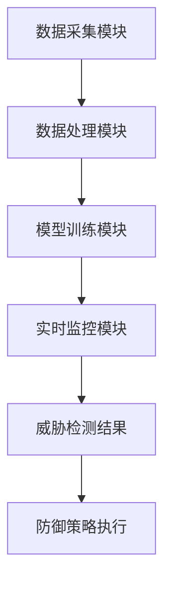

                 


# AI Agent在网络安全中的应用：威胁检测与防御

> 关键词：AI Agent，网络安全，威胁检测，威胁防御，机器学习，异常检测

> 摘要：本文详细探讨了AI Agent在网络安全中的应用，特别是威胁检测与防御领域的具体实现。文章首先介绍了AI Agent的基本概念和网络安全的核心问题，然后分析了AI Agent的核心原理与技术，包括机器学习算法和异常检测算法。接着，文章详细阐述了AI Agent在威胁检测中的应用，包括网络流量分析和异常行为分析，并通过实际案例进行了深入分析。最后，文章讨论了AI Agent在威胁防御中的应用，包括主动防御策略和自适应防御机制。本文旨在为网络安全领域的技术人员提供理论支持和实践指导，帮助他们更好地理解和应用AI Agent技术。

---

# 第一部分: AI Agent在网络安全中的应用概述

## 第1章: AI Agent与网络安全概述

### 1.1 AI Agent的基本概念

#### 1.1.1 AI Agent的定义
AI Agent（人工智能代理）是一种能够感知环境、自主决策并执行任务的智能实体。在网络安全领域，AI Agent通常被设计为能够实时监控网络流量、识别异常行为并采取相应措施的智能系统。

#### 1.1.2 AI Agent的核心特征
- **自主性**：AI Agent能够在没有人工干预的情况下自主运行。
- **反应性**：AI Agent能够实时感知环境变化并做出响应。
- **学习能力**：AI Agent能够通过机器学习算法不断优化自身的识别和决策能力。
- **可扩展性**：AI Agent能够适应不同规模和复杂度的网络安全需求。

#### 1.1.3 AI Agent在网络安全中的作用
- 提供实时威胁检测能力。
- 优化网络安全防御策略。
- 减少人工干预，降低运维成本。

### 1.2 网络安全的基本概念

#### 1.2.1 网络安全的定义
网络安全是指通过采取必要措施，防范网络、数据、信息等受到来自内部和外部的攻击、侵入、干扰、破坏和盗窃等危害，以确保网络系统的完整性、保密性和可用性的活动。

#### 1.2.2 网络安全的主要威胁
- **网络攻击**：如DDoS攻击、钓鱼攻击等。
- **数据泄露**：未经授权的访问和数据窃取。
- **恶意软件**：如病毒、蠕虫、木马等。
- **内部威胁**：如员工误操作或恶意行为。

#### 1.2.3 网络安全的防御体系
网络安全的防御体系通常包括防火墙、入侵检测系统（IDS）、入侵防御系统（IPS）、加密技术、身份验证等。

### 1.3 AI Agent在网络安全中的应用前景

#### 1.3.1 AI Agent在网络安全中的优势
- **高效性**：AI Agent能够快速处理大量数据，实时检测威胁。
- **准确性**：通过机器学习算法，AI Agent能够提高威胁检测的准确性。
- **适应性**：AI Agent能够根据环境变化自适应调整防御策略。

#### 1.3.2 AI Agent在威胁检测中的应用
AI Agent可以通过分析网络流量、用户行为和系统日志，发现潜在的威胁，并及时发出预警。

#### 1.3.3 AI Agent在威胁防御中的应用
AI Agent可以通过实时监控和分析网络流量，识别异常行为，并采取主动防御措施，如阻断恶意流量、隔离受感染设备等。

### 1.4 本章小结
本章介绍了AI Agent的基本概念、网络安全的主要威胁以及AI Agent在网络安全中的应用前景。AI Agent作为一种智能化的网络安全工具，能够在威胁检测与防御中发挥重要作用。

---

## 第2章: AI Agent的核心原理

### 2.1 AI Agent的工作流程

#### 2.1.1 数据采集与预处理
AI Agent通过网络接口采集网络流量数据，并对数据进行清洗、归一化等预处理操作，以便后续分析。

#### 2.1.2 模型训练与部署
AI Agent使用机器学习算法对预处理后的数据进行建模，并将训练好的模型部署到实时监控系统中。

#### 2.1.3 实时监控与响应
AI Agent通过实时监控网络流量，利用训练好的模型识别异常行为，并根据预设策略采取相应的防御措施。

### 2.2 AI Agent的关键技术

#### 2.2.1 机器学习算法
- **监督学习**：用于分类任务，如正常流量与异常流量的分类。
- **无监督学习**：用于聚类任务，如异常行为的识别。
- **强化学习**：用于动态调整防御策略。

#### 2.2.2 自然语言处理技术
自然语言处理技术用于分析日志文本、错误信息等非结构化数据，提取有用的信息。

#### 2.2.3 异常检测算法
异常检测算法用于识别网络流量中的异常行为，如流量突增、数据包畸形等。

### 2.3 AI Agent的数学模型

#### 2.3.1 机器学习模型的数学基础
机器学习模型通常基于概率论、统计学和线性代数等数学基础。例如，支持向量机（SVM）和随机森林（Random Forest）等算法。

#### 2.3.2 异常检测的数学模型
异常检测的数学模型通常包括概率密度函数、马尔可夫链等。例如，基于高斯混合模型（GMM）的异常检测方法。

#### 2.3.3 网络流量分析的数学模型
网络流量分析的数学模型通常基于图论和时间序列分析。例如，基于马尔可夫链的网络流量预测模型。

### 2.4 本章小结
本章详细介绍了AI Agent的核心原理，包括工作流程、关键技术以及数学模型。这些内容为后续章节的威胁检测与防御应用奠定了理论基础。

---

## 第3章: 网络流量分析与威胁检测

### 3.1 网络流量分析的基本原理

#### 3.1.1 网络流量特征提取
网络流量特征提取是通过分析网络数据包的头部信息、流量模式等，提取有助于威胁检测的特征。

#### 3.1.2 流量分类算法
流量分类算法用于将网络流量分为正常流量和异常流量。常用的算法包括决策树、朴素贝叶斯、支持向量机（SVM）等。

#### 3.1.3 异常流量检测
异常流量检测通过识别流量中的异常模式，发现潜在的网络攻击行为。

### 3.2 基于AI Agent的威胁检测方法

#### 3.2.1 基于监督学习的威胁检测
基于监督学习的威胁检测方法需要标记好的训练数据，如正常流量和异常流量。

#### 3.2.2 基于无监督学习的威胁检测
基于无监督学习的威胁检测方法适用于未知威胁的检测，无需标记好的训练数据。

#### 3.2.3 基于强化学习的威胁检测
基于强化学习的威胁检测方法通过不断试错，优化威胁检测策略。

### 3.3 实际案例分析

#### 3.3.1 网络入侵检测系统的设计与实现
设计一个基于AI Agent的网络入侵检测系统，包括数据采集、特征提取、模型训练和实时监控等模块。

#### 3.3.2 基于AI Agent的异常流量检测案例
通过实际网络流量数据，展示AI Agent如何通过异常检测算法识别并阻止DDoS攻击。

### 3.4 本章小结
本章详细介绍了网络流量分析与威胁检测的原理和方法，并通过实际案例展示了AI Agent在威胁检测中的应用。

---

## 第4章: 威胁防御策略与AI Agent

### 4.1 威胁防御策略

#### 4.1.1 主动防御策略
主动防御策略包括主动阻断恶意流量、隔离受感染设备等。

#### 4.1.2 自适应防御策略
自适应防御策略根据实时威胁情况动态调整防御策略。

#### 4.1.3 分层防御策略
分层防御策略通过多层次的防御措施，如网络层、应用层等，提高整体防御能力。

### 4.2 基于AI Agent的威胁防御方法

#### 4.2.1 基于AI Agent的主动防御
AI Agent通过实时监控网络流量，识别异常行为，并采取主动防御措施。

#### 4.2.2 基于AI Agent的自适应防御
AI Agent能够根据威胁情况动态调整防御策略，提高防御效果。

#### 4.2.3 AI Agent与其他防御系统的协同防御
AI Agent可以与其他防御系统（如防火墙、入侵检测系统）协同工作，形成综合防御体系。

### 4.3 实际案例分析

#### 4.3.1 基于AI Agent的DDoS防御系统
通过AI Agent实时分析网络流量，识别并阻止DDoS攻击。

#### 4.3.2 基于AI Agent的恶意软件检测与清除
AI Agent通过分析系统行为，识别恶意软件并采取清除措施。

### 4.4 本章小结
本章详细介绍了威胁防御策略与AI Agent的应用，展示了AI Agent在威胁防御中的重要作用。

---

## 第5章: 系统设计与实现

### 5.1 系统设计概述

#### 5.1.1 系统架构设计
AI Agent网络安全系统通常包括数据采集模块、数据处理模块、模型训练模块和实时监控模块。

#### 5.1.2 功能模块设计
- 数据采集模块：负责采集网络流量数据。
- 数据处理模块：对数据进行清洗、归一化等预处理。
- 模型训练模块：训练机器学习模型。
- 实时监控模块：利用训练好的模型进行实时监控和威胁检测。

### 5.2 系统实现细节

#### 5.2.1 数据采集与预处理
使用Python的Scapy库采集网络流量数据，并通过特征工程提取有用特征。

#### 5.2.2 模型训练与部署
使用Scikit-learn库训练机器学习模型，并将其部署到实时监控系统中。

#### 5.2.3 实时监控与响应
通过Flask框架搭建实时监控系统，利用训练好的模型分析网络流量，并根据检测结果采取相应的防御措施。

### 5.3 系统接口设计

#### 5.3.1 数据接口
数据接口负责与数据源（如网络设备、日志系统）进行数据交换。

#### 5.3.2 模型接口
模型接口负责与机器学习模型进行交互，获取威胁检测结果。

#### 5.3.3 用户接口
用户接口提供友好的操作界面，方便用户查看威胁检测结果并进行操作。

### 5.4 系统交互流程图


### 5.5 本章小结
本章详细介绍了AI Agent网络安全系统的系统设计与实现，包括架构设计、功能模块设计、接口设计和系统交互流程。

---

## 第6章: 项目实战

### 6.1 项目背景
为了验证AI Agent在网络安全中的应用，我们设计了一个基于AI Agent的网络入侵检测系统。

### 6.2 项目环境搭建

#### 6.2.1 硬件环境
- CPU：Intel Core i7
- 内存：16GB
- 硬盘：500GB

#### 6.2.2 软件环境
- 操作系统：Ubuntu 20.04
- Python版本：3.8
- 开发工具：Jupyter Notebook、VS Code

#### 6.2.3 数据集
使用KDD Cup 1999数据集作为训练数据。

### 6.3 项目核心代码实现

#### 6.3.1 数据采集与预处理
```python
import scapy.all as scapy

def get_network_traffic():
    # 采集网络流量数据
    packets = scapy.srp(scapy.IP(), timeout=1, verbose=0)
    return packets
```

#### 6.3.2 模型训练
```python
from sklearn.svm import SVC
from sklearn.model_selection import train_test_split

# 数据预处理
X = ...  # 特征向量
y = ...  # 标签

# 划分训练集和测试集
X_train, X_test, y_train, y_test = train_test_split(X, y, test_size=0.2)

# 训练SVM模型
model = SVC()
model.fit(X_train, y_train)

# 模型评估
score = model.score(X_test, y_test)
print(f"模型准确率：{score}")
```

#### 6.3.3 实时监控与防御
```python
from flask import Flask
import json

app = Flask(__name__)

@app.route('/detect-threat', methods=['POST'])
def detect Threat():
    data = request.json
    # 使用模型进行威胁检测
    prediction = model.predict(data)
    return json.dumps({'result': prediction})

if __name__ == '__main__':
    app.run()
```

### 6.4 项目案例分析

#### 6.4.1 案例1：DDoS攻击检测
通过AI Agent检测网络中的DDoS攻击，并采取流量限速措施。

#### 6.4.2 案例2：恶意软件检测
通过AI Agent分析系统行为，识别并清除恶意软件。

### 6.5 本章小结
本章通过实际项目展示了AI Agent在网络安全中的应用，详细讲解了项目环境搭建、核心代码实现和实际案例分析。

---

## 第7章: 总结与展望

### 7.1 总结
本文详细探讨了AI Agent在网络安全中的应用，特别是威胁检测与防御领域的具体实现。通过理论分析和实际案例，展示了AI Agent在网络安全中的重要作用。

### 7.2 展望
未来，随着AI技术的不断发展，AI Agent在网络安全中的应用将更加广泛和深入。我们可以期待更多的智能化、自适应的网络安全解决方案。

### 7.3 最佳实践Tips
- **数据质量**：确保数据的完整性和准确性。
- **模型优化**：不断优化机器学习模型，提高检测准确率。
- **系统维护**：定期更新模型和系统，应对新的网络安全威胁。

### 7.4 小结
本文为网络安全领域的技术人员提供了理论支持和实践指导，帮助他们更好地理解和应用AI Agent技术。

---

## 附录

### 附录A: 参考文献
- [1] Bishop, C. M. (2006). Pattern Recognition and Machine Learning. Springer.
- [2] Hastie, T., Tibshirani, R., & Friedman, J. (2009). The Elements of Statistical Learning. Springer.
- [3] Dettmers, I., & Wichersdorf, F. (2020). An overview of AI in cybersecurity. arXiv preprint arXiv:2010.11999.

### 附录B: 工具与库
- **Scapy**：用于网络数据包分析和处理。
- **Scikit-learn**：用于机器学习模型训练。
- **Flask**：用于构建实时监控系统。

---

# 作者：AI天才研究院/AI Genius Institute & 禅与计算机程序设计艺术 /Zen And The Art of Computer Programming

---

这篇博客文章详细介绍了AI Agent在网络安全中的应用，从理论到实践，为读者提供了全面的指导。希望对您有所帮助！

