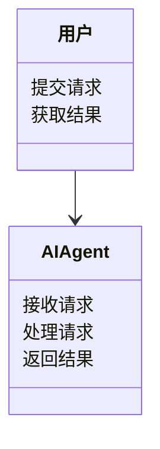
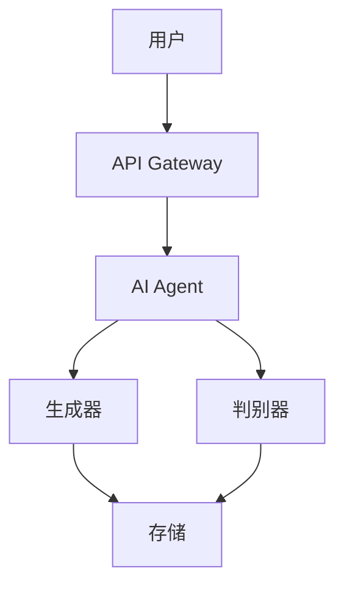
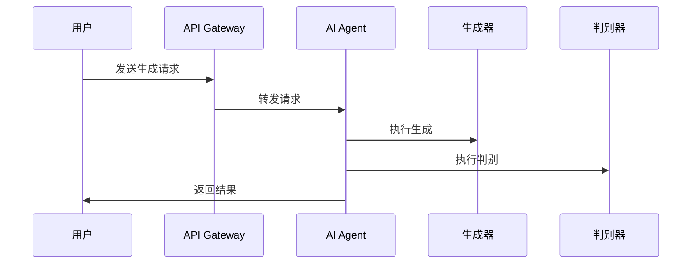

                 


# AI Agent在艺术创作中的应用

> 关键词：AI Agent, 艺术创作, 生成对抗网络, 强化学习, 艺术风格迁移

> 摘要：本文探讨了AI Agent在艺术创作中的应用，分析了其核心概念、算法原理、系统架构及实际案例。通过详细的技术分析，揭示了AI如何辅助或参与艺术创作过程，为艺术家和开发者提供了理论与实践的双重指导。

---

# 第一部分: AI Agent在艺术创作中的应用概述

## 第1章: 背景介绍

### 1.1 AI Agent的基本概念

#### 1.1.1 AI Agent的定义
AI Agent（人工智能代理）是指能够感知环境并采取行动以实现目标的智能实体。在艺术创作中，AI Agent可以被设计为辅助艺术家创作、生成艺术作品或独立创作艺术作品的工具。

#### 1.1.2 艺术创作的定义与特点
艺术创作是通过人类的创造力和技能，将想法转化为视觉、听觉或文学等形式的作品。其特点包括创造性、情感表达和个性化。

#### 1.1.3 AI Agent与艺术创作的结合方式
AI Agent可以通过生成图像、音乐、文学等形式直接参与艺术创作，也可以通过提供灵感、分析数据或优化创作过程间接支持艺术创作。

### 1.2 问题背景与问题描述

#### 1.2.1 艺术创作中的传统挑战
传统艺术创作面临灵感枯竭、技术限制和创作效率低下等问题，艺术家需要不断尝试和修正才能完成作品。

#### 1.2.2 AI技术如何解决这些挑战
AI技术可以通过生成潜在的创意、优化创作过程和提供技术支持来提升艺术创作的效率和质量。

#### 1.2.3 当前AI在艺术创作中的应用现状
目前，AI在艺术创作中的应用主要集中在图像生成、风格迁移和音乐创作等领域，但仍然面临技术与艺术结合的挑战。

### 1.3 问题解决与边界定义

#### 1.3.1 AI Agent在艺术创作中的核心问题
如何设计AI Agent使其能够理解艺术创作的目标、风格和情感，并生成符合人类审美的作品。

#### 1.3.2 应用的边界与外延
AI Agent在艺术创作中的应用边界在于其生成作品的原创性和艺术性，而外延则包括与人类艺术家的合作。

#### 1.3.3 核心概念的结构与组成
AI Agent在艺术创作中的核心结构包括感知模块、生成模块和评估模块。

---

## 第2章: 核心概念与联系

### 2.1 AI Agent的原理

#### 2.1.1 基于生成对抗网络的AI Agent
生成对抗网络（GAN）通过生成器和判别器的对抗训练，可以生成逼真的图像和艺术作品。

#### 2.1.2 基于强化学习的AI Agent
强化学习（RL）通过奖励机制，使AI Agent学会优化艺术创作的过程。

#### 2.1.3 基于转移学习的AI Agent
转移学习（Transfer Learning）使AI Agent能够将一种艺术风格迁移到另一种媒介。

### 2.2 核心概念的属性对比

#### 2.2.1 AI Agent与传统艺术创作工具的对比

| 属性       | AI Agent                         | 传统艺术工具                     |
|------------|----------------------------------|----------------------------------|
| 创造性     | 高                               | 中                               |
| 可控性     | 中                               | 高                               |
| 灵活性     | 高                               | 中                               |

### 2.3 ER实体关系图
```mermaid
er
actor: 用户
agent: AI创作代理
tool: 创作工具
style: 风格
medium: 媒介
```

---

## 第3章: 算法原理讲解

### 3.1 生成对抗网络（GAN）的原理

#### 3.1.1 GAN的结构
GAN由生成器和判别器组成，生成器试图生成逼真的图像，判别器试图区分生成图像和真实图像。

#### 3.1.2 GAN的训练过程
1. 初始化生成器和判别器的参数。
2. 训练判别器以区分真实图像和生成图像。
3. 训练生成器以欺骗判别器。

#### 3.1.3 GAN在艺术创作中的应用
GAN可以用于生成绘画、插画和数字艺术作品。

### 3.2 强化学习（RL）的原理

#### 3.2.1 RL的基本概念
RL通过智能体与环境的交互，学习最优策略以最大化累积奖励。

#### 3.2.2 RL在艺术创作中的应用
RL可以用于音乐创作和动态艺术作品的生成。

### 3.3 算法实现的Python代码示例

#### 3.3.1 GAN的实现
```python
import torch
import torch.nn as nn

class Generator(nn.Module):
    def __init__(self, latent_dim, img_size):
        super(Generator, self).__init__()
        self.model = nn.Sequential(
            nn.Linear(latent_dim, 256),
            nn.LeakyReLU(0.2),
            nn.Linear(256, img_size)
        )

    def forward(self, x):
        return self.model(x)

class Discriminator(nn.Module):
    def __init__(self, img_size):
        super(Discriminator, self).__init__()
        self.model = nn.Sequential(
            nn.Linear(img_size, 256),
            nn.LeakyReLU(0.2),
            nn.Linear(256, 1),
            nn.Sigmoid()
        )

    def forward(self, x):
        return self.model(x)

# 初始化模型
generator = Generator(latent_dim=100, img_size=100)
discriminator = Discriminator(img_size=100)
```

### 3.4 数学模型和公式

#### 3.4.1 GAN的损失函数
生成器的损失函数为：
$$ L_G = -\log(D(G(z))) $$
判别器的损失函数为：
$$ L_D = -\log(D(x)) - \log(1 - D(G(z))) $$

---

## 第4章: 系统分析与架构设计

### 4.1 项目场景介绍
本项目旨在设计一个基于AI Agent的艺术创作系统，能够生成绘画、音乐和文学作品。

### 4.2 系统功能设计

#### 4.2.1 领域模型


### 4.3 系统架构设计

#### 4.3.1 系统架构


### 4.4 系统接口设计

#### 4.4.1 API接口
- `POST /api/generate`: 提交生成请求
- `GET /api/result`: 获取生成结果

### 4.5 系统交互设计

#### 4.5.1 序列图


---

## 第5章: 项目实战

### 5.1 环境安装

#### 5.1.1 安装Python
```bash
python --version
pip install --upgrade pip
```

#### 5.1.2 安装库
```bash
pip install torch torchvision matplotlib
```

### 5.2 核心实现

#### 5.2.1 GAN实现
```python
# 完整的GAN实现代码
import torch
import torch.nn as nn
import torch.optim as optim
import numpy as np

class Generator(nn.Module):
    def __init__(self, latent_dim, img_size):
        super(Generator, self).__init__()
        self.model = nn.Sequential(
            nn.Linear(latent_dim, 256),
            nn.LeakyReLU(0.2),
            nn.Linear(256, img_size)
        )

    def forward(self, x):
        return self.model(x)

class Discriminator(nn.Module):
    def __init__(self, img_size):
        super(Discriminator, self).__init__()
        self.model = nn.Sequential(
            nn.Linear(img_size, 256),
            nn.LeakyReLU(0.2),
            nn.Linear(256, 1),
            nn.Sigmoid()
        )

    def forward(self, x):
        return self.model(x)

def train_gan(generator, discriminator, optimizer_g, optimizer_d, criterion, batch_size):
    for epoch in range(num_epochs):
        z = torch.randn(batch_size, latent_dim).to(device)
        gen_labels = torch.ones(batch_size, 1).to(device)
        real_labels = torch.zeros(batch_size, 1).to(device)

        # 生成假数据
        gen_output = generator(z)
        # 判别器训练
        d_output_real = discriminator(real_images)
        d_loss_real = criterion(d_output_real, real_labels)
        d_output_fake = discriminator(gen_output)
        d_loss_fake = criterion(d_output_fake, gen_labels)
        d_loss = d_loss_real + d_loss_fake

        # 优化器更新
        optimizer_d.zero_grad()
        d_loss.backward()
        optimizer_d.step()

        # 生成器训练
        g_output = generator(z)
        g_output_detached = g_output.detach()
        d_output_detached = discriminator(g_output_detached)
        g_loss = criterion(d_output_detached, gen_labels)

        optimizer_g.zero_grad()
        g_loss.backward()
        optimizer_g.step()

# 训练过程
num_epochs = 100
latent_dim = 100
img_size = 100
batch_size = 32
learning_rate = 0.0002

device = torch.device("cuda" if torch.cuda.is_available() else "cpu")

generator = Generator(latent_dim, img_size).to(device)
discriminator = Discriminator(img_size).to(device)

optimizer_g = optim.Adam(generator.parameters(), lr=learning_rate)
optimizer_d = optim.Adam(discriminator.parameters(), lr=learning_rate)
criterion = nn.BCELoss()

train_gan(generator, discriminator, optimizer_g, optimizer_d, criterion, batch_size)
```

---

## 第6章: 最佳实践、小结与注意事项

### 6.1 最佳实践
1. 在实际应用中，建议结合艺术家的创作意图进行AI Agent的定制化训练。
2. 使用高质量的艺术数据集以提高生成作品的质量。

### 6.2 小结
AI Agent在艺术创作中的应用不仅提升了创作效率，还拓展了艺术表达的边界。通过结合多种AI技术，艺术家可以创作出更加丰富和多样化的作品。

### 6.3 注意事项
- AI生成的作品可能缺乏人类的情感和创意，因此需要艺术家的参与和指导。
- 在使用AI Agent进行艺术创作时，需注意版权和伦理问题。

### 6.4 拓展阅读
建议读者进一步阅读《生成对抗网络：算法与应用》和《强化学习在艺术创作中的应用》等书籍，以深入理解AI Agent在艺术创作中的潜力。

---

# 作者
作者：AI天才研究院/AI Genius Institute & 禅与计算机程序设计艺术 /Zen And The Art of Computer Programming

