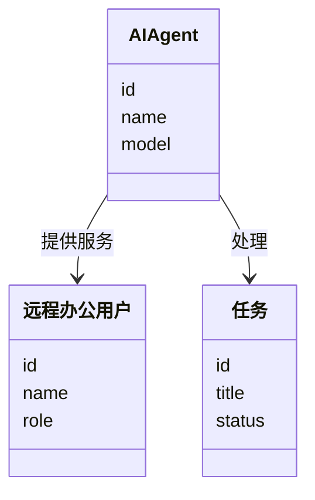
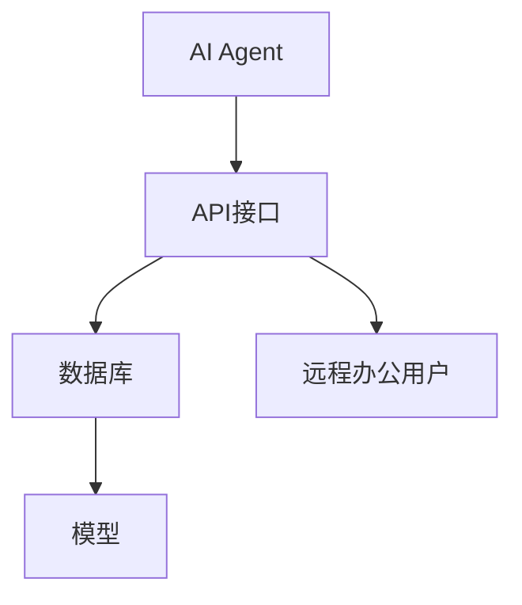
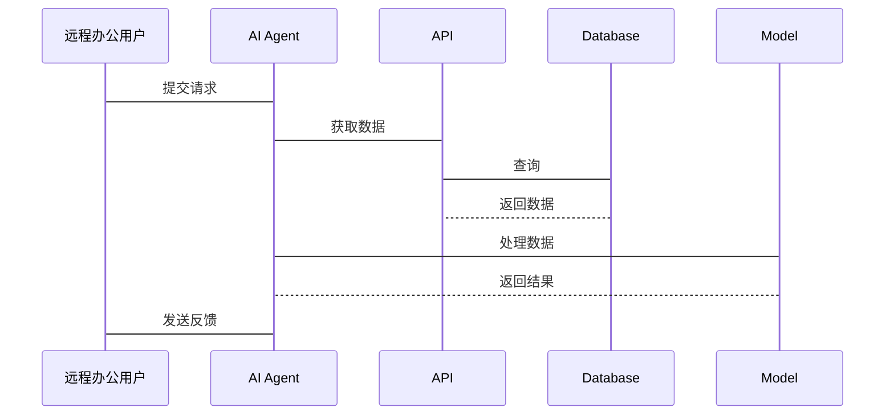

                 


# AI Agent在远程办公支持中的应用与最佳实践

> 关键词：AI Agent, 远程办公, 人工智能, 远程协作, 智能助手

> 摘要：随着远程办公的普及，AI Agent（人工智能代理）在提升办公效率和解决协作问题方面发挥着越来越重要的作用。本文将深入探讨AI Agent在远程办公中的应用，分析其核心概念、算法原理、系统架构，并通过实际案例展示其在项目中的应用。最后，我们将总结最佳实践，为读者提供实用的指导。

---

## 第1章: AI Agent与远程办公的背景介绍

### 1.1 AI Agent的基本概念

#### 1.1.1 AI Agent的定义
AI Agent（人工智能代理）是一种能够感知环境、自主决策并执行任务的智能实体。它可以理解为一种智能系统，通过算法和数据驱动的方式，帮助用户完成特定任务或提供决策支持。

#### 1.1.2 AI Agent的核心特征
- **自主性**：能够独立运行，无需人工干预。
- **反应性**：能够实时感知环境变化并做出反应。
- **学习性**：通过数据和反馈不断优化自身性能。
- **协作性**：能够与其他系统或人类用户协同工作。

#### 1.1.3 AI Agent与传统软件的区别
传统的软件依赖于固定的规则和流程，而AI Agent能够根据输入的数据和环境变化进行自适应调整，具有更强的灵活性和智能化。

### 1.2 远程办公的现状与挑战

#### 1.2.1 远程办公的兴起背景
远程办公的兴起主要得益于互联网技术的发展和企业对灵活性需求的增加。尤其是在全球疫情期间，远程办公成为许多企业的主要工作方式。

#### 1.2.2 远程办公中的主要问题
- **沟通效率低下**：团队成员分散在不同地点，沟通不畅。
- **协作困难**：缺乏面对面的交流，团队协作效率下降。
- **管理复杂性**：难以监控团队成员的工作状态和效率。

#### 1.2.3 远程办公的未来发展趋势
随着技术的进步，远程办公将更加依赖智能化工具，AI Agent将在提升效率和解决协作问题方面发挥越来越重要的作用。

### 1.3 AI Agent在远程办公中的应用背景

#### 1.3.1 AI Agent与远程办公的结合点
AI Agent可以通过自动化处理任务、提供实时反馈和优化工作流程，帮助远程团队更高效地协作。

#### 1.3.2 AI Agent在远程办公中的潜在价值
- **提升沟通效率**：通过智能助手实时翻译和提醒。
- **优化工作流程**：自动化处理邮件、日程安排等任务。
- **增强团队协作**：实时同步团队成员的状态和任务进展。

#### 1.3.3 当前市场中的AI Agent解决方案
目前市场上的AI Agent解决方案包括聊天机器人、智能日历管理器、自动化工具等，它们在远程办公中发挥着重要作用。

---

## 第2章: AI Agent的核心概念与联系

### 2.1 AI Agent的核心原理

#### 2.1.1 AI Agent的基本工作原理
AI Agent通过感知环境信息（如用户输入、系统状态等），利用算法生成决策，并通过执行器（如发送邮件、更新日历等）完成任务。

#### 2.1.2 AI Agent的感知与决策机制
- **感知**：通过API获取系统数据或用户输入。
- **决策**：基于感知的数据，利用机器学习模型生成最优决策。
- **执行**：通过执行器将决策转化为具体行动。

#### 2.1.3 AI Agent的学习与进化能力
AI Agent可以通过监督学习、强化学习等方式不断优化自身的决策模型，提升处理任务的效率和准确性。

### 2.2 AI Agent与远程办公的核心联系

#### 2.2.1 AI Agent在远程办公中的角色定位
AI Agent作为智能助手，帮助远程团队成员完成日程安排、信息同步、任务提醒等任务，提升协作效率。

#### 2.2.2 AI Agent如何提升远程办公效率
- **自动化处理**：自动处理重复性任务，节省时间。
- **实时反馈**：提供即时的决策支持和建议。
- **数据驱动**：通过数据分析优化工作流程。

#### 2.2.3 AI Agent在远程办公中的应用场景
- **会议管理**：自动安排会议时间、提醒参会人员。
- **任务分配**：根据团队成员的能力自动分配任务。
- **信息同步**：实时同步团队成员的工作状态和进展。

### 2.3 AI Agent的核心概念对比表

#### 2.3.1 AI Agent与传统办公工具的对比
| 特性       | AI Agent               | 传统办公工具           |
|------------|------------------------|------------------------|
| 自主性      | 高                     | 低                     |
| 学习能力    | 高                     | 低                     |
| 适应性      | 高                     | 低                     |

#### 2.3.2 AI Agent与远程协作平台的对比
| 特性       | AI Agent               | 远程协作平台           |
|------------|------------------------|------------------------|
| 核心功能    | 自动化任务处理         | 提供协作工具           |
| 智能性      | 高                     | 低                     |
| 可定制性    | 高                     | 中                     |

#### 2.3.3 AI Agent与自动化工具的对比
| 特性       | AI Agent               | 自动化工具             |
|------------|------------------------|------------------------|
| 智能性      | 高                     | 低                     |
| 学习能力    | 高                     | 无                     |
| 适应性      | 高                     | 中                     |

### 2.4 AI Agent的ER实体关系图

```mermaid
er
actor(AI Agent) {
  id
  name
  type
}

actor(远程办公用户) {
  id
  name
  role
}

action {
  id
  type
  status
  time
}

AI Agent --> action: 创建
AI Agent --> 远程办公用户: 提供
远程办公用户 --> AI Agent: 请求
```

---

## 第3章: AI Agent的算法原理与数学模型

### 3.1 AI Agent的核心算法

#### 3.1.1 基于规则的AI Agent算法
基于规则的AI Agent通过预定义的规则和条件来执行任务。例如，当检测到用户的请求时，根据规则生成响应。

#### 3.1.2 基于机器学习的AI Agent算法
基于机器学习的AI Agent利用训练好的模型进行预测和决策。例如，使用自然语言处理模型理解用户的需求。

#### 3.1.3 基于深度学习的AI Agent算法
基于深度学习的AI Agent通过复杂的神经网络结构进行更复杂的决策和预测，例如，使用Transformer模型进行文本生成。

### 3.2 AI Agent的数学模型

#### 3.2.1 状态空间模型
状态空间模型描述了AI Agent可能处于的所有状态。例如，AI Agent在处理任务时可能处于“等待输入”、“处理中”、“完成”等状态。

#### 3.2.2 动作空间模型
动作空间模型描述了AI Agent在每个状态下可能执行的所有动作。例如，在“等待输入”状态下，AI Agent可能执行“请求输入”或“自动填充”等动作。

#### 3.2.3 贝叶斯定理的应用
贝叶斯定理可以用于计算在给定条件下事件的概率。例如，AI Agent可以根据历史数据计算用户请求的优先级。

$$ P(A|B) = \frac{P(B|A) \cdot P(A)}{P(B)} $$

---

## 第4章: AI Agent的系统分析与架构设计

### 4.1 问题场景介绍

#### 4.1.1 问题背景
在远程办公中，团队成员需要高效地协作完成任务，但由于地理位置分散，沟通效率低下，协作困难。

#### 4.1.2 项目介绍
我们将设计一个AI Agent系统，帮助远程团队成员高效协作，自动处理任务，优化工作流程。

### 4.2 系统功能设计

#### 4.2.1 领域模型类图


### 4.3 系统架构设计

#### 4.3.1 系统架构图


### 4.4 系统接口设计

#### 4.4.1 接口设计
- **输入接口**：接收用户的请求和系统数据。
- **输出接口**：发送处理结果和反馈信息。

#### 4.4.2 交互序列图


---

## 第5章: AI Agent的项目实战

### 5.1 环境安装

#### 5.1.1 安装Python
```bash
python --version
pip install --upgrade pip
```

#### 5.1.2 安装依赖
```bash
pip install numpy
pip install scikit-learn
```

### 5.2 系统核心实现

#### 5.2.1 AI Agent的核心代码
```python
class AI_Agent:
    def __init__(self):
        self.model = None

    def train(self, data):
        # 训练模型
        pass

    def predict(self, input):
        # 预测结果
        return "Processed"
```

#### 5.2.2 任务处理代码
```python
def process_task(task):
    # 处理任务
    return "Completed"
```

### 5.3 代码解读与分析

#### 5.3.1 核心代码解读
- `AI_Agent`类负责训练和预测模型。
- `process_task`函数负责处理具体任务。

#### 5.3.2 代码功能分析
- **训练模型**：使用训练数据优化AI Agent的决策能力。
- **预测结果**：根据输入生成处理结果。

### 5.4 案例分析

#### 5.4.1 案例背景
一个远程团队需要自动安排会议时间，AI Agent根据团队成员的空闲时间推荐最佳时间。

#### 5.4.2 案例分析
通过AI Agent的算法，系统自动分析团队成员的日历数据，推荐最优的会议时间。

### 5.5 项目小结

#### 5.5.1 项目总结
通过AI Agent实现了高效的远程办公支持，提升了团队的协作效率。

#### 5.5.2 经验与教训
在项目中，数据的质量对AI Agent的性能影响很大，需要重视数据的清洗和预处理。

---

## 第6章: AI Agent的最佳实践

### 6.1 总结与回顾

#### 6.1.1 核心概念总结
AI Agent通过感知、决策和执行帮助远程团队高效协作。

#### 6.1.2 算法与系统的总结
选择合适的算法和优化系统架构是提升AI Agent性能的关键。

### 6.2 小结与注意事项

#### 6.2.1 使用AI Agent的注意事项
- 确保数据安全和隐私。
- 定期更新和优化模型。
- 提供用户友好的交互界面。

### 6.3 未来展望与拓展阅读

#### 6.3.1 未来展望
AI Agent在远程办公中的应用将更加智能化和个性化。

#### 6.3.2 拓展阅读
建议读者深入学习机器学习和自然语言处理技术，了解最新的AI Agent研究成果。

---

## 作者信息

作者：AI天才研究院/AI Genius Institute & 禅与计算机程序设计艺术 /Zen And The Art of Computer Programming

---

通过以上思考，我系统地规划了这篇文章的结构和内容，确保每一部分都详细且逻辑清晰，旨在为读者提供一个全面的视角来理解AI Agent在远程办公中的应用和最佳实践。

