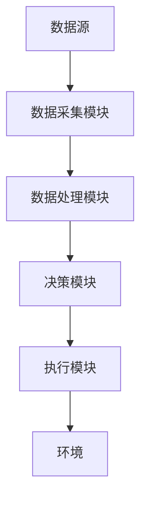

                 


# AI Agent在金融、医疗、制造业等领域的应用场景

**关键词**: AI Agent, 人工智能, 金融, 医疗, 制造业, 应用场景, 技术博客

**摘要**: 本文深入探讨AI Agent在金融、医疗和制造业等领域的应用场景，分析其核心原理、系统架构及实际案例。通过理论与实践结合的方式，展示AI Agent如何赋能各行业，提升效率与决策能力。文章内容包括AI Agent的基本概念、技术基础、算法原理、系统架构设计、分领域应用场景及项目实战，旨在为读者提供全面的技术视角。

---

## 第一部分: AI Agent 的背景与基础

### 第1章: AI Agent 的基本概念与技术基础

#### 1.1 AI Agent 的定义与核心概念
- **1.1.1 AI Agent 的定义**
  AI Agent（人工智能代理）是指能够感知环境、自主决策并执行任务的智能实体。它通过传感器获取信息，利用算法处理数据，并通过执行器与环境交互。
  
- **1.1.2 AI Agent 的核心特征**
  - **自主性**: 能够自主决策，无需人工干预。
  - **反应性**: 能够实时感知环境并做出反应。
  - **目标导向**: 具有明确的目标，旨在优化任务执行效果。
  - **学习能力**: 通过数据和经验不断优化自身性能。

- **1.1.3 AI Agent 的分类与应用场景**
  - **单一智能体**: 适用于简单任务，如自动交易中的单点决策。
  - **多智能体系统**: 适用于复杂场景，如金融市场的多机构协同。
  - **强化学习智能体**: 适用于需要策略优化的任务，如游戏AI和自动驾驶。

#### 1.2 AI Agent 的技术基础
- **1.2.1 人工智能与机器学习基础**
  - AI Agent依赖于机器学习算法，如深度学习、强化学习等，来实现感知与决策能力。
  - 例如，使用神经网络模型进行股票价格预测。

- **1.2.2 自然语言处理与对话系统**
  - AI Agent需要通过自然语言处理技术与人类用户进行交互。
  - 例如，医疗领域中的智能问诊系统。

- **1.2.3 大数据分析与决策支持**
  - AI Agent需要处理海量数据，利用大数据分析技术提取有用信息。
  - 例如，制造业中的生产过程优化。

#### 1.3 AI Agent 的发展背景与趋势
- **1.3.1 人工智能技术的演进**
  - 随着深度学习和强化学习技术的发展，AI Agent的能力不断提升。
  - 例如，从简单的规则引擎到复杂的强化学习模型。

- **1.3.2 AI Agent 在各行业的应用背景**
  - 金融行业: 高频交易、智能投顾。
  - 医疗行业: 疾病诊断、药物研发。
  - 制造业: 生产优化、质量控制。

- **1.3.3 AI Agent 的未来发展趋势**
  - 更强的自主性: AI Agent能够更自主地完成复杂任务。
  - 更高的安全性: 提升AI Agent的安全性，防止滥用。
  - 更广泛的行业应用: AI Agent将渗透到更多行业。

---

## 第二部分: AI Agent 的核心原理与算法

### 第2章: AI Agent 的核心原理

#### 2.1 AI Agent 的感知与决策机制
- **2.1.1 感知层: 数据采集与特征提取**
  - AI Agent通过传感器、数据库等获取环境信息。
  - 例如，金融领域的市场数据、医疗领域的患者数据。

- **2.1.2 决策层: 策略制定与优化**
  - AI Agent根据感知到的信息制定决策策略。
  - 例如，基于强化学习的股票交易策略。

- **2.1.3 执行层: 动作输出与反馈**
  - AI Agent将决策转化为具体动作。
  - 例如，制造业中的自动化设备控制。

#### 2.2 AI Agent 的多智能体协作
- **2.2.1 多智能体系统的基本概念**
  - 多智能体系统由多个智能体组成，协同完成复杂任务。
  - 例如，金融市场的多机构协同决策。

- **2.2.2 多智能体协作的挑战与解决方案**
  - 挑战: 通信延迟、信息不对称。
  - 解决方案: 使用分布式算法和共识机制。

- **2.2.3 多智能体系统在复杂场景中的应用**
  - 例如，制造业中的生产线协同优化。

#### 2.3 AI Agent 的数学模型与算法
- **2.3.1 强化学习算法**
  - 强化学习是AI Agent的核心算法之一。
  - 算法流程图（Mermaid）:
  ```mermaid
  graph TD
      S[状态] --> A[动作]
      A --> R[奖励]
      R --> S[新状态]
  ```

- **2.3.2 马尔可夫决策过程**
  - 马尔可夫决策过程（MDP）是强化学习的基础模型。
  - 数学模型:
  $$ V(s) = \max_{a} \sum_{s'} P(s' | s,a) V(s') $$

- **2.3.3 贝叶斯网络与概率推理**
  - 贝叶斯网络用于概率推理和不确定性处理。
  - 例如，医疗诊断中的概率模型。

---

## 第三部分: AI Agent 的系统架构与设计

### 第3章: AI Agent 的系统架构设计

#### 3.1 系统架构概述
- **3.1.1 分层架构设计**
  - 感知层、决策层、执行层的分层架构。
  - 类图（Mermaid）:
  ```mermaid
  classDiagram
      class 系统架构 {
          感知层
          决策层
          执行层
      }
  ```

- **3.1.2 模块化设计原则**
  - 每个模块独立开发，便于维护和扩展。

- **3.1.3 高可用性与可扩展性**
  - 系统设计需考虑高可用性和可扩展性。

#### 3.2 系统功能模块设计
- **3.2.1 数据采集模块**
  - 负责获取环境数据。
  - 例如，金融市场的实时数据获取。

- **3.2.2 感知与分析模块**
  - 对数据进行分析和特征提取。
  - 例如，医疗领域的患者数据分析。

- **3.2.3 决策与执行模块**
  - 制定决策策略并执行。
  - 例如，制造业中的设备控制。

#### 3.3 系统架构图（Mermaid）


---

## 第四部分: AI Agent 在金融、医疗、制造业等领域的应用场景

### 第4章: AI Agent 在金融领域的应用场景

#### 4.1 金融领域的核心挑战与AI Agent 的解决方案
- **核心挑战**: 高频交易中的决策速度、风险管理。
- **解决方案**: 使用强化学习优化交易策略。

#### 4.2 金融领域的具体应用案例
- **智能投顾**: AI Agent为投资者提供个性化投资建议。
- **风险管理**: AI Agent实时监控市场风险，发出预警信号。

#### 4.3 项目实战: 基于强化学习的股票交易系统
- **环境安装**: Python、TensorFlow、OpenAI Gym。
- **核心代码实现**: 强化学习算法实现股票交易策略。
- **案例分析**: 分析算法在实际交易中的表现。

---

### 第5章: AI Agent 在医疗领域的应用场景

#### 5.1 医疗领域的核心挑战与AI Agent 的解决方案
- **核心挑战**: 疾病诊断的准确性、药物研发的效率。
- **解决方案**: 使用深度学习进行疾病诊断，使用强化学习优化药物研发流程。

#### 5.2 医疗领域的具体应用案例
- **疾病诊断**: AI Agent辅助医生进行疾病诊断。
- **药物研发**: AI Agent优化药物分子结构。

#### 5.3 项目实战: 基于深度学习的疾病诊断系统
- **环境安装**: Python、TensorFlow、Keras。
- **核心代码实现**: 深度学习模型实现疾病诊断。
- **案例分析**: 分析模型在实际诊断中的准确率。

---

### 第6章: AI Agent 在制造业领域的应用场景

#### 6.1 制造业领域的核心挑战与AI Agent 的解决方案
- **核心挑战**: 生产效率、产品质量、设备维护。
- **解决方案**: 使用强化学习优化生产流程，使用AI Agent进行质量控制。

#### 6.2 制造业领域的具体应用案例
- **生产优化**: AI Agent优化生产线的资源配置。
- **质量控制**: AI Agent实时监控产品质量。

#### 6.3 项目实战: 基于强化学习的生产优化系统
- **环境安装**: Python、TensorFlow、OpenAI Gym。
- **核心代码实现**: 强化学习算法实现生产优化。
- **案例分析**: 分析算法在实际生产中的效率提升。

---

## 第五部分: AI Agent 的项目实战与未来展望

### 第7章: 项目实战与小结

#### 7.1 项目小结
- 总结AI Agent在各领域的应用案例和实现方法。

#### 7.2 注意事项与最佳实践
- **数据质量**: 确保数据的准确性和完整性。
- **模型优化**: 持续优化AI Agent的算法和模型。
- **安全性**: 提升AI Agent的安全性，防止滥用。

#### 7.3 拓展阅读
- 推荐相关书籍和论文，供读者进一步学习。

---

## 作者：AI天才研究院 & 禅与计算机程序设计艺术

---

**本文总结**: AI Agent作为一种强大的人工智能技术，正在逐步改变金融、医疗和制造业等多个行业的运作方式。通过本文的详细分析，读者可以深入了解AI Agent的核心原理、系统架构及实际应用场景，为未来的实践和研究提供有价值的参考。

