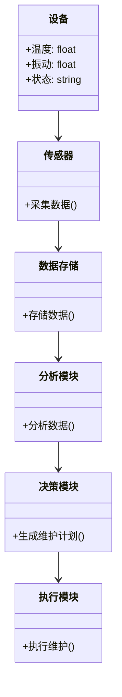
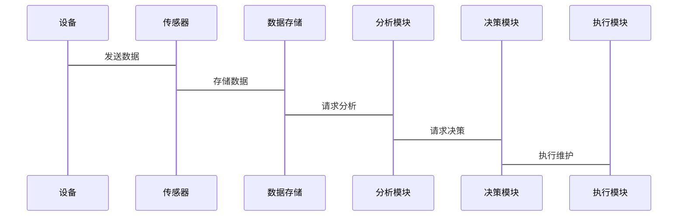

                 


# AI Agent在预测性维护中的实践

> **关键词**：AI Agent, 预测性维护, 工业智能化, 时间序列分析, 异常检测, 系统架构设计

> **摘要**：本文探讨了AI Agent在预测性维护中的实践应用，从背景介绍到系统架构设计，详细分析了AI Agent如何通过数据采集、特征提取、状态识别等技术实现预测性维护，助力工业智能化。

---

## 第一部分: AI Agent在预测性维护中的背景与概念

### 第1章: 预测性维护概述

#### 1.1 预测性维护的基本概念
##### 1.1.1 维护的基本类型
工业维护主要包括以下几种类型：
1. **预防性维护**：定期检查和维护设备，以防止故障发生。
2. **预测性维护**：基于设备状态数据，预测设备故障并安排维护。
3. **纠正性维护**：设备故障后进行修复。

##### 1.1.2 预测性维护的定义与特点
预测性维护是通过实时监测设备运行状态，利用传感器数据和机器学习算法预测设备故障，从而提前安排维护。其特点包括：
- **实时性**：基于实时数据进行分析。
- **预测性**：通过算法预测设备状态。
- **主动性**：提前安排维护，减少停机时间。

##### 1.1.3 预测性维护的必要性与优势
传统维护方式存在效率低、成本高等问题。预测性维护通过提前预测故障，可显著减少设备停机时间，降低维护成本，提高设备利用率。

#### 1.2 AI Agent的基本概念
##### 1.2.1 AI Agent的定义与分类
AI Agent是一种智能代理，能够感知环境、自主决策并执行任务。根据功能可分为：
1. **简单反射型**：基于规则执行任务。
2. **基于模型的反应型**：利用环境模型做出决策。
3. **目标驱动型**：根据目标选择最优行动。

##### 1.2.2 AI Agent的核心功能与特点
AI Agent的核心功能包括感知、推理、决策和执行。其特点为：
- **自主性**：无需外部干预。
- **反应性**：能够实时响应环境变化。
- **学习能力**：通过数据优化决策。

##### 1.2.3 AI Agent在工业中的应用前景
AI Agent在工业中的应用前景广阔，特别是在预测性维护、质量控制等领域，可显著提高生产效率和设备可靠性。

---

### 第2章: AI Agent与预测性维护的结合

#### 2.1 预测性维护中的问题背景
##### 2.1.1 传统预测性维护的局限性
传统预测性维护依赖人工经验，存在效率低、精度差等问题。

##### 2.1.2 工业智能化的推动作用
工业智能化通过引入AI技术，提高预测性维护的效率和准确性。

##### 2.1.3 AI Agent在预测性维护中的定位
AI Agent作为预测性维护的核心技术，负责数据采集、分析和决策。

#### 2.2 AI Agent在预测性维护中的核心作用
##### 2.2.1 数据采集与处理
AI Agent通过传感器实时采集设备运行数据，如温度、振动等。

##### 2.2.2 故障预测与决策
AI Agent利用机器学习算法预测设备故障，并生成维护建议。

##### 2.2.3 维护优化与执行
AI Agent优化维护计划，减少停机时间，降低维护成本。

#### 2.3 预测性维护与AI Agent的系统架构
##### 2.3.1 系统组成与功能模块
系统主要包括数据采集模块、分析模块、决策模块和执行模块。

##### 2.3.2 数据流与信息交互
数据从传感器流向分析模块，分析结果传至决策模块，决策指令传递至执行模块。

##### 2.3.3 系统边界与外延
系统边界包括设备、传感器、分析平台和维护人员。外延包括数据存储和第三方服务。

---

## 第二部分: AI Agent在预测性维护中的核心概念与原理

### 第3章: AI Agent的核心原理

#### 3.1 AI Agent的感知与决策机制
##### 3.1.1 数据采集与特征提取
通过传感器采集数据，提取特征如均值、方差等。

##### 3.1.2 状态识别与异常检测
利用异常检测算法识别设备状态异常。

##### 3.1.3 预测模型与决策算法
采用时间序列分析和强化学习算法进行预测和决策。

#### 3.2 预测性维护中的关键算法
##### 3.2.1 时间序列分析算法
使用ARIMA模型预测设备状态。

##### 3.2.2 异常检测算法
采用Isolation Forest算法检测异常点。

##### 3.2.3 强化学习算法
通过Q-Learning优化维护决策。

#### 3.3 AI Agent的数学模型与公式
##### 3.3.1 时间序列模型（ARIMA）
ARIMA模型公式：  
$$ ARIMA(p, d, q) $$  
其中，p为自回归阶数，d为差分阶数，q为移动平均阶数。

##### 3.3.2 异常检测模型
异常检测模型公式：  
$$ \text{异常概率} = f(x) $$  
其中，x为输入数据，f为模型函数。

##### 3.3.3 强化学习模型
强化学习模型公式：  
$$ Q(s, a) = r + \gamma \max Q(s', a') $$  
其中，s为状态，a为动作，r为奖励，γ为折扣因子。

---

### 第4章: 系统分析与架构设计方案

#### 4.1 问题场景介绍
设备故障可能导致生产中断，需通过AI Agent实现预测性维护。

#### 4.2 项目介绍
本项目旨在开发一个基于AI Agent的预测性维护系统，减少设备故障停机时间。

#### 4.3 系统功能设计
##### 4.3.1 领域模型（mermaid类图）


#### 4.4 系统架构设计
##### 4.4.1 系统架构图（mermaid架构图）


#### 4.5 系统接口设计
系统接口包括传感器接口、数据存储接口、分析模块接口和执行模块接口。

#### 4.6 系统交互设计
##### 4.6.1 系统交互流程（mermaid序列图）


---

## 第三部分: 项目实战

### 第5章: 项目实现

#### 5.1 环境安装
项目环境包括Python 3.8+，安装库如pandas、numpy、scikit-learn、tensorflow等。

#### 5.2 核心代码实现
##### 5.2.1 数据采集模块
```python
import pandas as pd
import numpy as np

def collect_data():
    # 采集数据示例
    data = pd.DataFrame({
        '温度': np.random.normal(50, 10, 100),
        '振动': np.random.normal(50, 10, 100)
    })
    return data
```

##### 5.2.2 分析模块
```python
from sklearn.ensemble import IsolationForest

def detect_anomalies(data):
    model = IsolationForest(n_estimators=100, random_state=42)
    model.fit(data)
    anomalies = model.predict(data)
    return anomalies
```

##### 5.2.3 决策模块
```python
from tensorflow.keras.models import Sequential
from tensorflow.keras.layers import LSTM, Dense

def predict_failure(data):
    model = Sequential()
    model.add(LSTM(50, input_shape=(1, 1)))
    model.add(Dense(1, activation='sigmoid'))
    model.compile(loss='binary_crossentropy', optimizer='adam')
    # 假设data已经训练好
    prediction = model.predict(data)
    return prediction
```

#### 5.3 案例分析
通过实际案例分析，展示AI Agent如何预测设备故障并优化维护计划。

#### 5.4 项目小结
总结项目实现过程，分析优缺点，提出改进建议。

---

## 第四部分: 总结与展望

### 第6章: 总结

#### 6.1 最佳实践 tips
- 数据质量至关重要，需确保数据的完整性和准确性。
- 选择合适的算法，根据场景调整模型参数。

#### 6.2 小结
AI Agent在预测性维护中的应用显著提高了设备维护效率，减少了停机时间。

#### 6.3 注意事项
- 数据隐私和安全需重视。
- 系统需具备良好的可扩展性和可维护性。

#### 6.4 拓展阅读
推荐阅读《机器学习实战》和《深度学习》等书籍，深入学习相关技术。

---

**作者：AI天才研究院（AI Genius Institute） & 禅与计算机程序设计艺术（Zen And The Art of Computer Programming）**

