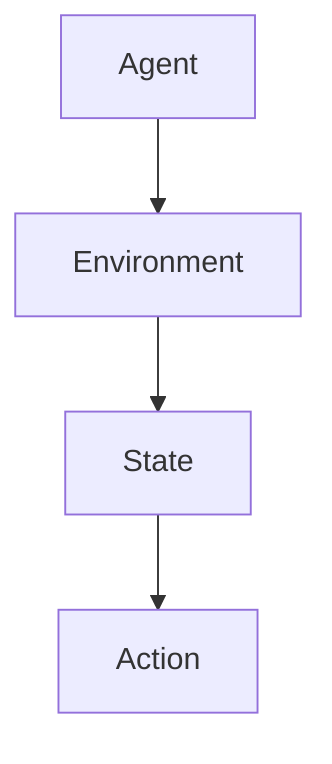
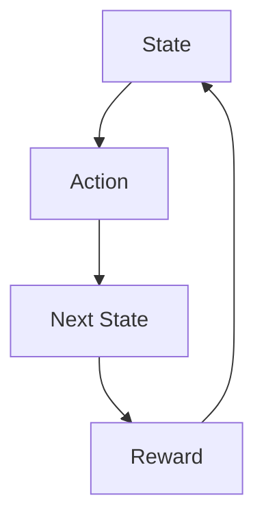
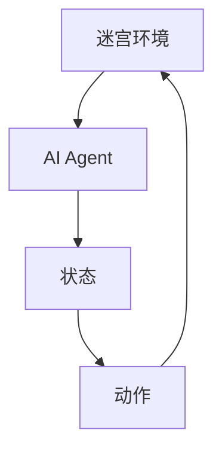

                 


# AI Agent基础概念介绍

> 关键词：AI Agent, 人工智能, 强化学习, 算法原理, 系统架构, 项目实战

> 摘要：本文将详细介绍AI Agent的基本概念、核心原理、系统架构、项目实战以及高级主题。通过逐步分析和实例讲解，帮助读者全面理解AI Agent的技术本质和应用场景。

---

# 第一部分: AI Agent基础概念概述

## 第1章: AI Agent的概述与背景

### 1.1 AI Agent的基本概念

AI Agent（人工智能代理）是指能够感知环境、自主决策并执行任务的智能实体。它具备以下核心特征：

- **自主性**：无需外部干预，自主完成任务。
- **反应性**：能够实时感知环境并做出反应。
- **目标导向**：基于目标驱动行为。
- **学习能力**：通过经验改进性能。

### 1.2 AI Agent的发展背景

AI Agent的发展得益于以下因素：

- **人工智能技术的演进**：从规则驱动到深度学习的跃迁。
- **大模型技术的推动**：如GPT-3、GPT-4等模型为AI Agent提供了强大的语言和决策能力。
- **实际应用的推动**：AI Agent在智能助手、自动驾驶、机器人等领域得到广泛应用。

### 1.3 AI Agent的应用场景

AI Agent的应用场景包括：

- **智能助手**：如Siri、Alexa等。
- **自动化决策系统**：如金融交易中的算法交易。
- **游戏AI**：如MOBA游戏中的智能NPC。
- **机器人控制**：如工业机器人和家庭服务机器人。

---

## 第2章: AI Agent的核心概念与联系

### 2.1 AI Agent的核心概念

- **状态空间**：表示系统可能的所有状态。
- **行动空间**：表示系统可能执行的所有动作。
- **环境模型**：描述环境的动态和结构。

### 2.2 AI Agent的属性特征对比

| 特征         | 描述                         |
|--------------|------------------------------|
| 自主性       | 无需外部干预                 |
| 反应性       | 能够实时感知并做出反应         |
| 目标导向     | 行为基于目标驱动               |
| 学习能力     | 通过经验改进性能               |

### 2.3 AI Agent的ER实体关系图



---

# 第二部分: AI Agent的算法原理

## 第3章: AI Agent的算法原理

### 3.1 AI Agent的核心算法

#### 3.1.1 Q-Learning算法

Q-Learning是一种经典的强化学习算法，适用于离散状态和动作空间的环境。其核心思想是通过学习Q值表来优化决策策略。

#### 3.1.2 算法流程图



#### 3.1.3 Python代码实现

```python
import numpy as np

class AI_Agent:
    def __init__(self, state_space, action_space):
        self.state_space = state_space
        self.action_space = action_space
        self.q_table = np.zeros((state_space, action_space))
    
    def take_action(self, state):
        if np.random.random() < 0.9:  # 探索与利用策略
            return np.argmax(self.q_table[state])
        else:
            return np.random.randint(self.action_space)
    
    def update_q_table(self, state, action, reward, next_state):
        q_value = self.q_table[state, action]
        next_max = np.max(self.q_table[next_state])
        self.q_table[state, action] = q_value + 0.1 * (reward + 0.9 * next_max)
```

### 3.2 算法实现

#### 3.2.1 Q-Learning算法的数学模型

Q值更新公式：

$$ Q(s, a) = Q(s, a) + \alpha \left(r + \gamma \max Q(s', a') - Q(s, a)\right) $$

其中：
- \( \alpha \) 是学习率。
- \( \gamma \) 是折扣因子。
- \( r \) 是奖励。

---

# 第三部分: AI Agent的系统架构与设计

## 第4章: AI Agent的系统分析与架构设计

### 4.1 问题场景介绍

设计一个AI Agent，用于实现迷宫导航任务。

### 4.2 系统功能设计

- **输入接口**：接收环境状态。
- **决策模块**：基于Q-Learning算法输出动作。
- **输出接口**：执行动作并返回奖励。

### 4.3 系统架构设计



### 4.4 系统接口设计

- **输入接口**：接收当前状态。
- **输出接口**：输出动作。

### 4.5 系统交互设计


---

## 第5章: AI Agent的项目实战

### 5.1 环境安装

安装Python和必要的库：

```bash
pip install numpy matplotlib
```

### 5.2 核心实现

```python
import numpy as np
import matplotlib.pyplot as plt

class MazeEnvironment:
    def __init__(self, rows, cols):
        self.rows = rows
        self.cols = cols
        self.goal = (rows-1, cols-1)
    
    def get_state(self, position):
        return position[0] * self.cols + position[1]
    
    def step(self, state, action):
        position = (state // self.cols, state % self.cols)
        if action == 0 and position[0] > 0:
            next_state = (position[0]-1) * self.cols + position[1]
            reward = 0
        elif action == 1 and position[1] < self.cols-1:
            next_state = position[0] * self.cols + (position[1]+1)
            reward = 0
        else:
            next_state = state
            reward = -1
        done = next_state == self.goal
        return next_state, reward, done

# 初始化环境和代理
env = MazeEnvironment(3, 3)
agent = AI_Agent(env.rows*env.cols, 2)

# 训练过程
for episode in range(100):
    state = env.get_state((0, 0))
    while not done:
        action = agent.take_action(state)
        next_state, reward, done = env.step(state, action)
        agent.update_q_table(state, action, reward, next_state)
        state = next_state
```

### 5.3 实际案例分析

通过训练后的Q表，代理能够找到最优路径，从起点（0,0）到达终点（2,2）。

---

## 第6章: 高级主题与扩展

### 6.1 多智能体协作

多智能体协作是未来AI Agent的重要方向，如自动驾驶中的车辆协同。

### 6.2 人机协作

AI Agent与人类协作，如医疗诊断辅助系统。

### 6.3 伦理问题

AI Agent的决策可能引发伦理问题，如自动驾驶的“电车难题”。

---

## 第7章: 总结与展望

### 7.1 总结

本文详细介绍了AI Agent的基本概念、算法原理、系统架构和项目实战。

### 7.2 展望

未来，AI Agent将在更多领域得到应用，如元宇宙、边缘计算等。

### 7.3 学习建议

建议读者深入学习强化学习、多智能体系统和伦理学相关知识。

---

作者：AI天才研究院 & 禅与计算机程序设计艺术

