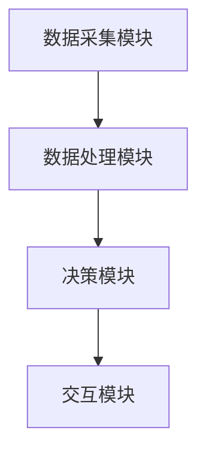

                 

# AI Agent开发中的法律与伦理考量

## 关键词：AI Agent, 法律, 伦理, 数据隐私, 责任, AI开发

## 摘要：随着AI技术的迅速发展，AI Agent的应用越来越广泛。然而，在开发和应用AI Agent的过程中，法律和伦理问题也随之而来。本文将深入探讨AI Agent开发中的法律与伦理考量，包括数据隐私、责任划分、公平性与多样性、透明性与可解释性等方面，分析这些问题对AI Agent开发的影响，并提出相应的解决方案。

---

## 第1章: AI Agent的基本概念与技术背景

### 1.1 AI Agent的定义与核心功能

#### 1.1.1 AI Agent的定义
AI Agent（人工智能代理）是指能够感知环境并采取行动以实现特定目标的智能体。与传统的AI系统不同，AI Agent具有更强的自主性和适应性，能够与环境进行交互并动态调整其行为。

#### 1.1.2 AI Agent的核心功能
1. **感知环境**：通过传感器或数据输入，AI Agent能够获取环境中的信息。
2. **目标设定**：根据任务需求，AI Agent设定目标并制定行动计划。
3. **决策与行动**：通过算法和模型，AI Agent做出决策并执行行动。
4. **学习与优化**：AI Agent能够通过反馈机制不断优化其行为。

#### 1.1.3 AI Agent与传统AI的区别
- **自主性**：AI Agent具有更强的自主性，能够独立决策。
- **动态性**：AI Agent能够根据环境变化动态调整行为。
- **交互性**：AI Agent能够与人类或其他系统进行实时交互。

### 1.2 AI Agent的技术基础

#### 1.2.1 机器学习与深度学习
机器学习是AI Agent的核心技术之一，通过训练模型，AI Agent能够从数据中学习规律并做出预测。深度学习是一种机器学习技术，通过多层神经网络实现更复杂的模式识别。

#### 1.2.2 自然语言处理
自然语言处理（NLP）是AI Agent与人类交互的重要技术，使得AI Agent能够理解和生成人类语言。

#### 1.2.3 强化学习与决策模型
强化学习是一种通过试错机制优化决策的技术，适用于动态环境下的AI Agent决策。

---

## 第2章: 法律与伦理的基本框架

### 2.1 法律框架

#### 2.1.1 数据隐私与保护
数据隐私是AI Agent开发中的核心法律问题。根据GDPR（通用数据保护条例）等法规，AI Agent必须确保用户数据的隐私和安全。

#### 2.1.2 责任与可追溯性
AI Agent的开发和应用涉及多方责任，包括开发者、用户和第三方。在发生问题时，需要明确责任归属并进行追溯。

#### 2.1.3 知识产权与AI生成内容
AI Agent生成的内容（如文本、图像）的知识产权归属是一个复杂的法律问题，需要明确开发者、用户和AI Agent之间的权利关系。

### 2.2 伦理框架

#### 2.2.1 AI Agent的伦理原则
- **公平性**：AI Agent的行为应避免偏见，确保公平对待所有用户。
- **透明性**：用户应能够理解AI Agent的决策过程。
- **可解释性**：AI Agent的决策应能够被人类解释和验证。

#### 2.2.2 透明性与可解释性
AI Agent的决策过程需要透明，用户应能够理解AI Agent的行为逻辑。

#### 2.2.3 公平性与多样性
AI Agent应避免基于种族、性别或其他特征的偏见，确保对所有用户公平。

---

## 第3章: 数据隐私与保护

### 3.1 数据隐私的法律框架

#### 3.1.1 GDPR与数据保护
GDPR要求AI Agent开发者必须明确数据使用目的，并获得用户授权。数据处理必须符合最小化原则，仅收集必要的信息。

#### 3.1.2 其他相关法律
不同国家和地区有不同的数据保护法律，AI Agent开发者需要遵守相关法规。

#### 3.1.3 数据跨境传输的法律问题
数据跨境传输需要遵守目的地国家的法律，确保数据安全和隐私保护。

### 3.2 数据收集与处理的合规性

#### 3.2.1 数据收集的合法性
AI Agent的数据收集必须基于用户授权，明确告知用户数据使用目的。

#### 3.2.2 数据处理的透明性
AI Agent应向用户明示数据处理流程，避免隐瞒数据使用方式。

#### 3.2.3 数据保护的技术措施
AI Agent开发者需要采取加密、匿名化等技术手段，确保数据安全。

---

## 第4章: 责任与可追溯性

### 4.1 责任分配的法律问题

#### 4.1.1 AI Agent开发者责任
开发者需要确保AI Agent的行为符合法律和伦理规范，提供必要的技术支持。

#### 4.1.2 用户责任
用户需要按照AI Agent的使用说明正确使用系统，避免滥用。

#### 4.1.3 第三方责任
AI Agent的开发可能涉及第三方服务，如云服务提供商，也需要承担相应的责任。

### 4.2 可追溯性与技术实现

#### 4.2.1 日志记录与追踪技术
AI Agent需要记录所有操作日志，以便在出现问题时进行追溯。

#### 4.2.2 责任分配的算法实现
通过算法设计，明确AI Agent在不同情境下的责任归属。

#### 4.2.3 可追溯性的法律要求
法律要求AI Agent开发者在设计阶段就考虑可追溯性，确保出现问题时能够快速定位责任方。

---

## 第5章: 知识产权与AI生成内容

### 5.1 知识产权的法律框架

#### 5.1.1 知识产权的基本概念
知识产权包括专利权、商标权、版权等，AI Agent生成的内容可能涉及多种知识产权问题。

#### 5.1.2 AI生成内容的版权归属
AI Agent生成的内容的版权归属尚未有明确的法律规定，通常认为归属于开发者或用户，具体需根据合同约定。

#### 5.1.3 知识产权保护的技术措施
AI Agent开发者可以通过技术手段防止内容被非法复制和使用。

---

## 第6章: 伦理框架下的AI Agent开发

### 6.1 公平性与多样性

#### 6.1.1 偏见的来源与影响
AI Agent的训练数据可能包含偏见，导致不公平的决策。

#### 6.1.2 伦理设计的实现
通过算法优化和数据清洗，消除偏见，确保公平性。

#### 6.1.3 伦理评估与改进
定期对AI Agent的行为进行伦理评估，及时发现和纠正问题。

---

## 第7章: 系统架构与开发指南

### 7.1 系统架构设计

#### 7.1.1 系统功能模块
- 数据采集模块
- 数据处理模块
- 决策模块
- 交互模块

#### 7.1.2 系统架构图

### 7.2 数据处理与隐私保护

#### 7.2.1 数据匿名化
通过对敏感数据进行匿名化处理，确保用户隐私。

#### 7.2.2 数据加密
使用加密技术保护数据安全，防止数据泄露。

### 7.3 伦理设计与实现

#### 7.3.1 伦理评估机制
在系统设计中加入伦理评估模块，确保AI Agent的行为符合伦理规范。

#### 7.3.2 可解释性设计
通过日志记录和可视化界面，帮助用户理解AI Agent的决策过程。

---

## 第8章: 未来展望与挑战

### 8.1 AI Agent技术的未来发展
AI Agent技术将在更多领域得到应用，如医疗、金融、教育等。随着技术的进步，AI Agent将更加智能化和人性化。

### 8.2 法律与伦理的长期挑战
随着AI Agent技术的不断发展，法律和伦理问题将更加复杂，需要持续关注和研究。

---

## 作者：AI天才研究院/AI Genius Institute & 禅与计算机程序设计艺术 /Zen And The Art of Computer Programming

---

### 附录：相关术语解释
- **AI Agent**：人工智能代理，能够感知环境并采取行动以实现目标的智能体。
- **GDPR**：通用数据保护条例，欧盟的数据保护法规，要求数据处理者保护用户隐私。
- **可解释性**：AI Agent的决策过程能够被人类理解和解释。
- **偏见**：AI Agent在决策中产生的不公平倾向，通常由训练数据中的偏差引起。

---

通过以上章节的详细分析，我们可以看到，AI Agent的开发不仅仅是技术问题，更涉及复杂的法律和伦理考量。只有在确保法律合规和伦理的前提下，AI Agent才能真正为人类带来福祉。

