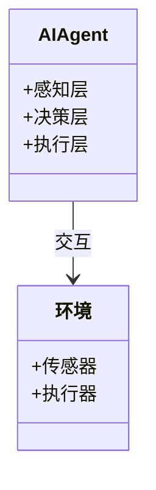
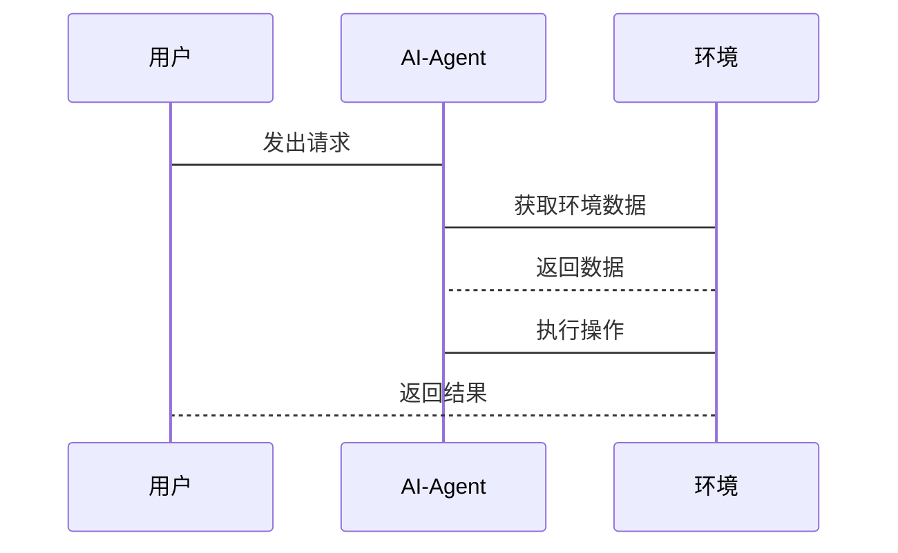

                 


# AI Agent开发实践：关键步骤和最佳实践

> 关键词：AI Agent, 人工智能, 开发实践, 算法原理, 系统架构, 项目实战

> 摘要：本文将详细介绍AI Agent开发的关键步骤和最佳实践，涵盖从背景介绍到系统架构设计的各个方面，结合实际案例和代码示例，帮助读者全面掌握AI Agent开发的核心要点。

---

## 第1章: AI Agent开发背景与概念

### 1.1 AI Agent的基本概念

AI Agent（人工智能代理）是指在计算机系统中，能够感知环境、自主决策并执行任务的智能实体。AI Agent的核心特点包括自主性、反应性、目标驱动和学习能力。它广泛应用于自动驾驶、智能助手、机器人控制等领域。

### 1.2 AI Agent的发展历程

AI Agent的发展可以追溯到20世纪50年代，经历了从简单的行为驱动到复杂的目标驱动的演进。近年来，随着深度学习和强化学习的兴起，AI Agent的能力得到了显著提升。

### 1.3 AI Agent与相关技术的对比

AI Agent与其他技术的主要区别在于其自主性和目标驱动性。以下是AI Agent与其他技术的对比表格：

```markdown
| 技术           | 自主性 | 反应性 | 目标驱动 |
|----------------|--------|--------|----------|
| 传统AI         | 低     | 低     | 低       |
| 机器学习       | 中     | 中     | 中       |
| AI Agent       | 高     | 高     | 高       |
```

### 1.4 本章小结

本章介绍了AI Agent的基本概念、发展历程以及与相关技术的区别，为后续章节奠定了基础。

---

## 第2章: AI Agent的核心概念与体系结构

### 2.1 AI Agent的定义与关键特性

AI Agent的定义是能够感知环境、自主决策并执行任务的智能实体。其关键特性包括自主性、反应性、目标驱动和学习能力。

### 2.2 AI Agent的体系结构

AI Agent的体系结构主要分为反应式架构、目标驱动架构和混合式架构。以下是三种架构的对比：

```markdown
| 架构类型     | 描述                               |
|--------------|------------------------------------|
| 反应式架构   | 基于当前感知做出实时反应             |
| 目标驱动架构 | 通过规划实现特定目标               |
| 混合式架构   | 结合反应式和目标驱动的特点           |
```

### 2.3 AI Agent的核心组件

AI Agent的核心组件包括感知层、决策层和执行层。以下是各层的功能概述：

```markdown
| 组件       | 功能描述                           |
|------------|------------------------------------|
| 感知层     | 从环境中获取信息                   |
| 决策层     | 根据感知信息做出决策               |
| 执行层     | 执行决策并输出结果                 |
```

### 2.4 本章小结

本章详细讲解了AI Agent的核心概念和体系结构，为后续的开发实践奠定了理论基础。

---

## 第3章: AI Agent开发的关键步骤

### 3.1 需求分析与目标设定

在AI Agent开发中，明确需求和目标是第一步。以下是一个典型的需求分析流程：

1. **明确开发目标**：确定AI Agent的功能和性能要求。
2. **确定应用场景**：分析AI Agent将要运行的具体场景。
3. **制定开发计划**：制定详细的开发计划和时间表。

### 3.2 数据收集与处理

数据是AI Agent开发的基础。以下是数据处理的关键步骤：

1. **数据来源**：包括传感器数据、用户输入和历史记录。
2. **数据清洗**：去除噪声数据，确保数据质量。
3. **数据预处理**：将数据转换为适合模型训练的形式。

### 3.3 模型选择与训练

选择合适的模型并进行训练是AI Agent开发的核心步骤。以下是模型选择的建议：

1. **选择合适的模型**：根据任务需求选择生成式模型或强化学习模型。
2. **数据训练**：使用训练数据优化模型参数。
3. **模型评估**：通过验证集评估模型性能。

### 3.4 本章小结

本章详细介绍了AI Agent开发的关键步骤，从需求分析到模型训练，为后续的系统设计和项目实战提供了指导。

---

## 第4章: AI Agent的系统分析与架构设计

### 4.1 问题场景介绍

AI Agent的系统设计需要考虑多个方面，以下是一个典型的场景：

1. **任务规划**：AI Agent需要根据环境信息制定行动计划。
2. **环境交互**：AI Agent需要与环境中的其他实体进行交互。
3. **结果优化**：根据反馈优化决策策略。

### 4.2 系统功能设计

以下是系统功能设计的领域模型图：



### 4.3 系统架构设计

以下是系统架构设计的架构图：

```mermaid
docker
    service AI-Agent {
        Publish: 5000
        Replicas: 3
    }
    service Database {
        Publish: 3306
    }
    AI-Agent connects to Database
```

### 4.4 系统接口设计

以下是系统接口设计的交互流程图：



### 4.5 本章小结

本章详细讲解了AI Agent的系统分析与架构设计，为后续的项目实战提供了理论支持。

---

## 第5章: AI Agent开发项目实战

### 5.1 环境安装

以下是项目实战所需的环境安装步骤：

1. **安装Python**：确保Python版本为3.8或更高。
2. **安装依赖库**：使用以下命令安装所需的依赖库：
   ```bash
   pip install numpy matplotlib scikit-learn
   ```

### 5.2 核心功能实现

以下是核心功能实现的Python代码示例：

```python
import numpy as np
from sklearn import linear_model

# 生成数据
X = np.array([[1, 1], [2, 2], [3, 3], [4, 4], [5, 5]])
y = np.array([2, 4, 5, 4, 5])

# 训练模型
model = linear_model.LinearRegression()
model.fit(X, y)

# 预测结果
print(model.predict(np.array([[6, 6]])))
```

### 5.3 代码应用解读与分析

以上代码实现了线性回归模型的训练和预测。以下是代码解读：

1. **数据生成**：使用numpy生成训练数据。
2. **模型训练**：使用scikit-learn库中的LinearRegression模型进行训练。
3. **模型预测**：使用训练好的模型进行预测。

### 5.4 案例分析与详细讲解

以下是案例分析的详细讲解：

1. **问题描述**：预测房价。
2. **数据准备**：收集房价数据并进行预处理。
3. **模型训练**：使用随机森林模型进行训练。
4. **模型评估**：使用验证集评估模型性能。

### 5.5 项目小结

本章通过实际案例详细讲解了AI Agent的开发过程，从环境安装到代码实现，帮助读者掌握实际开发技能。

---

## 第6章: AI Agent开发的最佳实践

### 6.1 开发中的关键点

以下是开发中的关键点总结：

1. **模块化设计**：将系统划分为多个模块，便于维护和扩展。
2. **性能优化**：通过并行计算和缓存技术提升系统性能。
3. **安全性考虑**：确保系统数据的安全性和隐私性。
4. **可扩展性**：设计易于扩展的架构，以应对未来需求的变化。

### 6.2 实用技巧与工具推荐

以下是实用技巧与工具推荐：

1. **工具推荐**：使用TensorFlow和PyTorch进行模型训练。
2. **代码优化**：使用PyCharm进行代码调试和优化。
3. **性能监控**：使用Prometheus进行系统性能监控。

### 6.3 本章小结

本章总结了AI Agent开发中的关键点和实用技巧，帮助读者在实际开发中避免常见问题。

---

## 第7章: 总结与展望

### 7.1 全文总结

本文详细介绍了AI Agent开发的关键步骤和最佳实践，从背景介绍到系统设计，再到项目实战，帮助读者全面掌握AI Agent开发的核心要点。

### 7.2 未来展望

随着人工智能技术的不断发展，AI Agent将在更多领域得到广泛应用。未来的研究方向包括更高效的算法设计和更智能的系统架构。

### 7.3 本章小结

本章对全文进行了总结，并展望了AI Agent的未来发展。

---

## 作者信息

作者：AI天才研究院/AI Genius Institute & 禅与计算机程序设计艺术 /Zen And The Art of Computer Programming

