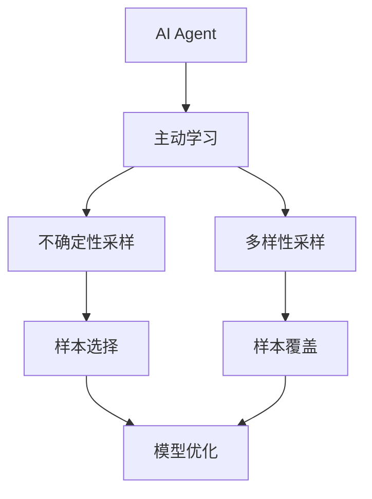
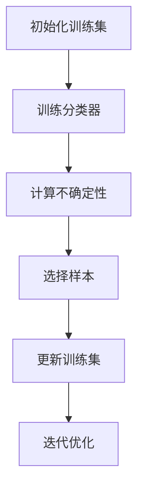
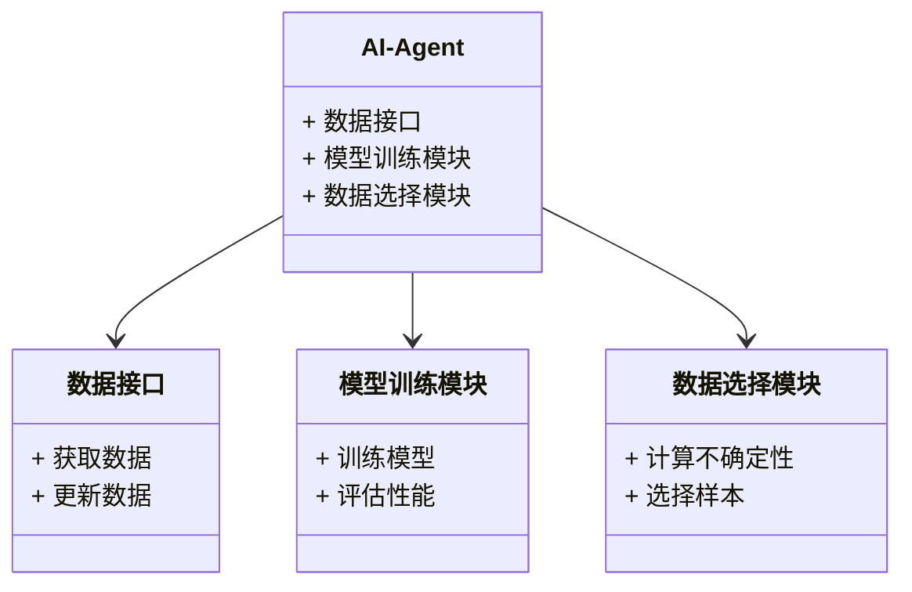
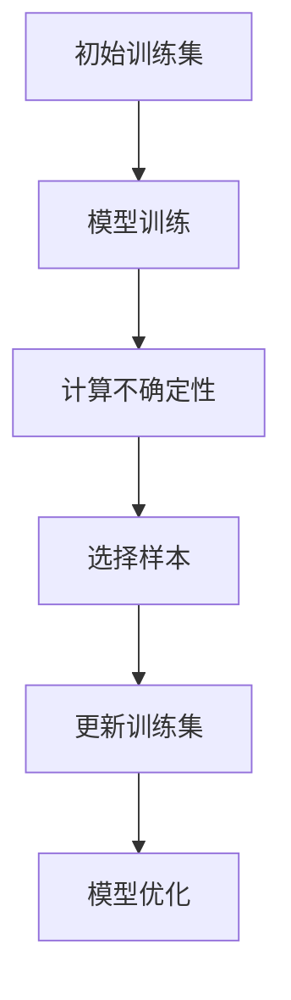

                 


# AI Agent的主动学习策略

> 关键词：主动学习，AI Agent，策略选择，优化方法，不确定性采样，多样性采样，密度采样

> 摘要：本文探讨了AI Agent在主动学习中的策略选择与优化方法。首先，我们介绍了AI Agent的基本概念及其在主动学习中的应用背景。接着，详细分析了主动学习的核心概念、策略类型及其实现原理。通过对比不同策略的特点和应用场景，我们提出了基于不确定性采样的优化方法，并结合实际案例进行了详细分析。最后，我们总结了AI Agent主动学习的关键点，并展望了未来的研究方向。

---

# 第一部分: AI Agent的主动学习策略概述

## 第1章: AI Agent与主动学习的背景介绍

### 1.1 AI Agent的基本概念
AI Agent（人工智能代理）是指能够感知环境、自主决策并采取行动以实现特定目标的智能实体。它具有以下核心特征：
- **自主性**：能够在没有外部干预的情况下独立运作。
- **反应性**：能够根据环境反馈实时调整行为。
- **目标导向**：所有行动都以实现预定目标为导向。
- **学习能力**：能够通过经验改进自身性能。

AI Agent的应用场景非常广泛，包括自动驾驶、智能客服、机器人控制、推荐系统等。

### 1.2 主动学习的基本概念
主动学习是一种机器学习方法，旨在通过选择性地收集和标注数据来优化模型性能。与监督学习不同，主动学习强调数据选择的重要性，模型可以主动查询未知数据进行学习。

主动学习的核心在于通过选择最具代表性的数据样本，减少标注数据的数量，同时提高模型的泛化能力。这在数据标注成本高昂的场景下尤为重要。

### 1.3 AI Agent主动学习的背景与意义
随着AI技术的快速发展，AI Agent需要在动态、复杂和不确定的环境中完成任务。主动学习能够帮助AI Agent在有限的数据和计算资源下，更高效地学习和适应环境。通过主动选择关键数据，AI Agent可以更快地优化其行为策略，从而提高任务成功率。

---

## 第2章: AI Agent主动学习的核心概念

### 2.1 主动学习的基本原理
主动学习的核心流程包括以下步骤：
1. **初始化**：选择初始数据集并进行标注。
2. **模型训练**：基于当前数据集训练模型。
3. **数据选择**：根据模型预测结果选择最具代表性的数据样本。
4. **数据标注与更新**：标注新选择的数据并将其加入训练集。
5. **模型优化**：重新训练模型并评估性能提升。

主动学习的关键在于如何选择数据。常用的策略包括不确定性采样、多样性采样和密度采样。

### 2.2 AI Agent主动学习的策略类型

#### 2.2.1 不确定性采样
不确定性采样基于模型对样本的预测置信度进行选择。置信度低的样本通常具有较高的信息价值，因为它们可以帮助模型更好地区分不同类别。

公式表示为：
$$ \text{置信度} = \frac{\max(p(y|x))}{\sum p(y|x)} $$
其中，$p(y|x)$ 表示在输入 $x$ 下输出 $y$ 的概率。

#### 2.2.2 多样性采样
多样性采样旨在选择具有代表性的样本，以覆盖整个数据分布。常用的方法包括：
- **最邻近搜索**：选择距离现有样本最远的新样本。
- **聚类分析**：将数据分成簇，每个簇选择一个代表样本。

#### 2.2.3 密度采样
密度采样关注数据分布的密集区域，通常用于发现异常点或高密度区域。常用的方法包括：
- **KDE（Kernel Density Estimation）**：通过概率密度函数选择高密度区域的样本。
- **LOF（Local Outlier Factor）**：基于局部密度比值选择异常样本。

### 2.3 AI Agent主动学习的数学模型

#### 2.3.1 核心公式
主动学习中的数据选择通常基于以下公式：
$$ \argmax_{x \in U} U(x) $$
其中，$U(x)$ 表示样本 $x$ 的不确定性度量，$U$ 表示未标注数据集。

#### 2.3.2 策略对比表格
以下表格对比了三种主动学习策略的特点：
| 策略类型   | 采样标准         | 适用场景           |
|------------|------------------|--------------------|
| 不确定性采样 | 置信度/熵值       | 分类任务           |
| 多样性采样   | 样本距离         | 聚类任务           |
| 密度采样     | 数据密度         | 异常检测           |

#### 2.3.3 ER实体关系图
以下是一个简单的实体关系图：


---

## 第3章: AI Agent主动学习的算法与实现

### 3.1 算法原理
主动学习算法的核心在于数据选择策略。以下是一个基于不确定性采样的主动学习算法流程：
1. 初始化：选择一个初始训练集 $T$ 并标注。
2. 训练：基于 $T$ 训练分类器 $f$。
3. 选择：计算未标注数据集 $U$ 中每个样本的不确定性度量 $U(x)$，并选择置信度最低的样本加入训练集。
4. 更新：将新选择的样本标注并加入训练集 $T$。
5. 重复步骤 2-4，直到满足停止条件（如达到预设迭代次数或性能收敛）。

### 3.2 算法实现

#### 3.2.1 Python代码实现
以下是一个基于不确定性采样的主动学习算法的Python代码示例：
```python
import numpy as np
from sklearn.svm import SVC
from sklearn.metrics import accuracy_score

def uncertainty_sampling(X, y, unlabeled_X, num_queries=1):
    # 初始化训练集
    idx = np.random.randint(len(y))
    selected_idx = idx
    selected_X = X[selected_idx]
    selected_y = y[selected_idx]
    
    # 训练模型
    model = SVC(probability=True)
    model.fit(selected_X.reshape(-1,1), selected_y)
    
    # 计算未标注样本的不确定性
    uncertainties = []
    for x in unlabeled_X:
        prob = model.predict_proba(x.reshape(-1,1))[:, 1]
        uncertainties.append(-np.log(prob))
    
    # 选择不确定性最高的样本
    selected_uncertainty_idx = np.argmax(uncertainties)
    new_X = unlabeled_X[selected_uncertainty_idx]
    
    return np.append(selected_X, new_X), np.append(selected_y, y[selected_uncertainty_idx])

# 示例用法
X_train = np.array([1,2,3,4])
y_train = np.array([0,0,1,1])
unlabeled_X = np.array([5,6,7])
new_X, new_y = uncertainty_sampling(X_train, y_train, unlabeled_X)
print(new_X, new_y)
```

#### 3.2.2 算法流程图
以下是一个基于不确定性采样的主动学习算法流程图：


---

## 第4章: 系统分析与架构设计

### 4.1 应用场景
AI Agent的主动学习策略可以应用于以下场景：
- **智能客服**：通过主动学习优化对话系统。
- **推荐系统**：主动选择用户行为数据以优化推荐算法。
- **自动驾驶**：主动学习道路环境数据以提高驾驶安全性。

### 4.2 系统功能设计
以下是一个AI Agent主动学习系统的功能模块图：


### 4.3 系统架构设计
以下是一个AI Agent主动学习系统的架构图：


### 4.4 接口设计
AI Agent主动学习系统的主要接口包括：
- **数据接口**：用于获取和更新数据。
- **模型接口**：用于训练和评估模型。
- **选择接口**：用于选择数据样本。

---

## 第5章: 项目实战与案例分析

### 5.1 环境安装
为了运行以下代码，需要安装以下Python库：
- `scikit-learn`：用于机器学习算法。
- `numpy`：用于数值计算。
- `mermaid`：用于绘制图表。

### 5.2 核心代码实现
以下是一个基于主动学习的分类器实现：
```python
import numpy as np
from sklearn.svm import SVC
from sklearn.metrics import accuracy_score

def active_learning(X_train, y_train, X_unlabeled, n_iterations=10):
    # 初始化训练集
    selected_idx = np.random.randint(len(y_train))
    selected_X = X_train[selected_idx:selected_idx+1]
    selected_y = y_train[selected_idx:selected_idx+1]
    
    for _ in range(n_iterations):
        # 训练模型
        model = SVC()
        model.fit(selected_X.reshape(-1,1), selected_y)
        
        # 计算未标注样本的不确定性
        uncertainties = []
        for x in X_unlabeled:
            prob = model.predict_proba(x.reshape(-1,1))[:, 1]
            uncertainties.append(-np.log(prob))
        
        # 选择不确定性最高的样本
        selected_uncertainty_idx = np.argmax(uncertainties)
        new_X = X_unlabeled[selected_uncertainty_idx:selected_uncertainty_idx+1]
        new_y = y_train[selected_uncertainty_idx:selected_uncertainty_idx+1]
        
        # 更新训练集
        selected_X = np.append(selected_X, new_X)
        selected_y = np.append(selected_y, new_y)
        
    return model, selected_X, selected_y

# 示例用法
X_train = np.array([1,2,3,4])
y_train = np.array([0,0,1,1])
X_unlabeled = np.array([5,6,7,8])
model, selected_X, selected_y = active_learning(X_train, y_train, X_unlabeled)
print("模型性能:", accuracy_score(model.predict(selected_X.reshape(-1,1)), selected_y))
```

### 5.3 案例分析
以下是一个基于主动学习的分类任务案例：


---

## 第6章: 总结与展望

### 6.1 本章小结
本文详细探讨了AI Agent的主动学习策略，从核心概念到算法实现，再到系统设计，全面分析了主动学习在AI Agent中的应用。通过对比不同策略的特点，提出了基于不确定性采样的优化方法，并通过实际案例验证了其有效性。

### 6.2 最佳实践 tips
- **选择合适的策略**：根据具体任务选择合适的主动学习策略。
- **结合领域知识**：将主动学习与领域知识相结合，提高学习效率。
- **监控与调整**：定期监控模型性能，及时调整学习策略。

### 6.3 注意事项
- **数据质量**：确保数据质量和多样性，避免过拟合。
- **计算资源**：主动学习需要额外的计算资源，需合理规划。
- **模型评估**：定期评估模型性能，确保主动学习的有效性。

### 6.4 拓展阅读
- 建议阅读《主动学习: 理论与应用》（《Active Learning: Theory and Application》）了解更多主动学习的理论与方法。
- 关注最新的AI Agent相关研究，了解最新的主动学习策略。

---

# 作者：AI天才研究院/AI Genius Institute & 禅与计算机程序设计艺术 /Zen And The Art of Computer Programming

