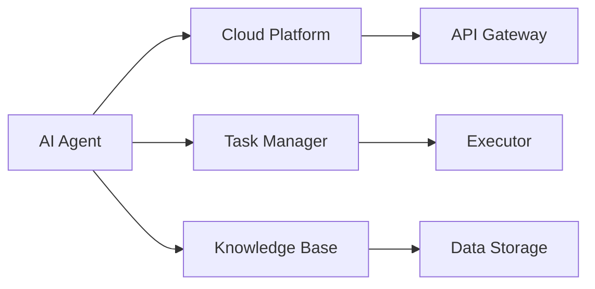
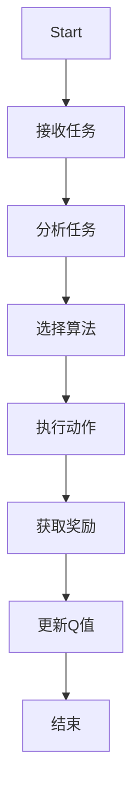
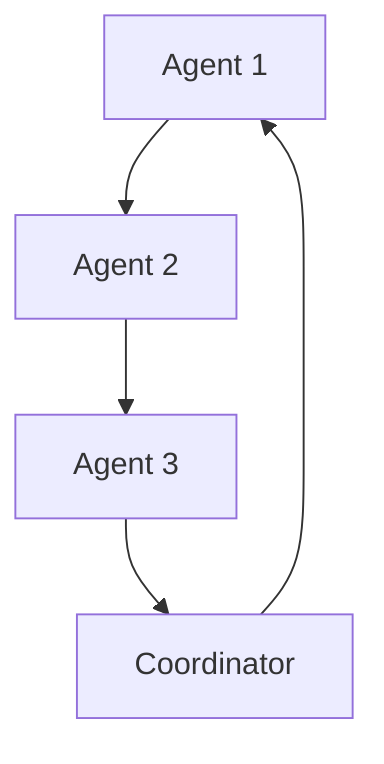
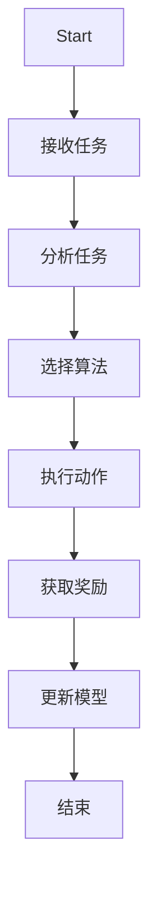
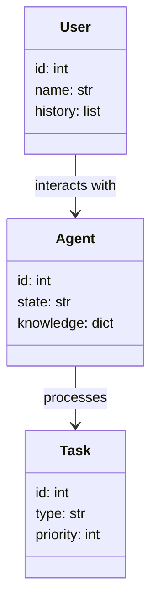
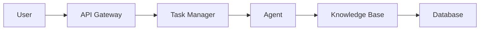
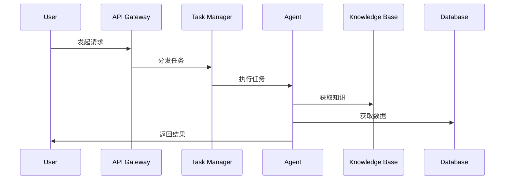

                 


# AI Agent的云端部署与管理

## 关键词：AI Agent, 云端部署, 人工智能, 系统架构, 算法原理, 项目实战

## 摘要：  
随着人工智能技术的快速发展，AI Agent（人工智能代理）在云端部署与管理的应用越来越广泛。本文将从AI Agent的基本概念、核心算法、系统架构、项目实战等多个方面，深入分析AI Agent在云端部署与管理的关键技术与实践。通过理论与实践相结合的方式，帮助读者全面理解AI Agent的云端部署与管理的核心要点。

---

# 第1章: AI Agent的概述与背景

## 1.1 AI Agent的基本概念

### 1.1.1 什么是AI Agent
AI Agent（人工智能代理）是一种能够感知环境、自主决策并执行任务的智能实体。它可以是一个软件程序、一个机器人，或者一个分布式系统中的组件。AI Agent的核心目标是通过与环境交互，实现特定的目标或解决复杂问题。

### 1.1.2 AI Agent的类型
AI Agent可以按照功能、智能水平或应用场景进行分类：

1. **简单反射型Agent**：基于当前感知做出简单反应，适用于规则明确的任务。
2. **基于模型的反射型Agent**：维护环境状态模型，能够根据模型做出决策。
3. **目标驱动型Agent**：基于明确的目标进行推理和行动。
4. **效用驱动型Agent**：通过最大化效用函数来优化决策。
5. **学习型Agent**：通过机器学习算法不断优化自身的行为策略。

### 1.1.3 AI Agent的核心特征
- **自主性**：能够在没有外部干预的情况下自主运行。
- **反应性**：能够感知环境并实时做出反应。
- **目标导向性**：基于目标驱动行为。
- **学习能力**：通过数据和经验优化自身性能。

---

## 1.2 AI Agent的背景与应用场景

### 1.2.1 云端部署的背景
随着云计算技术的成熟，AI Agent的部署不再局限于本地设备，而是更多地在云端进行。云端部署的优势包括：
- **弹性扩展**：根据负载需求自动调整资源。
- **高可用性**：通过分布式部署保证系统可靠性。
- **成本优化**：按需付费，降低硬件投入成本。

### 1.2.2 AI Agent在企业中的应用场景
1. **智能客服**：通过自然语言处理技术为用户提供个性化服务。
2. **推荐系统**：基于用户行为推荐个性化内容。
3. **自动化运维**：通过AI Agent实现系统的自动监控和故障修复。
4. **智慧城市**：在交通管理、环境监测等领域发挥重要作用。

### 1.2.3 云端部署的优势与挑战
**优势**：
- **资源弹性**：可以根据需求动态调整计算资源。
- **高可用性**：通过负载均衡和容灾备份保证系统稳定。
- **快速部署**：无需本地环境搭建，直接使用云服务。

**挑战**：
- **网络延迟**：云端部署可能导致延迟问题，影响实时性。
- **安全性**：数据传输和存储的安全性需要严格保障。
- **成本控制**：如何在性能和成本之间找到平衡点。

---

## 1.3 本章小结

本章介绍了AI Agent的基本概念、类型及其核心特征，探讨了AI Agent在云端部署的背景和应用场景，并分析了云端部署的优势与挑战。通过这些内容，读者可以初步理解AI Agent的云端部署的必要性和复杂性。

---

# 第2章: AI Agent的核心概念与原理

## 2.1 AI Agent的架构分析

### 2.1.1 AI Agent的组成模块
AI Agent的典型架构包括以下几个模块：
1. **感知模块**：负责感知环境信息，如传感器数据、用户输入等。
2. **推理模块**：基于感知信息进行逻辑推理，生成决策。
3. **行动模块**：根据推理结果执行具体操作，如发送请求、操作设备等。
4. **知识库**：存储AI Agent所需的知识和经验，用于推理和决策。

### 2.1.2 AI Agent的通信机制
AI Agent在云端部署时，通常需要与其他系统或服务进行通信。常见的通信机制包括：
- **REST API**：通过HTTP协议进行数据交互。
- **WebSocket**：实时通信协议，适用于需要实时反馈的场景。
- **消息队列**：通过消息队列（如Kafka、RabbitMQ）实现异步通信。

### 2.1.3 AI Agent的任务管理
AI Agent需要能够高效地管理任务，包括任务的分配、优先级排序和执行监控。常见的任务管理策略包括：
- **轮询调度**：按顺序执行任务。
- **优先级调度**：根据任务的重要性和紧急性进行动态调度。
- **负载均衡**：根据资源使用情况动态分配任务。

---

## 2.2 AI Agent的数学模型与公式

### 2.2.1 AI Agent的状态表示
AI Agent的状态通常可以用向量表示，其中每个元素对应一个状态特征。例如：
$$
S = (s_1, s_2, \ldots, s_n)
$$
其中，$s_i$ 表示第$i$个状态特征。

### 2.2.2 AI Agent的动作选择
在强化学习中，AI Agent的动作选择通常基于当前状态和策略函数。策略函数可以表示为：
$$
\pi(a|s) = P(\text{选择动作 } a \text{ 的概率} | s)
$$

### 2.2.3 AI Agent的奖励机制
奖励机制是强化学习中的关键部分，用于指导AI Agent的学习方向。奖励函数通常表示为：
$$
R(s, a) = \text{奖励值，根据当前状态 } s \text{ 和动作 } a \text{ 进行计算}
$$

---

## 2.3 AI Agent的实体关系图



---

## 2.4 本章小结

本章详细分析了AI Agent的架构、通信机制和任务管理策略，并通过数学公式和实体关系图展示了AI Agent的核心概念与原理。这些内容为后续章节的实现与部署奠定了理论基础。

---

# 第3章: AI Agent的算法原理与实现

## 3.1 AI Agent的核心算法

### 3.1.1 强化学习算法
强化学习是一种通过试错方法来优化决策的算法。典型的强化学习算法包括Q-Learning和Deep Q-Network（DQN）。

#### Q-Learning算法流程图


#### Q-Learning代码实现
```python
import numpy as np

class QLearning:
    def __init__(self, state_space, action_space, alpha=0.1, gamma=0.9):
        self.state_space = state_space
        self.action_space = action_space
        self.alpha = alpha
        self.gamma = gamma
        self.q_table = np.zeros((state_space, action_space))

    def choose_action(self, state, epsilon=0.1):
        if np.random.random() < epsilon:
            return np.random.randint(self.action_space)
        else:
            return np.argmax(self.q_table[state])

    def update_q_table(self, state, action, reward, next_state):
        self.q_table[state][action] = self.q_table[state][action] * (1 - self.alpha) + self.alpha * (reward + self.gamma * np.max(self.q_table[next_state]))
```

### 3.1.2 多智能体协作算法
多智能体协作算法通过多个AI Agent的协同工作来实现复杂的任务。典型的算法包括基于C.bpm的方法和基于分布式计算的方法。

#### 多智能体协作流程图


### 3.1.3 推荐系统算法
推荐系统是AI Agent的重要应用场景之一。常用的推荐算法包括协同过滤、基于内容的推荐和深度学习推荐。

#### 协同过滤算法代码实现
```python
import numpy as np
from sklearn.metrics import pairwise_distances

class CollaborativeFiltering:
    def __init__(self, user_count, item_count):
        self.user_count = user_count
        self.item_count = item_count
        self.ratings = np.zeros((user_count, item_count))

    def add_rating(self, user, item, rating):
        self.ratings[user][item] = rating

    def compute_similarity(self):
        return pairwise_distances(self.ratings.T, metric='cosine')

    def get_recommendations(self, user, k=3):
        similarity = self.compute_similarity()
        user_ratings = self.ratings[user]
        weighted_sum = np.zeros(self.item_count)
        for i in range(self.item_count):
            if user_ratings[i] == 0:
                weighted_sum[i] = np.sum(similarity[i] * user_ratings)
        return np.argsort(weighted_sum)[-k:]
```

---

## 3.2 AI Agent的算法流程图



---

## 3.3 本章小结

本章详细介绍了AI Agent的核心算法，包括强化学习、多智能体协作和推荐系统，并通过代码示例和流程图展示了这些算法的实现细节。这些算法是AI Agent实现复杂任务的核心技术。

---

# 第4章: AI Agent的系统分析与架构设计

## 4.1 系统分析与设计

### 4.1.1 问题场景介绍
假设我们正在设计一个AI Agent系统，用于实现智能客服功能。系统需要支持多种渠道（如网页、移动端）的用户请求，并能够根据用户的历史行为提供个性化的服务。

### 4.1.2 系统功能设计

#### 领域模型


### 4.1.3 系统架构设计

#### 系统架构图


#### 系统交互序列图


---

## 4.2 本章小结

本章通过具体的问题场景，设计了一个AI Agent系统的功能模块和架构，并通过图表展示了系统的各个部分之间的关系。这些设计为后续的实现和部署提供了清晰的指导。

---

# 第5章: AI Agent的项目实战

## 5.1 电商推荐系统的实现

### 5.1.1 环境搭建
```bash
pip install numpy pandas scikit-learn
```

### 5.1.2 核心实现

#### 推荐系统代码
```python
from sklearn.feature_extraction.text import TfidfVectorizer
from sklearn.metrics.pairwise import cosine_similarity

class RecommenderSystem:
    def __init__(self, products):
        self.products = products
        self.vectorizer = TfidfVectorizer()

    def train(self):
        self.vectors = self.vectorizer.fit_transform([p['description'] for p in self.products])

    def recommend(self, user_query, top_k=5):
        query_vector = self.vectorizer.transform([user_query])
        similarities = cosine_similarity(query_vector, self.vectors).flatten()
        indices = np.argsort(similarities)[::-1][:top_k]
        return [self.products[i] for i in indices]
```

### 5.1.3 代码应用解读
- **数据预处理**：将商品描述向量化。
- **模型训练**：使用TF-IDF算法生成向量表示。
- **推荐生成**：基于余弦相似度计算推荐结果。

### 5.1.4 实际案例分析
假设我们有以下商品数据：
```python
products = [
    {'id': 1, 'description': '人工智能书籍'},
    {'id': 2, 'description': '机器学习入门'},
    {'id': 3, 'description': '深度学习实战'},
    {'id': 4, 'description': '自然语言处理技巧'},
    {'id': 5, 'description': 'Python编程基础'}
]
```

用户输入查询：“推荐一些关于机器学习的书籍。”
系统返回：
```
推荐商品：
- 机器学习入门（id:2）
- 深度学习实战（id:3）
- 人工智能书籍（id:1）
```

### 5.1.5 本节小结

本节通过一个电商推荐系统的案例，详细讲解了AI Agent在实际项目中的实现过程，包括环境搭建、数据处理、模型训练和结果输出。

---

# 第6章: AI Agent的最佳实践与注意事项

## 6.1 性能优化
1. **资源分配**：根据任务需求动态分配计算资源。
2. **缓存机制**：通过缓存技术减少重复计算。
3. **并行计算**：利用多线程或分布式计算提升性能。

## 6.2 安全性
1. **数据加密**：确保数据在传输和存储过程中的安全性。
2. **权限管理**：严格控制系统的访问权限。
3. **日志监控**：实时监控系统日志，发现异常及时处理。

## 6.3 维护与扩展
1. **定期更新**：根据新数据和新需求不断优化模型。
2. **模块化设计**：确保系统模块化，便于维护和扩展。
3. **容错设计**：通过冗余和备份设计提高系统的容错能力。

---

## 6.4 小结

本章总结了AI Agent在云端部署与管理中的最佳实践和注意事项，包括性能优化、安全性、维护与扩展等方面。这些内容能够帮助读者在实际项目中避免常见问题，提高系统的稳定性和性能。

---

# 第7章: 总结与展望

## 7.1 本章总结
本文从AI Agent的基本概念到实际应用，详细探讨了AI Agent的云端部署与管理的关键技术。通过理论分析、算法实现和项目实战，读者可以全面掌握AI Agent的核心要点。

## 7.2 未来展望
随着人工智能技术的不断发展，AI Agent的云端部署与管理将面临更多的挑战和机遇。未来的研究方向可能包括：
- **边缘计算**：将AI Agent部署在边缘设备上，实现更高效的计算。
- **5G技术**：通过5G的高速网络，实现更高效的云端协同。
- **多模态交互**：支持更丰富的交互方式，如语音、视觉等。

---

## 作者

作者：AI天才研究院/AI Genius Institute & 禅与计算机程序设计艺术 /Zen And The Art of Computer Programming

---

希望这篇文章能够为读者提供关于AI Agent的云端部署与管理的全面理解，并为实际项目提供有价值的参考。

