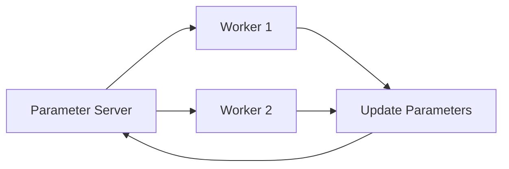
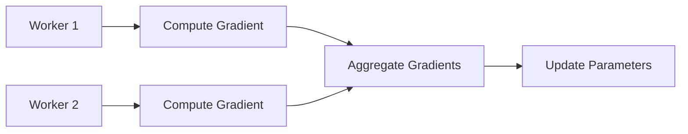
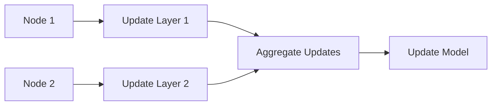
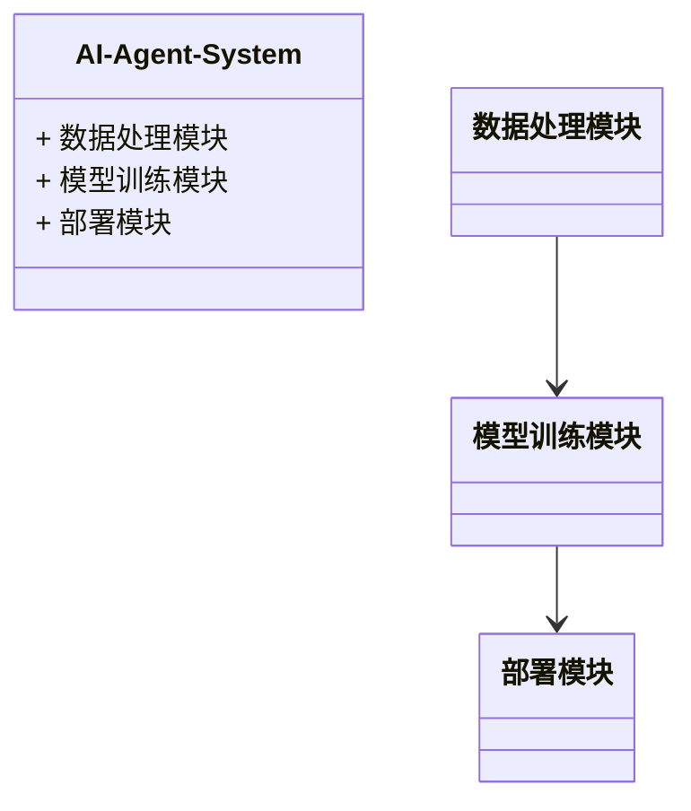
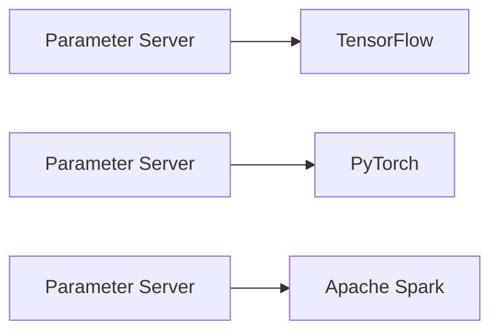
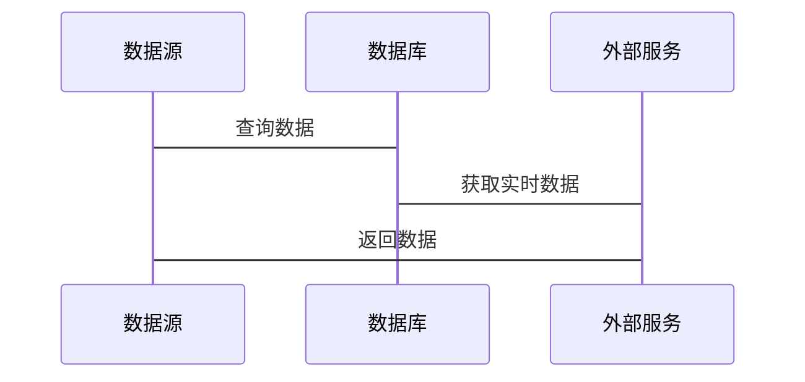
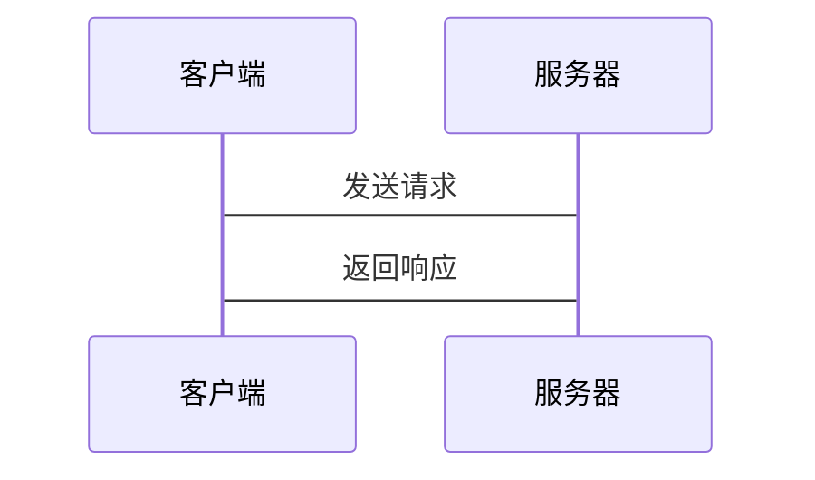

                 


# AI Agent的分布式训练与部署策略

---

## 关键词：AI Agent, 分布式训练, 部署策略, 分布式计算, 机器学习

---

## 摘要：  
本文详细探讨了AI Agent的分布式训练与部署策略，从背景、原理到实际应用，系统性地分析了AI Agent在分布式环境下的训练方法和部署技巧。通过理论与实践结合，本文旨在为读者提供一套完整的技术解决方案，帮助他们在实际项目中高效地应用AI Agent。

---

# 第1章 AI Agent的背景与概念

## 1.1 AI Agent的基本概念

### 1.1.1 什么是AI Agent  
AI Agent（人工智能代理）是指能够感知环境、自主决策并执行任务的智能实体。它可以是一个软件程序、一个机器人，甚至是一个复杂的系统，其核心目标是通过智能化的方法解决问题。

### 1.1.2 AI Agent的核心特征  
1. **自主性**：无需外部干预，自主完成任务。  
2. **反应性**：能够感知环境并实时调整行为。  
3. **学习能力**：通过数据和经验不断优化性能。  
4. **协作性**：能够与其他Agent或系统协同工作。  

### 1.1.3 AI Agent的分类与应用场景  
AI Agent可以分为**简单反射型**、**基于模型的反射型**、**目标驱动型**和**效用驱动型**。其应用场景包括自动驾驶、智能推荐、机器人控制、自然语言处理等。

---

## 1.2 分布式训练的背景与意义

### 1.2.1 分布式训练的定义  
分布式训练是指将训练任务分解到多个计算节点上并行执行，通过数据并行或模型并行的方式，加速模型训练过程。  

### 1.2.2 分布式训练的必要性  
随着AI模型规模的增大，单机训练效率逐渐下降，分布式训练成为提升计算效率和模型性能的必然选择。  

### 1.2.3 分布式训练的优势与挑战  
- **优势**：  
  - 提高计算效率，缩短训练时间。  
  - 支持更大规模的数据和模型。  
  - 降低单点故障风险，提高系统可靠性。  
- **挑战**：  
  - 网络通信开销大。  
  - 同步与异步策略的选择复杂。  
  - 不同硬件和环境的兼容性问题。  

---

## 1.3 部署策略的重要性

### 1.3.1 部署策略的定义  
部署策略是指在实际环境中部署AI Agent时所采用的方法和策略，包括硬件选择、网络架构设计、资源分配等。  

### 1.3.2 部署策略的核心目标  
- 确保AI Agent在实际环境中的稳定性和高效性。  
- 支持AI Agent的可扩展性和可维护性。  

### 1.3.3 部署策略的常见挑战  
- **资源分配**：如何在不同节点之间合理分配计算资源。  
- **网络延迟**：分布式部署中的网络通信延迟问题。  
- **系统容错**：如何应对节点故障或网络中断。  

---

## 1.4 本章小结  
本章介绍了AI Agent的基本概念、分布式训练的背景及其重要性。通过分析分布式训练的优势与挑战，为后续章节的深入探讨奠定了基础。

---

# 第2章 AI Agent的分布式训练原理

## 2.1 分布式训练的核心概念

### 2.1.1 分布式训练的数学模型  
分布式训练的核心是将模型参数分散到多个计算节点上，并通过同步或异步的方式更新参数。数学模型如下：  

$$ \theta_{i}^{(t+1)} = \theta_{i}^{(t)} + \eta \cdot g_{i}^{(t)} $$  

其中，$\theta_{i}$ 表示第i个节点的参数，$\eta$ 是学习率，$g_{i}$ 是梯度。  

### 2.1.2 分布式训练的通信机制  
通信机制是分布式训练的核心，包括参数同步、梯度聚合等过程。  

### 2.1.3 分布式训练的同步与异步策略  
- **同步策略**：所有节点在更新参数前必须完成当前梯度的计算和同步。  
- **异步策略**：节点可以独立地更新参数，无需等待其他节点完成。

---

## 2.2 分布式训练的主要算法

### 2.2.1 参数服务器模式  
参数服务器模式是一种经典的分布式训练方法，由多个 worker 节点负责计算梯度，参数服务器负责聚合梯度并更新参数。  

**参数服务器模式的流程图：**



### 2.2.2 数据并行模式  
数据并行模式将数据集分割到不同的 worker 节点上，每个节点计算梯度，最后将梯度汇总。  

**数据并行模式的流程图：**



### 2.2.3 模型并行模式  
模型并行模式将模型的不同部分分配到不同的节点上，每个节点负责部分参数的更新。  

**模型并行模式的流程图：**



---

## 2.3 分布式训练的优化技巧

### 2.3.1 梯度压缩技术  
通过压缩梯度数据减少通信开销。  

### 2.3.2 异常处理与容错机制  
通过冗余计算和 checkpoint 技术应对节点故障。  

### 2.3.3 网络带宽优化  
使用压缩算法或减少通信频率来降低网络开销。  

---

## 2.4 本章小结  
本章详细介绍了分布式训练的核心概念、主要算法及其优化技巧，为后续章节的系统设计和项目实战奠定了理论基础。

---

# 第3章 AI Agent的系统架构设计

## 3.1 系统功能设计

### 3.1.1 功能模块  
AI Agent系统主要包括数据处理模块、模型训练模块和部署模块。  

**功能模块的类图：**



### 3.1.2 领域模型设计  
领域模型是AI Agent系统的核心，用于描述问题域中的实体及其关系。  

**领域模型的ER图：**

```mermaid
erd
    customer(CustomerID, Name, Age, Gender)
    order(OrderID, CustomerID, OrderTime, Amount)
    product(ProductID, ProductName, Price)
    customer o-|r> order
    product o-|r> order
```

---

## 3.2 系统架构设计

### 3.2.1 参数服务器模式的架构  
参数服务器模式是分布式训练的典型架构，由参数服务器和多个 worker 节点组成。  

**参数服务器模式的架构图：**


### 3.2.2 分布式计算框架  
常用的分布式计算框架包括 TensorFlow、PyTorch 和 Apache Spark 等。  

**分布式计算框架的架构图：**



---

## 3.3 系统接口设计

### 3.3.1 系统接口  
AI Agent系统需要与数据源、数据库和外部服务进行交互。  

**系统接口的序列图：**



### 3.3.2 API 接口  
AI Agent系统通常提供RESTful API接口，供其他系统调用。  

**API接口的序列图：**



---

## 3.4 系统交互流程

### 3.4.1 训练流程  
1. 数据预处理：清洗和标注数据。  
2. 分布式训练：将数据分片到多个节点并行训练。  
3. 模型评估：评估模型的性能并进行调优。  

### 3.4.2 部署流程  
1. 模型保存：将训练好的模型保存为可部署的格式。  
2. 服务部署：将模型部署到目标环境中。  
3. 监控与维护：实时监控模型运行状态并进行维护。  

---

## 3.5 本章小结  
本章详细设计了AI Agent系统的功能模块、架构设计和交互流程，为后续章节的项目实战提供了系统性指导。

---

# 第4章 项目实战：AI Agent的分布式训练与部署

## 4.1 环境配置

### 4.1.1 软件环境  
- Python 3.8+  
- TensorFlow 2.5+  
- CUDA 11.0+  
- GPU驱动支持  

### 4.1.2 硬件环境  
- CPU：多核处理器  
- GPU：NVIDIA GPU卡  
- 网络：高速网络连接  

---

## 4.2 代码实现

### 4.2.1 分布式训练代码  
以下是一个使用TensorFlow的分布式训练示例：

```python
import tensorflow as tf
from tensorflow.keras import layers

# 初始化分布式策略
tf.distribute.Strategy()  

# 定义模型
model = tf.keras.Sequential([
    layers.Dense(64, activation='relu'),
    layers.Dense(10, activation='softmax')
])

# 编译模型
model.compile(optimizer='adam', loss='sparse_categorical_crossentropy', metrics=['accuracy'])

# 启动分布式训练
model.fit(x_train, y_train, epochs=10, batch_size=32)
```

### 4.2.2 部署代码  
以下是一个简单的部署示例：

```python
import flask
from flask import request, jsonify

app = flask.Flask(__name__)

@app.route('/predict', methods=['POST'])
def predict():
    data = request.get_json()
    prediction = model.predict(data['input'])
    return jsonify({'result': prediction.tolist()})

if __name__ == '__main__':
    app.run(port=5000)
```

---

## 4.3 案例分析

### 4.3.1 自然语言处理任务  
在自然语言处理任务中，我们可以使用BERT模型进行分布式训练，并部署到生产环境中提供实时推理服务。

### 4.3.2 图像识别任务  
在图像识别任务中，可以使用分布式训练加速ResNet模型的训练，并部署到边缘设备上进行实时识别。

---

## 4.4 本章小结  
本章通过实际案例展示了AI Agent的分布式训练与部署过程，帮助读者理解理论知识的实际应用。

---

# 第5章 最佳实践与总结

## 5.1 最佳实践

### 5.1.1 硬件选择  
根据任务需求选择合适的硬件，如GPU加速和网络带宽优化。  

### 5.1.2 网络优化  
使用低延迟、高带宽的网络，减少通信开销。  

### 5.1.3 代码优化  
优化代码结构，减少同步开销和资源竞争。  

---

## 5.2 总结与展望

### 5.2.1 总结  
本文系统性地介绍了AI Agent的分布式训练与部署策略，从理论到实践，详细讲解了分布式训练的算法原理、系统架构设计和项目实战。  

### 5.2.2 展望  
随着AI技术的不断发展，AI Agent的分布式训练与部署将更加智能化和高效化。未来的研究方向包括更高效的分布式算法、更智能的部署策略以及更强大的计算框架。

---

## 参考文献

1. 周志华. 机器学习. 清华大学出版社, 2016.  
2. TensorFlow官方文档. https://tensorflow.org  
3. PyTorch官方文档. https://pytorch.org  
4. Apache Spark官方文档. https://spark.apache.org  

---

## 作者：AI天才研究院 & 禅与计算机程序设计艺术

---

以上是《AI Agent的分布式训练与部署策略》的技术博客文章的完整目录大纲和内容。希望对您有所帮助！

