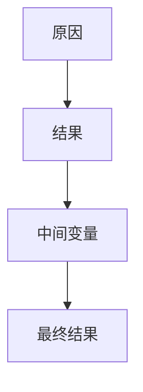
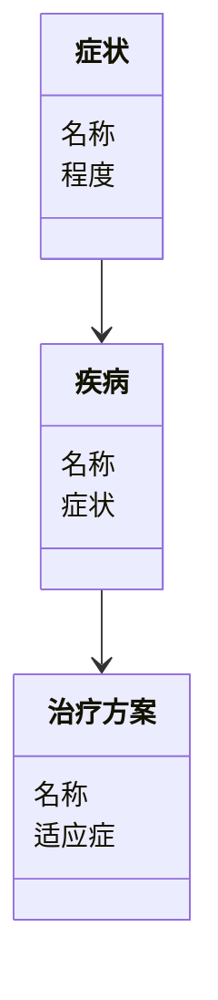
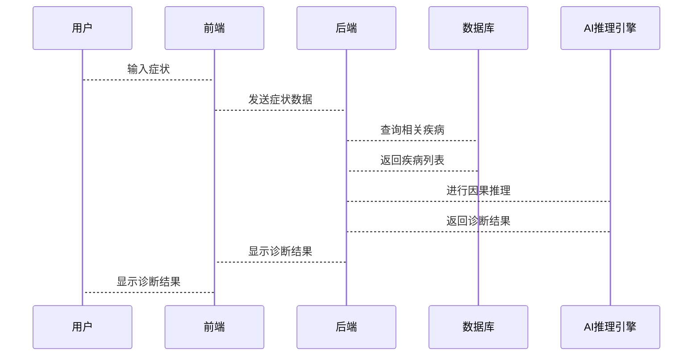

                 


# AI Agent的因果推理能力构建

> **关键词**：AI Agent、因果推理、因果图、知识图谱、机器学习、因果推断  
> **摘要**：本文系统地探讨了AI Agent因果推理能力的构建方法，从理论基础到算法实现，再到系统设计和项目实战，全面解析了如何赋予AI Agent具备因果推理的能力，以应对复杂的现实问题。

---

# 第一部分: AI Agent的因果推理能力背景介绍

## 第1章: AI Agent与因果推理概述

### 1.1 AI Agent的基本概念

#### 1.1.1 AI Agent的定义与分类
AI Agent（人工智能代理）是指在计算机系统中，能够感知环境并采取行动以实现目标的实体。AI Agent可以分为**简单反射型Agent**、**基于模型的反射型Agent**、**目标驱动型Agent**和**效用驱动型Agent**。

#### 1.1.2 因果推理的基本概念
因果推理是指从观察到的现象中推断出因果关系的过程。例如，给定数据“吃药后感冒好转”，因果推理可以推断出“吃药导致感冒好转”。

#### 1.1.3 AI Agent与因果推理的关系
AI Agent需要具备因果推理能力，以便在动态环境中理解因果关系，做出合理决策。

### 1.2 因果推理的必要性

#### 1.2.1 从相关性到因果性的转变
相关性分析只能说明变量之间的关联，而因果推理可以揭示变量之间的因果关系。例如，相关性分析可以发现“下雨与地湿”相关，而因果推理可以明确“下雨导致地湿”。

#### 1.2.2 因果推理在AI Agent中的作用
AI Agent需要通过因果推理来理解因果关系，从而在复杂环境中做出合理的决策。

#### 1.2.3 当前技术的挑战与机遇
当前技术在因果推理方面仍存在诸多挑战，例如如何从数据中发现因果关系、如何处理复杂的因果网络等。

### 1.3 本章小结
本章介绍了AI Agent的基本概念、因果推理的必要性以及当前技术的挑战与机遇。

---

# 第二部分: AI Agent因果推理的核心概念与联系

## 第2章: 因果推理的原理与方法

### 2.1 因果推理的原理

#### 2.1.1 因果关系的定义与特征
因果关系是指一个事件（原因）导致另一个事件（结果）的发生。因果关系具有**可传递性**、**反事实性**和**干预可性**等特征。

#### 2.1.2 因果图的构建与分析
因果图（Directed Acyclic Graph, DAG）是一种有向无环图，用于表示变量之间的因果关系。

#### 2.1.3 马尔可夫网与因果推理的关系
马尔可夫网（Markov Network）是一种用于表示变量之间依赖关系的概率图模型，与因果推理密切相关。

### 2.2 因果推理的关键方法

#### 2.2.1 非参数因果推断
非参数因果推断方法不依赖于具体的概率分布假设，例如**逆概率加权方法（IPW）**。

#### 2.2.2 参数化因果模型
参数化因果模型基于特定的概率分布假设，例如**结构方程模型（SEM）**。

#### 2.2.3 基于知识图谱的因果推理
基于知识图谱的因果推理结合了知识图谱的语义信息和因果推理的逻辑推理能力。

### 2.3 核心概念对比与联系

#### 2.3.1 相关性与因果性的对比分析
| 对比维度 | 相关性 | 因果性 |
|----------|--------|--------|
| 概念     | 变量之间的统计关联 | 变量之间的因果关系 |
| 解释力   | 低     | 高     |
| 应用场景 | 描述变量之间的关联 | 解释变量之间的因果关系 |

#### 2.3.2 因果图与知识图谱的异同
- **异同**：因果图侧重于因果关系的建模，而知识图谱侧重于知识的表示和推理。
- **联系**：因果图可以作为知识图谱的一部分，用于表示复杂的因果关系网络。

#### 2.3.3 Mermaid流程图：因果关系网络


### 2.4 本章小结
本章详细讲解了因果推理的原理、方法及其与其他概念的联系。

---

# 第三部分: AI Agent因果推理的算法原理

## 第3章: 因果发现算法

### 3.1 因果发现的基本原理

#### 3.1.1 基于统计的因果发现方法
基于统计的因果发现方法通过分析数据的分布特性来发现因果关系，例如**Granger因果检验**。

#### 3.1.2 基于机器学习的因果发现
基于机器学习的因果发现方法利用深度学习模型来发现因果关系，例如**因果卷积神经网络（CNN）**。

#### 3.1.3 因果发现的数学模型
因果发现的数学模型可以表示为：
$$ P(Y|X) = P(Y|do(X)) $$
其中，$do(X)$表示对变量$X$进行干预。

### 3.2 因果推断的具体实现

#### 3.2.1 因果推断的步骤与流程
因果推断的步骤包括：
1. 数据预处理
2. 建立因果图模型
3. 参数估计
4. 因果效应计算

#### 3.2.2 基于潜在结果的因果推断
基于潜在结果的因果推断方法通过分析潜在结果来估计因果效应，例如**倾向评分匹配（Propensity Score Matching）**。

#### 3.2.3 基于图模型的因果推断
基于图模型的因果推断方法利用图模型来表示因果关系，并通过图遍历算法来计算因果效应。

### 3.3 算法实现与代码示例

#### 3.3.1 使用Python实现因果发现算法
以下是一个使用Python实现的因果发现算法示例：
```python
import numpy as np
from causalnex.structure.causal_model import CausalModel

# 生成数据
np.random.seed(42)
n = 1000
X = np.random.normal(0, 1, n)
Y = X + np.random.normal(0, 1, n)

# 建立因果模型
model = CausalModel()
model.add_variable('X')
model.add_variable('Y')
model.add_edge('X', 'Y')

# 可视化因果图
model.plot_causal_model()
```

#### 3.3.2 因果推断的数学模型
因果推断的数学模型可以表示为：
$$ P(Y|do(X)) = \frac{P(Y, X)}{P(X)} $$
其中，$P(Y, X)$是$Y$和$X$的联合概率分布，$P(X)$是$X$的边缘概率分布。

### 3.4 本章小结
本章详细讲解了因果发现算法和因果推断的具体实现方法。

---

# 第四部分: AI Agent因果推理的系统分析与架构设计

## 第4章: 系统分析与架构设计方案

### 4.1 问题场景介绍
假设我们正在开发一个医疗诊断AI Agent，需要通过因果推理来诊断疾病。

### 4.2 系统功能设计

#### 4.2.1 领域模型设计
以下是一个领域模型的Mermaid类图：


#### 4.2.2 系统架构设计
以下是一个系统架构的Mermaid架构图：


#### 4.2.3 系统接口设计
系统接口包括：
1. 用户输入接口
2. 数据库查询接口
3. AI推理引擎接口

#### 4.2.4 系统交互设计
以下是一个系统交互的Mermaid序列图：


### 4.3 本章小结
本章详细讲解了AI Agent因果推理系统的分析与架构设计方案。

---

# 第五部分: AI Agent因果推理的项目实战

## 第5章: 项目实战

### 5.1 环境安装
需要安装以下工具：
1. Python
2. 相关的Python库（如`causalnex`）
3. Mermaid工具

### 5.2 核心代码实现

#### 5.2.1 数据预处理代码
```python
import pandas as pd
import numpy as np

# 生成数据
data = pd.DataFrame({
    'X': np.random.normal(0, 1, 1000),
    'Y': np.random.normal(0, 1, 1000)
})
```

#### 5.2.2 因果模型构建代码
```python
from causalnex.structure.causal_model import CausalModel

model = CausalModel()
model.add_variable('X')
model.add_variable('Y')
model.add_edge('X', 'Y')
model.plot_causal_model()
```

#### 5.2.3 因果推断代码
```python
from causalnex.inference import do_calculus

# 计算因果效应
effect = do_calculus(model, 'Y', 'X')
print(e

