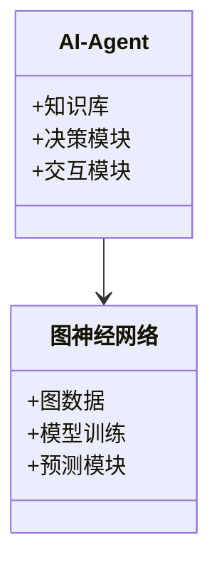
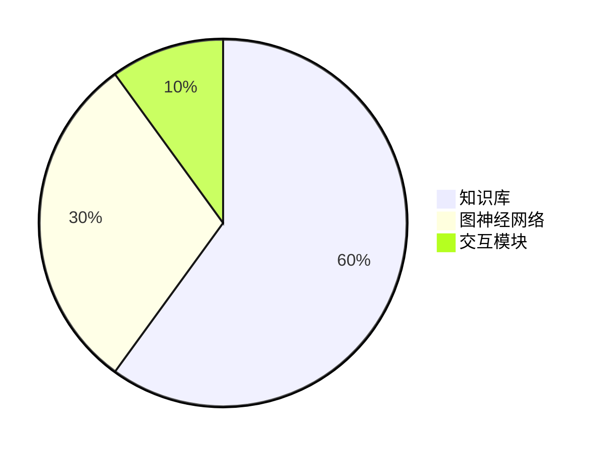
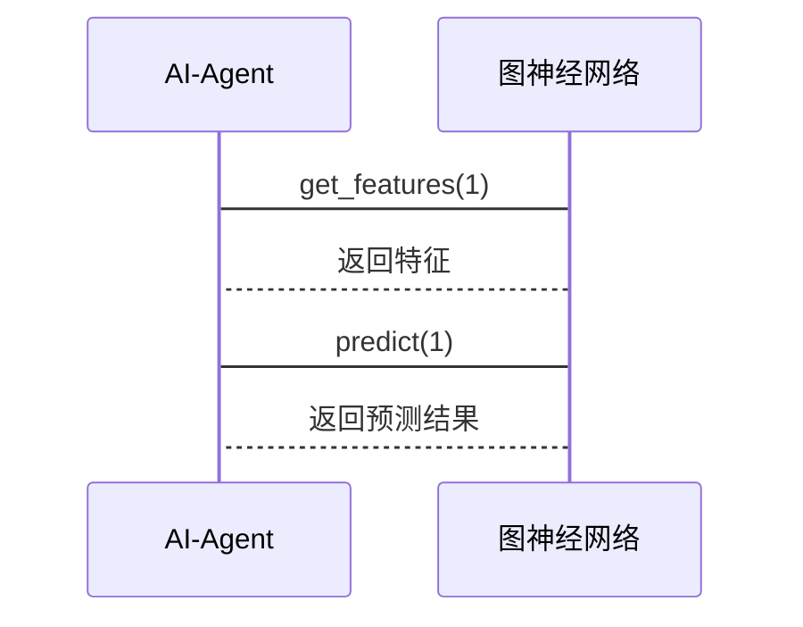

                 


# AI Agent的图神经网络技术应用

## 关键词
- AI Agent, 图神经网络, 技术应用, 算法原理, 系统架构

## 摘要
AI Agent与图神经网络的结合为人工智能领域带来了新的可能性。本文详细探讨了AI Agent的基本概念、图神经网络的核心原理及其在AI Agent中的具体应用。通过分析算法原理、系统架构设计和项目实战，本文为读者提供了从理论到实践的全面指导，帮助理解并掌握AI Agent的图神经网络技术应用。

---

# 第一部分: AI Agent与图神经网络技术概述

## 第1章: AI Agent与图神经网络技术背景

### 1.1 AI Agent的基本概念与特点
#### 1.1.1 AI Agent的定义
AI Agent（人工智能代理）是指能够感知环境并采取行动以实现目标的智能实体。它可以是一个软件程序、机器人或其他智能系统，具备自主决策和问题解决的能力。

#### 1.1.2 AI Agent的核心特点
- **自主性**：AI Agent能够在没有外部干预的情况下独立运行。
- **反应性**：能够实时感知环境并做出反应。
- **目标导向性**：所有行动都以实现特定目标为导向。
- **社交能力**：能够与其他AI Agent或人类进行交互和协作。

#### 1.1.3 AI Agent与传统AI的区别
传统AI（如专家系统）依赖于预定义的规则和知识库，而AI Agent则更加动态和自主，能够根据环境变化调整行为。

### 1.2 图神经网络的基本概念与特点
#### 1.2.1 图神经网络的定义
图神经网络（Graph Neural Networks, GNN）是一种处理图结构数据的深度学习模型。它通过在图的节点和边上进行信息传播，学习节点的特征表示。

#### 1.2.2 图神经网络的核心特点
- **图结构数据**：处理节点之间的关系和连接。
- **局部聚合**：通过聚合邻居节点的信息来更新当前节点的表示。
- **全局视角**：能够捕捉图的整体结构和节点之间的关系。

#### 1.2.3 图神经网络与传统神经网络的区别
传统神经网络处理的是线性数据（如文本、图像），而图神经网络处理的是非线性结构数据，能够捕捉数据之间的复杂关系。

### 1.3 AI Agent与图神经网络的结合
#### 1.3.1 AI Agent与图神经网络的结合背景
随着AI Agent在复杂环境中的应用需求增加，图神经网络的图结构处理能力为AI Agent提供了更强大的决策和问题解决能力。

#### 1.3.2 AI Agent与图神经网络的结合方式
- **知识表示**：利用图结构表示AI Agent的知识库。
- **决策推理**：通过图神经网络进行推理和决策。
- **交互协作**：在多Agent系统中，利用图神经网络进行协作和信息共享。

#### 1.3.3 AI Agent与图神经网络结合的优势
- **知识关联**：能够更好地处理复杂关系和知识关联。
- **动态适应**：具备动态调整行为的能力。
- **协作能力**：在多Agent系统中实现高效的协作。

### 1.4 本章小结
本章介绍了AI Agent和图神经网络的基本概念和特点，并探讨了两者结合的优势和应用场景。通过这些背景知识的铺垫，为后续的技术细节和应用实例奠定了基础。

---

## 第2章: 图神经网络的核心原理

### 2.1 图结构与图表示
#### 2.1.1 图的基本概念
图由节点（顶点）和边（边）组成，节点表示实体，边表示实体之间的关系。

#### 2.1.2 图的表示方法
- **邻接矩阵**：二维矩阵表示节点之间的连接情况。
- **邻接列表**：通过列表形式表示每个节点的邻居。
- **边列表**：记录所有边的信息。

#### 2.1.3 图的属性与特征
- **度**：节点的邻居数量。
- **权重**：边的权重表示关系的强度。
- **路径**：图中节点之间的连接路径。

#### 2.1.4 图的可视化
使用节点和边的布局算法对图进行可视化，如ForceAtlas2算法。

#### 2.1.5 图的类型
- **无向图**：边没有方向。
- **有向图**：边有方向。
- **加权图**：边有权重。
- **二分图**：节点分为两组，边只在两组之间连接。

### 2.2 图神经网络的基本原理
#### 2.2.1 图神经网络的输入与输出
- **输入**：图的结构信息和节点特征。
- **输出**：节点的表示或预测结果。

#### 2.2.2 图神经网络的传播机制
图神经网络通过消息传递机制（Message Passing）在图中传播信息，更新节点的特征表示。

#### 2.2.3 图神经网络的聚合与聚合函数
- **聚合函数**：将邻居节点的信息聚合到当前节点。
- **聚合函数类型**：平均、最大、最小、求和等。

#### 2.2.4 图神经网络的激活函数
常用的激活函数包括ReLU、Sigmoid、Tanh等，用于非线性变换。

### 2.3 图神经网络的数学模型
#### 2.3.1 图神经网络的数学表示
图神经网络的数学模型通常表示为：
$$
h_i^{(l+1)} = f\left(h_i^{(l)}, \{h_j^{(l)}\}_{j \in N(i)}\right)
$$
其中，$h_i^{(l)}$表示第$l$层节点$i$的特征向量，$N(i)$表示节点$i$的邻居节点集合，$f$是聚合函数。

#### 2.3.2 图神经网络的聚合函数公式
常用的聚合函数包括：
- 平均聚合：
$$
h_i^{(l+1)} = \frac{1}{|N(i)|} \sum_{j \in N(i)} h_j^{(l)}
$$
- 最大聚合：
$$
h_i^{(l+1)} = \max_{j \in N(i)} h_j^{(l)}
$$
- 求和聚合：
$$
h_i^{(l+1)} = \sum_{j \in N(i)} h_j^{(l)}
$$

#### 2.3.3 图神经网络的传播公式
图神经网络的传播公式通常包括聚合和更新两个步骤：
1. 聚合邻居的信息：
$$
a_i = \text{aggregate}\left(\{h_j^{(l)}\}_{j \in N(i)}\right)
$$
2. 更新当前节点的表示：
$$
h_i^{(l+1)} = f(h_i^{(l)}, a_i)
$$

### 2.4 本章小结
本章详细讲解了图神经网络的核心原理，包括图结构的表示方法、图神经网络的传播机制和聚合函数。通过这些原理，我们可以更好地理解图神经网络的工作方式。

---

## 第3章: AI Agent的图神经网络技术应用

### 3.1 AI Agent在图神经网络中的角色
#### 3.1.1 AI Agent在图神经网络中的功能
AI Agent可以作为图神经网络的节点，表示环境中的实体，并通过图结构进行交互和协作。

#### 3.1.2 AI Agent在图神经网络中的作用
- **知识表示**：利用图结构表示AI Agent的知识库。
- **决策推理**：通过图神经网络进行推理和决策。
- **交互协作**：在多Agent系统中，利用图神经网络进行协作和信息共享。

### 3.2 图神经网络在AI Agent中的具体应用
#### 3.2.1 图神经网络在AI Agent中的任务分配
通过图神经网络进行任务分配，确保每个AI Agent承担合适的工作。

#### 3.2.2 图神经网络在AI Agent中的决策过程
利用图神经网络进行推理和决策，提升决策的准确性和效率。

#### 3.2.3 图神经网络在AI Agent中的知识表示
通过图结构表示知识库，帮助AI Agent更好地理解和处理复杂关系。

### 3.3 图神经网络在AI Agent中的优势
#### 3.3.1 图神经网络的全局视角
图神经网络能够捕捉图的整体结构，帮助AI Agent更好地理解全局情况。

#### 3.3.2 图神经网络的动态适应能力
图神经网络能够实时更新节点特征，帮助AI Agent动态调整行为。

#### 3.3.3 图神经网络的协作能力
在多Agent系统中，图神经网络能够促进Agent之间的协作和信息共享。

### 3.4 本章小结
本章探讨了AI Agent在图神经网络中的角色和具体应用，展示了图神经网络在提升AI Agent功能和性能方面的重要作用。

---

## 第4章: 图神经网络在AI Agent中的算法实现

### 4.1 图神经网络算法的实现步骤
#### 4.1.1 数据准备
- 收集图结构数据和节点特征。
- 数据预处理（归一化、缺失值处理等）。

#### 4.1.2 模型训练
- 定义图神经网络模型。
- 编译模型（选择优化器和损失函数）。
- 训练模型（输入数据，调整模型参数）。

#### 4.1.3 模型预测
- 使用训练好的模型进行预测。
- 输出预测结果并进行分析。

#### 4.1.4 模型评估
- 使用验证集评估模型的性能（准确率、召回率等）。

### 4.2 图神经网络的Python实现
#### 4.2.1 安装必要的库
- 使用`networkx`进行图数据的构建和可视化。
- 使用`PyTorch`或`TensorFlow`进行模型训练。

#### 4.2.2 实现步骤
```python
import networkx as nx
import torch

# 1. 创建图
G = nx.Graph()
G.add_nodes_from([1, 2, 3])
G.add_edges_from([(1, 2), (2, 3)])

# 2. 转换为PyTorch的图表示
# 这里简要展示，实际实现需要更复杂的图神经网络模型
```

#### 4.2.3 模型实现
```python
class GraphNN(torch.nn.Module):
    def __init__(self, input_dim, hidden_dim):
        super(GraphNN, self).__init__()
        self.linear1 = torch.nn.Linear(input_dim, hidden_dim)
        self.linear2 = torch.nn.Linear(hidden_dim, 1)  # 输出单个值

    def forward(self, x):
        x = torch.relu(self.linear1(x))
        x = self.linear2(x)
        return x
```

### 4.3 图神经网络的数学模型与公式
#### 4.3.1 图神经网络的传播公式
$$
h_i^{(l+1)} = f(h_i^{(l)}, \{h_j^{(l)}\}_{j \in N(i)})
$$

#### 4.3.2 池化操作
$$
pool(h_i^{(l)}) = \max_{j \in N(i)} h_j^{(l)}
$$

### 4.4 本章小结
本章详细讲解了图神经网络在AI Agent中的算法实现，包括数据准备、模型训练和预测等步骤，并给出了具体的Python代码示例。

---

## 第5章: 图神经网络在AI Agent中的系统架构设计

### 5.1 系统需求分析
#### 5.1.1 项目背景
AI Agent需要处理复杂的环境和任务，图神经网络能够提供强大的支持。

#### 5.1.2 项目目标
通过图神经网络提升AI Agent的知识表示和决策能力。

#### 5.1.3 功能需求
- 知识库构建与管理。
- 图神经网络模型训练与预测。
- 多Agent协作与交互。

### 5.2 系统功能设计
#### 5.2.1 领域模型类图
使用Mermaid绘制领域模型类图，展示系统的功能模块。

```


#### 5.2.2 系统架构设计
使用Mermaid绘制系统架构图，展示系统的整体结构。

```


### 5.3 系统接口设计
#### 5.3.1 API接口
- `get_features(node_id)`：获取节点特征。
- `train_model(data)`：训练图神经网络模型。
- `predict(node_id)`：进行预测并返回结果。

#### 5.3.2 接口交互流程
使用Mermaid绘制序列图，展示接口的交互流程。

```


### 5.4 本章小结
本章详细讲解了AI Agent的图神经网络系统的架构设计，包括功能设计、接口设计和交互流程。

---

## 第6章: 图神经网络在AI Agent中的项目实战

### 6.1 环境安装与配置
#### 6.1.1 安装Python
- 使用Anaconda或虚拟环境安装Python 3.8及以上版本。

#### 6.1.2 安装必要的库
- `pip install networkx`
- `pip install pytorch`

### 6.2 核心功能实现
#### 6.2.1 知识库构建
- 使用`networkx`构建图结构数据。
- 为每个节点添加特征。

#### 6.2.2 图神经网络模型训练
- 定义模型结构。
- 编译模型并训练。

#### 6.2.3 预测与分析
- 使用训练好的模型进行预测。
- 分析预测结果并优化模型。

### 6.3 代码实现与解读
#### 6.3.1 知识库构建代码
```python
import networkx as nx

G = nx.Graph()
G.add_nodes_from(['A', 'B', 'C'])
G.add_edges_from([('A', 'B'), ('B', 'C')])
```

#### 6.3.2 图神经网络模型代码
```python
import torch
import torch.nn as nn

class GraphNN(nn.Module):
    def __init__(self, input_dim, hidden_dim):
        super(GraphNN, self).__init__()
        self.linear1 = nn.Linear(input_dim, hidden_dim)
        self.linear2 = nn.Linear(hidden_dim, 1)

    def forward(self, x):
        x = torch.relu(self.linear1(x))
        x = self.linear2(x)
        return x
```

#### 6.3.3 训练代码
```python
model = GraphNN(input_dim=3, hidden_dim=16)
criterion = nn.MSELoss()
optimizer = torch.optim.Adam(model.parameters(), lr=0.01)
```

### 6.4 实际案例分析
#### 6.4.1 案例背景
假设我们有一个AI Agent需要在社交网络中进行信息传播。

#### 6.4.2 数据准备
- 节点：用户、内容、关系。
- 边：用户之间的关注关系。

#### 6.4.3 模型训练
- 使用图神经网络模型进行训练，预测信息传播路径。

#### 6.4.4 结果分析
- 分析模型的预测结果，评估模型的准确性。

### 6.5 本章小结
本章通过实际案例展示了图神经网络在AI Agent中的应用，详细讲解了项目的实现过程和注意事项。

---

## 第7章: 图神经网络在AI Agent中的最佳实践

### 7.1 最佳实践 tips
#### 7.1.1 数据预处理
- 确保数据的完整性和准确性。
- 进行数据归一化处理。

#### 7.1.2 模型调优
- 调整模型的超参数（学习率、批量大小等）。
- 使用交叉验证评估模型性能。

#### 7.1.3 系统优化
- 优化系统的性能（内存使用、计算效率）。
- 使用分布式计算加速训练。

### 7.2 小结
总结全文内容，强调图神经网络在AI Agent中的重要性。

### 7.3 注意事项
- 注意模型的过拟合问题。
- 确保系统的安全性和稳定性。
- 及时更新和优化模型。

### 7.4 拓展阅读
推荐相关书籍和论文，供读者深入学习。

---

## 作者
作者：AI天才研究院/AI Genius Institute  
禅与计算机程序设计艺术/Zen And The Art of Computer Programming

