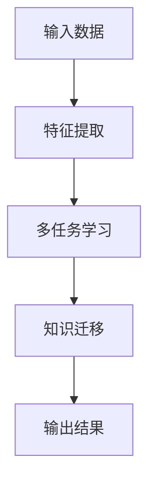

                 


# AI Agent的多任务学习与知识迁移

## 关键词：AI Agent, 多任务学习, 知识迁移, 机器学习, 人工智能, 深度学习

## 摘要：  
本文探讨AI Agent在多任务学习与知识迁移中的应用，分析其核心概念、算法原理及系统设计，结合实际案例，详细解读多任务学习与知识迁移的实现方法，帮助读者理解如何通过这些技术提升AI Agent的智能性和实用性。

---

# 第一部分: AI Agent的多任务学习与知识迁移背景介绍

## 第1章: AI Agent的基本概念

### 1.1 AI Agent的定义与特点  
AI Agent（人工智能代理）是指能够感知环境、自主决策并执行任务的智能实体。它具有以下特点：  
1. **自主性**：无需外部干预，自主完成任务。  
2. **反应性**：能够实时感知环境并做出反应。  
3. **目标导向**：基于目标驱动行为，优化决策过程。  
4. **学习能力**：通过学习提升任务执行能力。  

### 1.2 多任务学习的背景与意义  
多任务学习（Multi-Task Learning, MTL）是指让AI Agent在同一模型中学习多个任务，通过共享参数或特征提升学习效率和性能。MTL的优势包括：  
1. **减少数据需求**：通过共享特征，降低每个任务所需的数据量。  
2. **提升泛化能力**：跨任务学习有助于模型更好地泛化到新任务。  
3. **提高效率**：相比分别训练多个模型，MTL训练效率更高。  

### 1.3 知识迁移的定义与作用  
知识迁移（Knowledge Transfer）是指将一个任务中学到的知识迁移到另一个任务中，提升新任务的学习效率。知识迁移的作用包括：  
1. **减少训练时间**：通过迁移已有的知识，减少新任务的训练数据需求。  
2. **提升模型性能**：利用已有的知识，提升新任务的准确性和鲁棒性。  
3. **扩展任务能力**：通过知识迁移，AI Agent能够快速适应新任务。  

---

## 第2章: 多任务学习与知识迁移的核心概念

### 2.1 多任务学习的原理  
多任务学习的核心原理在于通过共享参数或特征，实现多个任务的联合优化。其主要机制包括：  
1. **共享参数机制**：多个任务共享部分参数，减少参数量并提升特征表达能力。  
2. **独立参数机制**：每个任务拥有独立的参数，适用于任务间差异较大的场景。  

### 2.2 知识迁移的原理  
知识迁移的核心在于提取源任务的特征，并将其应用于目标任务。其主要步骤包括：  
1. **特征提取**：从源任务中提取关键特征，作为知识迁移的基础。  
2. **适应性调整**：根据目标任务的特点，对提取的特征进行调整和优化。  
3. **知识复用**：将优化后的特征应用于目标任务，提升其学习效率和性能。  

### 2.3 多任务学习与知识迁移的关系  
多任务学习与知识迁移密切相关，多任务学习为知识迁移提供了丰富的特征表达，而知识迁移则为多任务学习提供了跨任务的知识复用能力。两者结合，能够显著提升AI Agent的多任务执行能力和知识应用能力。

---

## 第3章: 多任务学习与知识迁移的核心概念与联系

### 3.1 核心概念原理  
1. **多任务学习的数学模型**  
   多任务学习通常通过优化多个任务的损失函数来实现：  
   $$ \min_{\theta} \sum_{i=1}^{n} \lambda_i L_i(\theta) $$  
   其中，$\theta$是共享参数，$L_i$是第$i$个任务的损失函数，$\lambda_i$是调节系数。  

2. **知识迁移的数学模型**  
   知识迁移通常通过领域适应或分布迁移来实现，其数学模型可以表示为：  
   $$ P_{source}(x) \rightarrow P_{target}(y) $$  
   其中，$x$是源任务的输入，$y$是目标任务的输出。  

### 3.2 概念属性特征对比表格  
| 概念 | 属性 | 特征 |
|------|------|------|
| 多任务学习 | 参数共享 | 通过共享参数实现多个任务的联合优化 |
| 知识迁移 | 特征提取 | 通过提取特征实现知识的复用与迁移 |

### 3.3 ER实体关系图  
```mermaid
erd
  entity AI Agent {
    id: string
    tasks: string[]
    knowledge: string[]
  }
```

---

## 第4章: 多任务学习与知识迁移的算法原理

### 4.1 多任务学习算法  
1. **共享参数机制**  
   在多任务学习中，多个任务共享部分参数，通常通过神经网络中的共享层实现。例如，在自然语言处理任务中，可以共享词嵌入层的参数。  

2. **独立参数机制**  
   每个任务拥有独立的参数，适用于任务间差异较大的场景。例如，在图像分类任务中，每个任务可以拥有独立的卷积层参数。  

### 4.2 知识迁移算法  
1. **特征提取**  
   通过预训练模型提取源任务的特征，例如使用BERT提取文本特征，或使用ResNet提取图像特征。  

2. **适应性调整**  
   根据目标任务的特点，对提取的特征进行调整和优化。例如，可以通过适配器层对特征进行微调。  

### 4.3 多任务学习与知识迁移的结合  
1. **数学模型**  
   多任务学习与知识迁移的结合可以通过以下公式表示：  
   $$ \min_{\theta} \sum_{i=1}^{n} \lambda_i L_i(\theta) + \sum_{j=1}^{m} \mu_j L_j(\phi) $$  
   其中，$\theta$是多任务学习的共享参数，$\phi$是知识迁移的特征参数。  

2. **算法流程图**  


---

## 第5章: 多任务学习与知识迁移的系统设计

### 5.1 系统功能设计  
1. **领域模型**  
   通过领域模型描述系统的功能模块，例如：  
   ```mermaid
   classDiagram
       class AI Agent {
           executeTask()
           learn()
           transferKnowledge()
       }
       class TaskManager {
           assignTask()
           monitorProgress()
       }
       class KnowledgeBase {
           storeKnowledge()
           retrieveKnowledge()
       }
       AI Agent --> TaskManager: assignTask
       AI Agent --> KnowledgeBase: retrieveKnowledge
   ```

2. **系统架构设计**  
   系统架构图如下：  
   ```mermaid
   architecture
       A[AI Agent] --> B[Task Manager]
       A --> C[Knowledge Base]
       B --> D[数据源]
       C --> D[数据源]
   ```

3. **系统接口设计**  
   系统接口通常包括：  
   - **输入接口**：接收任务指令和数据输入。  
   - **输出接口**：输出任务执行结果和知识迁移结果。  

4. **系统交互设计**  
   系统交互流程图如下：  
   ```mermaid
   sequenceDiagram
       Alice → Agent: 发送任务指令
       Agent → TaskManager: 分配任务
       TaskManager → Agent: 执行任务
       Agent → KnowledgeBase: 学习知识
       KnowledgeBase → Agent: 提供知识支持
       Agent → Alice: 返回结果
   ```

---

## 第6章: 项目实战

### 6.1 环境配置  
1. **安装依赖**  
   ```bash
   pip install numpy pandas scikit-learn tensorflow
   ```

2. **代码实现**  
   ```python
   import numpy as np
   import tensorflow as tf

   class AIAssistant:
       def __init__(self):
           self.model = self.build_model()

       def build_model(self):
           inputs = tf.keras.Input(shape=(100,))
           x = tf.keras.layers.Dense(64, activation='relu')(inputs)
           x = tf.keras.layers.Dense(64, activation='relu')(x)
           outputs = tf.keras.layers.Dense(10, activation='softmax')(x)
           return tf.keras.Model(inputs=inputs, outputs=outputs)

       def train(self, x_train, y_train):
           self.model.compile(optimizer='adam', loss='sparse_categorical_crossentropy', metrics=['accuracy'])
           self.model.fit(x_train, y_train, epochs=10, batch_size=32)

       def transfer_knowledge(self, source_model):
           # 迁移知识，例如共享部分权重
           self.model.layers[1].set_weights(source_model.layers[1].get_weights())
   ```

### 6.2 功能解读  
1. **模型构建**  
   代码中定义了一个AI Assistant类，包含一个共享参数的多任务学习模型。  

2. **训练过程**  
   模型通过训练数据进行多任务学习，共享参数以优化多个任务的性能。  

3. **知识迁移**  
   通过`transfer_knowledge`方法，将源模型的知识迁移到目标模型中，提升目标任务的性能。  

### 6.3 案例分析  
以一个多任务对话系统为例，训练数据包含多个任务，例如：  
- 任务1：情感分析  
- 任务2：意图识别  
通过多任务学习和知识迁移，AI Agent能够同时完成多个任务，并快速适应新任务。

---

## 第7章: 总结与展望

### 7.1 总结  
本文详细探讨了AI Agent在多任务学习与知识迁移中的应用，分析了其核心概念、算法原理及系统设计，并结合实际案例，展示了如何通过这些技术提升AI Agent的智能性和实用性。

### 7.2 未来展望  
未来，随着AI技术的不断发展，多任务学习与知识迁移将更加智能化和自动化。AI Agent将能够更高效地完成多个任务，并通过知识迁移快速适应新任务，进一步提升其应用场景的广泛性和实用性。

### 7.3 最佳实践  
1. **数据处理**：确保数据质量，减少噪声对模型的影响。  
2. **模型选择**：根据任务特点选择合适的模型架构和参数共享策略。  
3. **性能优化**：通过正则化、数据增强等方法提升模型的泛化能力。  

---

## 作者：AI天才研究院/AI Genius Institute & 禅与计算机程序设计艺术 /Zen And The Art of Computer Programming

