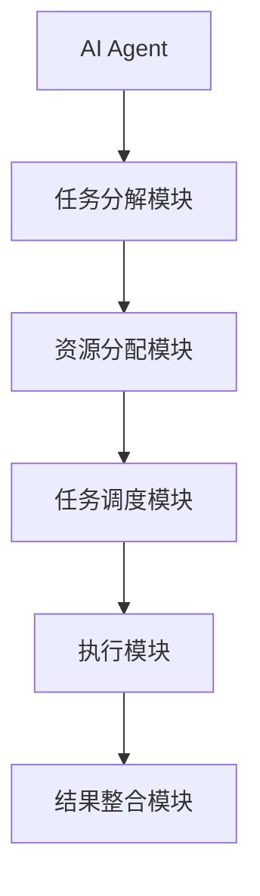

                 


# AI Agent的多任务并行处理能力

> 关键词：AI Agent, 多任务处理, 并行处理, 任务调度, 并行计算, 资源分配

> 摘要：本文将深入探讨AI Agent在多任务并行处理能力方面的核心原理、实现方法和实际应用。通过分析多任务并行处理的基本概念、算法原理、系统架构设计和实际案例，本文旨在为读者提供一个全面而深入的理解，帮助他们在实际项目中更好地应用AI Agent的多任务并行处理能力。

---

## 第一部分: AI Agent的多任务并行处理能力概述

### 第1章: AI Agent的基本概念与背景

#### 1.1 AI Agent的定义与特点
AI Agent（人工智能代理）是指能够感知环境、自主决策并执行任务的智能实体。其特点包括：

- **自主性**：能够在没有外部干预的情况下自主决策。
- **反应性**：能够实时感知环境并做出响应。
- **社交能力**：能够与其他Agent或人类进行交互和协作。
- **学习能力**：能够通过经验或数据优化自身的决策能力。

AI Agent的应用场景广泛，包括自动驾驶、智能助手、机器人控制、分布式系统等。

#### 1.2 多任务并行处理的背景与意义
随着AI技术的快速发展，AI Agent需要处理的任务越来越复杂。传统的单任务处理方式已经无法满足高效性和实时性的要求，因此多任务并行处理能力成为AI Agent的核心能力之一。

**1.2.1 多任务处理的背景**  
在现代计算环境中，多核处理器的普及使得并行计算成为可能。AI Agent需要充分利用硬件资源，通过并行处理提高任务执行效率。

**1.2.2 并行处理的重要性**  
并行处理可以显著提高系统的吞吐量和响应速度。在AI应用中，例如实时图像处理、自然语言处理等领域，多任务并行处理能够显著提升用户体验。

**1.2.3 多任务并行处理的挑战与机遇**  
挑战包括任务间的资源竞争、同步问题以及任务优先级的管理。机遇则体现在通过并行处理提高系统效率和性能。

---

### 第2章: AI Agent的多任务并行处理能力

#### 2.1 多任务处理的基本原理
多任务处理是指在同一时间段内处理多个任务的能力。其基本原理包括：

- **任务分解**：将复杂任务分解为多个子任务，分别处理后再整合结果。
- **资源分配**：合理分配计算资源（如CPU核、内存）以支持多任务并行执行。
- **任务同步**：确保任务之间的依赖关系正确处理，避免数据冲突。

#### 2.2 并行处理的实现机制
并行处理通过同时执行多个任务来提高计算效率。其实现机制包括：

- **线程与进程**：使用多线程或进程来实现任务并行。
- **锁与队列**：通过锁机制和队列管理任务的执行顺序，避免资源竞争。
- **负载均衡**：动态分配任务以充分利用计算资源。

---

## 第二部分: AI Agent多任务并行处理的核心概念与联系

### 第3章: 多任务并行处理的核心概念

#### 3.1 多任务处理的原理
多任务处理的实现需要解决以下关键问题：

- **任务分解**：将复杂任务分解为多个子任务，每个子任务独立执行。
- **资源分配**：根据任务需求分配计算资源，确保任务高效执行。
- **任务同步**：通过同步机制确保任务之间的依赖关系正确处理。

**3.1.1 任务分解与分配**
任务分解是多任务处理的基础。例如，在图像处理任务中，可以将图像分割为多个区域，分别处理后再合并结果。

**3.1.2 资源分配与调度**
资源分配需要考虑任务的优先级和计算资源的可用性。例如，优先级高的任务应分配更多的计算资源。

**3.1.3 任务同步与协调**
任务同步通过锁机制或信号量确保任务之间的依赖关系正确处理，避免数据冲突。

#### 3.2 并行处理的数学模型
并行处理的效率可以通过数学模型进行分析。以下是一个简单的并行计算模型：

$$
\text{总时间} = \max_{i} (T_i) \quad \text{其中} \quad T_i \text{是任务} i \text{的执行时间}
$$

该模型假设任务之间完全并行执行，且无资源竞争。

---

### 第4章: 多任务并行处理的核心要素

#### 4.1 任务分解与分配
任务分解的策略直接影响并行处理的效率。例如，将任务分解为尽可能独立的子任务可以提高并行效率。

#### 4.2 并行处理的优化策略
优化策略包括减少任务间的依赖关系、均衡任务负载、避免资源瓶颈等。

#### 4.3 任务调度与资源管理
任务调度算法（如Round-Robin调度）和资源分配算法（如动态分配）是实现高效并行处理的关键。

---

## 第三部分: AI Agent多任务并行处理的算法原理

### 第5章: 并行处理算法的实现

#### 5.1 多任务并行处理算法
以下是一个简单的多任务并行处理算法示例：

```python
import concurrent.futures

def process_task(task):
    # 处理单个任务
    pass

tasks = [task1, task2, task3]
with concurrent.futures.ThreadPoolExecutor() as executor:
    futures = {executor.submit(process_task, task): task for task in tasks}
    for future in concurrent.futures.as_completed(futures):
        task = futures[future]
        print(f"Task {task} completed")
```

#### 5.2 任务调度算法
任务调度算法决定了任务的执行顺序。例如，优先级调度算法可以根据任务优先级动态调整执行顺序。

---

## 第四部分: 系统分析与架构设计

### 第6章: 系统架构设计

#### 6.1 系统功能设计
系统功能包括任务分解、资源分配、任务调度和结果整合。

#### 6.2 系统架构图
以下是一个简单的系统架构图：



#### 6.3 接口设计
系统接口包括任务提交接口、资源分配接口和结果查询接口。

---

## 第五部分: 项目实战

### 第7章: 项目实现

#### 7.1 环境配置
需要安装Python的`concurrent.futures`库。

#### 7.2 核心代码实现
以下是一个多任务并行处理的Python实现示例：

```python
import concurrent.futures
import time

def process_task(n):
    print(f"Processing task {n}")
    time.sleep(n)
    return f"Task {n} completed"

tasks = [1, 2, 3]
with concurrent.futures.ThreadPoolExecutor() as executor:
    futures = {executor.submit(process_task, n): n for n in tasks}
    for future in concurrent.futures.as_completed(futures):
        task = futures[future]
        print(f"Task {task} completed successfully")
```

#### 7.3 实际案例分析
通过上述代码可以实现简单的多任务并行处理。在实际应用中，可以根据具体需求优化任务分解和资源分配策略。

---

## 第六部分: 总结与展望

### 第8章: 总结

#### 8.1 核心内容回顾
本文详细探讨了AI Agent的多任务并行处理能力，包括基本概念、算法原理和系统架构设计。

#### 8.2 最佳实践
- 合理分解任务，避免资源竞争。
- 优化任务调度算法，提高并行效率。
- 定期监控系统性能，及时调整资源分配策略。

### 第9章: 展望

#### 9.1 未来发展方向
未来，AI Agent的多任务并行处理能力将进一步优化，特别是在分布式计算和边缘计算领域。

---

作者：AI天才研究院/AI Genius Institute & 禅与计算机程序设计艺术 /Zen And The Art of Computer Programming

