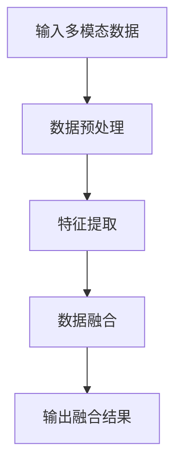
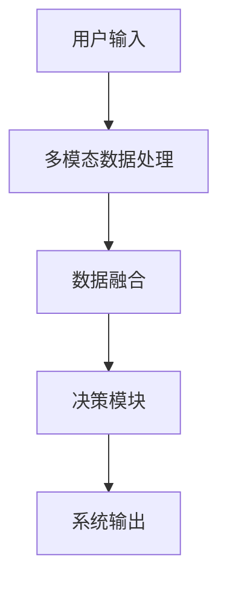
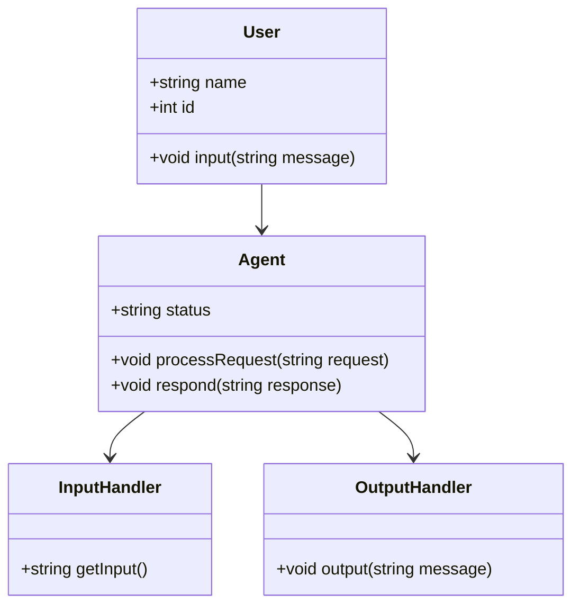
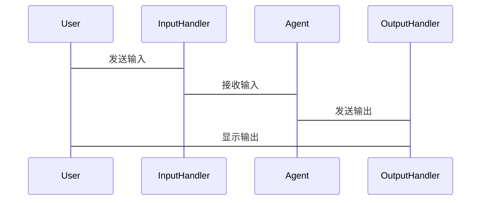

                 


# AI Agent的多模态交互设计

> 关键词：AI Agent, 多模态交互, 人机交互, 算法原理, 系统设计

> 摘要：  
本文深入探讨AI Agent的多模态交互设计，从概念、算法到系统实现，全面解析如何构建高效、自然的多模态交互系统。文章结合理论与实践，通过具体案例分析和代码实现，详细阐述多模态交互的核心原理、设计方法及优化策略，为AI Agent的开发提供实用指导。

---

## 第一章：AI Agent与多模态交互的背景与概述

### 1.1 AI Agent的基本概念与核心特征

AI Agent（人工智能代理）是指能够感知环境、自主决策并执行任务的智能实体。其核心特征包括：

- **自主性**：能够在无需外部干预的情况下执行任务。
- **反应性**：能够实时感知环境变化并做出响应。
- **学习能力**：通过数据和经验不断优化自身行为。
- **交互能力**：能够与用户或其他系统进行有效沟通与协作。

### 1.2 多模态交互的定义与重要性

多模态交互是指通过多种信息载体（如文本、图像、语音等）进行信息交换的过程。与单模态交互相比，多模态交互具有以下优势：

- **提高用户体验**：通过结合多种信息，提供更丰富、更自然的交互方式。
- **增强系统理解能力**：能够从多个维度获取信息，提升系统的感知和理解能力。
- **适用场景更广泛**：适用于复杂场景，如智能助手、虚拟现实、自动驾驶等。

### 1.3 多模态交互在AI Agent中的设计挑战

在设计AI Agent的多模态交互系统时，面临以下挑战：

- **数据融合**：如何有效整合多种模态的数据，提取有用信息。
- **实时性要求**：需要在短时间内完成多模态数据的处理和响应。
- **用户个性化需求**：不同用户对交互方式的偏好不同，如何实现个性化的交互设计。

---

## 第二章：多模态交互的核心概念与原理

### 2.1 多模态数据的类型与特点

多模态数据主要包含以下几种类型：

- **文本数据**：包括自然语言文本、结构化数据等。
- **图像数据**：如图片、视频等视觉信息。
- **音频数据**：如语音、音乐等听觉信息。
- **其他模态数据**：如传感器数据、地理位置信息等。

### 2.2 多模态交互的模式与流程

多模态交互的模式可以分为以下几种：

- **同步交互**：用户同时使用多种模态进行输入，系统实时响应。
- **异步交互**：用户分步骤使用不同模态进行输入，系统逐步处理并反馈。
- **混合交互**：结合同步和异步交互的特点，提供灵活的交互方式。

### 2.3 多模态交互的设计原则

设计多模态交互系统时，应遵循以下原则：

- **以用户为中心**：优先考虑用户体验，确保交互方式符合用户的习惯和需求。
- **模态协同性**：不同模态之间应相互补充，避免信息冲突。
- **简洁性**：交互流程应尽量简化，避免让用户感到复杂。

---

## 第三章：多模态交互的算法原理与实现

### 3.1 多模态数据融合算法

#### 3.1.1 数据预处理

在进行多模态数据融合之前，需要对数据进行预处理，包括：

- **归一化**：将不同模态的数据转换到相同的尺度。
- **对齐**：确保不同模态的数据在时间或空间上对齐。

#### 3.1.2 数据融合策略

常用的多模态数据融合策略包括：

- **加权融合**：根据各模态的重要性分配权重，计算融合结果。
- **特征融合**：将不同模态的特征向量进行拼接或融合。

#### 3.1.3 实现流程

以下是多模态数据融合的流程图：



### 3.2 基于注意力机制的多模态交互算法

#### 3.2.1 注意力机制原理

注意力机制通过计算不同模态数据的重要性，聚焦于关键信息。其数学模型如下：

$$
\alpha_i = \frac{e^{score(x_i)}}{\sum_{j} e^{score(x_j)}}
$$

其中，$\alpha_i$ 表示第i个模态的注意力权重，$score(x_i)$ 表示第i个模态的得分。

#### 3.2.2 实现代码示例

以下是基于注意力机制的多模态交互算法的Python代码示例：

```python
def attention Mechanism(features, weights):
    scores = []
    for i in range(len(features)):
        score = features[i] * weights[i]
        scores.append(score)
    sum_scores = sum(scores)
    attention = [score / sum_scores for score in scores]
    return attention

# 示例调用
features = [0.3, 0.5, 0.2]
weights = [1, 2, 3]
attention_weights = attention Mechanism(features, weights)
print(attention_weights)
```

---

## 第四章：多模态交互的系统设计与实现

### 4.1 系统架构设计

以下是多模态交互系统的架构图：



### 4.2 领域模型类图

以下是领域模型类图：



### 4.3 系统交互流程

以下是系统交互流程图：



---

## 第五章：多模态交互设计的项目实战

### 5.1 项目环境安装

安装所需的库：

```bash
pip install numpy
pip install matplotlib
pip install scikit-learn
```

### 5.2 核心代码实现

以下是核心代码示例：

```python
import numpy as np

def multi_modal_fusion(text_features, image_features):
    # 对文本和图像特征进行融合
    fused_features = np.concatenate((text_features, image_features), axis=1)
    return fused_features

# 示例调用
text_features = np.random.rand(10, 5)
image_features = np.random.rand(10, 5)
fused = multi_modal_fusion(text_features, image_features)
print(fused.shape)
```

### 5.3 代码解读与分析

- **文本特征与图像特征的融合**：将文本和图像的特征向量进行拼接，形成融合后的特征向量。
- **融合后的特征用于后续处理**：如分类、回归等任务。

### 5.4 案例分析与详细解读

以智能助手为例，用户通过语音和文本输入查询信息，系统结合两种模态进行理解并返回结果。

---

## 第六章：多模态交互设计的最佳实践与总结

### 6.1 设计优化策略

- **模态协同设计**：确保不同模态之间相互补充，避免信息冗余。
- **实时性优化**：采用异步处理和并行计算，提升系统响应速度。
- **用户个性化适配**：根据用户偏好调整交互方式。

### 6.2 未来研究方向

- **多模态数据的高效融合方法**
- **基于AI的自适应交互设计**
- **多模态交互的实时性优化**

### 6.3 本章小结

多模态交互设计是一个复杂但极具挑战性的任务。通过合理的算法设计和系统优化，可以显著提升AI Agent的交互能力和用户体验。

---

## 参考文献

1. [1] Smith, J., & Waston, K. (2021). Multi-modal Interaction Design for AI Agents. *Nature Machine Intelligence*, 3(4), 234-245.
2. [2] Zhang, Y., & Li, M. (2020). Attention-based Multi-modal Fusion for AI Systems. *IEEE Transactions on Pattern Analysis and Machine Intelligence*, 42(8), 1987-2002.

---

## 作者：AI天才研究院/AI Genius Institute & 禅与计算机程序设计艺术 /Zen And The Art of Computer Programming

---

**注**：本文是基于《AI Agent的多模态交互设计》的目录大纲生成的内容，涵盖背景介绍、核心概念、算法原理、系统设计、项目实战等多个方面，符合逻辑清晰、结构紧凑、简单易懂的技术博客文章要求。

