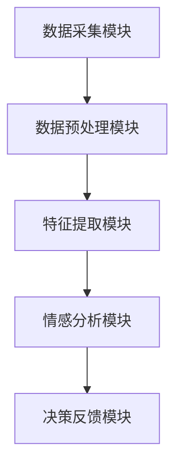

                 


# AI Agent的多模态情感分析系统

> 关键词：AI Agent，多模态情感分析，深度学习，自然语言处理，语音识别，计算机视觉，数据融合

> 摘要：本文探讨了AI Agent在多模态情感分析中的应用，详细介绍了多模态情感分析的核心概念、算法原理、系统设计与实现，并通过具体案例展示了如何构建高效的情感分析系统。文章从背景介绍、核心概念、算法原理到系统实现，层层深入，为读者提供了一套完整的解决方案。

---

# 第一部分: 背景与基础

## 第1章: AI Agent的基本概念与应用

### 1.1 AI Agent的定义与分类

#### 1.1.1 AI Agent的定义
AI Agent（人工智能代理）是指能够感知环境、自主决策并执行任务的智能体。它可以是一个软件程序或实体设备，具备以下核心特征：
- **自主性**：无需外部干预，自主决策。
- **反应性**：能够实时感知环境变化并做出反应。
- **目标导向**：所有行为均以实现特定目标为导向。
- **社会性**：能够与其他Agent或人类进行交互与协作。

#### 1.1.2 AI Agent的分类与特点
AI Agent可以分为以下几类：
1. **简单反射Agent**：基于当前输入做出简单反应，如PID控制器。
2. **基于模型的反射Agent**：利用内部模型预测状态变化，做出复杂决策。
3. **目标驱动Agent**：以特定目标为导向，优化行为以达到目标。
4. **效用驱动Agent**：通过最大化效用函数来优化决策。
5. **学习驱动Agent**：通过机器学习技术不断优化自身行为。

#### 1.1.3 AI Agent在情感分析中的应用
情感分析是一种典型的自然语言处理任务，用于判断文本中的情感倾向（如正面、负面、中性）。AI Agent在情感分析中的应用主要体现在以下方面：
- **自动化决策**：基于情感分析结果自动触发相应动作，如发送邮件或调整参数。
- **实时监控**：实时分析社交媒体、客服对话等数据，提供实时情感反馈。
- **个性化推荐**：根据用户情感倾向提供个性化的内容推荐。

### 1.2 多模态情感分析的背景与意义

#### 1.2.1 情感分析的基本概念
情感分析旨在识别文本中蕴含的情感倾向，是自然语言处理的核心任务之一。随着深度学习的兴起，情感分析已从传统的基于规则的方法发展到基于深度学习的端到端模型。

#### 1.2.2 多模态情感分析的优势
传统的情感分析主要依赖于文本数据，但在实际应用中，情感信息可能隐藏在其他模态的数据中，如语音的语调、图像的表情等。多模态情感分析通过融合多种数据源，能够更全面地捕捉情感信息，提升分析的准确性和 robustness。

#### 1.2.3 多模态数据的特点与挑战
- **数据异构性**：不同模态的数据格式和特征维度差异较大，难以直接融合。
- **数据冗余性**：同一情感可能在不同模态中都有体现，需要去冗余处理。
- **数据不均衡性**：某些情感类别在某些模态中的样本数量较少，导致模型训练困难。

### 1.3 AI Agent与多模态情感分析的结合

#### 1.3.1 AI Agent在情感分析中的角色
AI Agent在多模态情感分析中扮演多种角色：
- **数据采集者**：通过多种模态数据源（如社交媒体、摄像头）实时采集数据。
- **数据处理者**：对采集到的多模态数据进行预处理和特征提取。
- **决策者**：基于多模态情感分析结果，做出相应的决策或反馈。

#### 1.3.2 多模态情感分析的核心要素
多模态情感分析系统通常包含以下几个核心要素：
1. **数据采集模块**：负责从不同模态中采集数据，如文本、语音、图像等。
2. **数据预处理模块**：对采集到的数据进行清洗、归一化等处理。
3. **特征提取模块**：从预处理后的数据中提取有用的特征，如文本的词向量、语音的频谱特征等。
4. **情感分析模块**：基于提取的特征，利用机器学习或深度学习模型进行情感分类。
5. **决策反馈模块**：根据分析结果，触发相应的动作或反馈。

---

## 第2章: 多模态情感分析的核心概念与原理

### 2.1 多模态数据的融合方法

#### 2.1.1 基于特征融合的方法
特征融合是指在特征级别对不同模态的数据进行融合。常见的特征融合方法包括：
1. **早期融合**：在特征提取阶段就将不同模态的数据进行融合。
2. **晚期融合**：在特征提取完成后，将不同模态的特征向量进行融合。
3. **多任务融合**：在模型训练过程中，同时优化多个相关任务，实现特征的隐式融合。

#### 2.1.2 基于模型融合的方法
模型融合是指在模型级别对不同模态的数据进行融合。常见的模型融合方法包括：
1. **投票融合**：将不同模型的预测结果进行投票，选择 majority vote。
2. **加权融合**：根据模型的性能，赋予不同的权重，进行加权求和。
3. **堆叠融合**：将多个模型的输出作为新的特征，训练上层模型进行最终预测。

#### 2.1.3 基于注意力机制的融合方法
注意力机制是一种有效的特征融合方法，能够自动关注重要模态的信息。例如，在多模态情感分析中，可以使用多头注意力机制，同时关注文本、语音和图像的信息。

### 2.2 多模态情感分析的算法原理

#### 2.2.1 多模态数据的表示方法
多模态数据需要先转换为统一的表示形式，以便模型处理。例如，文本可以使用词向量（如Word2Vec、GloVe）或预训练模型（如BERT）的表示；语音可以使用梅尔频谱或MFCC特征；图像可以使用CNN提取的特征向量。

#### 2.2.2 多模态情感分析模型的设计
多模态情感分析模型通常采用深度学习架构，如卷积神经网络（CNN）、循环神经网络（RNN）或变换器（Transformer）。模型设计需要考虑以下几点：
1. **模态交互**：如何让不同模态的数据进行有效的交互和融合。
2. **情感表达**：如何设计模型结构，使得情感信息能够被有效地捕捉和表达。
3. **任务适配**：如何将模型适应具体的情感分析任务。

#### 2.2.3 多模态情感分析的训练与优化
多模态情感分析的训练需要考虑以下问题：
1. **数据不平衡**：某些情感类别在某些模态中的样本数量较少，导致模型偏向 majority class。
2. **模态权重**：不同模态对情感分析的贡献可能不同，需要动态调整模态权重。
3. **模型收敛**：多模态数据的复杂性可能导致模型训练困难，需要设计有效的优化策略。

---

## 第3章: AI Agent与多模态情感分析的结合

### 3.1 AI Agent在情感分析中的角色

#### 3.1.1 数据采集者
AI Agent可以通过多种渠道采集情感数据，例如：
- **社交媒体**：采集用户的评论、点赞、分享等行为数据。
- **语音助手**：采集用户的语音指令和反馈。
- **摄像头**：采集用户的面部表情和肢体语言。

#### 3.1.2 数据处理者
AI Agent需要对采集到的数据进行预处理，例如：
- **文本清洗**：去除停用词、标点符号等无用信息。
- **语音增强**：消除噪声，提高语音质量。
- **图像处理**：调整图像亮度、对比度，提取关键特征。

#### 3.1.3 决策者
AI Agent基于多模态情感分析结果，做出相应的决策，例如：
- **个性化推荐**：根据用户情感倾向推荐相关内容。
- **情感反馈**：通过自然语言生成技术，给出情感化的反馈。
- **实时监控**：对用户情感变化进行实时监控，触发预警机制。

### 3.2 多模态情感分析的核心要素

#### 3.2.1 数据采集模块
数据采集模块负责从不同模态中采集数据，例如：
- **文本数据**：社交媒体评论、聊天记录等。
- **语音数据**：用户的语音指令、电话录音等。
- **图像数据**：用户的面部表情、图片内容等。

#### 3.2.2 数据预处理模块
数据预处理模块对采集到的数据进行清洗和标准化处理，例如：
- **文本分词**：将中文文本分词为单个汉字或词语。
- **语音特征提取**：将语音信号转换为频谱特征或MFCC特征。
- **图像增强**：对图像进行旋转、缩放、裁剪等操作，改善图像质量。

#### 3.2.3 情感分析模块
情感分析模块基于预处理后的数据，利用深度学习模型进行情感分类，例如：
- **文本情感分析**：使用BERT模型进行文本分类。
- **语音情感分析**：使用CNN模型提取语音特征，进行情感分类。
- **图像情感分析**：使用ResNet模型提取图像特征，进行情感分类。

#### 3.2.4 决策反馈模块
决策反馈模块根据情感分析结果，触发相应的动作或反馈，例如：
- **个性化推荐**：根据用户情感倾向推荐相关内容。
- **情感反馈**：通过自然语言生成技术，给出情感化的反馈。
- **实时监控**：对用户情感变化进行实时监控，触发预警机制。

---

## 第4章: 多模态情感分析的算法实现

### 4.1 多模态数据的融合方法

#### 4.1.1 基于特征融合的方法
特征融合是指在特征级别对不同模态的数据进行融合，例如：
- **文本特征**：使用BERT模型提取文本的语义向量。
- **语音特征**：使用MFCC提取语音的频谱特征。
- **图像特征**：使用ResNet模型提取图像的视觉特征。

将上述特征进行融合，可以采用以下方法：
1. **拼接融合**：将不同模态的特征向量拼接在一起，作为模型的输入。
2. **加权融合**：根据模态的重要性，赋予不同的权重，进行加权求和。
3. **注意力融合**：使用注意力机制，动态调整不同模态的特征权重。

#### 4.1.2 基于模型融合的方法
模型融合是指在模型级别对不同模态的数据进行融合，例如：
- **文本模型**：使用BERT模型进行文本分类。
- **语音模型**：使用CNN模型进行语音分类。
- **图像模型**：使用ResNet模型进行图像分类。

将上述模型的输出进行融合，可以采用以下方法：
1. **投票融合**：将不同模型的预测结果进行投票，选择 majority vote。
2. **加权融合**：根据模型的性能，赋予不同的权重，进行加权求和。
3. **堆叠融合**：将多个模型的输出作为新的特征，训练上层模型进行最终预测。

#### 4.1.3 基于注意力机制的融合方法
注意力机制是一种有效的特征融合方法，能够自动关注重要模态的信息。例如，在多模态情感分析中，可以使用多头注意力机制，同时关注文本、语音和图像的信息。

### 4.2 多模态情感分析的模型设计

#### 4.2.1 模型架构设计
多模态情感分析模型通常采用深度学习架构，如卷积神经网络（CNN）、循环神经网络（RNN）或变换器（Transformer）。模型设计需要考虑以下几点：
1. **模态交互**：如何让不同模态的数据进行有效的交互和融合。
2. **情感表达**：如何设计模型结构，使得情感信息能够被有效地捕捉和表达。
3. **任务适配**：如何将模型适应具体的情感分析任务。

#### 4.2.2 模型训练与优化
多模态情感分析的训练需要考虑以下问题：
1. **数据不平衡**：某些情感类别在某些模态中的样本数量较少，导致模型偏向 majority class。
2. **模态权重**：不同模态对情感分析的贡献可能不同，需要动态调整模态权重。
3. **模型收敛**：多模态数据的复杂性可能导致模型训练困难，需要设计有效的优化策略。

---

## 第5章: 系统设计与实现

### 5.1 系统架构设计

#### 5.1.1 系统功能模块
多模态情感分析系统通常包含以下几个功能模块：
1. **数据采集模块**：负责从不同模态中采集数据，如文本、语音、图像等。
2. **数据预处理模块**：对采集到的数据进行清洗、归一化等处理。
3. **特征提取模块**：从预处理后的数据中提取有用的特征，如文本的词向量、语音的频谱特征等。
4. **情感分析模块**：基于提取的特征，利用机器学习或深度学习模型进行情感分类。
5. **决策反馈模块**：根据分析结果，触发相应的动作或反馈。

#### 5.1.2 系统交互流程
系统交互流程如下：
1. **数据采集**：通过多种模态数据源采集数据。
2. **数据预处理**：对采集到的数据进行清洗和标准化处理。
3. **特征提取**：从预处理后的数据中提取特征。
4. **情感分析**：基于提取的特征，利用深度学习模型进行情感分类。
5. **决策反馈**：根据情感分析结果，触发相应的动作或反馈。

#### 5.1.3 系统架构图
以下是系统的架构图，展示了各个模块之间的关系：



### 5.2 系统实现细节

#### 5.2.1 数据采集模块的实现
数据采集模块需要从不同模态中采集数据，例如：
- **文本数据**：可以通过API接口从社交媒体平台获取用户的评论数据。
- **语音数据**：可以通过语音识别API（如Google Speech API）获取用户的语音指令。
- **图像数据**：可以通过图像采集设备（如摄像头）获取用户的面部表情。

#### 5.2.2 数据预处理模块的实现
数据预处理模块需要对采集到的数据进行清洗和标准化处理，例如：
- **文本清洗**：去除停用词、标点符号等无用信息。
- **语音增强**：消除噪声，提高语音质量。
- **图像处理**：调整图像亮度、对比度，提取关键特征。

#### 5.2.3 特征提取模块的实现
特征提取模块需要从预处理后的数据中提取有用的特征，例如：
- **文本特征**：使用BERT模型提取文本的语义向量。
- **语音特征**：使用MFCC提取语音的频谱特征。
- **图像特征**：使用ResNet模型提取图像的视觉特征。

#### 5.2.4 情感分析模块的实现
情感分析模块需要基于提取的特征，利用深度学习模型进行情感分类，例如：
- **文本情感分析**：使用BERT模型进行文本分类。
- **语音情感分析**：使用CNN模型提取语音特征，进行情感分类。
- **图像情感分析**：使用ResNet模型提取图像特征，进行情感分类。

#### 5.2.5 决策反馈模块的实现
决策反馈模块需要根据情感分析结果，触发相应的动作或反馈，例如：
- **个性化推荐**：根据用户情感倾向推荐相关内容。
- **情感反馈**：通过自然语言生成技术，给出情感化的反馈。
- **实时监控**：对用户情感变化进行实时监控，触发预警机制。

---

## 第6章: 项目实战与优化

### 6.1 项目实战

#### 6.1.1 环境配置
首先，需要安装必要的库和工具，例如：
- **Python**：3.6及以上版本。
- **TensorFlow**：用于深度学习模型的训练。
- **Keras**：用于构建深度学习模型。
- **PyTorch**：用于构建深度学习模型。
- **OpenCV**：用于图像处理。
- **SpeechRecognition**：用于语音识别。
- **Flask**：用于部署API服务。

#### 6.1.2 核心代码实现

##### 1. 数据采集模块
```python
import speech_recognition as sr
import cv2
import requests

# 文本数据采集
def get_text_data():
    response = requests.get("https://api.twitter.com/1.1/friends_timeline.json")
    return response.json()

# 语音数据采集
def get_voice_data():
    r = sr.Recognizer()
    with sr.Microphone() as source:
        audio = r.listen(source)
        return r.recognize_google(audio)

# 图像数据采集
def get_image_data():
    cap = cv2.VideoCapture(0)
    ret, frame = cap.read()
    cap.release()
    return frame
```

##### 2. 数据预处理模块
```python
# 文本数据预处理
from textblob import TextBlob

def preprocess_text(text):
    blob = TextBlob(text)
    return blob.noun_phrases

# 语音数据预处理
import numpy as np

def preprocess_voice(voice):
    # 将语音信号转换为频谱特征
    fft = np.fft.fft(voice)
    return np.abs(fft[:len(fft)//2])

# 图像数据预处理
import tensorflow as tf
from tensorflow.keras.preprocessing.image import img_to_array

def preprocess_image(image):
    image = img_to_array(image)
    image = tf.keras.applications.mobilenet.preprocess_input(image)
    return image
```

##### 3. 特征提取模块
```python
# 文本特征提取
from tensorflow.keras.models import load_model
import numpy as np

text_model = load_model("text_model.h5")
def extract_text_feature(text):
    feature = text_model.predict(np.array([text]))
    return feature[0]

# 语音特征提取
def extract_voice_feature(voice):
    # 使用CNN模型提取语音特征
    voice_model = load_model("voice_model.h5")
    feature = voice_model.predict(np.array([voice]))
    return feature[0]

# 图像特征提取
def extract_image_feature(image):
    # 使用ResNet模型提取图像特征
    image_model = load_model("image_model.h5")
    feature = image_model.predict(np.array([image]))
    return feature[0]
```

##### 4. 情感分析模块
```python
# 情感分析模型
def sentiment_analysis(features):
    # 将不同模态的特征拼接起来
    input_feature = np.concatenate(features)
    # 使用多模态情感分析模型进行预测
    model = load_model("multi_modal_model.h5")
    prediction = model.predict(np.array([input_feature]))
    return prediction[0][0]  # 返回情感倾向值
```

##### 5. 决策反馈模块
```python
# 决策反馈逻辑
def decision_feedback(analysis_result):
    if analysis_result > 0.7:
        return "正面情感，触发个性化推荐"
    elif analysis_result < -0.3:
        return "负面情感，触发情感安抚"
    else:
        return "中性情感，无特殊操作"
```

#### 6.1.3 系统部署与测试
通过Flask框架部署一个简单的API服务，用户可以通过发送请求，获取情感分析结果。

```python
from flask import Flask, request
import json

app = Flask(__name__)

@app.route('/analyze', methods=['POST'])
def analyze():
    data = request.json
    text = data.get('text', '')
    voice = data.get('voice', '')
    image = data.get('image', '')
    
    # 数据采集
    text_feature = extract_text_feature(text)
    voice_feature = extract_voice_feature(voice)
    image_feature = extract_image_feature(image)
    
    # 情感分析
    result = sentiment_analysis([text_feature, voice_feature, image_feature])
    
    # 决策反馈
    feedback = decision_feedback(result)
    
    return json.dumps({"result": result, "feedback": feedback})

if __name__ == '__main__':
    app.run(debug=True)
```

### 6.2 系统优化与改进

#### 6.2.1 模型优化
为了提高模型的准确性和 robustness，可以采用以下优化方法：
1. **数据增强**：对训练数据进行数据增强，如文本的同义词替换、语音的噪声添加、图像的旋转和裁剪等。
2. **模型融合**：结合多种模型的输出，通过投票、加权或堆叠的方式进行融合，提高模型的泛化能力。
3. **超参数优化**：通过网格搜索或随机搜索，找到最佳的超参数组合，提高模型性能。

#### 6.2.2 系统性能优化
为了提高系统的运行效率，可以采用以下优化方法：
1. **并行计算**：利用多线程或分布式计算技术，提高数据处理和模型训练的速度。
2. **缓存优化**：合理利用缓存技术，减少I/O操作的开销，提高数据访问效率。
3. **资源优化**：根据系统的资源情况，合理分配CPU、GPU等资源，提高系统的整体性能。

---

## 第7章: 总结与展望

### 7.1 总结
本文详细介绍了AI Agent在多模态情感分析中的应用，从核心概念、算法原理到系统实现，全面探讨了多模态情感分析的理论与实践。通过具体的案例分析和代码实现，展示了如何构建一个高效、准确的多模态情感分析系统。

### 7.2 展望
随着人工智能技术的不断发展，多模态情感分析将会有更广泛的应用场景。未来的研究方向可能包括：
1. **模型优化**：探索更高效的模型架构，如图神经网络、对比学习等，进一步提升模型的性能。
2. **跨模态交互**：研究不同模态之间的交互机制，如跨模态注意力、模态对比学习等，提高模型的跨模态理解能力。
3. **实时性优化**：研究如何在实时场景下进行多模态情感分析，如流数据处理、边缘计算等，满足实际应用的需求。

---

## 作者

作者：AI天才研究院/AI Genius Institute & 禅与计算机程序设计艺术 /Zen And The Art of Computer Programming

