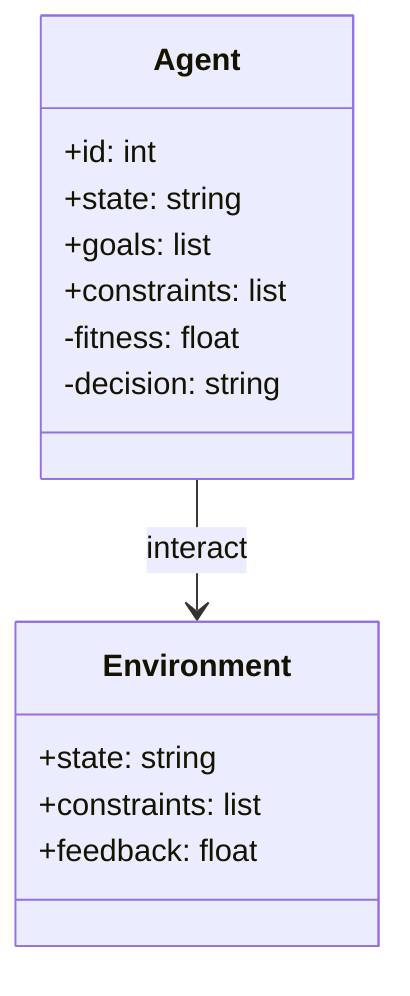
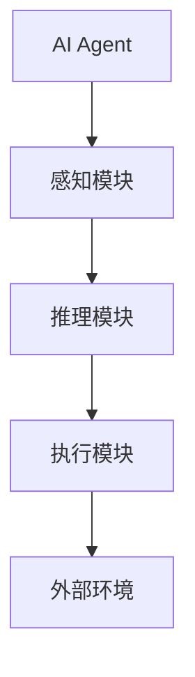
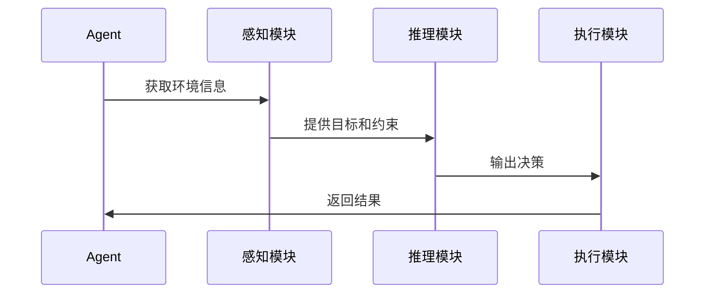

                 


# AI Agent的多目标优化决策系统

## 关键词：AI Agent，多目标优化，决策系统，强化学习，优化算法

## 摘要：本文深入探讨了AI Agent在多目标优化决策系统中的应用，从基本概念、算法原理到系统架构设计，结合实际案例和代码实现，全面解析多目标优化的实现方法及其在AI Agent中的应用。文章旨在为读者提供从理论到实践的系统性指导，帮助理解并实现高效的多目标优化决策系统。

---

# 第1章 多目标优化决策系统的背景与目标

## 1.1 问题背景与目标

### 1.1.1 问题背景
AI Agent在复杂环境中进行决策时，往往需要同时优化多个目标，这些目标之间可能存在冲突，例如最大化利润的同时最小化成本。传统的单目标优化方法难以处理这种多目标问题。

### 1.1.2 问题描述
AI Agent需要在多个目标之间找到平衡点，例如在自动驾驶中，既要考虑行驶速度又要确保安全。多目标优化决策系统的目标是在满足所有约束条件的情况下，找到最优的决策方案。

### 1.1.3 问题解决思路
通过引入多目标优化算法，AI Agent可以在多个目标之间进行权衡，找到帕累托最优解。常用的算法包括遗传算法、粒子群优化和NSGA-II等。

### 1.1.4 边界与外延
多目标优化的边界包括问题的约束条件和决策空间，外延则涉及强化学习和分布式计算等技术，进一步提升决策系统的性能。

### 1.1.5 核心概念与组成要素
多目标优化的核心概念包括目标函数、约束条件、帕累托最优等。AI Agent的决策系统由感知模块、推理模块和执行模块组成，通过多目标优化算法实现最优决策。

---

# 第2章 多目标优化的基本原理

## 2.1 核心概念与原理

### 2.1.1 多目标优化的基本概念
多目标优化是指在多个目标函数下寻找最优解的过程，通常通过帕累托前沿来表示最优解的集合。

### 2.1.2 多目标优化与单目标优化的对比
单目标优化仅考虑一个目标，而多目标优化需要同时优化多个目标，通常会引入权衡和折中的概念。

### 2.1.3 AI Agent在多目标优化中的作用
AI Agent作为决策者，通过多目标优化算法在复杂环境中找到最优的决策方案。

### 2.1.4 系统的可扩展性与高效性
多目标优化系统需要具备良好的扩展性，能够处理多个目标和约束条件，同时保证计算效率。

## 2.2 多目标优化的数学模型

### 2.2.1 多目标优化的数学表达
$$ \text{minimize } f(x) $$
$$ \text{subject to } g(x) \leq 0 $$

### 2.2.2 帕累托前沿的定义与性质
帕累托前沿是多目标优化中的最优解集合，任何解在该前沿之外都无法在所有目标上超越该解。

## 2.3 多目标优化的算法选择与对比

### 2.3.1 常见多目标优化算法
- 遗传算法（GA）
- 粒子群优化（PSO）
- NSGA-II算法

### 2.3.2 算法优缺点对比
| 算法名称 | 优点 | 缺点 |
|----------|------|------|
| GA       | 具备全局搜索能力 | 收敛速度较慢 |
| PSO      | 收敛速度快 | 易陷入局部最优 |
| NSGA-II  | 具备良好的收敛性和分布性 | 实现复杂度较高 |

### 2.3.3 算法选择策略
根据具体问题的约束条件和目标数量选择合适的算法，同时考虑计算资源和时间限制。

---

# 第3章 多目标优化算法的实现与应用

## 3.1 基础算法原理

### 3.1.1 遗传算法（GA）

#### 3.1.1.1 算法步骤
1. 初始化种群
2. 计算适应度值
3. 选择与交叉操作
4. 变异与更新种群

#### 3.1.1.2 适应度函数
$$ f(x) = x_1 + x_2 + \dots + x_n $$

### 3.1.2 粒子群优化（PSO）

#### 3.1.2.1 算法步骤
1. 初始化粒子群
2. 计算适应度值
3. 更新粒子速度和位置
4. 保持粒子边界

#### 3.1.2.2 速度更新公式
$$ v_i = v_i + w(v_i) + c_1 r_1 (p_i - x_i) + c_2 r_2 (p_g - x_i) $$ $$ p_i = x_i + v_i $$

### 3.1.3 NSGA-II算法

#### 3.1.3.1 算法步骤
1. 初始化种群
2. 计算适应度值
3. 进行非支配排序
4. 执行交叉和变异操作

#### 3.1.3.2 适应度分配方法
使用拥挤度距离进行适应度分配，确保解的多样性和分布性。

---

# 第4章 系统架构与实现

## 4.1 问题场景介绍

### 4.1.1 问题场景描述
AI Agent需要在多个目标之间进行决策，例如在智能交通系统中，同时优化通行效率和减少碳排放。

### 4.1.2 系统目标与功能需求
系统目标：实现多目标优化决策；功能需求：包括目标建模、算法选择、决策执行等。

## 4.2 系统功能设计

### 4.2.1 领域模型设计
使用Mermaid类图展示领域模型，明确各个组件之间的关系。



### 4.2.2 系统架构设计
使用Mermaid架构图展示系统的整体架构，包括数据流、功能模块和接口设计。



### 4.2.3 系统接口设计
定义系统的输入输出接口，例如目标函数接口、约束条件接口等。

### 4.2.4 系统交互流程
使用Mermaid序列图展示系统交互流程，明确各个模块之间的协作关系。



---

# 第5章 项目实战与实现

## 5.1 环境安装与配置

### 5.1.1 安装Python和相关库
安装必要的Python库，如numpy、pymo、scipy等。

### 5.1.2 配置开发环境
使用Jupyter Notebook或PyCharm进行代码开发和调试。

## 5.2 核心代码实现

### 5.2.1 遗传算法实现

```python
import numpy as np

def fitness(x):
    return sum(x)

def crossover(parent1, parent2):
    return np.where(np.random.random() > 0.5, parent1, parent2)

def mutate(individual):
    return individual + np.random.normal(0, 0.1, len(individual))

# 初始化种群
population = np.random.randint(0, 10, (100, 5))

# 计算适应度
fitness_values = np.apply_along_axis(fitness, 1, population)

# 选择与交叉
selected = population[np.argsort(fitness_values)]
new_population = crossover(selected[0], selected[1])

# 变异
mutated_population = mutate(new_population)
```

### 5.2.2 NSGA-II实现

```python
class Solution:
    def __init__(self, objectives, constraints):
        self.objectives = objectives
        self.constraints = constraints
        self.fitness = 0

def dominance(p1, p2):
    if all(p1.objectives >= p2.objectives):
        return True
    return False

# 初始化种群
solutions = [Solution(objectives=np.random.rand(3), constraints=np.random.rand(2)) for _ in range(100)]

# 计算适应度
for sol in solutions:
    sol.fitness = sum(sol.objectives)

# 非支配排序
fronts = []
for sol in solutions:
    dominated = False
    for other in solutions:
        if dominance(other, sol):
            dominated = True
            break
    if not dominated:
        fronts.append(sol)
```

## 5.3 案例分析与实现

### 5.3.1 案例分析
以交通信号控制为例，设计一个多目标优化问题，目标是在高峰期和非高峰期优化交通流量。

### 5.3.2 代码实现
实现一个多目标优化算法，解决交通信号灯的控制问题，优化通行效率和减少碳排放。

## 5.4 项目小结

---

# 第6章 最佳实践与注意事项

## 6.1 最佳实践 tips

### 6.1.1 算法选择
根据具体问题选择合适的算法，例如在高维问题中选择NSGA-II。

### 6.1.2 参数调优
合理设置算法参数，如种群大小、交叉概率等，以提高算法性能。

### 6.1.3 系统设计
确保系统的可扩展性和高效性，能够处理多个目标和约束条件。

## 6.2 小结

## 6.3 注意事项

### 6.3.1 算法收敛性
注意算法的收敛性，避免陷入局部最优。

### 6.3.2 系统稳定性
确保系统的稳定性和可靠性，特别是在实时应用中。

### 6.3.3 安全性
注意系统的安全性，防止恶意攻击和数据泄露。

## 6.4 拓展阅读

### 6.4.1 强化学习
探索强化学习在多目标优化中的应用。

### 6.4.2 分布式计算
研究分布式计算技术，进一步提升系统的计算能力。

---

# 结论与展望

## 7.1 结论
本文详细介绍了AI Agent在多目标优化决策系统中的应用，从基本概念到算法实现，再到系统设计和项目实战，为读者提供了全面的指导。

## 7.2 展望
未来，随着AI和计算技术的不断发展，多目标优化决策系统将更加智能化和高效化，进一步推动AI Agent的应用和发展。

---

作者：AI天才研究院 & 禅与计算机程序设计艺术

