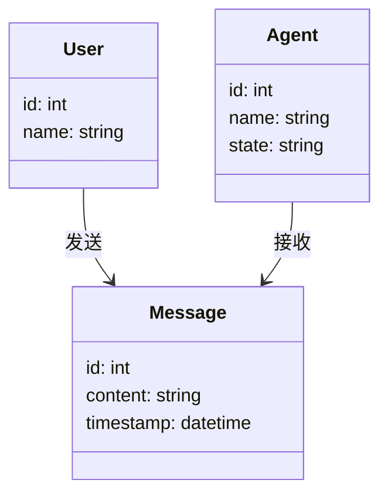
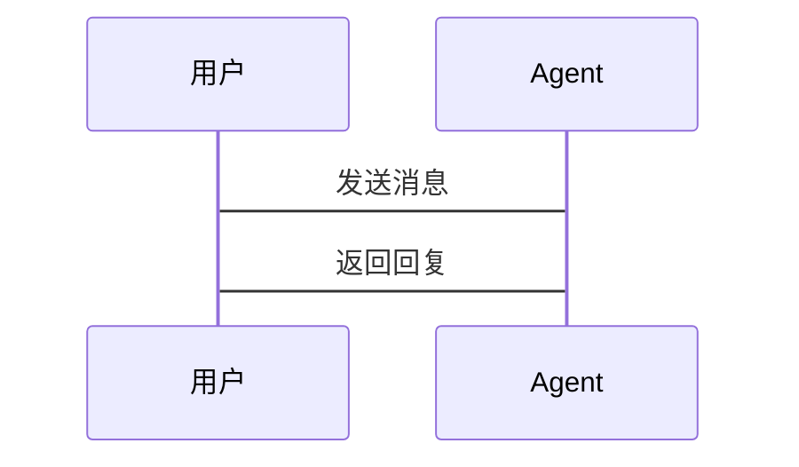

                 


# AI Agent的多轮对话能力增强

> 关键词：AI Agent，多轮对话，自然语言处理，上下文管理，对话生成模型，对话理解模型

> 摘要：本文系统地探讨了AI Agent的多轮对话能力增强的关键技术，包括核心概念、算法原理、系统架构、项目实战以及最佳实践。通过详细的技术分析和实际案例，展示了如何提升AI Agent在多轮对话中的理解和生成能力，实现更自然、流畅的交互体验。

---

## 第1章: AI Agent的基本概念

### 1.1 AI Agent的定义与特点

AI Agent（人工智能代理）是指能够感知环境并采取行动以实现目标的智能实体。与传统程序不同，AI Agent具备以下特点：

- **自主性**：能够在没有外部干预的情况下自主决策。
- **反应性**：能够实时感知环境并做出反应。
- **目标导向**：通过采取行动来实现预设目标。
- **学习能力**：能够通过经验改进性能。

AI Agent的应用场景广泛，包括智能助手、自动驾驶、智能客服等。

### 1.2 多轮对话的必要性

在实际应用中，单轮对话无法满足复杂场景的需求，例如需要上下文理解的任务。多轮对话能够通过多次交互，逐步明确用户需求，提高对话的准确性和效率。

---

## 第2章: AI Agent的多轮对话能力背景

### 2.1 多轮对话的背景介绍

当前，AI对话系统主要以单轮对话为主，难以处理复杂场景。多轮对话能力的增强能够提升用户体验，使其更加智能化和人性化。

### 2.2 多轮对话的核心问题

多轮对话的核心问题包括对话历史的处理、上下文的理解与记忆、对话目标的动态调整等。

---

## 第3章: AI Agent的多轮对话能力的核心概念

### 3.1 多轮对话能力的定义

多轮对话能力是指AI Agent能够通过多次交互，理解上下文并生成连贯的对话内容的能力。

### 3.2 多轮对话能力的关键技术

- **对话生成模型**：基于RNN或Transformer的模型，生成符合上下文的回复。
- **对话理解模型**：理解用户输入的意图和情感。
- **上下文管理技术**：存储和检索对话历史。

### 3.3 多轮对话能力与相关技术的联系

- **与自然语言处理的关系**：NLP技术为对话理解和生成提供基础。
- **与知识图谱的关系**：知识图谱为对话提供背景知识。
- **与对话系统架构的关系**：架构设计影响对话系统的性能。

---

## 第4章: 多轮对话能力的算法原理

### 4.1 对话生成模型

#### 4.1.1 基于RNN的对话生成

使用循环神经网络处理序列数据，生成回复。模型结构包括编码器和解码器。

#### 4.1.2 基于Transformer的对话生成

采用自注意力机制，捕捉全局上下文信息，生成更连贯的回复。

#### 4.1.3 深度强化学习在对话生成中的应用

通过强化学习优化对话策略，提升对话的自然度和流畅性。

### 4.2 对话理解模型

#### 4.2.1 基于BERT的对话理解

利用预训练语言模型BERT进行对话理解，提取意图和实体。

#### 4.2.2 基于注意力机制的对话理解

通过注意力机制聚焦关键部分，提升理解精度。

#### 4.2.3 对话上下文的表示方法

使用序列模型表示上下文，捕捉对话的动态变化。

### 4.3 上下文管理技术

#### 4.3.1 对话历史的存储与检索

采用数据库或缓存技术存储对话历史，支持快速检索。

#### 4.3.2 上下文的表示

使用向量表示上下文，便于模型处理。

---

## 第5章: AI Agent的多轮对话能力增强的系统架构

### 5.1 项目介绍

本项目旨在开发一个具备多轮对话能力的AI Agent，提升用户体验。

### 5.2 系统功能设计

#### 5.2.1 领域模型

使用Mermaid类图描述系统中的实体及其关系。



#### 5.2.2 系统架构设计

采用分层架构，包括数据层、业务逻辑层和表现层。


#### 5.2.3 接口设计

定义RESTful API接口，支持用户和Agent之间的交互。

#### 5.2.4 交互流程设计

使用Mermaid序列图描述对话流程。



---

## 第6章: 项目实战

### 6.1 环境安装

安装Python、TensorFlow、Keras等依赖库。

### 6.2 核心代码实现

#### 6.2.1 对话生成模型代码

```python
import tensorflow as tf
from tensorflow.keras import layers

# 定义模型
def build_model(max_length):
    encoder = layers.Input(shape=(max_length,))
    embedding = layers.Embedding(vocab_size, embedding_dim)(encoder)
    encoder_lstm = layers.LSTM(hidden_units)(embedding)
    
    decoder = layers.Input(shape=(None,))
    decoder_embedding = layers.Embedding(vocab_size, embedding_dim)(decoder)
    decoder_lstm = layers.LSTM(hidden_units)(decoder_embedding, initial_state=[encoder_lstm])
    output = layers.Dense(vocab_size, activation='softmax')(decoder_lstm)
    
    model = tf.keras.Model(inputs=[encoder, decoder], outputs=output)
    model.compile(optimizer='adam', loss='sparse_categorical_crossentropy')
    return model
```

#### 6.2.2 对话理解模型代码

```python
import bert

def build_bert_model():
    bert_layer = bert.BertModelLayer(bert_config)
    input_ids = tf.keras.Input(shape=(max_seq_length,), dtype='int32')
    input_mask = tf.keras.Input(shape=(max_seq_length,), dtype='int32')
    embeddings, _ = bert_layer([input_ids, input_mask])
    pooled_output = layers.Dense(1, activation='sigmoid')(embeddings)
    model = tf.keras.Model(inputs=[input_ids, input_mask], outputs=pooled_output)
    model.compile(optimizer='adam', loss='binary_crossentropy')
    return model
```

### 6.3 代码应用解读与分析

解释代码的功能和实现细节，展示如何使用上述代码实现对话生成和理解。

### 6.4 实际案例分析

通过具体案例，展示如何应用上述技术解决问题。

### 6.5 项目小结

总结项目的实现过程，讨论遇到的问题和解决方案。

---

## 第7章: 最佳实践与小结

### 7.1 最佳实践

- **数据质量**：使用高质量的训练数据，提升模型性能。
- **模型优化**：采用合适的优化策略，提高对话质量。
- **用户体验**：设计友好的交互界面，提升用户体验。

### 7.2 小结

本文详细探讨了AI Agent的多轮对话能力增强的关键技术，从理论到实践，展示了如何提升对话系统的性能。

### 7.3 注意事项

- **数据隐私**：注意数据的安全和隐私保护。
- **性能优化**：优化模型的计算效率，降低资源消耗。

### 7.4 拓展阅读

推荐相关领域的书籍和论文，供读者深入学习。

---

## 作者信息

作者：AI天才研究院/AI Genius Institute & 禅与计算机程序设计艺术/Zen And The Art of Computer Programming

---

以上是《AI Agent的多轮对话能力增强》的完整内容，涵盖从基础到高级的技术细节和实际应用。

