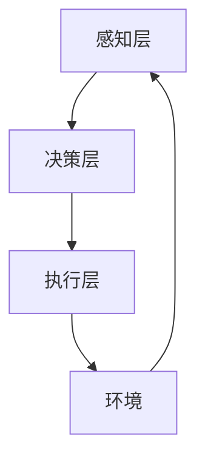

                 


# AI Agent的实时决策系统设计

> 关键词：AI Agent，实时决策，强化学习，系统架构，算法原理，项目实战

> 摘要：本文详细探讨了AI Agent在实时决策系统中的设计与实现，涵盖核心概念、算法原理、系统架构、项目实战等方面，帮助读者全面理解AI Agent的实时决策机制及其应用场景。

---

# 第1章: AI Agent的实时决策系统概述

## 1.1 AI Agent的基本概念

### 1.1.1 什么是AI Agent
AI Agent（人工智能代理）是一种能够感知环境、做出决策并执行动作的智能实体。它通过与环境交互，利用传感器获取信息，利用执行器采取行动，以实现特定目标。

### 1.1.2 AI Agent的核心特征
AI Agent具有以下核心特征：
1. **自主性**：能够自主决策，无需外部干预。
2. **反应性**：能够实时感知环境并快速响应。
3. **目标导向**：基于目标驱动决策过程。
4. **学习能力**：能够通过经验改进决策策略。

### 1.1.3 AI Agent的应用场景
AI Agent广泛应用于多个领域，例如：
- **自动驾驶**：实时感知环境并做出驾驶决策。
- **智能家居**：根据用户行为调整设备状态。
- **机器人控制**：实现复杂任务的自主执行。

## 1.2 实时决策系统的定义与特点

### 1.2.1 实时决策的定义
实时决策是指在极短时间内，基于当前环境状态，快速做出决策并执行动作的过程。

### 1.2.2 实时决策的核心要求
1. **快速响应**：决策过程必须在限定时间内完成。
2. **准确性**：决策结果必须准确可靠。
3. **适应性**：能够适应动态变化的环境。

### 1.2.3 AI Agent在实时决策中的作用
AI Agent通过整合感知、推理和执行功能，成为实时决策系统的核心组成部分。

## 1.3 本章小结
本章介绍了AI Agent的基本概念、核心特征及其在实时决策系统中的作用，为后续内容奠定了基础。

---

# 第2章: AI Agent的核心概念与原理

## 2.1 AI Agent的核心概念

### 2.1.1 状态空间
状态空间是系统可能处于的所有状态的集合，每个状态代表环境的一个可能配置。

### 2.1.2 动作空间
动作空间是AI Agent在某一状态下可以执行的所有动作的集合。

### 2.1.3 奖励函数
奖励函数定义了AI Agent在执行某个动作后所获得的奖励值，用于指导学习过程。

### 2.1.4 策略与价值函数
- **策略**：决定AI Agent在某一状态下选择哪个动作的规则。
- **价值函数**：评估某状态下采取某个动作后的预期收益。

## 2.2 AI Agent的核心原理

### 2.2.1 状态-动作-奖励-状态（SARSA）循环
SARSA循环描述了强化学习的基本过程，包括：
1. **感知状态**：观察当前环境状态。
2. **选择动作**：基于当前策略选择一个动作。
3. **执行动作**：执行选择的动作并观察环境变化。
4. **获取奖励**：根据动作结果获得奖励。
5. **更新策略**：基于奖励更新策略。

### 2.2.2 Q-learning算法原理
Q-learning是一种经典的强化学习算法，通过更新Q值表来学习最优策略。

## 2.3 AI Agent与其他概念的对比

### 2.3.1 AI Agent与传统自动机的区别
- **自主性**：AI Agent具有自主决策能力，而传统自动机通常基于固定规则。
- **学习能力**：AI Agent能够通过经验改进，而传统自动机不具备学习能力。

### 2.3.2 AI Agent与强化学习的关系
AI Agent是强化学习的重要应用场景，强化学习为AI Agent提供了决策优化的理论基础。

## 2.4 本章小结
本章详细讲解了AI Agent的核心概念和原理，重点分析了状态空间、动作空间、奖励函数等关键要素，并通过对比帮助读者理解AI Agent的独特性。

---

# 第3章: AI Agent实时决策系统的算法原理

## 3.1 基于强化学习的AI Agent算法

### 3.1.1 强化学习的基本原理
强化学习通过智能体与环境的交互，学习最优策略以最大化累计奖励。

### 3.1.2 SARSA算法的数学模型
SARSA算法的更新公式为：
$$ Q(s, a) \leftarrow Q(s, a) + \alpha \left[r + \gamma Q(s', a') - Q(s, a)\right] $$
其中：
- $\alpha$ 是学习率。
- $\gamma$ 是折扣因子。
- $r$ 是即时奖励。

### 3.1.3 Q-learning算法的数学模型
Q-learning算法的更新公式为：
$$ Q(s, a) \leftarrow Q(s, a) + \alpha \left[r + \gamma \max_{a'} Q(s', a') - Q(s, a)\right] $$

## 3.2 基于模型的决策方法

### 3.2.1 动态模型的构建
动态模型用于预测下一状态，公式为：
$$ P(s' | s, a) $$

### 3.2.2 策略评估与改进
- **策略评估**：计算在当前策略下的价值函数。
- **策略改进**：基于评估结果改进策略。

## 3.3 算法的优缺点对比

### 3.3.1 SARSA算法
- **优点**：适合处理离散动作空间。
- **缺点**：收敛速度较慢。

### 3.3.2 Q-learning算法
- **优点**：无需选择动作，适用于连续动作空间。
- **缺点**：在某些情况下可能出现Q值更新不稳定。

## 3.4 本章小结
本章详细分析了基于强化学习的AI Agent算法，重点讲解了SARSA和Q-learning算法的数学模型和优缺点。

---

# 第4章: AI Agent实时决策系统的系统架构设计

## 4.1 系统结构设计

### 4.1.1 感知层
感知层负责接收环境信息，包括传感器数据和状态信息。

### 4.1.2 决策层
决策层基于感知信息和历史经验，计算出最优动作。

### 4.1.3 执行层
执行层负责将决策层输出的动作转化为实际操作。

## 4.2 系统交互流程

### 4.2.1 状态感知
AI Agent通过传感器获取当前状态信息。

### 4.2.2 动作选择
基于当前状态和历史经验，选择最优动作。

### 4.2.3 执行反馈
执行动作并观察环境变化，获取反馈信息。

## 4.3 系统架构设计图


## 4.4 本章小结
本章详细介绍了AI Agent实时决策系统的系统架构设计，包括感知层、决策层和执行层的交互流程。

---

# 第5章: AI Agent实时决策系统的项目实战

## 5.1 项目背景与目标

### 5.1.1 项目背景
以智能交通系统为例，设计一个基于AI Agent的实时路径规划系统。

## 5.2 系统环境搭建

### 5.2.1 环境安装
- 安装Python、TensorFlow和OpenAI Gym库。

## 5.3 核心代码实现

### 5.3.1 状态感知
```python
def get_state():
    # 获取当前交通状态
    pass
```

### 5.3.2 动作选择
```python
def choose_action(state):
    # 基于状态选择动作
    pass
```

### 5.3.3 执行反馈
```python
def execute_action(action):
    # 执行动作并返回反馈
    pass
```

## 5.4 功能解读与分析
通过代码实现路径规划功能，AI Agent能够实时调整路径以避开障碍。

## 5.5 项目小结
本章通过具体案例展示了AI Agent实时决策系统的实现过程，帮助读者理解理论知识的实际应用。

---

# 第6章: 总结与展望

## 6.1 本章总结
本文详细探讨了AI Agent的实时决策系统设计，涵盖核心概念、算法原理、系统架构和项目实战等方面。

## 6.2 当前挑战与未来方向
- **计算资源限制**：实时决策需要高性能计算支持。
- **多智能体协作**：复杂场景下的多智能体协作仍需进一步研究。
- **人机协作**：如何实现人与AI Agent的有效协作是一个重要方向。

## 6.3 未来展望
随着技术进步，AI Agent的实时决策系统将在更多领域得到广泛应用。

## 6.4 注意事项
在实际应用中，需注意算法的实时性和稳定性，避免决策错误导致的严重后果。

---

# 作者：AI天才研究院/AI Genius Institute & 禅与计算机程序设计艺术 /Zen And The Art of Computer Programming

---

**说明：**  
本文内容涵盖了AI Agent实时决策系统设计的各个方面，通过理论分析和实际案例，帮助读者深入理解其设计与实现。由于篇幅限制，每个部分的具体实现细节和技术细节未全部展开，建议读者结合相关文献进一步研究。

