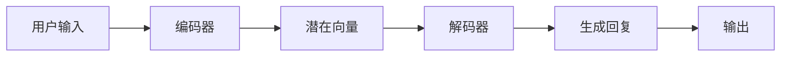

                 


# AI Agent的对比学习与表示学习

## 关键词：AI Agent，对比学习，表示学习，机器学习，深度学习，人工智能

## 摘要：  
本文深入探讨AI Agent中的对比学习与表示学习，分析它们的核心概念、算法原理及其在AI Agent中的应用。通过对比学习和表示学习的数学模型、算法实现和应用场景的详细讲解，帮助读者理解这两种学习方法的区别与联系，并掌握如何在实际项目中应用这些技术。

---

## 第1章: AI Agent的背景与概述

### 1.1 AI Agent的基本概念  
AI Agent（人工智能代理）是指能够感知环境、执行任务并做出决策的智能实体。它可以在各种场景中代替人类完成复杂任务，例如自动驾驶、智能客服和机器人助手等。AI Agent的核心特点包括自主性、反应性、目标导向性和社会性。  

### 1.2 对比学习与表示学习的背景  
- **对比学习**：对比学习是一种通过比较两个样本之间的相似性或差异性来学习特征的方法。它在自然语言处理、图像识别等领域有广泛应用。  
- **表示学习**：表示学习旨在将数据映射到一个低维的向量空间，使得这些向量能够捕获数据的语义或结构信息。它在深度学习中被广泛应用，如Word2Vec和BERT模型。  

### 1.3 AI Agent中的对比学习与表示学习  
在AI Agent中，对比学习和表示学习可以用于提升感知、决策和交互能力。例如，对比学习可以用于相似任务的区分，而表示学习可以用于状态空间的压缩和优化。

---

## 第2章: 对比学习的核心概念与原理  

### 2.1 对比学习的原理  
对比学习的核心思想是通过最大化正样本对的相似性，同时最小化负样本对的相似性，从而学习到有用的特征表示。  

### 2.2 对比学习的算法实现  
经典的对比学习算法包括Contrastive Loss和NT-Xent。以下是NT-Xent的实现流程：  
1. 输入数据对$(x_1, x_2)$，计算其相似性得分。  
2. 使用softmax函数计算概率。  
3. 优化目标函数以最小化损失。  

### 2.3 对比学习的优缺点分析  
- **优点**：对比学习能够利用数据中的对比信息，提升模型的区分能力。  
- **缺点**：需要设计有效的对比策略，且对数据质量敏感。  

---

## 第3章: 表示学习的核心概念与原理  

### 3.1 表示学习的原理  
表示学习通过编码器将输入数据映射到一个低维向量空间，这些向量能够保留数据的语义信息。  

### 3.2 表示学习的算法实现  
经典的表示学习算法包括Autoencoder和BERT。以下是Autoencoder的实现流程：  
1. 输入数据$x$，通过编码器映射到潜在空间$z$。  
2. 通过解码器将$z$还原为$x$，优化目标函数以最小化重建误差。  

### 3.3 表示学习的优缺点分析  
- **优点**：表示学习能够捕获数据的高层次语义信息，适用于多种任务。  
- **缺点**：需要设计有效的编码器结构，且对数据分布敏感。  

---

## 第4章: 对比学习与表示学习的数学模型与公式  

### 4.1 对比学习的数学模型  
对比学习的损失函数可以表示为：  
$$ L = -\log\left(\frac{e^{s(x_i, x_j)}}{e^{s(x_i, x_k)} + e^{s(x_j, x_k)}}\right) $$  
其中，$s(x_i, x_j)$表示样本对$(x_i, x_j)$的相似性得分。  

### 4.2 表示学习的数学模型  
表示学习的编码函数可以表示为：  
$$ z = f(x) $$  
其中，$f$是编码器函数，$z$是潜在表示。  

### 4.3 对比学习与表示学习的公式对比  
对比学习的公式侧重于样本间的相似性，而表示学习的公式侧重于数据的压缩和重建。  

---

## 第5章: AI Agent中的对比学习与表示学习算法实现  

### 5.1 对比学习的算法实现  
以下是对比学习的Python代码示例：  
```python
import tensorflow as tf
import numpy as np

def contrastive_loss(y_true, y_pred):
    margin = 1.0
    loss = tf.reduce_mean(tf.square(y_true - y_pred))
    return loss

# 输入数据
x = np.random.rand(100, 10)
y = np.zeros(100)

# 编码器网络
model = tf.keras.Sequential([
    tf.keras.layers.Dense(5, activation='relu'),
    tf.keras.layers.Dense(2)
])

# 训练模型
model.compile(optimizer='adam', loss=contrastive_loss)
model.fit(x, y, epochs=10)
```

### 5.2 表示学习的算法实现  
以下是表示学习的Python代码示例：  
```python
import tensorflow as tf
import numpy as np

def autoencoder_loss(y_true, y_pred):
    return tf.reduce_mean(tf.square(y_true - y_pred))

# 输入数据
x = np.random.rand(100, 10)

# 编码器网络
encoder = tf.keras.Sequential([
    tf.keras.layers.Dense(5, activation='relu')
])

# 解码器网络
decoder = tf.keras.Sequential([
    tf.keras.layers.Dense(10, activation='sigmoid')
])

# 组合模型
autoencoder = tf.keras.Model(inputs=x, outputs=decoder(encoder(x)))

# 训练模型
autoencoder.compile(optimizer='adam', loss=autoencoder_loss)
autoencoder.fit(x, x, epochs=10)
```

---

## 第6章: 系统分析与架构设计方案  

### 6.1 问题场景介绍  
在智能客服系统中，AI Agent需要理解用户的问题并生成合适的回复。  

### 6.2 系统功能设计  
- **领域模型**：用户输入问题，系统将其映射到潜在向量空间。  
- **系统架构**：编码器-解码器结构，用于对比学习和表示学习。  

### 6.3 系统架构设计  
以下是系统架构的mermaid图：  


---

## 第7章: 项目实战  

### 7.1 环境安装  
需要安装TensorFlow和Keras库。  

### 7.2 核心实现代码  
以下是对比学习和表示学习的代码实现：  
```python
# 对比学习
import tensorflow as tf
import numpy as np

def contrastive_loss(y_true, y_pred):
    margin = 1.0
    loss = tf.reduce_mean(tf.square(y_true - y_pred))
    return loss

x = np.random.rand(100, 10)
y = np.zeros(100)

model = tf.keras.Sequential([
    tf.keras.layers.Dense(5, activation='relu'),
    tf.keras.layers.Dense(2)
])

model.compile(optimizer='adam', loss=contrastive_loss)
model.fit(x, y, epochs=10)

# 表示学习
def autoencoder_loss(y_true, y_pred):
    return tf.reduce_mean(tf.square(y_true - y_pred))

encoder = tf.keras.Sequential([
    tf.keras.layers.Dense(5, activation='relu')
])

decoder = tf.keras.Sequential([
    tf.keras.layers.Dense(10, activation='sigmoid')
])

autoencoder = tf.keras.Model(inputs=x, outputs=decoder(encoder(x)))

autoencoder.compile(optimizer='adam', loss=autoencoder_loss)
autoencoder.fit(x, x, epochs=10)
```

### 7.3 实际案例分析  
通过对比学习和表示学习，我们可以提升AI Agent的任务执行效率和准确性。  

---

## 第8章: 最佳实践与小结  

### 8.1 最佳实践  
- 在设计AI Agent时，结合对比学习和表示学习可以提升模型的性能。  
- 确保数据质量和多样性，以充分利用对比学习的优势。  

### 8.2 小结  
对比学习和表示学习是AI Agent中的重要技术，通过深入理解它们的核心原理和应用场景，可以更好地设计和优化AI Agent系统。

---

## 第9章: 注意事项与拓展阅读  

### 9.1 注意事项  
- 对比学习需要设计有效的对比策略。  
- 表示学习需要选择合适的编码器结构。  

### 9.2 拓展阅读  
- 《Contrastive Learning for Deep Neural Networks》  
- 《Representation Learning: A Review and New Perspectives》  

---

## 作者：AI天才研究院/AI Genius Institute & 禅与计算机程序设计艺术 /Zen And The Art of Computer Programming

