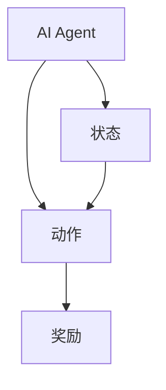
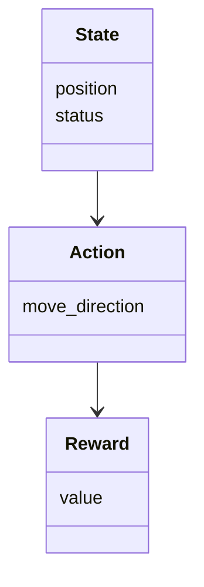
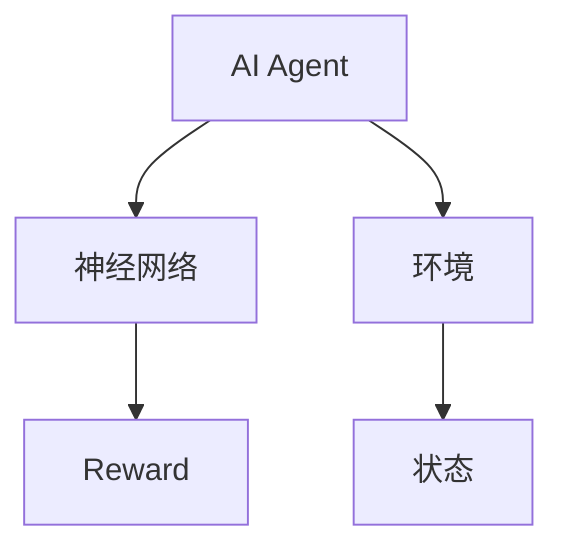

                 


# AI Agent的强化学习应用

> 关键词：AI Agent, 强化学习, 机器学习, 人工智能, 决策优化, 机器人控制, 自动交易

> 摘要：本文详细探讨了AI Agent在强化学习中的应用，从基础概念到算法原理，再到系统架构和实际项目案例，全面解析了如何利用强化学习提升AI Agent的决策能力。文章结合理论分析和实践操作，帮助读者理解强化学习在不同场景下的应用，掌握AI Agent设计的核心方法。

---

## 第1章: AI Agent与强化学习的基础概念

### 1.1 AI Agent的基本概念

#### 1.1.1 AI Agent的定义与特点
AI Agent（人工智能代理）是指能够感知环境、自主决策并采取行动的智能实体。其特点包括：
- **自主性**：无需外部干预，自主完成任务。
- **反应性**：能够实时感知环境变化并做出反应。
- **目标导向性**：以特定目标为导向，优化决策过程。
- **学习能力**：通过学习提升决策能力。

#### 1.1.2 强化学习的基本概念
强化学习是一种机器学习范式，通过智能体与环境的交互，逐步优化决策策略。其核心在于通过试错（trial-and-error）获得经验，并基于经验改进决策模型。

#### 1.1.3 AI Agent与强化学习的关系
AI Agent为强化学习提供决策主体，而强化学习则为AI Agent提供优化决策的机制。两者结合，使AI Agent能够在复杂环境中自主学习并做出最优决策。

---

### 1.2 强化学习的核心原理

#### 1.2.1 状态、动作与奖励的定义
- **状态（State）**：环境对AI Agent的当前反馈，如游戏中的棋盘状态。
- **动作（Action）**：AI Agent在给定状态下采取的具体行动，如移动棋子。
- **奖励（Reward）**：环境对AI Agent动作的反馈，用于指导学习。

#### 1.2.2 策略与价值函数的解释
- **策略（Policy）**：AI Agent在给定状态下选择动作的概率分布。
- **价值函数（Value Function）**：评估某状态下策略的优劣，指导AI Agent选择最优动作。

#### 1.2.3 探索与利用的平衡
AI Agent在强化学习过程中需要在**探索**（尝试新动作以发现更好的策略）和**利用**（利用已知最佳策略）之间找到平衡，以避免陷入局部最优。

---

## 第2章: AI Agent与强化学习的核心概念与联系

### 2.1 强化学习的数学模型

#### 2.1.1 状态空间的表示
状态空间由所有可能的状态组成，可以用向量或其他数据结构表示。例如，在棋类游戏中，状态可以表示为棋盘的具体布局。

#### 2.1.2 动作空间的定义
动作空间是AI Agent在给定状态下可采取的所有动作的集合。例如，在二维平面上移动，动作空间可以是上下左右四个方向。

#### 2.1.3 奖励函数的设计
奖励函数定义了AI Agent每一步动作的奖励值，通常通过领域专家定义。例如，在机器人导航任务中，接近目标点给予正奖励，碰撞障碍物给予负奖励。

---

### 2.2 AI Agent与强化学习的关系

#### 2.2.1 AI Agent作为强化学习主体
AI Agent是强化学习的核心主体，负责感知环境、选择动作并执行。

#### 2.2.2 强化学习驱动AI Agent决策
通过强化学习，AI Agent学习到最优策略，提升决策能力。

#### 2.2.3 AI Agent与环境的交互机制
AI Agent通过与环境交互，获得状态、动作和奖励信息，不断优化自身策略。

---

### 2.3 核心概念对比表

| 概念       | 描述                                                                 |
|------------|----------------------------------------------------------------------|
| 状态       | 环境对AI Agent的反馈，表示当前环境情况                                   |
| 动作       | AI Agent采取的具体行动                                               |
| 奖励       | 环境对AI Agent动作的评价，用于指导学习                                 |

---

### 2.4 实体关系图



---

## 第3章: 强化学习算法原理与AI Agent的结合

### 3.1 基础强化学习算法

#### 3.1.1 Q-Learning算法
Q-Learning是一种经典的强化学习算法，通过更新Q值表（Q-table）来学习最优策略。Q值表示在某状态下采取某动作的预期奖励。

**算法流程：**
1. 初始化Q值表。
2. 环境返回当前状态。
3. 根据策略选择动作。
4. 执行动作，获得奖励。
5. 更新Q值表：$$ Q(s, a) = Q(s, a) + \alpha [r + \gamma \max Q(s', a') - Q(s, a)] $$
6. 重复，直到收敛。

**代码示例：**
```python
import numpy as np

class QLearning:
    def __init__(self, state_size, action_size, alpha=0.1, gamma=0.9):
        self.state_size = state_size
        self.action_size = action_size
        self.alpha = alpha
        self.gamma = gamma
        self.q_table = np.zeros((state_size, action_size))

    def get_action(self, state):
        return np.argmax(self.q_table[state])

    def update_q_table(self, state, action, reward, next_state):
        self.q_table[state][action] = self.q_table[state][action] + self.alpha * (reward + self.gamma * np.max(self.q_table[next_state]) - self.q_table[state][action])
```

---

#### 3.1.2 Deep Q-Network (DQN)
DQN结合了深度神经网络和强化学习，通过神经网络近似Q值函数，避免了Q值表的维度灾难问题。

**网络结构：**
- 输入层：接收状态向量。
- 隐藏层：多个全连接层，提取特征。
- 输出层：输出每个动作的Q值。

**算法流程：**
1. 环境返回当前状态。
2. 神经网络输出所有动作的Q值。
3. 根据ε-greedy策略选择动作。
4. 执行动作，获得奖励。
5. 将（状态，动作，奖励，下一个状态）存入经验回放池。
6. 从经验回放池随机抽取一批样本，训练神经网络。

**代码示例：**
```python
import tensorflow as tf

class DQN:
    def __init__(self, state_size, action_size):
        self.state_size = state_size
        self.action_size = action_size
        self.model = self.build_model()
        self.target_model = self.build_model()
        self.update_target_weights()

    def build_model(self):
        model = tf.keras.Sequential([
            tf.keras.layers.Dense(32, activation='relu', input_shape=(state_size,)),
            tf.keras.layers.Dense(32, activation='relu'),
            tf.keras.layers.Dense(action_size, activation='linear')
        ])
        return model

    def update_target_weights(self):
        self.target_model.set_weights(self.model.get_weights())

    def get_action(self, state, epsilon=0.1):
        if np.random.random() < epsilon:
            return np.random.randint(self.action_size)
        q_values = self.model.predict(state)
        return np.argmax(q_values[0])
```

---

## 第4章: AI Agent的强化学习系统架构与实现

### 4.1 问题场景介绍

#### 4.1.1 项目背景
以一个简单的机器人导航任务为例，目标是让AI Agent控制机器人在迷宫中找到出口。

#### 4.1.2 系统功能需求
- 环境感知：获取当前状态。
- 动作选择：基于强化学习算法选择动作。
- 奖励机制：根据动作结果给予奖励。

---

### 4.2 系统架构设计

#### 4.2.1 领域模型设计


#### 4.2.2 系统架构


---

### 4.3 项目实现

#### 4.3.1 环境安装
- 安装必要的库：`pip install numpy tensorflow`

#### 4.3.2 核心代码实现
```python
class MazeEnvironment:
    def __init__(self, size):
        self.size = size
        self.goal = (size-1, size-1)
        self.start = (0, 0)

    def get_state(self, position):
        return position

    def step(self, action, current_state):
        # 根据动作更新状态，返回新的状态和奖励
        new_state = self.move(current_state, action)
        reward = self.give_reward(new_state)
        return new_state, reward

    def move(self, state, action):
        # 假设action是0-3：左、上、右、下
        directions = [(-1,0), (0,1), (1,0), (0,-1)]
        new_x = state[0] + directions[action][0]
        new_y = state[1] + directions[action][1]
        if new_x < 0 or new_x >= self.size or new_y < 0 or new_y >= self.size:
            return state
        return (new_x, new_y)

    def give_reward(self, state):
        if state == self.goal:
            return 1
        elif state == self.start:
            return -0.5
        else:
            return -0.1
```

---

## 第5章: 强化学习在AI Agent中的实际应用

### 5.1 游戏AI的实现

#### 5.1.1 游戏环境搭建
使用OpenAI Gym库创建一个简单的迷宫环境。

#### 5.1.2 策略训练
训练AI Agent在迷宫中找到出口，通过强化学习算法不断优化策略。

---

### 5.2 机器人控制的应用

#### 5.2.1 系统集成
将强化学习算法集成到机器人控制系统中，实现自主导航和路径规划。

---

### 5.3 自动交易的案例

#### 5.3.1 交易策略优化
利用强化学习优化股票交易策略，通过历史数据训练模型，实现自动化交易。

---

## 第6章: 最佳实践与注意事项

### 6.1 小结
- 强化学习是提升AI Agent决策能力的关键技术。
- Q-Learning和DQN是常用的强化学习算法。

### 6.2 注意事项
- 设计合理的奖励函数。
- 平衡探索与利用。
- 避免过拟合，保持策略的泛化能力。

### 6.3 拓展阅读
- 《Deep Reinforcement Learning》
- 《Reinforcement Learning: Theory and Algorithms》

---

## 作者：AI天才研究院/AI Genius Institute & 禅与计算机程序设计艺术 /Zen And The Art of Computer Programming

---

### 总结
本文通过详细讲解AI Agent与强化学习的基础概念、算法原理和系统架构，结合实际项目案例，展示了如何利用强化学习提升AI Agent的决策能力。从理论到实践，为读者提供了全面的知识体系和实操指南。

