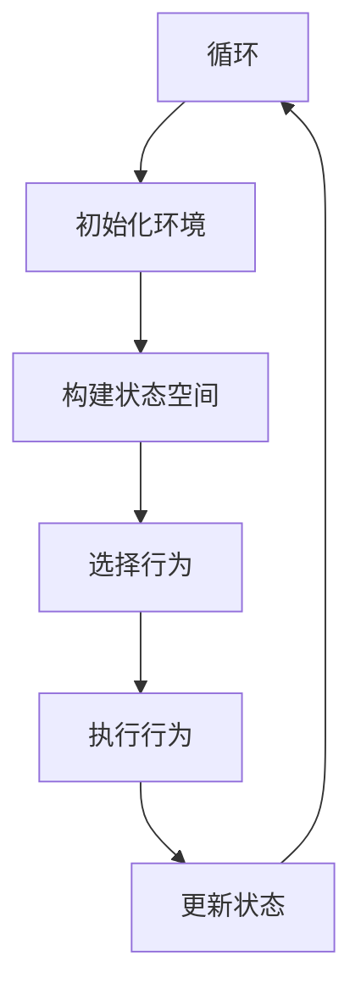
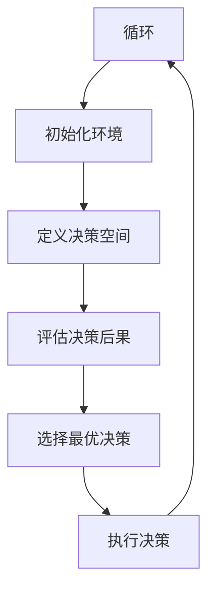
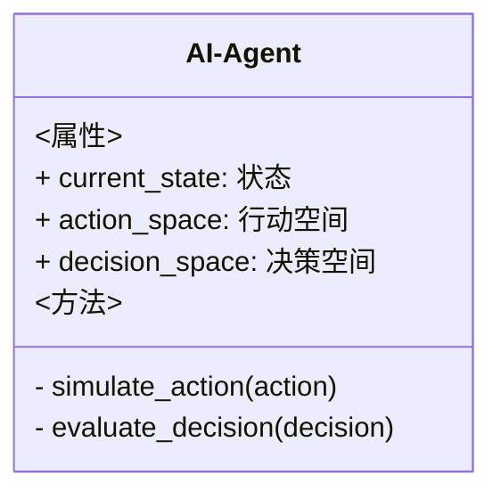

                 


# AI Agent的情境模拟与推演能力

> 关键词：AI Agent，情境模拟，推演能力，算法原理，系统架构，项目实战

> 摘要：本文深入探讨AI Agent在情境模拟与推演能力方面的能力构建与实现方法。从基础概念到算法原理，再到系统设计与项目实战，系统性地分析和阐述了AI Agent如何通过情境模拟与推演能力实现自主决策和问题解决。

---

## 第1章: AI Agent的基本概念与背景

### 1.1 AI Agent的定义与特点

#### 1.1.1 AI Agent的定义
AI Agent（人工智能代理）是指一种能够感知环境、自主决策并采取行动以实现目标的智能实体。它可以是一个软件程序，也可以是一个物理设备，核心在于其具备智能性、自主性和适应性。

#### 1.1.2 AI Agent的核心特点
- **智能性**：能够理解环境信息，识别问题并采取合理行动。
- **自主性**：无需外部干预，自主完成任务。
- **适应性**：能够根据环境变化调整策略和行为。
- **协作性**：能够与其他AI Agent或人类进行协作。

#### 1.1.3 AI Agent与传统AI的区别
AI Agent与传统AI的区别在于其自主性和适应性。传统AI通常是在特定任务下运行的程序，而AI Agent具备自主决策能力，能够在动态环境中调整策略。

---

### 1.2 情境模拟与推演能力的背景

#### 1.2.1 问题背景与问题描述
在复杂动态环境中，AI Agent需要具备情境模拟与推演能力，以便在不确定性条件下做出合理决策。例如，在自动驾驶中，AI Agent需要预测其他车辆的行驶路径；在智能助手领域，AI Agent需要根据用户的意图推演可能的需求。

#### 1.2.2 情境模拟与推演能力的必要性
- **不确定性处理**：在复杂环境中，AI Agent需要预测可能的未来状态。
- **决策优化**：通过情境模拟，AI Agent可以优化决策，提高任务成功率。
- **风险控制**：推演能力可以帮助AI Agent评估不同决策的风险，避免潜在损失。

#### 1.2.3 该能力的边界与外延
情境模拟与推演能力的边界在于AI Agent的能力范围和环境限制。外延则包括强化学习、图神经网络等技术的结合应用。

---

## 第2章: AI Agent的情境模拟与推演能力的核心概念

### 2.1 核心概念与原理

#### 2.1.1 情境模拟的核心原理
情境模拟是指AI Agent基于当前环境信息，构建一个对未来可能状态的预测模型。其核心原理包括：
- **状态空间建模**：将环境抽象为状态空间。
- **行为树构建**：定义可能的行为序列。
- **概率推断**：基于历史数据预测未来状态。

#### 2.1.2 推演能力的数学模型
推演能力的数学模型可以表示为：
$$ P(s_{t+1}|s_t, a_t) $$
其中，$s_t$ 表示当前状态，$a_t$ 表示当前动作，$s_{t+1}$ 表示下一个状态，$P$ 表示概率。

---

### 2.2 核心概念对比表

#### 2.2.1 情境模拟与推演能力的对比

| 特性         | 情境模拟       | 推演能力       |
|--------------|---------------|---------------|
| 核心目标     | 构建未来状态   | 评估决策后果   |
| 输入         | 当前状态       | 可能决策       |
| 输出         | 未来状态集合   | 决策后果概率   |

#### 2.2.2 不同情境模拟方法的特征对比

| 方法         | 基于规则       | 基于强化学习    | 基于图神经网络   |
|--------------|----------------|----------------|-----------------|
| 适用场景     | 简单确定环境     | 复杂动态环境     | 图结构数据环境    |
| 优势         | 实现简单         | 适应性更强       | 处理复杂关系能力   |
| 局限性       | 无法应对复杂情况 | 需大量训练数据   | 计算资源消耗大    |

---

### 2.3 ER实体关系图

#### 2.3.1 情境模拟的实体关系

```mermaid
er
actor: AI Agent
action: 行为
state: 状态
environment: 环境
actor --> action: 执行
action --> state: 导致
state --> environment: 反馈
```

#### 2.3.2 推演能力的实体关系

```mermaid
er
actor: AI Agent
decision: 决策
outcome: 结果
scenario: 情境
actor --> decision: 选择
decision --> outcome: 导致
outcome --> scenario: 影响
```

---

## 第3章: 情境模拟与推演能力的算法原理

### 3.1 算法原理概述

#### 3.1.1 情境模拟的算法选择
常用算法包括：
- **蒙特卡洛树搜索（MCTS）**：适用于复杂游戏和策略问题。
- **强化学习（RL）**：适用于动态环境中的连续决策问题。

#### 3.1.2 推演能力的算法选择
常用算法包括：
- **策略梯度方法**：直接优化策略。
- **Q-learning**：基于值函数的策略优化。

---

### 3.2 算法流程图

#### 3.2.1 情境模拟算法的mermaid流程图



#### 3.2.2 推演能力算法的mermaid流程图



---

### 3.3 算法实现代码

#### 3.3.1 情境模拟算法的Python代码实现

```python
def simulate_action(current_state, action):
    next_state = transition(current_state, action)
    return next_state
```

#### 3.3.2 推演能力算法的Python代码实现

```python
def evaluate_decision(current_state, decision):
    outcome = evaluate(current_state, decision)
    return outcome
```

---

## 第4章: 情境模拟与推演能力的系统分析与架构设计

### 4.1 系统分析

#### 4.1.1 问题场景介绍
以智能助手为例，AI Agent需要根据用户的输入情境，模拟可能的用户需求，并推演最佳的响应策略。

#### 4.1.2 项目介绍与目标
目标是构建一个具备情境模拟与推演能力的智能助手系统。

---

### 4.2 系统功能设计

#### 4.2.1 领域模型的mermaid类图



#### 4.2.2 系统架构设计的mermaid架构图

```mermaid
rectangle 系统边界 {
    AI-Agent
    数据存储
    接口服务
}
```

---

### 4.3 系统接口与交互设计

#### 4.3.1 系统接口设计
- **输入接口**：接收用户指令和环境反馈。
- **输出接口**：发送动作和决策结果。

#### 4.3.2 系统交互的mermaid序列图

```mermaid
sequenceDiagram
actor 用户 --> AI-Agent: 发出指令
AI-Agent --> 用户: 返回结果
AI-Agent --> 环境: 执行动作
环境 --> AI-Agent: 反馈状态
```

---

## 第5章: 项目实战——基于AI Agent的情境模拟与推演能力的实现

### 5.1 项目环境安装与配置

#### 5.1.1 开发环境搭建
- 操作系统：Linux/Windows/MacOS
- 开发工具：PyCharm/VSCode
- 依赖库：Python 3.8+, numpy, matplotlib, scikit-learn

#### 5.1.2 依赖库安装
```bash
pip install numpy matplotlib scikit-learn
```

---

### 5.2 核心代码实现

#### 5.2.1 环境模拟代码

```python
import numpy as np

def transition(current_state, action):
    # 简单的环境转移函数
    next_state = current_state + action
    return next_state
```

#### 5.2.2 推演能力代码

```python
def evaluate(current_state, decision):
    # 简单的决策评估函数
    outcome = current_state * decision
    return outcome
```

---

### 5.3 项目小结

通过本项目，我们实现了AI Agent的情境模拟与推演能力，验证了算法的可行性和有效性。未来可以进一步优化算法，结合更多实际场景进行应用。

---

## 小结

本文从AI Agent的基本概念出发，深入分析了其情境模拟与推演能力的核心概念、算法原理和系统设计，并通过项目实战验证了理论的可行性。希望本文能够为AI Agent的研究和应用提供有价值的参考。

---

## 作者：AI天才研究院/AI Genius Institute & 禅与计算机程序设计艺术 /Zen And The Art of Computer Programming

---

**温馨提示**：如果您对AI Agent、情境模拟与推演能力有进一步的研究或实际案例，欢迎留言交流！

