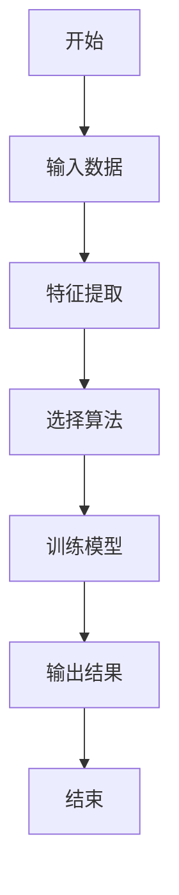
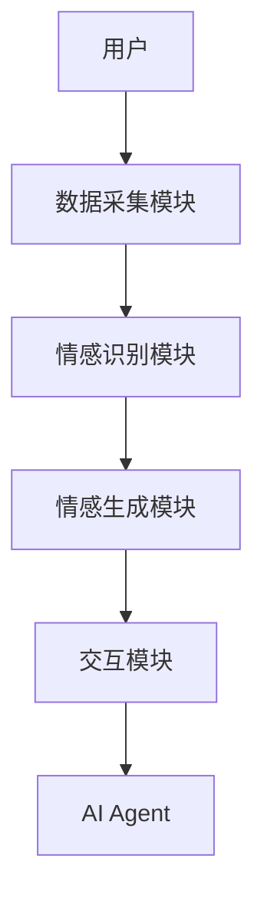

                 


---

# AI Agent的情感计算与应用

> 关键词：AI Agent, 情感计算, 人机交互, 深度学习, 自然语言处理, 情感分析

> 摘要：本文探讨AI Agent如何通过情感计算实现与人类的高效、情感化交互。文章从情感计算的基本概念、AI Agent的定义与特点出发，详细分析情感计算在AI Agent中的应用原理、算法实现和系统架构设计。通过具体案例分析，展示情感计算在实际项目中的应用价值，并总结情感计算在AI Agent未来发展中的关键点和注意事项。

---

## 第一部分: AI Agent情感计算的背景与概念

### 第1章: AI Agent与情感计算概述

#### 1.1 情感计算的基本概念

情感计算（Affective Computing）是一种通过计算机技术来识别、理解和模拟人类情感的新兴领域。它结合了心理学、认知科学、计算机科学等多个学科的知识，旨在让计算机能够像人类一样理解和响应情感信息。情感计算的核心目标是通过分析用户的语言、语气、面部表情和行为模式，推断出用户的情感状态，从而提供更智能化的服务。

- 情感计算的关键任务包括情感识别、情感分析和情感生成。
- 情感计算的应用场景非常广泛，包括智能客服、教育辅助、心理健康支持、智能家居等领域。

#### 1.2 AI Agent的定义与特点

AI Agent（人工智能代理）是指具有自主决策和执行任务能力的智能体。与传统程序不同，AI Agent能够感知环境、理解用户需求，并通过自主决策来完成目标。AI Agent的特点包括：

- **自主性**：AI Agent能够在没有外部干预的情况下独立运行。
- **反应性**：能够实时感知环境变化并做出响应。
- **目标导向**：AI Agent的行为以实现特定目标为导向。
- **学习能力**：能够通过学习不断优化自身的决策和行为。

#### 1.3 AI Agent情感计算的必要性

在AI Agent与人类交互的过程中，情感计算起到了桥梁作用。通过情感计算，AI Agent能够更好地理解用户的情感需求，从而提供更贴心的服务。

- 情感计算在人机交互中的作用：通过情感识别，AI Agent能够理解用户的当前情绪状态，从而调整交互策略。
- 情感计算对AI Agent能力的提升：情感计算使得AI Agent能够从简单的信息处理升级到情感化服务，显著提升用户体验。
- 情感计算的边界与外延：情感计算不仅关注用户的情感状态，还包括情感的表达和生成，从而实现更复杂的交互。

### 1.4 本章小结

本章从情感计算的基本概念和AI Agent的定义与特点入手，分析了情感计算在AI Agent中的重要性。通过理解情感计算的核心任务和AI Agent的特点，读者可以更好地理解情感计算在人机交互中的应用价值。

---

## 第二部分: 情感计算的核心概念与原理

### 第2章: 情感计算的核心概念

#### 2.1 情感计算的理论基础

情感计算的理论基础涉及多个学科，包括心理学、认知科学和计算机科学。

- **心理学基础**：人类情感是由生理和心理因素共同作用的结果，情感计算需要模拟这些因素。
- **认知科学基础**：情感与认知过程密切相关，情感计算需要结合认知模型来理解情感。
- **计算机科学基础**：情感计算依赖于机器学习、自然语言处理等技术，通过算法实现情感识别和分析。

#### 2.2 情感计算与AI Agent的关系

AI Agent的情感计算能力是其智能化的核心部分。通过情感计算，AI Agent能够理解用户的情感需求，从而提供更个性化的服务。

- **情感计算在AI Agent中的位置**：情感计算是AI Agent实现高级交互的基础技术。
- **情感计算对AI Agent能力的提升**：情感计算使得AI Agent能够从简单的信息处理升级到情感化服务。
- **情感计算与AI Agent目标的一致性**：AI Agent的目标是提供更智能、更贴心的服务，情感计算是实现这一目标的关键技术。

#### 2.3 情感计算的核心原理

情感计算的核心原理包括情感识别、情感分析和情感生成。

- **情感识别**：通过分析用户的语言、语气、面部表情等信息，识别出用户的情感状态。
- **情感分析**：对用户的情感状态进行分类，如正面、负面或中性。
- **情感生成**：根据用户的情感需求，生成相应的情感表达，如语气、表情或语言。

#### 2.4 本章小结

本章从情感计算的理论基础出发，分析了情感计算与AI Agent的关系，详细阐述了情感计算的核心原理。通过理解这些内容，读者可以更好地掌握情感计算在AI Agent中的应用。

---

## 第三部分: 情感计算的算法原理与实现

### 第3章: 情感计算的算法原理

#### 3.1 情感计算的常用算法

情感计算的常用算法包括基于机器学习的情感分类算法和基于深度学习的情感分类算法。

- **基于机器学习的情感分类算法**：如支持向量机（SVM）和随机森林（Random Forest），这些算法通常依赖于特征工程，需要手动提取情感相关的特征。
- **基于深度学习的情感分类算法**：如卷积神经网络（CNN）和循环神经网络（RNN），这些算法能够自动学习情感相关的特征，适用于处理文本数据。

#### 3.2 情感计算的数学模型

情感计算的数学模型包括情感分类模型和情感生成模型。

- **情感分类模型**：通常使用逻辑回归（Logistic Regression）或支持向量机（SVM）进行分类。
- **情感生成模型**：如生成对抗网络（GAN）或变体自编码器（VAE），用于生成情感化文本或语音。

#### 3.3 情感计算的算法流程图

以下是情感计算的算法流程图：



#### 3.4 本章小结

本章详细介绍了情感计算的常用算法和数学模型，并通过流程图展示了情感计算的算法流程。通过理解这些内容，读者可以更好地掌握情感计算的实现方法。

---

## 第四部分: AI Agent情感计算的系统架构与设计

### 第4章: AI Agent情感计算的系统架构

#### 4.1 系统架构概述

AI Agent情感计算的系统架构通常包括以下几个模块：

- **数据采集模块**：负责采集用户的情感数据，如文本、语音和面部表情。
- **情感识别模块**：通过算法对用户的情感数据进行识别和分类。
- **情感生成模块**：根据识别出的情感状态，生成相应的情感表达。
- **交互模块**：负责与用户进行实时交互，根据情感状态调整交互策略。

#### 4.2 系统架构设计

以下是AI Agent情感计算的系统架构图：



#### 4.3 本章小结

本章从系统架构的角度，详细介绍了AI Agent情感计算的各个模块及其相互关系。通过理解这些内容，读者可以更好地掌握情感计算在AI Agent中的实现方式。

---

## 第五部分: 项目实战

### 第5章: 项目实战

#### 5.1 项目介绍

本项目旨在实现一个基于AI Agent的情感计算系统，能够通过文本分析识别用户的情感状态，并生成相应的情感化响应。

#### 5.2 环境配置

- **Python版本**：3.8及以上
- **依赖库**：numpy, pandas, scikit-learn, tensorflow

#### 5.3 核心实现

以下是情感分类的核心代码：

```python
import numpy as np
from sklearn.feature_extraction.text import TfidfVectorizer
from sklearn.svm import SVC

# 数据预处理
X = [...]  # 文本数据
y = [...]  # 标签

# 特征提取
vectorizer = TfidfVectorizer()
X_vec = vectorizer.fit_transform(X)

# 训练模型
model = SVC()
model.fit(X_vec, y)

# 预测
new_text = [...]  # 新文本
new_vec = vectorizer.transform([new_text])
prediction = model.predict(new_vec)[0]

print(f"预测结果：{prediction}")
```

#### 5.4 项目小结

本章通过一个具体案例，详细介绍了情感计算在实际项目中的应用。通过代码实现和案例分析，读者可以更好地理解情感计算的实现过程。

---

## 第六部分: 最佳实践与小结

### 第6章: 最佳实践

#### 6.1 注意事项

- 在情感计算中，数据的质量和多样性非常重要，需要确保数据的代表性和平衡性。
- 情感计算的结果需要结合上下文进行解释，避免误判。
- 情感计算的应用需要遵守伦理规范，保护用户隐私。

#### 6.2 未来趋势

- 情感计算将更加智能化和个性化，AI Agent能够根据用户的实时情感状态提供更精准的服务。
- 情感计算将与增强现实（AR）和虚拟现实（VR）技术结合，提供更沉浸式的交互体验。
- 情感计算将更加注重隐私保护，确保用户数据的安全性。

### 6.3 本章小结

本章总结了情感计算在AI Agent中的应用，并提出了未来的发展方向和注意事项。通过这些内容，读者可以更好地理解情感计算的未来趋势和实际应用中的注意事项。

---

## 作者信息

作者：AI天才研究院/AI Genius Institute & 禅与计算机程序设计艺术 /Zen And The Art of Computer Programming

---

**全文完**

