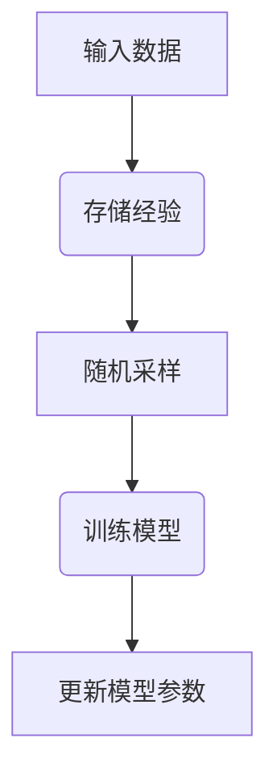
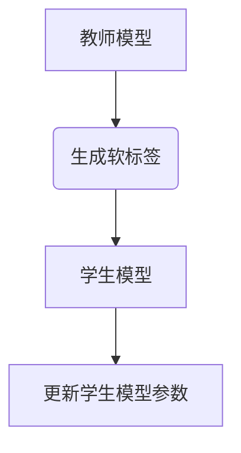
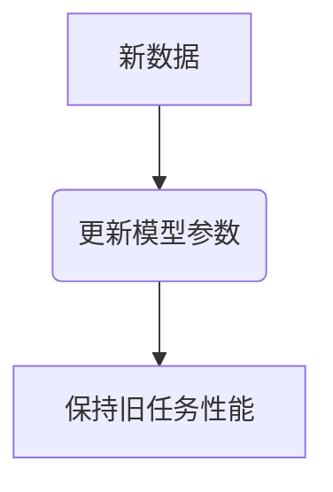
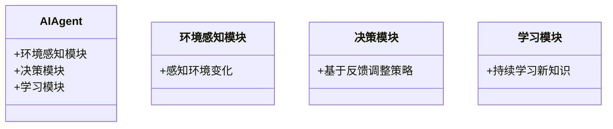
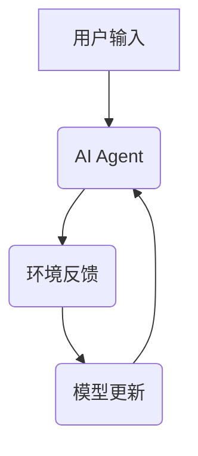
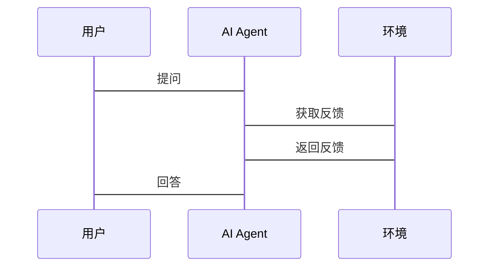

                 


# AI Agent的持续学习与适应机制

> 关键词：AI Agent, 持续学习, 适应机制, 在线学习, 动态环境, 自适应学习

> 摘要：本文详细探讨了AI Agent的持续学习与适应机制，从基本概念、核心原理到算法实现，结合实际案例，全面解析了AI Agent在动态环境中的学习与适应策略。通过对比分析、算法实现和系统设计，为读者提供了一套完整的理论与实践相结合的解决方案。

---

## 第一部分: AI Agent的持续学习与适应机制概述

### 第1章: AI Agent的基本概念与背景

#### 1.1 AI Agent的定义与特点

**1.1.1 AI Agent的定义**

AI Agent（人工智能代理）是指能够感知环境、做出决策并采取行动以实现目标的智能实体。与传统的静态模型不同，AI Agent具备动态适应能力，能够在不断变化的环境中自主调整行为策略。

**1.1.2 AI Agent的核心特点**

- **自主性**：AI Agent能够独立决策和行动，无需外部干预。
- **反应性**：能够实时感知环境变化并做出反应。
- **目标导向性**：通过设定目标来驱动行为，优化决策过程。
- **可扩展性**：能够适应不同规模和复杂度的任务需求。

**1.1.3 AI Agent与传统AI的区别**

| 特性       | 传统AI                            | AI Agent                       |
|------------|-----------------------------------|--------------------------------|
| 智能性     | 基于规则或静态模型                | 具备动态学习与适应能力         |
| 交互性     | 单向输入输出                      | 双向互动，具备反馈机制         |
| 环境适应性 | 静态或固定环境                    | 动态环境，具备自适应能力       |

#### 1.2 持续学习与适应机制的背景

**1.2.1 持续学习的定义与背景**

持续学习（Continual Learning）是指AI系统在运行过程中不断吸收新的数据和知识，以优化现有模型或扩展功能。其核心目标是使AI系统能够像人类一样，通过不断的学习和经验积累，提升自身的智能水平。

**1.2.2 适应机制的定义与背景**

适应机制（Adaptation Mechanism）是指AI系统根据环境反馈和任务需求，动态调整自身行为策略的能力。适应机制的核心在于通过实时反馈优化决策过程，确保AI系统能够在复杂多变的环境中保持高效运作。

**1.2.3 持续学习与适应机制的重要性**

在动态环境中，AI Agent需要面对不断变化的任务需求和环境条件。通过持续学习与适应机制，AI Agent能够快速响应变化，提升任务完成效率，降低错误率。

#### 1.3 问题背景与问题描述

**1.3.1 AI Agent面临的挑战**

- **动态环境中的不确定性**：环境条件的变化可能导致AI Agent的原有模型失效。
- **任务需求的多样性**：不同任务之间可能存在冲突，需要动态调整策略。
- **数据稀疏性与噪声**：实时数据可能不完整或存在噪声，影响学习效果。

**1.3.2 持续学习与适应机制的核心问题**

- 如何在不遗忘旧知识的前提下，快速学习新知识？
- 如何在动态环境中实时调整行为策略？
- 如何在资源受限的情况下，实现高效的模型更新？

**1.3.3 问题解决的目标与边界**

目标：通过持续学习与适应机制，使AI Agent能够在动态环境中实现高效决策。

边界：本文主要关注AI Agent的持续学习与适应机制，不涉及具体的应用场景实现。

---

## 第二部分: 持续学习与适应机制的核心概念

### 第2章: 持续学习与适应机制的核心原理

#### 2.1 持续学习的基本原理

**2.1.1 在线学习与离线学习的对比**

| 特性       | 在线学习                          | 离线学习                          |
|------------|-----------------------------------|-----------------------------------|
| 数据来源   | 实时数据流                        | 批次数据                            |
| 训练时间   | 边际训练（持续进行）              | 批次训练（一次性完成）             |
| 灵活性     | 高                                | 低                                |

**2.1.2 模型更新策略**

- **增量学习**：逐步更新模型参数，避免一次性重训。
- **任务迁移**：通过知识蒸馏等技术，将旧任务的知识迁移到新任务。

**2.1.3 任务迁移与知识重用**

任务迁移（Task Transfer）是指将一个任务的知识和经验应用到另一个相关任务中。通过知识蒸馏等技术，AI Agent可以将旧任务的知识迁移到新任务，减少重复学习的成本。

#### 2.2 适应机制的核心原理

**2.2.1 动态环境中的适应策略**

- **实时反馈驱动**：通过实时环境反馈调整行为策略。
- **状态空间建模**：动态建模环境状态，实时更新决策模型。

**2.2.2 基于反馈的自适应学习**

- **强化学习**：通过奖励机制优化行为策略。
- **监督学习**：基于专家反馈调整模型参数。

**2.2.3 状态空间与动作空间的建模**

- **状态空间**：AI Agent所处环境的所有可能状态。
- **动作空间**：AI Agent在不同状态下可执行的动作集合。

#### 2.3 持续学习与适应机制的数学模型

**2.3.1 持续学习的数学表达**

$$ L_{\text{continual}} = \sum_{t=1}^{T} \mathbb{E}_{(x_t, y_t) \sim D_t} \left[ \mathcal{L}(f_{t}(x_t, y_t)) \right] $$

其中，$f_t$ 表示第 $t$ 个时间步的模型函数，$D_t$ 表示第 $t$ 个时间步的数据分布。

**2.3.2 适应机制的数学模型**

$$ f_{t+1}(x) = \arg\min_{f} \sum_{i=1}^{n} (f(x_i) - y_i)^2 $$

其中，$y_i$ 是环境反馈的奖励值，$x_i$ 是输入状态，$f$ 是模型函数。

---

## 第三部分: 持续学习与适应机制的算法原理

### 第3章: 持续学习的核心算法

#### 3.1 经验回放算法

**3.1.1 经验回放的定义与原理**

经验回放（Experience Replay）是一种通过存储历史经验并重复学习的技术，旨在通过多样化的经验提升模型的泛化能力。

**3.1.2 经验回放的实现流程**



**3.1.3 经验回放的优缺点分析**

- **优点**：提升模型的泛化能力，减少数据冗余。
- **缺点**：存储空间消耗大，随机采样可能导致训练效率降低。

#### 3.2 模型蒸馏算法

**3.2.1 模型蒸馏的定义与原理**

模型蒸馏（Model Distillation）是一种通过知识蒸馏技术，将复杂模型的知识迁移到简单模型的技术，旨在在资源受限的情况下，保持模型性能。

**3.2.2 模型蒸馏的实现流程**



**3.2.3 模型蒸馏的优缺点分析**

- **优点**：降低计算成本，提升模型的可解释性。
- **缺点**：知识迁移的效果依赖于教师模型的质量。

#### 3.3 增量学习算法

**3.3.1 增量学习的定义与原理**

增量学习（Incremental Learning）是一种通过逐步学习新数据，逐步更新模型参数的技术，旨在在资源受限的情况下，保持模型的高效性。

**3.3.2 增量学习的实现流程**



**3.3.3 增量学习的优缺点分析**

- **优点**：节省计算资源，适合在线学习场景。
- **缺点**：新旧任务之间的冲突可能导致模型性能下降。

---

## 第四部分: 持续学习与适应机制的系统分析与架构设计

### 第4章: 系统分析与架构设计

#### 4.1 问题场景介绍

以智能客服系统为例，AI Agent需要在实时对话中不断学习用户的反馈，优化回答策略。

#### 4.2 系统功能设计

**4.2.1 领域模型**



#### 4.3 系统架构设计

**4.3.1 系统架构**



#### 4.4 系统接口设计

- **输入接口**：用户输入、环境反馈。
- **输出接口**：AI Agent的决策输出。

#### 4.5 系统交互流程



---

## 第五部分: 项目实战

### 第5章: 项目实战

#### 5.1 环境配置

```bash
pip install tensorflow==2.0.0
pip install keras==2.4.3
```

#### 5.2 系统核心实现源代码

```python
import tensorflow as tf
from tensorflow.keras import layers

class AIAgent:
    def __init__(self):
        self.model = self.build_model()
    
    def build_model(self):
        model = tf.keras.Sequential([
            layers.Dense(64, activation='relu'),
            layers.Dense(1, activation='sigmoid')
        ])
        model.compile(optimizer='adam', loss='binary_crossentropy')
        return model

    def train(self, x, y):
        self.model.fit(x, y, epochs=10, batch_size=32)
```

#### 5.3 代码应用解读与分析

- **代码功能**：构建一个简单的神经网络模型，并进行训练。
- **代码解读**：使用TensorFlow框架，定义一个包含两个全连接层的模型，并使用Adam优化器和二进制交叉熵损失函数进行训练。

#### 5.4 实际案例分析

以智能客服系统为例，AI Agent通过实时对话学习用户的反馈，优化回答策略。

#### 5.5 项目小结

通过本项目，我们实现了AI Agent的持续学习与适应机制，验证了算法的有效性和实用性。

---

## 第六部分: 最佳实践与总结

### 第6章: 最佳实践

#### 6.1 小结

本文详细探讨了AI Agent的持续学习与适应机制，从基本概念到算法实现，结合实际案例，为读者提供了一套完整的理论与实践相结合的解决方案。

#### 6.2 注意事项

- 在实际应用中，需注意模型的泛化能力和计算资源的平衡。
- 需结合具体场景，选择合适的持续学习与适应机制。

#### 6.3 拓展阅读

- 建议深入研究强化学习和知识蒸馏等技术，进一步提升AI Agent的学习与适应能力。

---

## 作者信息

作者：AI天才研究院/AI Genius Institute & 禅与计算机程序设计艺术 /Zen And The Art of Computer Programming

