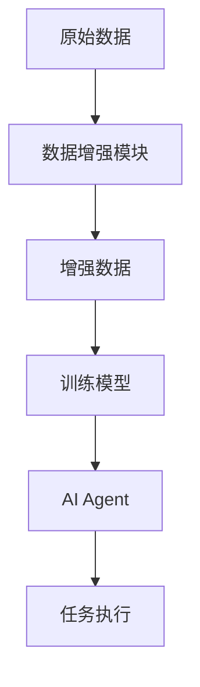

                 


# AI Agent的数据增强技术与策略

> **关键词**：AI Agent, 数据增强, 人工智能, 机器学习, 数据处理

> **摘要**：本文系统地探讨了AI Agent在数据增强技术中的应用策略与实现方法。通过分析数据增强技术的核心概念、算法原理、系统架构及实际案例，深入剖析了数据增强技术在提升AI Agent性能中的关键作用。本文旨在为AI Agent的开发者和研究者提供一份全面的技术指南，帮助他们在实际应用中更好地利用数据增强技术来优化AI Agent的性能与功能。

---

# 第一部分: AI Agent与数据增强技术概述

## 第1章: AI Agent与数据增强技术的背景介绍

### 1.1 AI Agent的基本概念
#### 1.1.1 AI Agent的定义
AI Agent（人工智能代理）是指在计算机系统中，能够感知环境、自主决策并执行任务的智能实体。它可以理解为一个具备特定目标和功能的智能程序，能够与用户、环境或其他系统进行交互。

#### 1.1.2 AI Agent的核心特征
- **自主性**：能够在没有外部干预的情况下自主运行。
- **反应性**：能够根据环境输入实时调整行为。
- **目标导向性**：以实现特定目标为导向。
- **学习能力**：能够通过数据和经验改进性能。

#### 1.1.3 AI Agent的分类与应用场景
- **分类**：
  - 按智能水平：弱AI Agent、强AI Agent。
  - 按功能：工具型AI Agent、社交型AI Agent。
- **应用场景**：
  - 智能助手（如Siri、Alexa）。
  - 自动驾驶系统。
  - 智能推荐系统。

### 1.2 数据增强技术的背景与意义
#### 1.2.1 数据增强技术的定义
数据增强（Data Augmentation）是指通过技术手段对原始数据进行变换、扩展或生成新的数据，以增加数据的多样性和丰富性。

#### 1.2.2 数据增强技术的分类
- **图像数据增强**：旋转、缩放、裁剪、添加噪声等。
- **文本数据增强**：同义词替换、句式变化、数据扩展等。
- **音频数据增强**：添加噪声、改变语速、改变音调等。

#### 1.2.3 数据增强技术在AI Agent中的作用
- **提升模型泛化能力**：通过增加数据多样性，减少模型过拟合。
- **增强模型鲁棒性**：使模型在面对不同环境和输入时表现更稳定。
- **降低数据获取成本**：通过生成数据，减少对大量标注数据的依赖。

### 1.3 AI Agent与数据增强技术的联系
#### 1.3.1 数据增强技术如何提升AI Agent性能
- **数据多样性**：通过数据增强，AI Agent能够更好地适应不同场景和输入。
- **模型训练效率**：减少对大量标注数据的需求，降低训练成本。
- **功能扩展**：通过生成新数据，AI Agent可以学习更多技能和任务。

#### 1.3.2 数据增强技术在AI Agent训练中的应用
- **图像识别任务**：增强图像数据，提升识别准确率。
- **自然语言处理任务**：增强文本数据，提升理解和生成能力。
- **语音识别任务**：增强音频数据，提升识别准确性和鲁棒性。

#### 1.3.3 数据增强技术与AI Agent目标的结合
- 数据增强技术需要根据AI Agent的具体任务进行定制化设计。
- 数据增强的目标应与AI Agent的最终目标保持一致。

---

## 第2章: 数据增强技术的核心概念与联系

### 2.1 数据增强技术的原理
#### 2.1.1 数据增强的基本原理
数据增强通过变换、扩展或生成数据，增加数据的多样性和丰富性，从而提升模型的性能。

#### 2.1.2 数据增强的数学模型
数据增强可以通过函数变换表示，例如：
$$
y = f(x, \theta)
$$
其中，\( x \) 是原始数据，\( \theta \) 是变换参数，\( y \) 是增强后的数据。

#### 2.1.3 数据增强的核心算法
- **图像增强算法**：旋转、缩放、裁剪、添加噪声等。
- **文本增强算法**：同义词替换、句式变化、数据扩展等。
- **音频增强算法**：添加噪声、改变语速、改变音调等。

### 2.2 数据增强技术的特征对比
#### 2.2.1 不同数据增强技术的对比分析
| 技术类型   | 参数调整 | 数据生成方式 | 适用场景       |
|------------|----------|--------------|----------------|
| 图像增强   | 旋转、缩放、裁剪 | 变换现有数据 | 图像识别         |
| 文本增强   | 同义词替换、句式变化 | 生成新文本 | 自然语言处理     |
| 音频增强   | 添加噪声、改变语速 | 变换现有音频 | 语音识别         |

#### 2.2.2 数据增强技术的优缺点分析
- **优点**：
  - 提高模型的泛化能力。
  - 减少对标注数据的依赖。
  - 降低模型过拟合的风险。
- **缺点**：
  - 数据增强可能引入噪声，影响模型性能。
  - 数据增强策略需要根据具体任务进行调整。

#### 2.2.3 数据增强技术的适用场景
- **小数据集**：通过数据增强生成更多数据，提升模型性能。
- **特定任务需求**：针对不同任务设计不同的数据增强策略。

### 2.3 数据增强技术的ER实体关系图
```mermaid
er
actor: AI Agent
augment_strategy: 数据增强策略
data_source: 数据源
augmented_data: 增强数据
training_model: 训练模型
result: 模型性能
actor --> augment_strategy
augment_strategy --> data_source
augment_strategy --> augmented_data
augmented_data --> training_model
training_model --> result
```

---

## 第3章: 数据增强算法的原理与实现

### 3.1 数据增强算法的分类
#### 3.1.1 图像数据增强算法
- **随机裁剪**：从图像中随机裁剪一部分作为新的图像。
- **随机旋转**：对图像进行随机角度旋转。
- **添加噪声**：在图像中添加随机噪声。

#### 3.1.2 文本数据增强算法
- **同义词替换**：将文本中的单词替换为同义词。
- **句式变化**：通过改变句子的结构生成新的文本。
- **数据扩展**：通过扩展数据生成更多文本。

#### 3.1.3 音频数据增强算法
- **添加噪声**：在音频中添加环境噪声。
- **改变语速**：调整音频的语速。
- **改变音调**：调整音频的音调。

### 3.2 数据增强算法的实现流程
#### 3.2.1 数据增强算法的输入输出
- **输入**：原始数据（图像、文本、音频）。
- **输出**：增强后的数据。

#### 3.2.2 数据增强算法的处理步骤
1. **数据预处理**：对原始数据进行标准化处理。
2. **参数设置**：设置数据增强的参数（如旋转角度、噪声强度等）。
3. **数据变换**：根据参数对数据进行变换。
4. **数据后处理**：对增强后的数据进行质量检查。

#### 3.2.3 数据增强算法的实现代码
以下是一个图像数据增强的Python代码示例：
```python
import numpy as np
from PIL import Image

def augment_image(image_path):
    original_image = Image.open(image_path)
    # 随机旋转
    rotated_image = original_image.rotate(np.random.randint(-180, 180))
    # 随机裁剪
    width, height = original_image.size
    crop_size = min(width, height)
    crop_image = rotated_image.crop((0, 0, crop_size, crop_size))
    # 添加噪声
    noise_image = np.array(crop_image) + np.random.normal(0, 10, crop_image.size)
    noise_image = Image.fromarray(noise_image.astype('uint8'))
    return noise_image

augmented_image = augment_image('input.jpg')
augmented_image.save('augmented_output.jpg')
```

### 3.3 数据增强算法的数学模型
#### 3.3.1 数据增强的数学表达式
数据增强可以通过以下数学表达式表示：
$$
y = f(x, \theta)
$$
其中，\( x \) 是原始数据，\( \theta \) 是变换参数，\( y \) 是增强后的数据。

#### 3.3.2 数据增强的优化目标
数据增强的优化目标是：
$$
\min_{\theta} \mathbb{E}_{x}[L(f(x, \theta), y)]
$$
其中，\( L \) 是损失函数，\( y \) 是真实标签。

#### 3.3.3 数据增强的损失函数
常用的数据增强损失函数包括：
- **均方误差（MSE）**：
  $$
  L = \frac{1}{n}\sum_{i=1}^{n}(y_i - \hat{y}_i)^2
  $$
- **交叉熵损失**：
  $$
  L = -\frac{1}{n}\sum_{i=1}^{n}y_i \log(\hat{y}_i)
  $$

---

## 第4章: 数据增强技术的系统分析与架构设计

### 4.1 系统应用场景分析
#### 4.1.1 数据增强技术的应用场景
- **图像识别**：识别图像中的物体、场景等。
- **自然语言处理**：进行文本分类、机器翻译等任务。
- **语音识别**：识别语音中的内容。

#### 4.1.2 AI Agent的典型应用场景
- **智能助手**：如Siri、Alexa等。
- **自动驾驶系统**：如Tesla的自动驾驶技术。
- **智能推荐系统**：如Netflix的推荐系统。

### 4.2 系统功能设计
#### 4.2.1 数据增强模块的功能设计
- **数据预处理**：对原始数据进行标准化处理。
- **参数设置**：设置数据增强的参数（如旋转角度、噪声强度等）。
- **数据变换**：根据参数对数据进行变换。
- **数据后处理**：对增强后的数据进行质量检查。

#### 4.2.2 AI Agent模块的功能设计
- **感知环境**：通过传感器或其他方式感知环境。
- **决策制定**：根据感知信息制定决策。
- **执行任务**：根据决策执行具体任务。

### 4.3 系统架构设计
#### 4.3.1 数据增强模块的架构设计
- **输入接口**：接收原始数据。
- **数据增强引擎**：对数据进行变换。
- **输出接口**：输出增强后的数据。

#### 4.3.2 AI Agent模块的架构设计
- **感知模块**：感知环境信息。
- **决策模块**：根据感知信息制定决策。
- **执行模块**：根据决策执行任务。

#### 4.3.3 系统的整体功能架构


---

## 第5章: 项目实战

### 5.1 环境安装与配置
- **安装Python**：建议使用Python 3.8及以上版本。
- **安装相关库**：如TensorFlow、Keras、OpenCV等。

### 5.2 核心代码实现
#### 5.2.1 数据增强模块的实现
```python
import tensorflow as tf
from tensorflow.keras.preprocessing.image import ImageDataGenerator

# 创建数据增强生成器
datagen = ImageDataGenerator(rotation_range=20,  # 随机旋转20度
                              width_shift_range=0.2,  # 宽度偏移
                              height_shift_range=0.2,  # 高度偏移
                              shear_range=0.2,  # 剪切强度
                              zoom_range=0.2,  # 缩放范围
                              horizontal_flip=True)  # 水平翻转

# 生成增强数据
for image in datagen.flow(x, batch_size=1, save_to_dir='augmented_images', 
                          save_prefix='augmented_', epochs=1):
    pass
```

#### 5.2.2 AI Agent模块的实现
```python
import numpy as np
from tensorflow.keras.models import load_model

# 加载预训练模型
model = load_model('model.h5')

# 接收输入
input_data = np.array([input_vector])

# 预测输出
output = model.predict(input_data)

# 执行任务
execute_task(output)
```

### 5.3 案例分析与详细解读
#### 5.3.1 案例分析
假设我们正在开发一个图像识别的AI Agent，用于识别道路上的交通标志。我们可以通过数据增强技术生成更多样化的交通标志图像，从而提高模型的识别准确率。

#### 5.3.2 详细解读
- **数据增强策略**：对图像进行随机旋转、缩放和添加噪声。
- **模型训练**：使用增强后的数据训练模型，提升模型的泛化能力。
- **任务执行**：AI Agent在实际场景中识别交通标志，验证数据增强的效果。

### 5.4 项目小结
通过本项目的实施，我们验证了数据增强技术在提升AI Agent性能中的重要作用。数据增强不仅能够提高模型的泛化能力，还能降低数据获取成本。

---

## 第6章: 总结与展望

### 6.1 最佳实践 tips
- 数据增强技术需要根据具体任务进行定制化设计。
- 数据增强策略的选择应考虑模型的最终目标。
- 数据增强参数的设置需要通过实验进行调整。

### 6.2 小结
本文系统地探讨了AI Agent在数据增强技术中的应用策略与实现方法。通过分析数据增强技术的核心概念、算法原理、系统架构及实际案例，深入剖析了数据增强技术在提升AI Agent性能中的关键作用。

### 6.3 注意事项
- 数据增强可能引入噪声，影响模型性能。
- 数据增强策略需要与AI Agent的最终目标保持一致。
- 数据增强技术需要结合具体任务进行调整和优化。

### 6.4 拓展阅读
- 《Deep Learning》——Ian Goodfellow
- 《Hands-On Machine Learning with Scikit-Learn, Keras, and TensorFlow》——Aurélien Géron

---

**作者：AI天才研究院/AI Genius Institute & 禅与计算机程序设计艺术 /Zen And The Art of Computer Programming**

