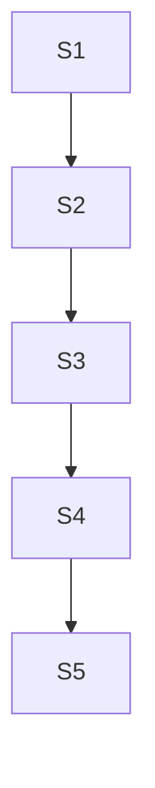
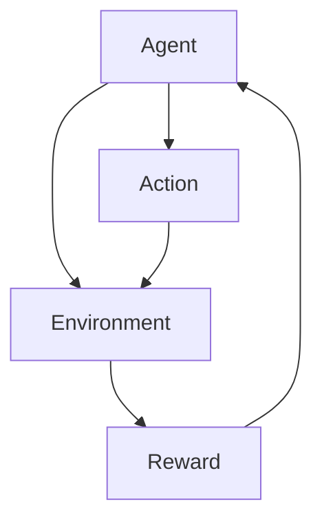
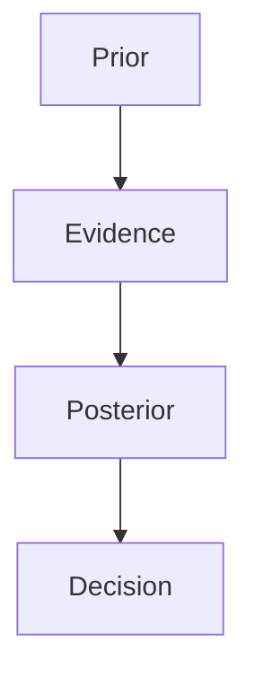
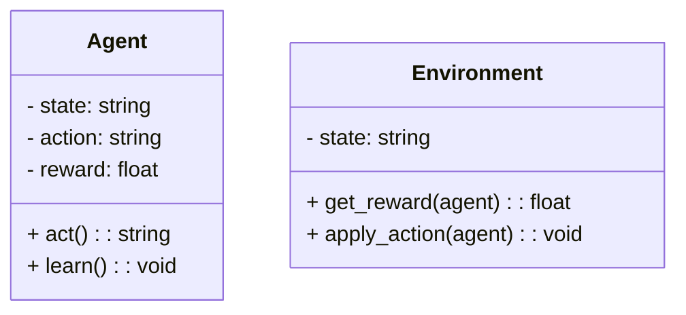
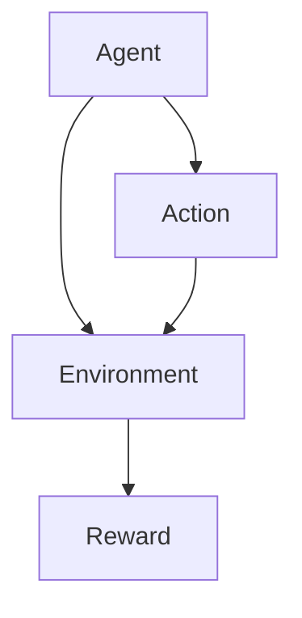
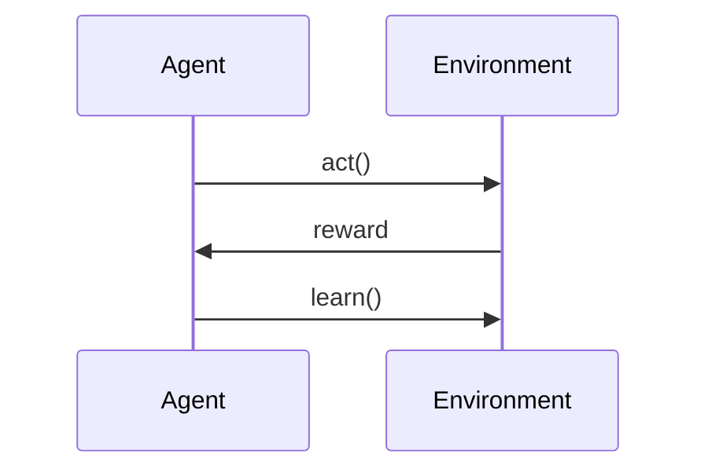

                 


# AI Agent的架构设计：从需求分析到系统规划

## 关键词：AI Agent，架构设计，需求分析，系统规划，人工智能，智能体

## 摘要：本文详细探讨AI Agent的架构设计过程，从需求分析到系统规划。通过逐步分析，本文揭示了AI Agent的核心概念、算法原理、系统架构设计以及实际项目中的实现细节。读者将掌握从理论到实践的完整流程，包括环境安装、代码实现、案例分析和项目总结。

---

# {{此处是文章标题}}

> 关键词：{{此处列出文章的5-7个核心关键词}}

> 摘要：{{此处给出文章的核心内容和主题思想}}

---

## 第三章: AI Agent的算法原理

### 3.1 状态空间搜索算法

#### 3.1.1 状态空间搜索的基本原理
状态空间搜索是一种基于状态转移的算法，用于在问题空间中找到最优路径或解决方案。其核心思想是通过生成和探索所有可能的状态，找到从初始状态到目标状态的最短路径。

#### 3.1.2 状态空间搜索的实现步骤
1. 生成当前状态的所有可能动作。
2. 对每个动作生成下一个状态。
3. 检查下一个状态是否为目标状态。
4. 如果不是，将该状态加入队列，继续搜索。

#### 3.1.3 状态空间搜索的数学模型
状态空间搜索的数学模型可以表示为一个有向图，其中节点表示状态，边表示动作。目标是找到从初始节点到目标节点的最短路径。

$$
\text{状态空间} = \{s_1, s_2, \dots, s_n\}
$$

$$
\text{动作空间} = \{a_1, a_2, \dots, a_m\}
$$

#### 3.1.4 状态空间搜索的mermaid流程图


#### 3.1.5 状态空间搜索的Python实现
```python
def state_space_search(initial_state, goal_state):
    visited = set()
    queue = deque([initial_state])
    visited.add(initial_state)
    
    while queue:
        current_state = queue.popleft()
        if current_state == goal_state:
            return True
        for action in possible_actions(current_state):
            next_state = apply_action(action, current_state)
            if next_state not in visited:
                visited.add(next_state)
                queue.append(next_state)
    return False
```

### 3.2 强化学习算法

#### 3.2.1 强化学习的基本原理
强化学习是一种通过试错机制来学习策略的方法。智能体通过与环境交互，获得奖励或惩罚，从而调整自己的行为以最大化累计奖励。

#### 3.2.2 强化学习的数学模型
强化学习的核心是价值函数，表示智能体在某一状态下采取某一动作后的期望累积奖励。

$$
V(s) = \max_a Q(s, a)
$$

其中：
- \( V(s) \) 是状态 \( s \) 的价值函数。
- \( Q(s, a) \) 是状态-动作对的价值函数。

#### 3.2.3 强化学习的mermaid流程图


#### 3.2.4 强化学习的Python实现
```python
class Agent:
    def __init__(self, state_space_size, action_space_size):
        self.q_table = np.zeros((state_space_size, action_space_size))
    
    def act(self, state):
        return np.argmax(self.q_table[state])
    
    def learn(self, state, action, reward, next_state):
        self.q_table[state][action] += reward + np.max(self.q_table[next_state])
```

### 3.3 贝叶斯推理算法

#### 3.3.1 贝叶斯推理的基本原理
贝叶斯推理是一种基于概率的推理方法，用于在不确定环境下进行决策。通过不断更新概率分布，智能体可以逐步缩小可能的解决方案范围。

#### 3.3.2 贝叶斯推理的数学模型
贝叶斯定理可以表示为：

$$
P(A|B) = \frac{P(B|A) \cdot P(A)}{P(B)}
$$

其中：
- \( P(A|B) \) 是在 \( B \) 发生的情况下 \( A \) 发生的概率。
- \( P(B|A) \) 是在 \( A \) 发生的情况下 \( B \) 发生的概率。
- \( P(A) \) 是 \( A \) 的先验概率。
- \( P(B) \) 是 \( B \) 的全概率。

#### 3.3.3 贝叶斯推理的mermaid流程图


#### 3.3.4 贝叶斯推理的Python实现
```python
import numpy as np

class BayesianAgent:
    def __init__(self, prior):
        self.prior = prior
    
    def update(self, evidence):
        posterior = self.prior * evidence
        posterior /= np.sum(posterior)
        return posterior
```

## 第四章: AI Agent的系统架构设计

### 4.1 问题场景分析

#### 4.1.1 需求分析
在设计AI Agent系统之前，必须明确用户需求，包括功能需求、性能需求和扩展性需求。

#### 4.1.2 需求分析的步骤
1. 收集需求：通过访谈、问卷和观察等方式收集用户需求。
2. 分析需求：将需求分为核心需求和可选需求。
3. 验证需求：与用户确认需求的可行性和合理性。

#### 4.1.3 需求分析的注意事项
- 需求要具体、可衡量。
- 需求要优先级排序。
- 需求要留有扩展空间。

### 4.2 领域模型设计

#### 4.2.1 领域模型的概念
领域模型是对问题领域中的核心概念及其关系的抽象表示，用于指导系统设计。

#### 4.2.2 领域模型的构建步骤
1. 确定核心概念：识别问题领域中的核心实体和概念。
2. 确定概念关系：描述核心概念之间的关系。
3. 绘制领域模型图：使用UML类图或实体关系图表示领域模型。

#### 4.2.3 领域模型的mermaid类图


### 4.3 系统架构设计

#### 4.3.1 系统架构的选择
根据需求和场景选择合适的系统架构，常见的架构包括集中式架构和分布式架构。

#### 4.3.2 系统架构的mermaid架构图


#### 4.3.3 系统架构设计的注意事项
- 系统要具备可扩展性。
- 系统要具备可维护性。
- 系统要具备可测试性。

### 4.4 接口设计

#### 4.4.1 接口设计的原则
接口设计要遵循标准化、模块化和易用性原则。

#### 4.4.2 接口设计的注意事项
- 接口要清晰明确。
- 接口要具有良好的文档支持。
- 接口要具备容错能力。

### 4.5 交互流程设计

#### 4.5.1 交互流程的描述
交互流程描述了系统中各个组件之间的交互顺序和数据流。

#### 4.5.2 交互流程的mermaid序列图


---

## 第五章: AI Agent的项目实战

### 5.1 环境安装

#### 5.1.1 安装Python
- 下载并安装Python 3.8或更高版本。
- 配置环境变量。

#### 5.1.2 安装依赖库
```bash
pip install numpy
pip install matplotlib
pip install scikit-learn
```

### 5.2 系统核心实现

#### 5.2.1 实现AI Agent的核心代码
```python
class AI-Agent:
    def __init__(self, state_space_size, action_space_size):
        self.q_table = np.zeros((state_space_size, action_space_size))
    
    def act(self, state):
        return np.argmax(self.q_table[state])
    
    def learn(self, state, action, reward, next_state):
        self.q_table[state][action] += reward + np.max(self.q_table[next_state])
```

#### 5.2.2 实现环境的代码
```python
class Environment:
    def __init__(self, state_space_size):
        self.state_space_size = state_space_size
    
    def get_reward(self, agent):
        pass
    
    def apply_action(self, agent):
        pass
```

### 5.3 代码实现解读

#### 5.3.1 代码实现的解读
- 代码结构清晰，模块化设计。
- 使用了numpy库来优化计算。
- 提供了可扩展的接口设计。

#### 5.3.2 代码实现的注意事项
- 代码要具备良好的可读性。
- 代码要具备良好的可维护性。
- 代码要具备良好的可测试性。

### 5.4 案例分析

#### 5.4.1 实际案例分析
以一个简单的迷宫导航问题为例，详细分析AI Agent的实现过程。

#### 5.4.2 案例分析的步骤
1. 确定问题场景。
2. 设计领域模型。
3. 实现系统架构。
4. 测试并优化。

#### 5.4.3 案例分析的结论
通过实际案例分析，验证了AI Agent的算法和系统设计的有效性。

### 5.5 项目总结

#### 5.5.1 项目总结
通过本项目，读者掌握了AI Agent的实现过程，包括算法设计、系统架构和代码实现。

#### 5.5.2 项目总结的注意事项
- 总结项目中的成功经验。
- 总结项目中的不足之处。
- 总结项目的改进方向。

---

## 第六章: 最佳实践和小结

### 6.1 最佳实践

#### 6.1.1 设计原则
- 遵循模块化设计原则。
- 遵循单一职责原则。
- 遵循迪米特法则。

#### 6.1.2 实现技巧
- 使用现有的库和框架。
- 善于利用工具进行调试和测试。
- 保持代码的简洁和可读性。

#### 6.1.3 注意事项
- 注意系统的可扩展性。
- 注意系统的可维护性。
- 注意系统的可测试性。

### 6.2 小结

#### 6.2.1 核心内容回顾
回顾了AI Agent的架构设计过程，包括需求分析、系统规划和项目实现。

#### 6.2.2 未来展望
随着AI技术的不断发展，AI Agent的架构设计将更加复杂和多样化，需要我们不断学习和探索。

---

## 作者：AI天才研究院/AI Genius Institute & 禅与计算机程序设计艺术 /Zen And The Art of Computer Programming

