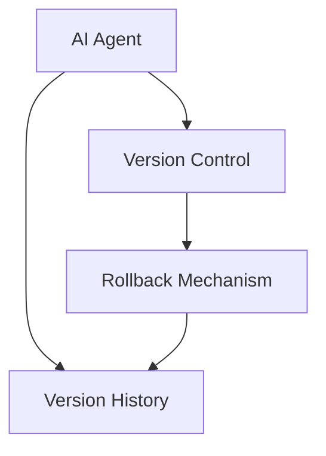
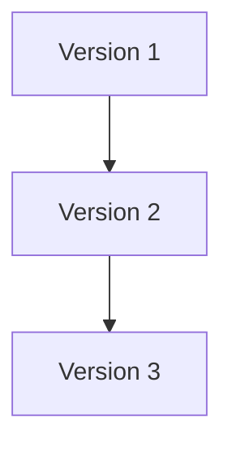
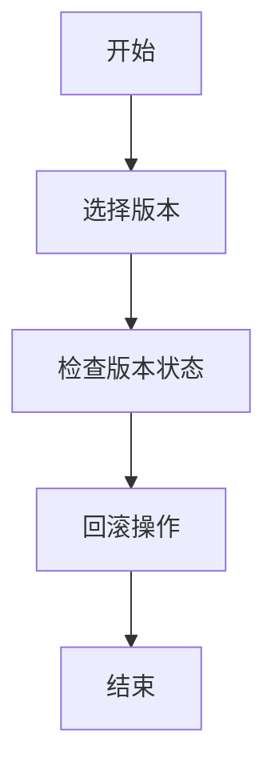
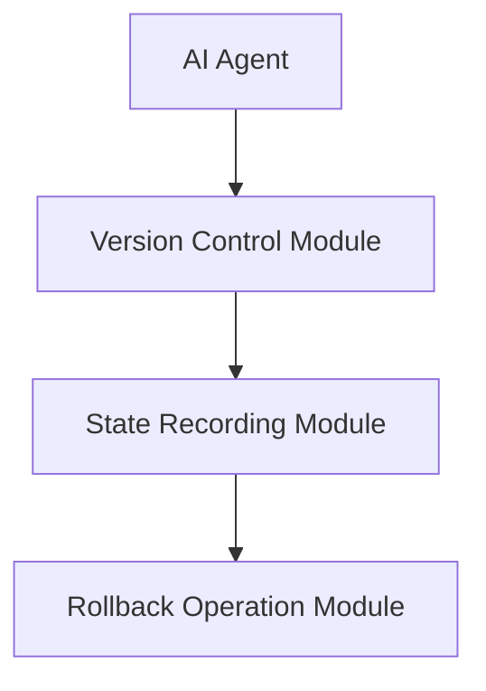

                 


# AI Agent的版本控制与回滚机制：确保稳定运行

## 关键词：
AI Agent、版本控制、回滚机制、系统稳定性、容错设计、技术实现

## 摘要：
在AI Agent的开发与应用中，版本控制与回滚机制是确保其稳定运行的关键技术。本文将从AI Agent的基本概念出发，深入探讨版本控制与回滚机制的核心原理，结合算法实现与系统架构设计，分析其在实际应用中的重要性。通过详细的技术分析和实战案例，本文旨在为读者提供一份全面的技术指南，帮助他们在实际项目中更好地设计和实现AI Agent的版本控制与回滚机制。

---

# 第一部分: AI Agent的版本控制与回滚机制基础

---

# 第1章: AI Agent的背景与问题背景

## 1.1 AI Agent的基本概念

### 1.1.1 AI Agent的定义
AI Agent（人工智能代理）是指能够感知环境、自主决策并执行任务的智能实体。它可以是一个软件程序、机器人或其他智能系统，具备以下核心特点：
- **自主性**：能够在没有外部干预的情况下独立运行。
- **反应性**：能够感知环境并实时调整行为。
- **目标导向**：通过设定目标来驱动其行为。
- **学习能力**：能够通过数据和经验不断优化自身性能。

AI Agent广泛应用于自动驾驶、智能助手、推荐系统等领域。

### 1.1.2 AI Agent的核心特点
1. **智能性**：AI Agent能够通过算法和数据做出决策。
2. **适应性**：能够根据环境变化调整自身行为。
3. **交互性**：能够与用户、系统或其他Agent进行交互。
4. **安全性**：在复杂环境中确保行为的安全性。

### 1.1.3 AI Agent的类型与应用场景
AI Agent可以分为以下几类：
1. **简单反射型Agent**：基于当前输入做出简单反应。
2. **基于模型的反射型Agent**：利用内部状态模型进行决策。
3. **目标驱动型Agent**：根据预设目标进行行为选择。
4. **效用驱动型Agent**：通过最大化效用函数来优化决策。

应用场景包括：
- 智能助手（如Siri、Alexa）。
- 自动驾驶系统。
- 金融交易中的智能决策。

---

## 1.2 版本控制与回滚机制的重要性

### 1.2.1 为什么需要版本控制
AI Agent的运行依赖于复杂的算法和模型，这些算法和模型可能会不断迭代和优化。版本控制的作用在于：
1. **记录变更历史**：确保每次修改都有可追溯的记录。
2. **支持多人协作**：在团队开发中避免冲突。
3. **回溯问题**：当出现错误时，可以快速找到问题的根源。

### 1.2.2 为什么需要回滚机制
AI Agent在运行过程中可能会因为版本更新或环境变化而出现意外行为。回滚机制的作用在于：
1. **快速恢复稳定状态**：当新版本出现问题时，可以快速回退到上一个稳定版本。
2. **支持实验性更新**：允许在生产环境中安全地进行实验性更新。
3. **降低风险**：通过回滚机制降低版本更新的风险。

### 1.2.3 版本控制与回滚机制的边界与外延
版本控制的边界：
- **数据层面**：仅涉及代码和配置文件的变更。
- **行为层面**：不直接影响AI Agent的运行逻辑，而是通过代码变更间接影响。

回滚机制的外延：
- **系统层面**：支持整个系统的回滚，包括服务、配置和数据。
- **业务层面**：确保业务逻辑的连续性和一致性。

---

## 1.3 问题背景与问题描述

### 1.3.1 AI Agent在运行中的潜在问题
1. **算法错误**：新版本的算法可能导致决策错误。
2. **数据偏差**：数据源的变化可能影响模型性能。
3. **环境干扰**：外部环境的突变可能导致系统崩溃。

### 1.3.2 版本控制与回滚机制在问题解决中的作用
1. **快速定位问题**：通过版本历史可以快速定位问题的根源。
2. **快速恢复稳定**：通过回滚机制可以迅速恢复到稳定状态。

### 1.3.3 问题场景的边界与核心要素
1. **边界条件**：仅在版本更新和回滚过程中出现问题。
2. **核心要素**：版本记录、回滚策略、恢复机制。

---

## 1.4 本章小结
本章通过介绍AI Agent的基本概念、版本控制与回滚机制的重要性，以及问题背景与问题描述，为后续章节的深入分析奠定了基础。

---

# 第2章: AI Agent版本控制的核心概念与联系

## 2.1 核心概念原理

### 2.1.1 版本控制的原理
版本控制通过记录代码和配置文件的变更历史，实现对AI Agent的版本管理。核心步骤包括：
1. **提交变更**：将修改的内容提交到版本控制系统。
2. **分支与合并**：在不同的分支上进行开发，然后将分支合并到主分支。
3. **版本回溯**：通过历史记录找到特定版本的代码。

### 2.1.2 回滚机制的原理
回滚机制通过记录每个版本的状态，允许在出现问题时快速恢复到特定版本。核心步骤包括：
1. **记录状态**：在每个版本更新时记录系统状态。
2. **状态检查**：在出现问题时，检查当前版本的状态。
3. **状态回滚**：将系统状态恢复到目标版本的状态。

### 2.1.3 版本控制与回滚机制的关系
版本控制提供了回滚机制的基础，而回滚机制则是版本控制的补充。版本控制确保了版本的可追溯性，而回滚机制则确保了版本的可恢复性。

---

## 2.2 核心概念属性特征对比

| **特性**         | **版本控制**           | **回滚机制**           |
|------------------|-----------------------|-----------------------|
| **核心目标**     | 记录变更历史           | 恢复到特定状态         |
| **实现方式**     | 版本树、分支与合并     | 状态快照、检查点       |
| **依赖性**       | 依赖于代码变更记录     | 依赖于系统状态记录     |
| **应用场景**     | 开发与协作             | 系统故障恢复           |

---

## 2.3 ER实体关系图架构



---

## 2.4 本章小结
本章通过对比版本控制和回滚机制的核心概念，分析了它们的原理与关系，为后续的算法实现奠定了基础。

---

# 第3章: AI Agent版本控制与回滚机制的算法原理

## 3.1 版本控制算法原理

### 3.1.1 版本树的构建原理
版本树是一种树状结构，用于记录代码的变更历史。每个节点代表一个版本，节点之间的关系表示代码的变更路径。



### 3.1.2 版本树的存储结构
版本树的存储结构通常采用哈希指针的方式，每个节点包含以下信息：
- **版本号**：唯一的版本标识。
- **父版本号**：父节点的版本标识。
- **变更记录**：本次版本的修改内容。

### 3.1.3 版本树的遍历算法
版本树的遍历算法用于从根节点开始，逐步访问所有节点。常见的遍历算法包括深度优先搜索（DFS）和广度优先搜索（BFS）。

---

## 3.2 回滚机制算法原理

### 3.2.1 回滚点的标记与选择
回滚点的标记通常基于版本树的节点，选择特定版本作为回滚点。

### 3.2.2 回滚路径的计算
回滚路径的计算需要找到从当前版本到目标版本的最短路径。

### 3.2.3 回滚操作的实现
回滚操作的实现通常涉及以下步骤：
1. **查找目标版本**：找到目标版本的节点。
2. **恢复系统状态**：将系统状态恢复到目标版本的状态。

---

## 3.3 算法流程图



---

## 3.4 本章小结
本章通过详细分析版本控制与回滚机制的算法原理，为后续的系统设计与实现奠定了基础。

---

# 第4章: AI Agent版本控制与回滚机制的系统设计

## 4.1 系统分析与架构设计

### 4.1.1 问题场景介绍
AI Agent在运行过程中可能会因为版本更新或环境变化而出现意外行为。版本控制与回滚机制需要能够快速定位问题并恢复系统稳定。

### 4.1.2 系统功能设计
系统功能包括：
- **版本管理**：记录和管理AI Agent的版本。
- **状态记录**：记录每个版本的系统状态。
- **回滚操作**：支持从当前版本回滚到任意目标版本。

### 4.1.3 系统架构设计
系统架构包括以下几个部分：
1. **版本控制模块**：负责版本的记录与管理。
2. **状态记录模块**：负责系统状态的记录与存储。
3. **回滚操作模块**：负责回滚操作的实现。

---

## 4.2 系统架构设计图



---

## 4.3 系统接口设计

### 4.3.1 接口定义
1. **提交版本**：提交新的版本到版本控制模块。
2. **记录状态**：记录当前版本的系统状态。
3. **回滚版本**：根据目标版本号进行回滚操作。

### 4.3.2 接口交互流程
1. **提交版本**：AI Agent提交新的版本到版本控制模块。
2. **记录状态**：版本控制模块通知状态记录模块记录当前版本的系统状态。
3. **回滚版本**：当出现问题时，AI Agent调用回滚操作模块进行回滚。

---

## 4.4 本章小结
本章通过分析问题场景，设计了AI Agent版本控制与回滚机制的系统架构与接口，为后续的实现奠定了基础。

---

# 第5章: AI Agent版本控制与回滚机制的项目实战

## 5.1 项目环境与工具安装

### 5.1.1 开发环境
- **操作系统**：Linux或Windows。
- **编程语言**：Python。
- **版本控制工具**：Git。

### 5.1.2 工具安装
安装Git：
```bash
sudo apt-get install git
```

---

## 5.2 系统核心实现源代码

### 5.2.1 版本控制模块实现
```python
class VersionControl:
    def __init__(self):
        self.version_tree = {}  # 版本树存储
        self.current_version = 0

    def commit(self, changes):
        self.current_version += 1
        self.version_tree[self.current_version] = changes

    def rollback(self, version):
        if version in self.version_tree:
            return self.version_tree[version]
        else:
            return None
```

### 5.2.2 状态记录模块实现
```python
class StateRecorder:
    def __init__(self):
        self.states = {}  # 状态记录

    def record_state(self, version, state):
        self.states[version] = state

    def get_state(self, version):
        return self.states.get(version, None)
```

### 5.2.3 回滚操作模块实现
```python
class RollbackManager:
    def __init__(self):
        self.version_control = VersionControl()
        self.state_recorder = StateRecorder()

    def rollback_to_version(self, version):
        state = self.version_control.rollback(version)
        if state:
            self.state_recorder.get_state(version)
            return True
        else:
            return False
```

---

## 5.3 代码应用解读与分析
通过上述代码，我们可以实现一个简单的版本控制与回滚机制。版本控制模块负责记录版本变更，状态记录模块负责记录每个版本的系统状态，回滚操作模块负责根据目标版本号进行回滚操作。

---

## 5.4 实际案例分析与详细讲解

### 5.4.1 案例背景
假设我们正在开发一个AI推荐系统，需要对推荐算法进行版本控制与回滚。

### 5.4.2 案例实现
1. **提交版本**：提交新的推荐算法版本。
2. **记录状态**：记录当前版本的推荐结果。
3. **回滚版本**：当出现问题时，回滚到之前的版本。

---

## 5.5 本章小结
本章通过实际案例，详细讲解了AI Agent版本控制与回滚机制的实现过程，帮助读者更好地理解和应用相关技术。

---

# 第6章: 最佳实践、注意事项与小结

## 6.1 最佳实践

### 6.1.1 版本控制策略
- 定期提交代码变更。
- 使用分支与合并策略。
- 保持版本变更的可追溯性。

### 6.1.2 回滚策略
- 定期记录系统状态。
- 在出现问题时，快速定位问题版本。
- 使用自动化工具实现回滚。

### 6.1.3 系统设计
- 设计清晰的系统架构。
- 采用模块化设计。
- 保持代码的可维护性。

---

## 6.2 注意事项

### 6.2.1 版本控制
- 避免在主分支上进行实验性修改。
- 定期清理无用版本。

### 6.2.2 回滚机制
- 确保回滚操作的可靠性。
- 定期测试回滚机制。

### 6.2.3 系统稳定性
- 定期进行压力测试。
- 保持系统日志的完整性。

---

## 6.3 本章小结
本章总结了AI Agent版本控制与回滚机制的最佳实践和注意事项，帮助读者更好地在实际项目中应用相关技术。

---

# 作者：AI天才研究院/AI Genius Institute & 禅与计算机程序设计艺术 /Zen And The Art of Computer Programming

---

以上是《AI Agent的版本控制与回滚机制：确保稳定运行》的技术博客文章的完整目录和内容框架。文章从基础到实践，层层深入，详细分析了AI Agent版本控制与回滚机制的核心概念、算法原理、系统设计和项目实战，为读者提供了一套完整的解决方案。

