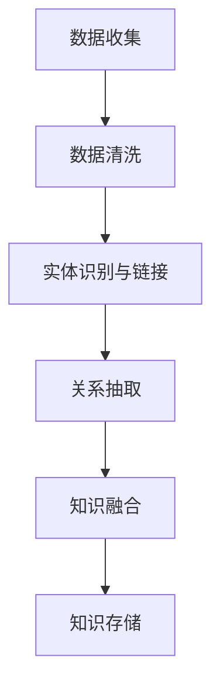
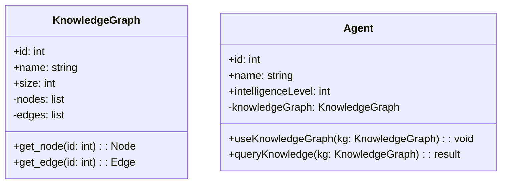

                 


# AI Agent的知识图谱集成方案

> 关键词：AI Agent，知识图谱，知识表示，智能体，图谱集成

> 摘要：本文系统地探讨了AI Agent与知识图谱的集成方案，分析了知识图谱的核心概念、AI Agent的基本原理及其二者的集成意义。文章从知识图谱的构建算法、AI Agent的属性特征对比入手，结合实际案例，详细阐述了知识图谱与AI Agent的集成方案，并通过数学公式和代码实现，深入解析了知识图谱的三元组表示、向量空间模型等关键技术。文章还通过Mermaid图展示了知识图谱与AI Agent的实体关系、系统架构设计、交互流程等，为读者提供了从理论到实践的全面指导。

---

# 正文

## 第一部分: AI Agent的知识图谱集成背景与概念

### 第1章: 知识图谱与AI Agent概述

#### 1.1 知识图谱的基本概念

知识图谱是一种以结构化方式表示知识的图数据库，其核心是通过三元组（实体-关系-实体或实体-属性-值）的形式，描述现实世界中的实体及其之间的关系。知识图谱可以表示为一个有向图，其中节点表示实体或概念，边表示实体之间的关系或属性。

知识图谱的构建流程一般包括以下步骤：
1. **数据收集**：从结构化数据（如数据库）、半结构化数据（如HTML页面）和非结构化数据（如文本）中提取信息。
2. **数据清洗**：去除噪声数据，确保数据的准确性和一致性。
3. **实体识别与链接**：通过命名实体识别（NER）和实体链接技术，将文本中的实体映射到知识图谱中的具体节点。
4. **关系抽取**：从文本中抽取实体之间的关系，并建立边。
5. **知识融合**：将多个来源的知识进行合并，消除冲突，形成统一的知识表示。
6. **知识存储**：将构建好的知识图谱存储在图数据库中，如Neo4j、TinkerPop等。

#### 1.2 AI Agent的基本概念

AI Agent（智能体）是一种能够感知环境并采取行动以实现目标的实体。AI Agent的核心功能包括：
1. **感知**：通过传感器或数据接口获取环境中的信息。
2. **推理**：基于获取的信息进行逻辑推理，做出决策。
3. **行动**：根据决策结果执行操作，影响环境。

AI Agent可以分为以下几类：
1. **简单反射型智能体**：基于当前感知直接行动，不涉及推理。
2. **基于模型的反射型智能体**：维护环境的模型，基于模型进行推理和决策。
3. **目标驱动型智能体**：根据目标选择行动。
4. **效用驱动型智能体**：基于效用函数选择行动，以最大化效用。

#### 1.3 知识图谱与AI Agent的集成意义

知识图谱为AI Agent提供了丰富的语义信息，帮助智能体更好地理解环境、推理和决策。AI Agent则为知识图谱提供了动态的应用场景，使其能够适应复杂多变的现实世界。二者的结合主要体现在以下几个方面：
1. **语义理解**：知识图谱为AI Agent提供语义知识，使其能够理解复杂的关系和属性。
2. **智能推理**：通过知识图谱的结构化信息，AI Agent可以进行更复杂的逻辑推理。
3. **知识扩展**：AI Agent可以通过与环境交互，动态更新知识图谱，实现知识的自我扩展。

### 第2章: 知识图谱与AI Agent的核心概念与联系

#### 2.1 知识图谱的属性特征

知识图谱具有以下核心属性：
1. **结构化**：通过三元组形式表示实体及其关系。
2. **语义化**：不仅存储事实，还存储实体之间的语义关系。
3. **可扩展性**：支持动态添加新实体和关系。

#### 2.2 AI Agent的属性特征

AI Agent的核心属性包括：
1. **智能性**：能够进行推理和决策。
2. **自主性**：能够在没有外部干预的情况下自主行动。
3. **交互性**：能够与环境和其他智能体进行交互。

#### 2.3 知识图谱与AI Agent的对比分析

| 属性 | 知识图谱 | AI Agent |
|------|---------|----------|
| 核心目标 | 表示知识 | 完成任务 |
| 表现形式 | 图结构 | 状态、动作 | 
| 主要功能 | 存储、检索知识 | 感知、推理、行动 |
| 可扩展性 | 高 | 高 |
| 语义理解 | 强 | 弱（依赖知识图谱） |

#### 2.4 知识图谱与AI Agent的ER实体关系图

```mermaid
er
    entity(Agent) {
        id: int
        name: string
        intelligenceLevel: int
    }
    entity(KnowledgeGraph) {
        id: int
        name: string
        size: int
    }
    relationship(Agent "使用" KnowledgeGraph) {
        agent_id: int
        knowledge_graph_id: int
    }
```

---

## 第二部分: 知识图谱集成的算法原理与数学模型

### 第3章: 知识图谱构建算法原理

#### 3.1 知识图谱构建的算法流程

知识图谱的构建流程可以用以下Mermaid图表示：



#### 3.2 知识图谱的三元组表示

知识图谱的核心是三元组（头实体，关系，尾实体），可以用以下公式表示：

$$ (头实体, 关系, 尾实体) $$

其中，头实体和尾实体可以是具体的实体或概念，关系描述了两者之间的联系。

#### 3.3 知识图谱的向量空间模型

知识图谱中的实体和关系可以映射到向量空间中，常用的方法是通过Word2Vec或GloVe等模型进行嵌入表示。例如，实体“人”可以表示为一个向量：

$$ e_{人} = [e_1, e_2, ..., e_n] $$

关系“喜欢”可以表示为另一个向量：

$$ r_{喜欢} = [r_1, r_2, ..., r_m] $$

通过向量运算，可以计算实体之间的相似性或推理关系。

---

## 第三部分: 系统分析与架构设计方案

### 第4章: 系统架构设计

#### 4.1 系统功能设计

知识图谱与AI Agent的集成系统需要实现以下功能：
1. **知识图谱存储**：存储和管理知识图谱数据。
2. **AI Agent接口**：提供与AI Agent交互的接口。
3. **知识推理**：基于知识图谱进行推理，辅助AI Agent决策。

系统功能可以用以下Mermaid图表示：



#### 4.2 系统架构设计

系统架构设计可以用以下Mermaid图表示：


---

## 第四部分: 项目实战

### 第5章: 知识图谱集成的实战应用

#### 5.1 环境安装

要实现知识图谱与AI Agent的集成，首先需要安装以下工具：
- 图数据库：Neo4j
- Python库：networkx、numpy

安装命令如下：

```bash
pip install neo4j==4.0.0 networkx numpy
```

#### 5.2 核心代码实现

以下是一个简单的知识图谱构建和AI Agent查询的Python代码示例：

```python
from neo4j import GraphDatabase
from networkx import Graph

# 知识图谱构建
def build_knowledge_graph():
    graph = Graph()
    graph.add_node("人", {"name": "张三"})
    graph.add_node("职位", {"name": "工程师"})
    graph.add_edge("人", "职位", {"关系": "担任"})
    return graph

# AI Agent查询
def agent_query(graph, target):
    for node in graph.nodes():
        if node["name"] == target:
            return node
    return None

# 实验
kg = build_knowledge_graph()
agent = agent_query(kg, "张三")
if agent:
    print(f"找到的实体：{agent}")
else:
    print("未找到实体")
```

#### 5.3 案例分析

假设我们有一个简单的知识图谱，其中包含“人”、“职位”、“公司”等实体及其关系。AI Agent可以通过查询知识图谱，推理出“张三担任工程师职位”这一事实，并据此做出决策。

---

## 第五部分: 最佳实践与小结

### 第6章: 最佳实践

1. **数据质量**：确保知识图谱的数据准确性和完整性。
2. **模型优化**：根据具体场景优化知识图谱的嵌入模型。
3. **安全与隐私**：在构建和使用知识图谱时，注意数据隐私和安全问题。

### 6.2 小结

本文系统地探讨了AI Agent与知识图谱的集成方案，从理论到实践，详细讲解了知识图谱的构建算法、AI Agent的核心属性、二者的集成意义以及实际应用案例。通过本文的学习，读者可以掌握知识图谱与AI Agent的集成方法，并在实际项目中加以应用。

---

作者：AI天才研究院/AI Genius Institute  
禅与计算机程序设计艺术 /Zen And The Art of Computer Programming

